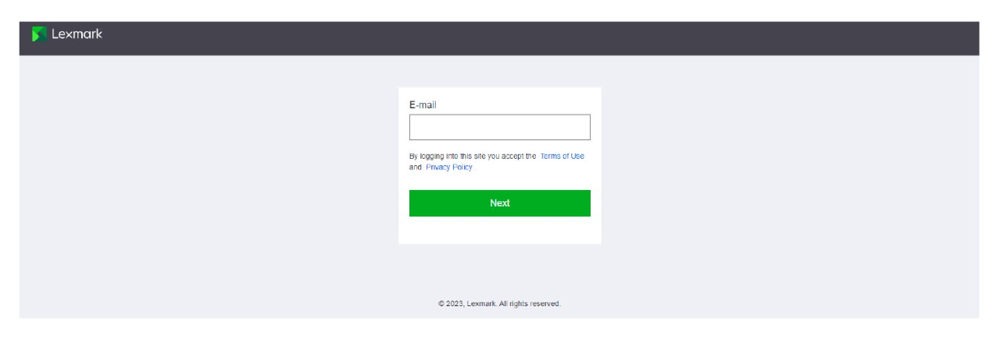
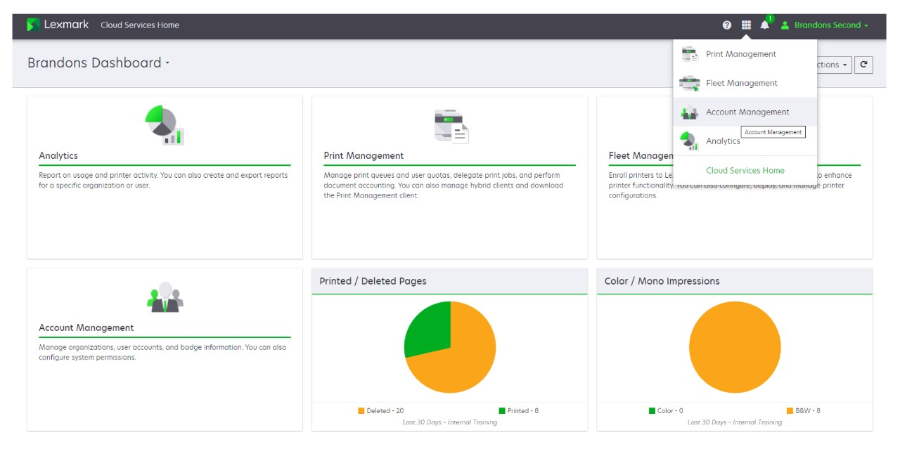
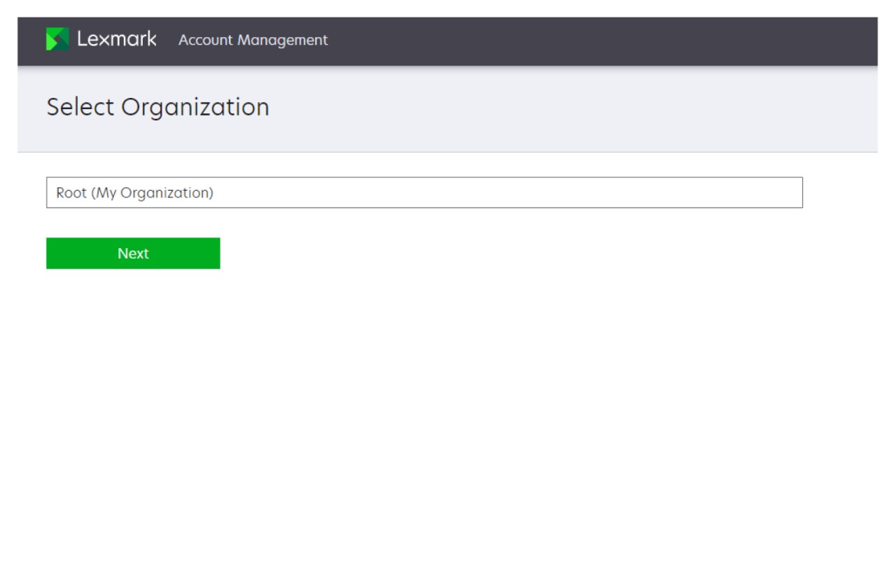
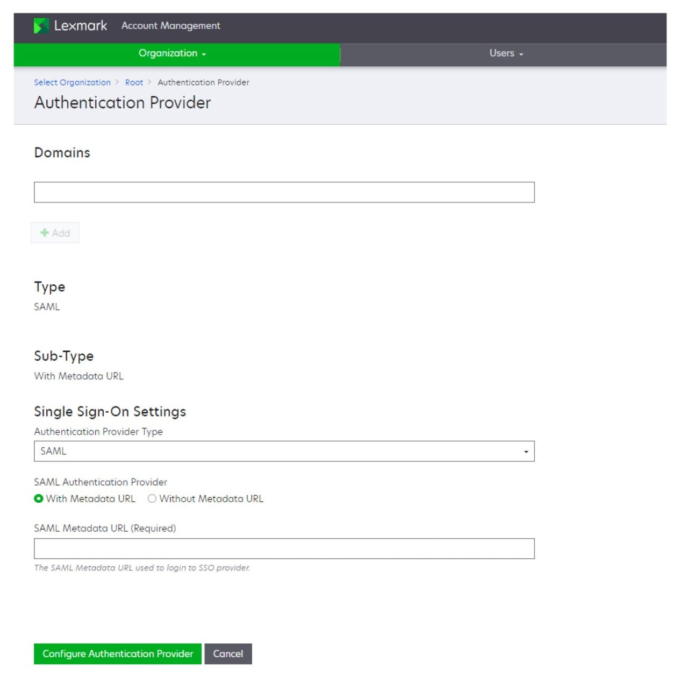
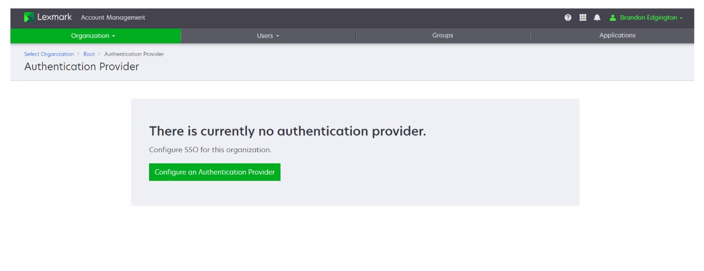
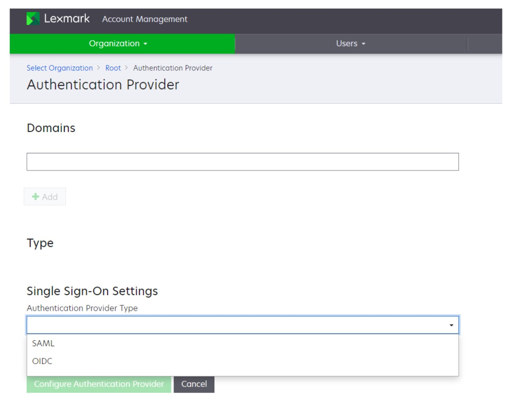
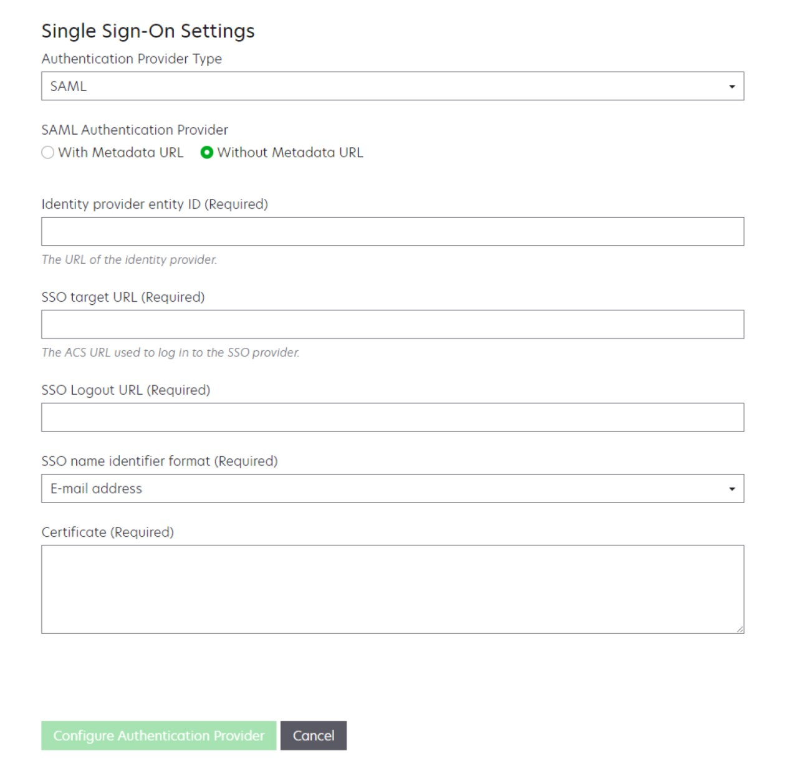

# Integrate Lexmark Cloud Services (SAML) for SSO with Microsoft Entra ID

In this article you learn how to integrate Lexmark Cloud Services (SAML) with Microsoft Entra ID. When you integrate Lexmark Cloud Services (SAML) with Microsoft Entra ID, you can:

- Control in Microsoft Entra ID who has access to Lexmark Cloud Services (SAML).
- Enable your users to be automatically signed-in to Lexmark Cloud Services (SAML) with their Microsoft Entra accounts.
- Manage your accounts in one central location.

## Prerequisites

[!INCLUDE [common-prerequisites.md](~/identity/saas-apps/includes/common-prerequisites.md)]
- Lexmark Cloud Services (SAML) single sign-on (SSO) enabled subscription.

## Scenario description

In this article, you configure and test Microsoft Entra SSO in a test environment.
## Add Lexmark Cloud Services (SAML) from the gallery

To configure the integration of Lexmark Cloud Services (SAML) into Microsoft Entra ID, you need to add Lexmark Cloud Services (SAML) from the gallery to your list of managed SaaS apps.

1. Sign in to the [Microsoft Entra admin center](https://entra.microsoft.com) as at least a [Cloud Application Administrator](~/identity/role-based-access-control/permissions-reference.md#cloud-application-administrator).
1. Browse to **Entra ID** > **Enterprise applications** > **New application**.
1. In the **Browse Microsoft Entra App Gallery** section, type **Lexmark Cloud Services (SAML)** in the search box.
1. Select **Lexmark Cloud Services (SAML)** from results panel and then add the app. Wait a few seconds while the app is added to your tenant.

[!INCLUDE [sso-wizard.md](~/identity/saas-apps/includes/sso-wizard.md)]

## Configure Microsoft Entra SSO

Complete the following steps to enable Microsoft Entra single sign-on.

1. Sign in to the [Microsoft Entra admin center](https://entra.microsoft.com) as at least a [Cloud Application Administrator](~/identity/role-based-access-control/permissions-reference.md#cloud-application-administrator).
1. Browse to **Entra ID** > **Enterprise apps** > **Lexmark Cloud Services (SAML)** > **Single sign-on**.
1. On the **Select a single sign-on method** page, select **SAML**.
1. On the **Set up single sign-on with SAML** page, select the pencil icon for **Basic SAML Configuration** to edit the settings.

   

1. On the **Basic SAML Configuration** section, perform the following steps:

    a. In the **Identifier** textbox, type a URL using one of the following patterns:

    | **Identifier** |
    |---------------|
    |`https://lexmarkb2c.b2clogin.com/LexmarkB2C.onmicrosoft.com/B2C_1A_TrustFrameworkBase_ciam` |
    | `https://lexmarkb2ceu.b2clogin.com/LexmarkB2CEU.onmicrosoft.com/B2C_1A_TrustFrameworkBase_ciam` |

    b. In the **Reply URL** textbox, type a URL using one of the following patterns:

    | **Reply URL** |
    |------------|
    |`https://lexmarkb2c.b2clogin.com/LexmarkB2C.onmicrosoft.com/B2C_1A_TrustFrameworkBase_ciam/samlp/sso/assertionconsumer` |
    | `https://lexmarkb2ceu.b2clogin.com/LexmarkB2CEU.onmicrosoft.com/B2C_1A_TrustFrameworkBase_ciam/samlp/sso/assertionconsumer` |

    > [!Note]
    > These values aren't real. Update these values with the actual Identifier and Reply URL. Contact Lexmark SSO Client support team to get these values. You can also refer to the patterns shown in the **Basic SAML Configuration** section.

1. On the **Set up single sign-on with SAML** page, in the **SAML Certificates** section, select the copy button to copy **App Federation Metadata Url** and save it on your computer.

   
[!INCLUDE [create-assign-users-sso.md](~/identity/saas-apps/includes/create-assign-users-sso.md)]

## Configure Lexmark Cloud Services (SAML) SSO

To configure single sign-on on **Lexmark Cloud Services (SAML)** side, you need to send the **App Federation Metadata Url** to Lexmark Cloud Services (SAML) support team. They set this setting to have the SAML SSO connection set properly on both sides. Also review the [Lexmark documentation](https://support.lexmark.com/en_us/manuals-guides/online/Lexmark-Cloud-Platform/configuring-microsoft-entra-id-federation-for-saml.html) on configuring Microsoft Entra ID with SAML federation

## Configure your organization for SSO with SAML

1. Log in to Lexmark Cloud Services.
   
1. From the navigation menu on the right side of the screen, select **Account Management**.
   
1. If necessary, select your organization, and then select **Next**.
   
1. From the Organization menu, select **Authentication Provider**.
   
1. Select **Configure on Authentication Provider**.
   
1. From the **Authentication Provider Type** menu, select **SAML**.
   

   > [!Note]
   > The Domains field allows Lexmark Cloud Services to establish a new user account after the user logs in. Listing each organization domain isn't required. If no domain is set, then the new users must be manually added to the organization before they log in.

1. In the **SAML Authentication Provider** section, select either **With Metadata URL** or **Without Metadata URL**.

   > [!Note]
   > We recommend selecting With Metadata URL for a shorter process.

### With Metadata URL

   If you want to configure the **SAML Authentication Provider** section with Metadata URL, then perform the following steps:
1. In the **SAML Authentication Provider** section, select **With Metadata URL**.
   
1. In the **SAML Metadata URL (Required)** field, paste the App Federation Metadata URL that you have previously copied and retained.

   > [!Note]
   > For more information on App Federation Metadata Url, see [Downloading certificates and copying URLs](https://support.lexmark.com/en_us/manuals-guides/online/Lexmark-Cloud-Platform/downloading-certificates-and-copying-urls-v5921516.html).

1. Select **Configure Authentication Provider**.

### Without Metadata URL

 If you want to configure the SAML Authentication Provider section without Metadata URL, then perform the following steps:
1. In the **SAML Authentication Provider** section, select **Without Metadata URL**.
   
1. In the **Identity provider entity ID (Required)** field, depending on your location, type either of the following:
   - For EU:
      **`https://lexmarkb2ceu.b2clogin.com/LexmarkB2CEU.onmicrosoft.com/B2C_1A_TrustFrameworkBase_ciam`**
   - For US: 
      **`https://lexmarkb2c.b2clogin.com/LexmarkB2C.onmicrosoft.com/B2C_1A_TrustFrameworkBase_ciam`**

   > [!Note]
   > The URLs must be same to the URLs entered in Microsoft Entra ID.

1. Enter the required information copied from Microsoft Entra ID:
   - SSO target URL (Required)
   - SSO Logout URL (Required)
   - Certificate (Required)

   > [!Note]
   > Make sure you include the header and the footer for the certificate.

1. Select **Configure Authentication Provider**.

   > [!Note]
   > Once authentication configuration is completed, you will receive an email on configuration status. In case of configuration failure, contact your Lexmark representative.

> [!Note]
> Make sure that you don't exit the Lexmark Cloud Services portal or allow the portal to time out. It is time to test your SAML connection, and you might be unable to log in to correct any problems discovered during testing. For more information on testing the federation, see [Testing a federation](https://support.lexmark.com/en_us/manuals-guides/online/Lexmark-Cloud-Platform/testing-a-federation-v59215222.html).

### Create Lexmark Cloud Services (SAML) test user

In this section, you create a user called B.Simon in Lexmark Cloud Services (SAML). Work with Lexmark Cloud Services (SAML) support team to add the users in the Lexmark Cloud Services (SAML) platform. Users must be created and activated before you use single sign-on.

## Test SSO 

In this section, you test your Microsoft Entra single sign-on configuration using the [My Apps](https://myapps.microsoft.com) portal.

When you select the Lexmark Cloud Services (SAML) tile in the My Apps, you should be automatically signed in to the Lexmark Cloud Services (SAML) for which you set up SSO. For more information about the My Apps portal, see [Introduction to the My Apps](https://support.microsoft.com/account-billing/sign-in-and-start-apps-from-the-my-apps-portal-2f3b1bae-0e5a-4a86-a33e-876fbd2a4510).

## Related content

Once you configure Lexmark Cloud Services (SAML), you can enforce session control, which protects exfiltration and infiltration of your organization's sensitive data in real time. Session control extends from Conditional Access. [Learn how to enforce session control with Microsoft Defender for Cloud Apps](/cloud-app-security/proxy-deployment-any-app).
