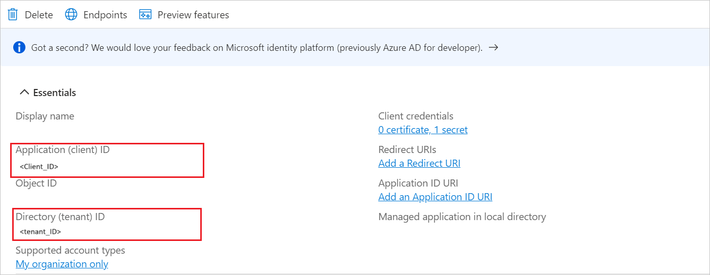

# Tutorial: Microsoft Entra single sign-on (SSO) integration with LifeBalance Program (OIDC)

In this tutorial, you'll learn how to integrate LifeBalance Program (OIDC) with Microsoft Entra ID. When you integrate LifeBalance Program (OIDC) with Microsoft Entra ID, you can:

Use Microsoft Entra ID to control who can access LifeBalance Program (OIDC).
Enable your users to be automatically signed in to LifeBalance Program (OIDC) with their Microsoft Entra accounts.
Manage your accounts in one central location: the Azure portal.

## Prerequisites

To get started, you need the following items:

* A Microsoft Entra subscription. If you don't have a subscription, you can get a [free account](https://azure.microsoft.com/free/).
* LifeBalance Program (OIDC) single sign-on (SSO) enabled subscription.

## Add LifeBalance Program (OIDC) from the gallery

To configure the integration of LifeBalance Program (OIDC) into Microsoft Entra ID, you need to add LifeBalance Program (OIDC) from the gallery to your list of managed SaaS apps.

1. Sign in to the [Microsoft Entra admin center](https://entra.microsoft.com) as at least a [Cloud Application Administrator](~/identity/role-based-access-control/permissions-reference.md#cloud-application-administrator).

1. Browse to **Identity > Applications > Enterprise applications > New application**.

1. In the **Add from the gallery** section, enter **LifeBalance Program (OIDC)** in the search box.

1. Select **LifeBalance Program (OIDC)** in the results panel and then add the app. Wait a few seconds while the app is added to your tenant.

## Configure Microsoft Entra SSO

Follow these steps to enable Microsoft Entra SSO in the Microsoft Entra admin center.

1. Sign in to the [Microsoft Entra admin center](https://entra.microsoft.com) as at least a [Cloud Application Administrator](~/identity/role-based-access-control/permissions-reference.md#cloud-application-administrator).

1. Browse to **Identity** > **Applications** > **Enterprise applications** > **LifeBalance Program (OIDC)** > **Single sign-on**.

1. Perform the following steps in the below section:

    1. Click **Go to application**.

        

    1. Copy **Application (client) ID**, **Directory (tenant) ID** and use it later in the LifeBalance Program (OIDC) side configuration.

        

1. Navigate to **Authentication** tab on the left menu and perform the following steps:

    1. In the **Redirect URIs** textbox, paste the **Redirect URI** value, which you have copied from LifeBalance Program (OIDC) side.

        

    1. Click **Configure** button.

1. Navigate to **Certificates & secrets** on the left menu and perform the following steps:

    1. Go to **Client secrets** tab and click **+New client secret**.
    1. Enter a valid **Description** in the textbox and select **Expires** days from the drop-down as per your requirement and click **Add**.

        

    1. Once you add a client secret, **Value** will be generated. Copy the value and use it later in the LifeBalance Program (OIDC) side configuration.

        

### Create a Microsoft Entra test user

In this section, you'll create a test user called B.Simon.

1. Sign in to the [Microsoft Entra admin center](https://entra.microsoft.com) as at least a [User Administrator](~/identity/role-based-access-control/permissions-reference.md#user-administrator).
1. Browse to **Identity** > **Users** > **All users**.
1. Select **New user** > **Create new user**, at the top of the screen.
1. In the **User** properties, follow these steps:
   1. In the **Display name** field, enter `B.Simon`.  
   1. In the **User principal name** field, enter the username@companydomain.extension. For example, `B.Simon@contoso.com`.
   1. Select the **Show password** check box, and then write down the value that's displayed in the **Password** box.
   1. Select **Review + create**.
1. Select **Create**.

### Assign the Microsoft Entra test user

In this section, you'll enable B.Simon to use single sign-on by granting access to LifeBalance Program (OIDC).

1. Sign in to the [Microsoft Entra admin center](https://entra.microsoft.com) as at least a [Cloud Application Administrator](~/identity/role-based-access-control/permissions-reference.md#cloud-application-administrator).
1. Browse to **Identity** > **Applications** > **Enterprise applications** > **LifeBalance Program (OIDC)**.
1. In the app's overview page, select **Users and groups**.
1. Select **Add user/group**, then select **Users and groups** in the **Add Assignment** dialog.
   1. In the **Users and groups** dialog, select **B.Simon** from the Users list, then click the **Select** button at the bottom of the screen.
   1. If you are expecting a role to be assigned to the users, you can select it from the **Select a role** dropdown. If no role has been set up for this app, you see "Default Access" role selected.
   1. In the **Add Assignment** dialog, click the **Assign** button.

## Configure LifeBalance Program (OIDC) SSO

To complete the OAuth/OIDC federation setup on **LifeBalance Program (OIDC)** side, you need to send the copied values like  Tenant ID, Application ID, and Client Secret from Entra to [LifeBalance Program (OIDC) support team](mailto:info@lifebalanceprogram.com). They set this setting to have the OIDC connection set properly on both sides.