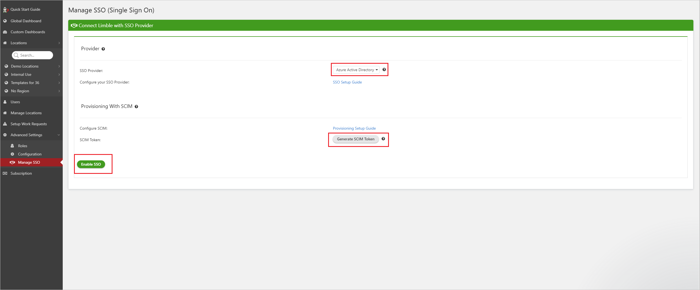

# Configure LimbleCMMS for automatic user provisioning with Microsoft Entra ID

This article describes the steps you need to perform in both LimbleCMMS and Microsoft Entra ID to configure automatic user provisioning. When configured, Microsoft Entra ID automatically provisions and de-provisions users and groups to [LimbleCMMS](https://limblecmms.com/) using the Microsoft Entra provisioning service. For important details on what this service does, how it works, and frequently asked questions, see [Automate user provisioning and deprovisioning to SaaS applications with Microsoft Entra ID](~/identity/app-provisioning/user-provisioning.md). 

## Capabilities Supported
> [!div class="checklist"]
> * Create users in LimbleCMMS.
> * Remove users in LimbleCMMS when they don't require access anymore.
> * Creates groups in LimbleCMMS.
> * Adds/Removes users from groups in LimbleCMMS
> * Removes groups in LimbleCMMS
> * Keep user attributes synchronized between Microsoft Entra ID and LimbleCMMS.
> * Provision groups and group memberships in LimbleCMMS.
> * [Single sign-on](~/identity/enterprise-apps/add-application-portal-setup-oidc-sso.md) to LimbleCMMS (recommended).

## Prerequisites

The scenario outlined in this article assumes that you already have the following prerequisites:

* [A Microsoft Entra tenant](~/identity-platform/quickstart-create-new-tenant.md). 
* One of the following roles: [Application Administrator](/entra/identity/role-based-access-control/permissions-reference#application-administrator), [Cloud Application Administrator](/entra/identity/role-based-access-control/permissions-reference#cloud-application-administrator), or [Application Owner](/entra/fundamentals/users-default-permissions#owned-enterprise-applications). 
* A [LimbleCMMS](https://limblecmms.com/signup/?plan=business-yearly) tenant with Business Plus or above licensing.
* A user account in LimbleCMMS with Super Admin permissions.
* Single Sign On to be enabled in your LimbleCMMS tenant (contact your Customer Success Manager).
* At least one group you plan on provisioning to LimbleCMMS (permissions in LimbleCMMS are based on groups, if you don't provision a group then the users that are provisioned don't have any permissions associated with them). 

## Step 1: Plan your provisioning deployment
1. Learn about [how the provisioning service works](~/identity/app-provisioning/user-provisioning.md).
1. Determine who's in [scope for provisioning](~/identity/app-provisioning/define-conditional-rules-for-provisioning-user-accounts.md).
1. Determine what data to [map between Microsoft Entra ID and LimbleCMMS](~/identity/app-provisioning/customize-application-attributes.md). 

## Step 2: Configure LimbleCMMS to support provisioning with Microsoft Entra ID

1. Login to LimbleCMMS as a **Super Admin**.
1. Navigate to **Advanced Settings > Manage SSO**.
      
1. Select **Microsoft Entra ID** as your SSO Provider.
1. [Setup OIDC](https://help.limblecmms.com/en/articles/4446986-active-directory-oidc-sso-setup-guide) to support Single Sign On
1. Select the **Generate SCIM Token** button to retrieve your SCIM token, save this for a future step.
1. Select **"Enable SSO"**.

## Step 3: Add LimbleCMMS from the Microsoft Entra application gallery

Add LimbleCMMS from the Microsoft Entra application gallery to start managing provisioning to LimbleCMMS. If you have previously setup LimbleCMMS for SSO you can use the same application. However, we recommend that you create a separate app when testing out the integration initially. Learn more about adding an application from the gallery [here](~/identity/enterprise-apps/add-application-portal.md). 

## Step 4: Define who is in scope for provisioning 

[!INCLUDE [create-assign-users-provisioning.md](~/identity/saas-apps/includes/create-assign-users-provisioning.md)]

## Step 5: Configure automatic user provisioning to LimbleCMMS 

This section guides you through the steps to configure the Microsoft Entra provisioning service to create, update, and disable users and/or groups in LimbleCMMS based on user and/or group assignments in Microsoft Entra ID.

### To configure automatic user provisioning for LimbleCMMS in Microsoft Entra ID:

1. Sign in to the [Microsoft Entra admin center](https://entra.microsoft.com) as at least a [Cloud Application Administrator](~/identity/role-based-access-control/permissions-reference.md#cloud-application-administrator).
1. Browse to **Entra ID** > **Enterprise apps**

	

1. In the applications list, select **LimbleCMMS**.

	

1. Select the **Provisioning** tab.

	

1. Set the **Provisioning Mode** to **Automatic**.

	

1. In the **Admin Credentials** section, input your LimbleCMMS **Tenant URL** and **Secret Token**. Select **Test Connection** to ensure Microsoft Entra ID can connect to LimbleCMMS.

	

1. In the **Notification Email** field, enter the email address of a person or group who should receive the provisioning error notifications and select the **Send an email notification when a failure occurs** check box.

	

1. Select **Save**.

1. In the **Mappings** section, select **Synchronize Microsoft Entra users to LimbleCMMS**.

1. Review the user attributes that are synchronized from Microsoft Entra ID to LimbleCMMS in the **Attribute-Mapping** section. The attributes selected as **Matching** properties are used to match the user accounts in LimbleCMMS for update operations. If you choose to change the [matching target attribute](~/identity/app-provisioning/customize-application-attributes.md), you need to ensure that the LimbleCMMS SCIM API supports filtering users based on that attribute. Select the **Save** button to commit any changes.

   |Attribute|Type|Supported for filtering|
   |---|---|---|
   |userName|String|&check;
   |active|Boolean|   
   |emails[type eq "work"].value|String|
   |name.givenName|String|
   |name.familyName|String|
   |externalId|String|

1. In the **Mappings** section, select **Synchronize Microsoft Entra groups to LimbleCMMS**.

1. Review the group attributes that are synchronized from Microsoft Entra ID to LimbleCMMS in the **Attribute-Mapping** section. The attributes selected as **Matching** properties are used to match the groups in LimbleCMMS for update operations. Select the **Save** button to commit any changes.

      |Attribute|Type|Supported for filtering|
      |---|---|---|
      |displayName|String|&check;
      |members|Reference|
      |externalId|String|      

1. To configure scoping filters, refer to the following instructions provided in the [Scoping filter  article](~/identity/app-provisioning/define-conditional-rules-for-provisioning-user-accounts.md).

1. To enable the Microsoft Entra provisioning service for LimbleCMMS, change the **Provisioning Status** to **On** in the **Settings** section.

	

1. Define the users and/or groups that you would like to provision to LimbleCMMS by choosing the desired values in **Scope** in the **Settings** section.

	

1. When you're ready to provision, select **Save**.

	

This operation starts the initial synchronization cycle of all users and groups defined in **Scope** in the **Settings** section. The initial cycle takes longer to perform than subsequent cycles, which occur approximately every 40 minutes as long as the Microsoft Entra provisioning service is running. 

## Step 6: Monitor your deployment

[!INCLUDE [monitor-deployment.md](~/identity/saas-apps/includes/monitor-deployment.md)]

## More resources

* [Managing user account provisioning for Enterprise Apps](~/identity/app-provisioning/configure-automatic-user-provisioning-portal.md)
* [What is application access and single sign-on with Microsoft Entra ID?](~/identity/enterprise-apps/what-is-single-sign-on.md)

## Related content

* [Learn how to review logs and get reports on provisioning activity](~/identity/app-provisioning/check-status-user-account-provisioning.md)
