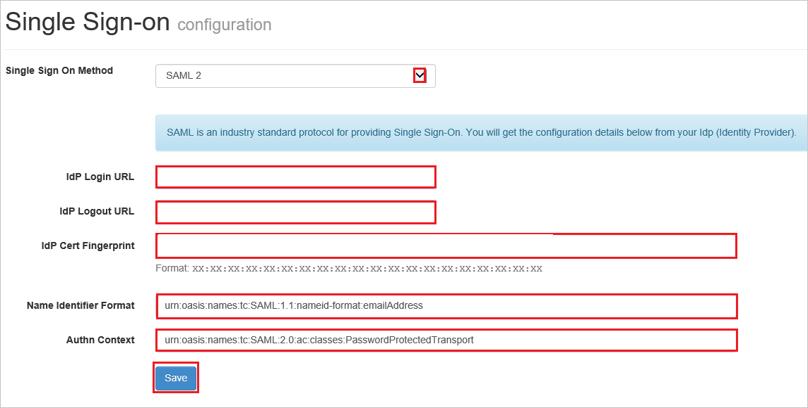

# Configure LiquidFiles for Single sign-on with Microsoft Entra ID

In this article,  you learn how to integrate LiquidFiles with Microsoft Entra ID. When you integrate LiquidFiles with Microsoft Entra ID, you can:

* Control in Microsoft Entra ID who has access to LiquidFiles.
* Enable your users to be automatically signed-in to LiquidFiles with their Microsoft Entra accounts.
* Manage your accounts in one central location.

## Prerequisites
The scenario outlined in this article assumes that you already have the following prerequisites:

[!INCLUDE [common-prerequisites.md](~/identity/saas-apps/includes/common-prerequisites.md)]
* LiquidFiles single sign-on enabled subscription.

> [!NOTE]
> This integration is also available to use from Microsoft Entra US Government Cloud environment. You can find this application in the Microsoft Entra US Government Cloud Application Gallery and configure it in the same way as you do from public cloud.

## Scenario description

In this article,  you configure and test Microsoft Entra single sign-on in a test environment.

* LiquidFiles supports **SP** initiated SSO.

## Add LiquidFiles from the gallery

To configure the integration of LiquidFiles into Microsoft Entra ID, you need to add LiquidFiles from the gallery to your list of managed SaaS apps.

1. Sign in to the [Microsoft Entra admin center](https://entra.microsoft.com) as at least a [Cloud Application Administrator](~/identity/role-based-access-control/permissions-reference.md#cloud-application-administrator).
1. Browse to **Entra ID** > **Enterprise apps** > **New application**.
1. In the **Add from the gallery** section, type **LiquidFiles** in the search box.
1. Select **LiquidFiles** from results panel and then add the app. Wait a few seconds while the app is added to your tenant.

 Alternatively, you can also use the [Enterprise App Configuration Wizard](https://portal.office.com/AdminPortal/home?Q=Docs#/azureadappintegration). In this wizard, you can add an application to your tenant, add users/groups to the app, assign roles, and walk through the SSO configuration as well. [Learn more about Microsoft 365 wizards.](/microsoft-365/admin/misc/azure-ad-setup-guides)

## Configure and test Microsoft Entra SSO for LiquidFiles

Configure and test Microsoft Entra SSO with LiquidFiles using a test user called **B.Simon**. For SSO to work, you need to establish a link relationship between a Microsoft Entra user and the related user in LiquidFiles.

To configure and test Microsoft Entra SSO with LiquidFiles, perform the following steps:

1. **[Configure Microsoft Entra SSO](#configure-azure-ad-sso)** - to enable your users to use this feature.
    1. **Create a Microsoft Entra test user** - to test Microsoft Entra single sign-on with B.Simon.
    1. **Assign the Microsoft Entra test user** - to enable B.Simon to use Microsoft Entra single sign-on.
1. **[Configure LiquidFiles SSO](#configure-liquidfiles-sso)** - to configure the single sign-on settings on application side.
    1. **[Create LiquidFiles test user](#create-liquidfiles-test-user)** - to have a counterpart of B.Simon in LiquidFiles that's linked to the Microsoft Entra representation of user.
1. **[Test SSO](#test-sso)** - to verify whether the configuration works.

## Configure Microsoft Entra SSO

Follow these steps to enable Microsoft Entra SSO.

1. Sign in to the [Microsoft Entra admin center](https://entra.microsoft.com) as at least a [Cloud Application Administrator](~/identity/role-based-access-control/permissions-reference.md#cloud-application-administrator).
1. Browse to **Entra ID** > **Enterprise apps** > **LiquidFiles** > **Single sign-on**.
1. On the **Select a single sign-on method** page, select **SAML**.
1. On the **Set up single sign-on with SAML** page, select the pencil icon for **Basic SAML Configuration** to edit the settings.

   

1. On the **Basic SAML Configuration** section, perform the following steps:

    a. In the **Identifier (Entity ID)** text box, type a URL using the following pattern:
    `https://<YOUR_SERVER_URL>`

    b. In the **Reply URL** textbox, type a URL using the following pattern: `https://<YOUR_SERVER_URL>/saml/consume`

	c. In the **Sign on URL** text box, type a URL using the following pattern:
    `https://<YOUR_SERVER_URL>/saml/init`

	> [!NOTE]
	> These values aren't real. Update these values with the actual Identifier,Reply URL and Sign on URL. Contact [LiquidFiles Client support team](https://www.liquidfiles.com/support.html) to get these values. You can also refer to the patterns shown in the **Basic SAML Configuration** section.

5. In the **SAML Signing Certificate** section, select **Edit** button to open **SAML Signing Certificate** dialog.

	

6. In the **SAML Signing Certificate** section, copy the **THUMBPRINT** and save it on your computer.

    

7. On the **Set up LiquidFiles** section, copy the appropriate URL(s) as per your requirement.

	

[!INCLUDE [create-assign-users-sso.md](~/identity/saas-apps/includes/create-assign-users-sso.md)]

## Configure LiquidFiles SSO

1. Sign-on to your LiquidFiles company site as administrator.

1. Select **Single Sign-On** in the **Admin > Configuration** from the menu.

1. On the **Single Sign-On Configuration** page, perform the following steps.

    

    a. As **Single Sign On Method**, select **SAML 2**.

	b. In the **IDP Login URL** textbox, paste the value of **Login URL**.

	c. In the **IDP Logout URL** textbox, paste the value of **Logout URL**.

	d. In the **IDP Cert Fingerprint** textbox, paste the **THUMBPRINT** value..

	e. In the Name Identifier Format textbox, type the value `urn:oasis:names:tc:SAML:1.1:nameid-format:emailAddress`.

	f. In the Authn Context textbox, type the value `urn:oasis:names:tc:SAML:2.0:ac:classes:PasswordProtectedTransport`.

	g. Select **Save**.

### Create LiquidFiles test user

The objective of this section is to create a user called Britta Simon in LiquidFiles. Work with your LiquidFiles server administrator to get yourself added as a user before logging in to your LiquidFiles application.

## Test SSO

In this section, you test your Microsoft Entra single sign-on configuration with following options. 

* Select **Test this application**, this option redirects to LiquidFiles Sign-on URL where you can initiate the login flow. 

* Go to LiquidFiles Sign-on URL directly and initiate the login flow from there.

* You can use Microsoft My Apps. When you select the LiquidFiles tile in the My Apps, this option redirects to LiquidFiles Sign-on URL. For more information, see [Microsoft Entra My Apps](/azure/active-directory/manage-apps/end-user-experiences#azure-ad-my-apps).

## Related content

Once you configure LiquidFiles you can enforce session control, which protects exfiltration and infiltration of your organization’s sensitive data in real time. Session control extends from Conditional Access. [Learn how to enforce session control with Microsoft Defender for Cloud Apps](/cloud-app-security/proxy-deployment-aad).
