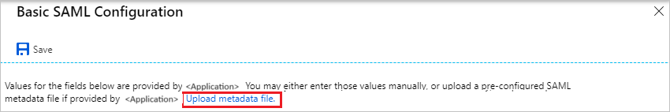
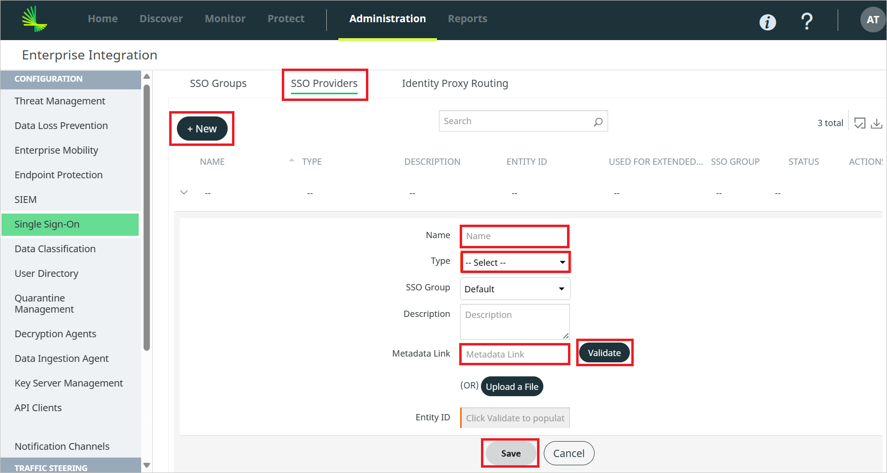

# Microsoft Entra SSO integration with Lookout Secure Access

In this tutorial, you'll learn how to integrate Lookout Secure Access with Microsoft Entra ID. When you integrate Lookout Secure Access with Microsoft Entra ID, you can:

* Control in Microsoft Entra ID who has access to Lookout Secure Access.
* Enable your users to be automatically signed-in to Lookout Secure Access with their Microsoft Entra accounts.
* Manage your accounts in one central location.

## Overview

Lookout Cloud Security Platform is a data-centric cloud security solution that protects your users from internet-based threats and protects data stored in cloud applications, private applications, and websites.

The solution supports these important components of cloud security:

- Lookout Secure Internet Access: Protection for web or nonweb internet-based traffic. 
- Lookout Secure Private Access: Protection for private application traffic.
- Lookout Secure Cloud Access: Protection for cloud application traffic.

## Prerequisites

To integrate Microsoft Entra ID with Lookout Secure Access, you need:

* A Microsoft Entra subscription. If you don't have a subscription, you can get a [free account](https://azure.microsoft.com/free/).
* Lookout SSE subscription.

## Scenario description

In this tutorial, you configure and test Microsoft Entra SSO in a test environment.

* Lookout Secure Access supports both **SP and IDP** initiated SSO.

## Add Lookout Secure Access from the gallery

To configure the integration of Lookout Secure Access into Microsoft Entra ID, you need to add Lookout Secure Access from the gallery to your list of managed SaaS apps.

1. Sign in to the [Microsoft Entra admin center](https://entra.microsoft.com) as at least a [Cloud Application Administrator](~/identity/role-based-access-control/permissions-reference.md#cloud-application-administrator).
1. Browse to **Identity** > **Applications** > **Enterprise applications** > **New application**.
1. In the **Add from the gallery** section, type **Lookout Secure Access** in the search box.
1. Select **Lookout Secure Access** from results panel and then add the app. Wait a few seconds while the app is added to your tenant.

Alternatively, you can also use the [Enterprise App Configuration Wizard](https://portal.office.com/AdminPortal/home?Q=Docs#/azureadappintegration). In this wizard, you can add an application to your tenant, add users/groups to the app, assign roles, and walk through the SSO configuration as well. [Learn more about Microsoft 365 wizards.](/microsoft-365/admin/misc/azure-ad-setup-guides)

## Configure and test Microsoft Entra SSO for Lookout Secure Access

Configure and test Microsoft Entra SSO with Lookout Secure Access using a test user called **B.Simon**. For SSO to work, you need to establish a link relationship between a Microsoft Entra user and the related user in Lookout Secure Access.

To configure and test Microsoft Entra SSO with Lookout Secure Access, perform the following steps:

1. **[Configure Microsoft Entra SSO](#configure-microsoft-entra-sso)** - to enable your users to use this feature.
    1. **[Create a Microsoft Entra ID test user](#create-a-microsoft-entra-id-test-user)** - to test Microsoft Entra single sign-on with B.Simon.
    1. **[Assign the Microsoft Entra ID test user](#assign-the-microsoft-entra-id-test-user)** - to enable B.Simon to use Microsoft Entra single sign-on.
1. **[Configure Lookout Secure Access SSO](#configure-lookout-secure-access-sso)** - to configure the single sign-on settings on application side.
    1. **[Create Lookout Secure Access test user](#create-lookout-secure-access-test-user)** - to have a counterpart of B.Simon in Lookout Secure Access that is linked to the Microsoft Entra ID representation of user.
1. **[Test SSO](#test-sso)** - to verify whether the configuration works.

## Configure Microsoft Entra SSO

Follow these steps to enable Microsoft Entra SSO in the Microsoft Entra admin center.

1. Sign in to the [Microsoft Entra admin center](https://entra.microsoft.com) as at least a [Cloud Application Administrator](~/identity/role-based-access-control/permissions-reference.md#cloud-application-administrator).
1. Browse to **Identity** > **Applications** > **Enterprise applications** > **Lookout Secure Access** > **Single sign-on**.
1. On the **Select a single sign-on method** page, select **SAML**.
1. On the **Set up single sign-on with SAML** page, click the pencil icon for **Basic SAML Configuration** to edit the settings.

   

1. On the **Basic SAML Configuration** section, if you have **Service Provider metadata file**, perform the following steps:

	a. Click **Upload metadata file**.

    

	b. Click on **folder logo** to select the metadata file and click **Upload**.

	

	c. After the metadata file is successfully uploaded, the **Identifier** and **Reply URL** values get auto populated in Basic SAML Configuration section.

	> [!NOTE]
    > If the Identifier and Reply URL values are not getting auto populated, then fill the values manually according to your requirement. You can get **Service Provider Metadata** file from the **[Configure Lookout Secure Access](#configure-lookout-secure-access-sso)** section.

    d. In the **Relay State** textbox, paste the value, which you have copied from the Lookout management console and click **Save**.

1. Lookout Secure Access application expects the SAML assertions in a specific format, which requires you to add custom attribute mappings to your SAML token attributes configuration. For the **Unique User Identifier (Name ID)** attribute, please set Name identifier format as **Unspecified** manually.

    

1. On the **Set up single sign-on with SAML** page, in the **SAML Signing Certificate** section, click copy button to copy **App Federation Metadata Url** and save it on your computer.

	

### Create a Microsoft Entra ID test user

In this section, you'll create a test user in the Microsoft Entra admin center called B.Simon.

1. Sign in to the [Microsoft Entra admin center](https://entra.microsoft.com) as at least a [User Administrator](~/identity/role-based-access-control/permissions-reference.md#user-administrator).
1. Browse to **Identity** > **Users** > **All users**.
1. Select **New user** > **Create new user**, at the top of the screen.
1. In the **User** properties, follow these steps:
   1. In the **Display name** field, enter `B.Simon`.  
   1. In the **User principal name** field, enter the username@companydomain.extension. For example, `B.Simon@contoso.com`.
   1. Select the **Show password** check box, and then write down the value that's displayed in the **Password** box.
   1. Select **Review + create**.
1. Select **Create**.

### Assign the Microsoft Entra ID test user

In this section, you'll enable B.Simon to use Microsoft Entra single sign-on by granting access to Lookout Secure Access.

1. Sign in to the [Microsoft Entra admin center](https://entra.microsoft.com) as at least a [Cloud Application Administrator](~/identity/role-based-access-control/permissions-reference.md#cloud-application-administrator).
1. Browse to **Identity** > **Applications** > **Enterprise applications** > **Lookout Secure Access**.
1. In the app's overview page, select **Users and groups**.
1. Select **Add user/group**, then select **Users and groups** in the **Add Assignment** dialog.
   1. In the **Users and groups** dialog, select **B.Simon** from the Users list, then click the **Select** button at the bottom of the screen.
   1. If you are expecting a role to be assigned to the users, you can select it from the **Select a role** dropdown. If no role has been set up for this app, you see "Default Access" role selected.
   1. In the **Add Assignment** dialog, click the **Assign** button.

## Configure Lookout Secure Access SSO

1. Log in to Lookout Secure Access company site as an administrator.

1. Go to **Administration** > **Enterprise Integration** and click **Single Sign-On** from the left pane.

1. On the **SSO Groups** tab, click on the download icon of the **SP Metadata** from the Default group. A pop-up appears with SP Metadata details. Click on SP Metadata File button to download the file and upload in the **Basic SAML Configuration** section in the Microsoft Entra admin center.

    

1. Navigate to **SSO Providers** tab and perform the following steps.

    

    1. Click **+New**.

    1. Enter a valid Name in the **Name** field and select Type as **Identity Provider**.

    1. Paste the **App Federation Metadata Url** in the **Metadata Link**  textbox, which you have copied from the Microsoft Entra admin center.

    1. Click **Validate**.
    
    1. Click **Save**.

1. Navigate back to **Administration** > **System Settings** > **Enterprise Authentication** and perform the following steps:
    
    

    1. From the **Identity Provider** dropdown, choose the Identity Provider you created.

    1. Enable the **Management Console** and **Endpoint** by turning on the toggle.

    1. Copy the **Relay State** value by clicking the copy button and paste it in the **Relay State** textbox in **Basic SAML Configuration** section on Entra side.

    1. Click **Save**.

### Create Lookout Secure Access test user

In this section, a user called Britta Simon is created in Lookout Secure Access. Lookout Secure Access supports just-in-time user provisioning, which is enabled by default. There is no action item for you in this section. If a user doesn't already exist in Lookout Secure Access, a new one is created after authentication.

## Test SSO 

In this section, you test your Microsoft Entra single sign-on configuration with following options.
 
#### SP initiated
  
* Go to Lookout SSE Management Console URL directly and initiate the login with IDP flow from there.

#### IDP initiated
 
* Click on **Test this application** in Microsoft Entra admin center and you should be automatically signed in to the Lookout Secure Access for which you set up the SSO.
 
You can also use Microsoft My Apps to test the application in any mode. When you click the Lookout Secure Access tile in the My Apps, if configured in SP mode you would be redirected to the application sign-on page for initiating the login flow and if configured in IDP mode, you should be automatically signed in to the Lookout Secure Access for which you set up the SSO. For more information about the My Apps, see [Introduction to the My Apps](https://support.microsoft.com/account-billing/sign-in-and-start-apps-from-the-my-apps-portal-2f3b1bae-0e5a-4a86-a33e-876fbd2a4510).

## Next steps

Once you configure Lookout Secure Access you can enforce session control, which protects exfiltration and infiltration of your organization's sensitive data in real time. Session control extends from Conditional Access. [Learn how to enforce session control with Microsoft Defender for Cloud Apps](/cloud-app-security/proxy-deployment-any-app).
