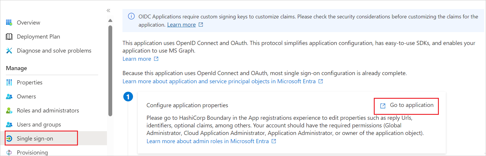
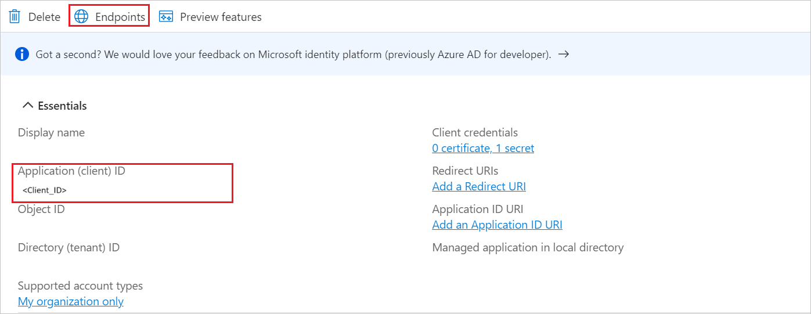
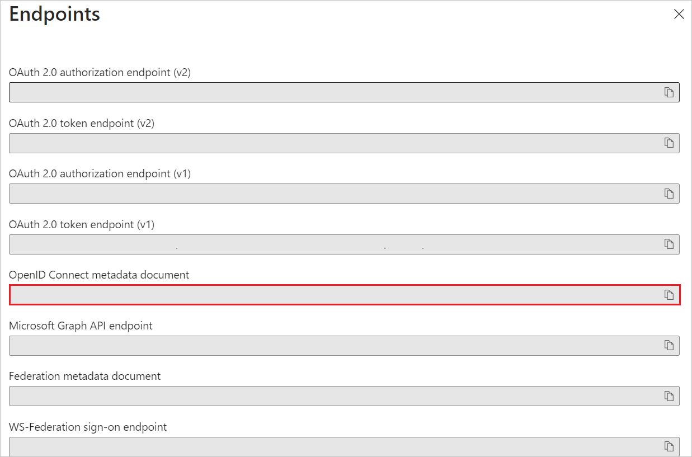
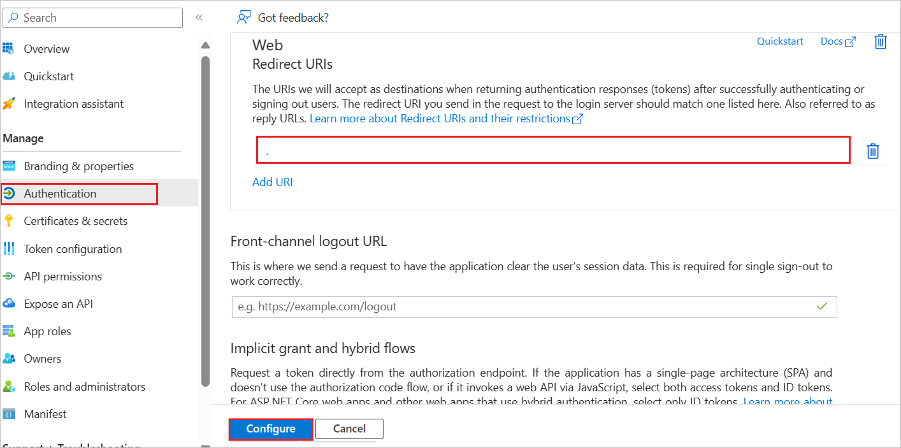
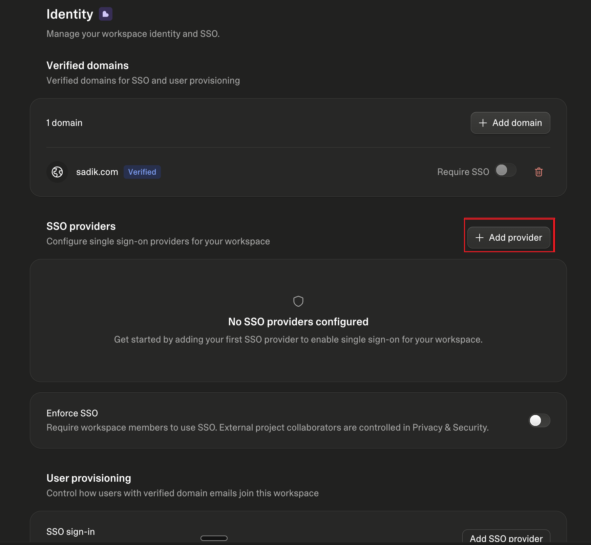
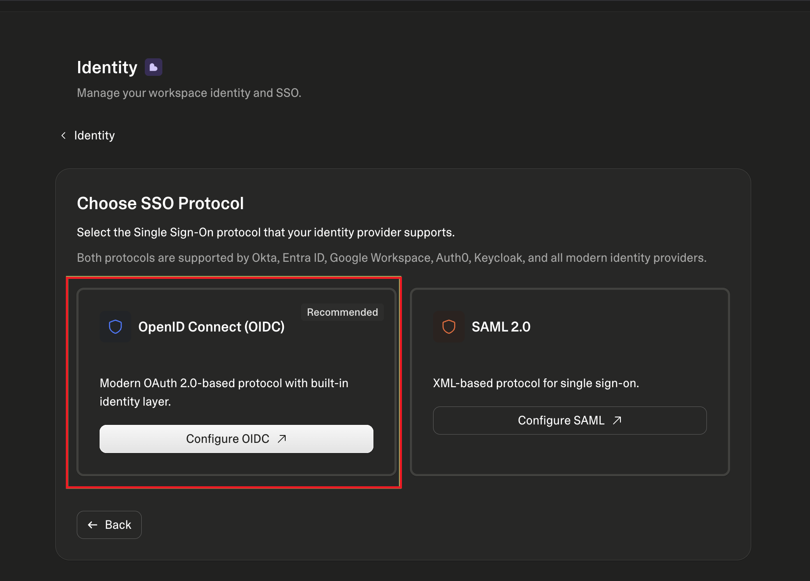
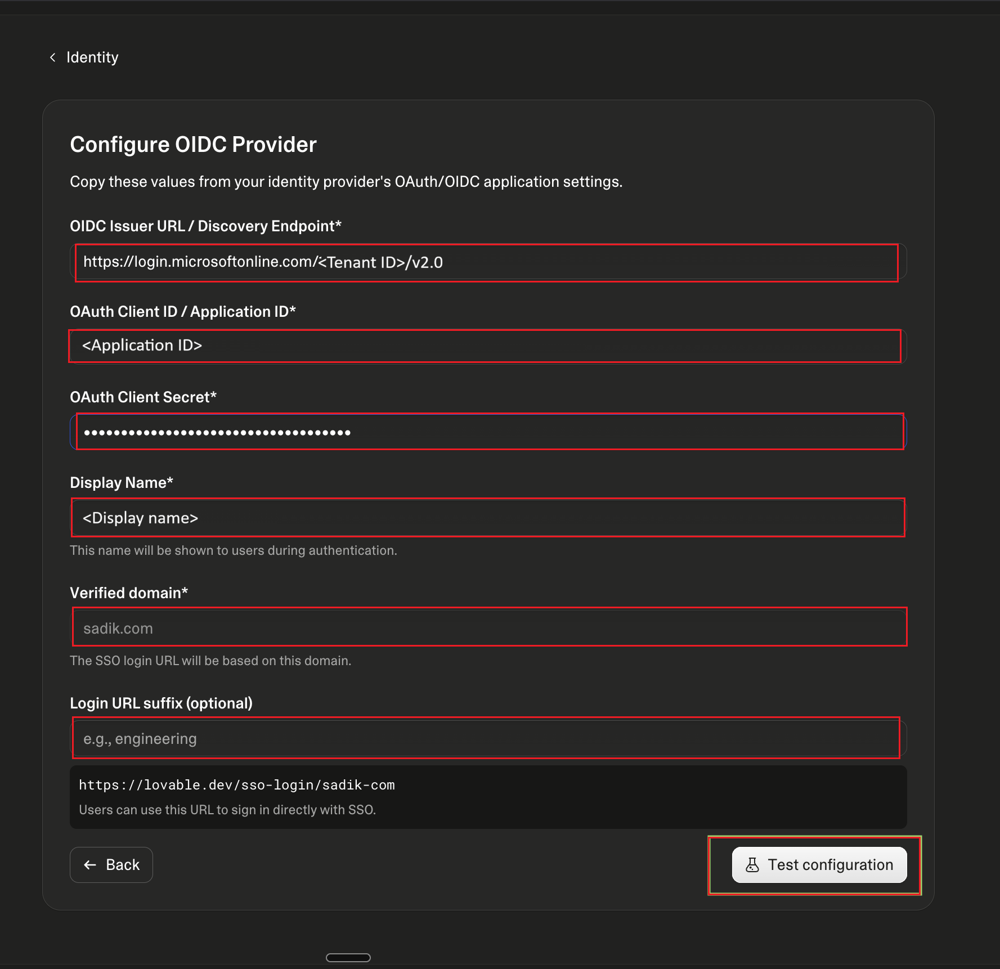

# Configure Lovable (OIDC) for Single sign-on with Microsoft Entra ID

In this article, you learn how to integrate Lovable with Microsoft Entra ID by using OpenID Connect (OIDC). When you integrate Lovable with Microsoft Entra ID, you can:

* Use Microsoft Entra ID to control who can access Lovable.
* Enable your users to sign in to Lovable with their Microsoft Entra accounts.
* Manage access to Lovable in one central location.

Lovable supports OIDC-based workspace single sign-on (SSO) for Business and Enterprise workspaces. Lovable supports service provider (SP)-initiated sign-on only. Users must start sign-in from Lovable.

## Prerequisites

To get started, you need the following items:

* A Microsoft Entra subscription. If you don't have a subscription, you can get a [free account](https://azure.microsoft.com/pricing/purchase-options/azure-account?cid=msft_learn).
* A Lovable Business or Enterprise workspace.
* Owner or administrator permissions in the Lovable workspace.
* A verified domain in Lovable.

## Add Lovable (OIDC) from the gallery

To configure the integration of Lovable into Microsoft Entra ID, you need to add Lovable from the gallery to your list of managed SaaS apps.

1. Sign in to the [Microsoft Entra admin center](https://entra.microsoft.com) as at least a [Cloud Application Administrator](~/identity/role-based-access-control/permissions-reference.md#cloud-application-administrator).

1. Browse to **Entra ID** > **Enterprise apps** > **New application**.

1. In the **Add from the gallery** section, enter **Lovable** in the search box.

1. Select **Lovable** in the results panel and then add the app. Wait a few seconds while the app is added to your tenant.

## Configure Microsoft Entra SSO

Follow these steps to enable Microsoft Entra SSO in the Microsoft Entra admin center.

1. Sign in to the [Microsoft Entra admin center](https://entra.microsoft.com) as at least a [Cloud Application Administrator](~/identity/role-based-access-control/permissions-reference.md#cloud-application-administrator).

1. Browse to **Entra ID** > **Enterprise apps** > **Lovable** > **Single sign-on**.

1. Perform the following steps in the below section:

    1. Select **Go to application**.

        

    1. Copy **Application (client) ID** and **Directory (tenant) ID**. You use these values later in the Lovable configuration.

        

    1. Under **Endpoints**, copy the **OpenID Connect metadata document** link if you want to verify the metadata endpoint used by the application.

        

1. Navigate to **Authentication** on the left menu and perform the following steps:

    1. In the **Redirect URIs** box, enter the Lovable redirect URI: `https://auth.lovable.dev/__/auth/handler`

        

    1. Select **Configure**.

1. Navigate to **API permissions** on the left menu.

1. Verify that the Microsoft Graph delegated permissions required by Lovable are configured:

    * `email`
    * `openid`
    * `profile`

1. Select **Grant admin consent** for the configured permissions.

1. Navigate to **Certificates & secrets** on the left menu and perform the following steps:

    1. Go to the **Client secrets** tab and select **New client secret**.

    1. Enter a description, select an expiration period, and then select **Add**.

    1. Copy the client secret **Value**. You use this value later in the Lovable configuration.

> [!IMPORTANT]
> Copy the client secret value immediately. It isn't shown again after you leave the page.

### Create a Microsoft Entra test user

In this section, you create a test user called B.Simon.

1. Sign in to the [Microsoft Entra admin center](https://entra.microsoft.com) as at least a [User Administrator](~/identity/role-based-access-control/permissions-reference.md#user-administrator).

1. Browse to **Entra ID** > **Users**.

1. Select **New user** > **Create new user**.

1. In the **User** properties, follow these steps:

   1. In the **Display name** field, enter `B.Simon`.

   1. In the **User principal name** field, enter the username@companydomain.extension. For example, `B.Simon@contoso.com`.

   1. Select the **Show password** check box, and then write down the value that's displayed in the **Password** box.

   1. Select **Review + create**.

1. Select **Create**.

### Assign the Microsoft Entra test user

In this section, you enable B.Simon to use single sign-on by granting access to Lovable.

1. Sign in to the [Microsoft Entra admin center](https://entra.microsoft.com) as at least a [Cloud Application Administrator](~/identity/role-based-access-control/permissions-reference.md#cloud-application-administrator).

1. Browse to **Entra ID** > **Enterprise apps**.

1. In the applications list, select **Lovable**.

1. In the app's overview page, select **Users and groups**.

1. Select **Add user/group**, and then select **Users and groups**.

1. In the **Users and groups** dialog, select **B.Simon** from the users list, and then select **Select**.

1. In the **Add Assignment** dialog, select **Assign**.

## Configure Lovable OIDC SSO

Below are the configuration steps to complete the OIDC SSO setup in Lovable:

1. Sign in to [Lovable](https://lovable.dev) as a workspace owner or administrator.

1. Go to your workspace **Settings**. In the sidebar, under **Members & access**, select **Identity**.

1. If your domain isn't verified yet, verify it first:

    1. In the **Verified domains** section, select **Add domain**.

    1. In the **Domain** box, enter your domain (for example, `contoso.com`).

    1. Add the TXT record shown on the page to your DNS provider. DNS changes can take from a few minutes up to 72 hours to propagate.

    1. Select **Verify domain**, and after the domain is verified, select **Continue**.

1. In the **SSO providers** section, select **Add provider**.

    

1. On the **Choose SSO Protocol** step, select **Configure OIDC** under **OpenID Connect (OIDC)**.

    

1. Lovable shows preparation steps that summarize the identity provider setup you already completed in Microsoft Entra ID (application settings, redirect URI, and OAuth scopes). Select **Next** to move through them, and then select **I've Configured My IdP**.

1. On the **Configure OIDC Provider** step, perform the following steps:

    

    1. In **OIDC Issuer URL / Discovery Endpoint**, enter the following URL. Replace `{TENANT_ID}` with the **Directory (tenant) ID** value that you copied from Microsoft Entra ID.

       `https://login.microsoftonline.com/{TENANT_ID}/v2.0`

    1. In **OAuth Client ID / Application ID**, paste the **Application (client) ID** value that you copied from Microsoft Entra ID.

    1. In **OAuth Client Secret**, paste the client secret value that you copied from Microsoft Entra ID.

    1. In **Display Name**, enter the name that users see during authentication.

    1. In **Verified domain**, select the verified domain to use for SSO. The SSO login URL is based on this domain.

    1. Optionally, in **Login URL suffix**, enter a suffix for the SSO login identifier. The resulting SSO login URL is shown below the field; users can use this URL to sign in directly with SSO.

1. Select **Test configuration** to validate the OIDC configuration.

1. On the **Test results** step, review the validation results, and then select **Configure provider**.

1. Review the confirmation page, and then select **Confirm & enable SSO** to finish the Lovable OIDC SSO configuration.

The provider now appears in the **SSO providers** section together with its SSO login URL, which you can copy and share with your users.

> [!NOTE]
> Wait 6 hours and test SSO login before enforcing SSO for the workspace. Lovable disables the **Enforce SSO** toggle during this period for newly created providers.

## Test SSO

Lovable supports SP-initiated sign-on only. IdP-initiated sign-on from a Microsoft Entra application tile isn't supported.

To test SSO, go to Lovable and start the SSO sign-in flow. If you configured an SSO login identifier in Lovable, users can also start sign-in by using the following URL:

`https://lovable.dev/sso-login/{tenantId}`

Replace `{tenantId}` with the SSO login identifier configured in Lovable.

## Additional Lovable SSO settings

After the OIDC provider is configured, a Lovable workspace owner or administrator can enforce SSO for the workspace in **Settings** > **Workspace** > **Identity**. When SSO is enforced, workspace members must authenticate with SSO.

Lovable supports just-in-time (JIT) provisioning through SSO. User accounts are created automatically the first time users sign in with SSO and are added to the company workspace. Lovable also supports SCIM provisioning on the Enterprise plan.
