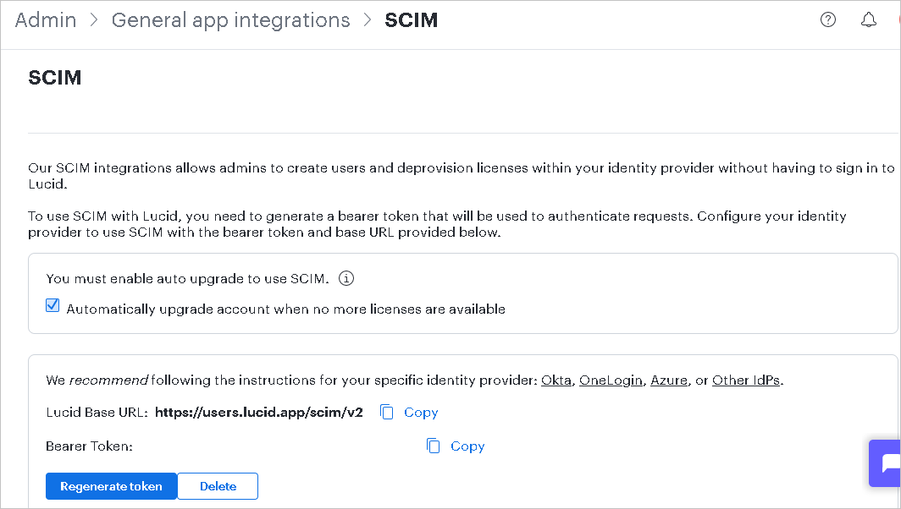

# Configure Lucid (All Products) for automatic user provisioning with Microsoft Entra ID

This article describes the steps you need to perform in both Lucid (All Products) and Microsoft Entra ID to configure automatic user provisioning. When configured, Microsoft Entra ID automatically provisions and de-provisions users and groups to [Lucid (All Products)](https://lucid.co/) using the Microsoft Entra provisioning service. For important details on what this service does, how it works, and frequently asked questions, see [Automate user provisioning and deprovisioning to SaaS applications with Microsoft Entra ID](~/identity/app-provisioning/user-provisioning.md). 

## Capabilities supported
> [!div class="checklist"]
> * Create users in Lucid (All Products).
> * Remove users in Lucid (All Products) when they don't require access anymore.
> * Keep user attributes synchronized between Microsoft Entra ID and Lucid (All Products).
> * Provision groups and group memberships in Lucid (All Products).
> * [Single sign-on](./lucid-tutorial.md) to Lucid (All Products) (recommended)

## Prerequisites

The scenario outlined in this article assumes that you already have the following prerequisites:

* [A Microsoft Entra tenant](~/identity-platform/quickstart-create-new-tenant.md). 
* One of the following roles: [Application Administrator](/entra/identity/role-based-access-control/permissions-reference#application-administrator), [Cloud Application Administrator](/entra/identity/role-based-access-control/permissions-reference#cloud-application-administrator), or [Application Owner](/entra/fundamentals/users-default-permissions#owned-enterprise-applications). 
* A user account in Lucid (All Products) with Admin rights.
* Confirm that you're on an Enterprise account with an up-to-date pricing plan. To upgrade, please contact our sales team.
* Contact your Lucidchart Customer Success Manager so that they can enable SCIM for your account.

## Step 1: Plan your provisioning deployment
1. Learn about [how the provisioning service works](~/identity/app-provisioning/user-provisioning.md).
1. Determine who's in [scope for provisioning](~/identity/app-provisioning/define-conditional-rules-for-provisioning-user-accounts.md).
1. Determine what data to [map between Microsoft Entra ID and Lucid (All Products)](~/identity/app-provisioning/customize-application-attributes.md). 

## Step 2: Configure Lucid (All Products) to support provisioning with Microsoft Entra ID

1. Log in to [Lucid Admin Console](https://lucid.app/). Navigate to **Admin**.
1. Select **App integration** in the left-hand menu.
1. Select the **SCIM** tile.
1. Select **Generate Token**. Lucid will populate the **Bearer Token** text field with a unique code for you to share with Azure.Copy and save the **Bearer token**. This value is entered in the **Secret Token** * field in the Provisioning tab of your Lucid(All Products) application.

	

## Step 3: Add Lucid (All Products) from the Microsoft Entra application gallery

Add Lucid (All Products) from the Microsoft Entra application gallery to start managing provisioning to Lucid (All Products). If you have previously setup Lucid (All Products) for SSO, you can use the same application. However, we recommend that you create a separate app when testing out the integration initially. Learn more about adding an application from the gallery [here](~/identity/enterprise-apps/add-application-portal.md). 

## Step 4: Define who is in scope for provisioning 

[!INCLUDE [create-assign-users-provisioning.md](~/identity/saas-apps/includes/create-assign-users-provisioning.md)]

## Step 5: Configure automatic user provisioning to Lucid (All Products) 

This section guides you through the steps to configure the Microsoft Entra provisioning service to create, update, and disable users and/or groups in Lucid (All Products) based on user and/or group assignments in Microsoft Entra ID.

### To configure automatic user provisioning for Lucid (All Products) in Microsoft Entra ID:

1. Sign in to the [Microsoft Entra admin center](https://entra.microsoft.com) as at least a [Cloud Application Administrator](~/identity/role-based-access-control/permissions-reference.md#cloud-application-administrator).
1. Browse to **Entra ID** > **Enterprise apps**

	

1. In the applications list, select **Lucid (All Products)**.

	

1. Select the **Provisioning** tab.

	

1. Set the **Provisioning Mode** to **Automatic**.

	

1. Under the **Admin Credentials** section, input your Lucid (All Products) Tenant URL and Secret Token. Select **Test Connection** to ensure Microsoft Entra ID can connect to Lucid (All Products). If the connection fails, ensure your Lucid (All Products) account has Admin permissions and try again.

 	

1. In the **Notification Email** field, enter the email address of a person or group who should receive the provisioning error notifications and select the **Send an email notification when a failure occurs** check box.

	

1. Select **Save**.

1. Under the **Mappings** section, select **Provision Microsoft Entra users**.

1. Review the user attributes that are synchronized from Microsoft Entra ID to Lucid (All Products) in the **Attribute-Mapping** section. The attributes selected as **Matching** properties are used to match the user accounts in Lucid (All Products) for update operations. If you choose to change the [matching target attribute](~/identity/app-provisioning/customize-application-attributes.md), you need to ensure that the Lucid (All Products) API supports filtering users based on that attribute. Select the **Save** button to commit any changes.

    |Attribute|Type|Supported for filtering|Required by Lucid (All Products)|
    |---|---|---|---|
    |userName|String|&check;|&check;
    |emails[type eq "work"].value|String||&check;
    |active|Boolean||
    |name.givenName|String||
    |name.familyName|String||
    |urn:ietf:params:scim:schemas:extension:lucid:2.0:User:billingCode|String||
    |urn:ietf:params:scim:schemas:extension:lucid:2.0:User:productLicenses.Lucidchart|String||
    |urn:ietf:params:scim:schemas:extension:lucid:2.0:User:productLicenses.Lucidspark|String||
    |urn:ietf:params:scim:schemas:extension:lucid:2.0:User:productLicenses.LucidscaleExplorer|String||
    |urn:ietf:params:scim:schemas:extension:lucid:2.0:User:productLicenses.LucidscaleCreator|String||

1. Under the **Mappings** section, select **Provision Microsoft Entra groups**.

1. Review the group attributes that are synchronized from Microsoft Entra ID to Lucid (All Products) in the **Attribute-Mapping** section. The attributes selected as **Matching** properties are used to match the groups in Lucid (All Products) for update operations. Select the **Save** button to commit any changes.

    |Attribute|Type|Supported for filtering|Required by Lucid (All Products)|
    |---|---|---|---|
    |displayName|String|&check;|&check;
    |members|Reference||    

1. To configure scoping filters, refer to the following instructions provided in the [Scoping filter  article](~/identity/app-provisioning/define-conditional-rules-for-provisioning-user-accounts.md).

1. To enable the Microsoft Entra provisioning service for Lucid (All Products), change the **Provisioning Status** to **On** in the **Settings** section.

	

1. Define the users and/or groups that you would like to provision to Lucid (All Products) by choosing the desired values in **Scope** in the **Settings** section.

	

1. When you're ready to provision, select **Save**.

	

This operation starts the initial synchronization cycle of all users and groups defined in **Scope** in the **Settings** section. The initial cycle takes longer to perform than subsequent cycles, which occur approximately every 40 minutes as long as the Microsoft Entra provisioning service is running. 

## Step 6: Monitor your deployment

[!INCLUDE [monitor-deployment.md](~/identity/saas-apps/includes/monitor-deployment.md)]

## More resources

* [Managing user account provisioning for Enterprise Apps](~/identity/app-provisioning/configure-automatic-user-provisioning-portal.md)
* [What is application access and single sign-on with Microsoft Entra ID?](~/identity/enterprise-apps/what-is-single-sign-on.md)

## Related content

* [Learn how to review logs and get reports on provisioning activity](~/identity/app-provisioning/check-status-user-account-provisioning.md)
