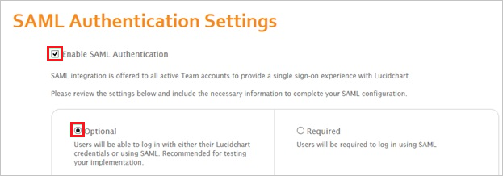
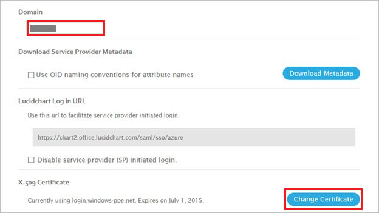
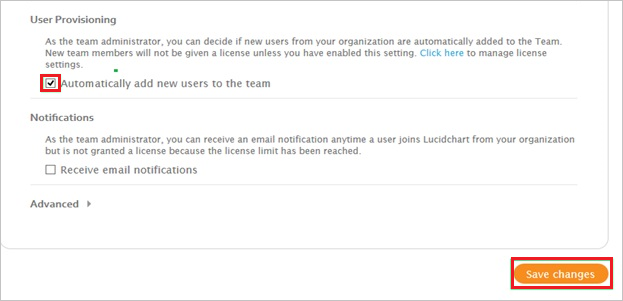

# Configure Lucidchart for Single sign-on with Microsoft Entra ID

In this article,  you learn how to integrate Lucidchart with Microsoft Entra ID. When you integrate Lucidchart with Microsoft Entra ID, you can:

* Control in Microsoft Entra ID who has access to Lucidchart.
* Enable your users to be automatically signed-in to Lucidchart with their Microsoft Entra accounts.
* Manage your accounts in one central location.

## Prerequisites
The scenario outlined in this article assumes that you already have the following prerequisites:

[!INCLUDE [common-prerequisites.md](~/identity/saas-apps/includes/common-prerequisites.md)]
* Lucidchart single sign-on (SSO) enabled subscription.

## Scenario description

In this article,  you configure and test Microsoft Entra SSO in a test environment.

* Lucidchart supports **SP** initiated SSO
* Lucidchart supports [**Automated** user provisioning and deprovisioning](lucidchart-provisioning-tutorial.md) (recommended).
* Lucidchart supports **Just In Time** user provisioning

## Add Lucidchart from the gallery

To configure the integration of Lucidchart into Microsoft Entra ID, you need to add Lucidchart from the gallery to your list of managed SaaS apps.

1. Sign in to the [Microsoft Entra admin center](https://entra.microsoft.com) as at least a [Cloud Application Administrator](~/identity/role-based-access-control/permissions-reference.md#cloud-application-administrator).
1. Browse to **Entra ID** > **Enterprise apps** > **New application**.
1. In the **Add from the gallery** section, type **Lucidchart** in the search box.
1. Select **Lucidchart** from results panel and then add the app. Wait a few seconds while the app is added to your tenant.

 Alternatively, you can also use the [Enterprise App Configuration Wizard](https://portal.office.com/AdminPortal/home?Q=Docs#/azureadappintegration). In this wizard, you can add an application to your tenant, add users/groups to the app, assign roles, and walk through the SSO configuration as well. [Learn more about Microsoft 365 wizards.](/microsoft-365/admin/misc/azure-ad-setup-guides)

## Configure and test Microsoft Entra SSO for Lucidchart

Configure and test Microsoft Entra SSO with Lucidchart using a test user called **B.Simon**. For SSO to work, you need to establish a link relationship between a Microsoft Entra user and the related user in Lucidchart.

To configure and test Microsoft Entra SSO with Lucidchart, perform the following steps:

1. **[Configure Microsoft Entra SSO](#configure-azure-ad-sso)** - to enable your users to use this feature.
    * **Create a Microsoft Entra test user** - to test Microsoft Entra single sign-on with B.Simon.
    * **Assign the Microsoft Entra test user** - to enable B.Simon to use Microsoft Entra single sign-on.
1. **[Configure Lucidchart SSO](#configure-lucidchart-sso)** - to configure the single sign-on settings on application side.
    * **[Create Lucidchart test user](#create-lucidchart-test-user)** - to have a counterpart of B.Simon in Lucidchart that's linked to the Microsoft Entra representation of user.
1. **[Test SSO](#test-sso)** - to verify whether the configuration works.

## Configure Microsoft Entra SSO

Follow these steps to enable Microsoft Entra SSO.

1. Sign in to the [Microsoft Entra admin center](https://entra.microsoft.com) as at least a [Cloud Application Administrator](~/identity/role-based-access-control/permissions-reference.md#cloud-application-administrator).
1. Browse to **Entra ID** > **Enterprise apps** > **Lucidchart** > **Single sign-on**.
1. On the **Select a single sign-on method** page, select **SAML**.
1. On the **Set up single sign-on with SAML** page, select the pencil icon for **Basic SAML Configuration** to edit the settings.

   

1. On the **Basic SAML Configuration** section, enter the values for the following fields:

   In the **Sign-on URL** text box, type the URL as:
    `https://chart2.office.lucidchart.com/saml/sso/azure`

1. On the **Set up Single Sign-On with SAML** page, in the **SAML Signing Certificate** section, select **Download** to download the **Federation Metadata XML** from the given options as per your requirement and save it on your computer.

	

6. On the **Set up Lucidchart** section, copy the appropriate URL(s) as per your requirement.

	

	

[!INCLUDE [create-assign-users-sso.md](~/identity/saas-apps/includes/create-assign-users-sso.md)]

## Configure Lucidchart SSO

1. In a different web browser window, log into your Lucidchart company site as an administrator.

2. In the menu on the top, select **Team**.

    

3. Select **Applications** > **Manage SAML**.

    

4. On the **SAML Authentication Settings** dialog page, perform the following steps:

    a. Select **Enable SAML Authentication**, and then select **Optional**.

    

    b. In the **Domain** textbox, type your domain, and then select **Change Certificate**.

    

    c. Open your downloaded metadata file, copy the content, and then paste it into the **Upload Metadata** textbox.

    

    d. Select **Automatically Add new users to the team**, and then select **Save changes**.

    

### Create Lucidchart test user

There's no action item for you to configure user provisioning to Lucidchart.  When an assigned user tries to log into Lucidchart using the access panel, Lucidchart checks whether the user exists.  

If there is no user account available yet, it's automatically created by Lucidchart.

## Test SSO 

In this section, you test your Microsoft Entra single sign-on configuration with following options. 

* Select **Test this application**, this option redirects to Lucidchart Sign-on URL where you can initiate the login flow. 

* Go to Lucidchart Sign-on URL directly and initiate the login flow from there.

* You can use Microsoft My Apps. When you select the Lucidchart tile in the My Apps, you should be automatically signed in to the Lucidchart for which you set up the SSO. For more information about the My Apps, see [Introduction to the My Apps](https://support.microsoft.com/account-billing/sign-in-and-start-apps-from-the-my-apps-portal-2f3b1bae-0e5a-4a86-a33e-876fbd2a4510).

## Related content

 Once you configure the Lucidchart you can enforce session controls, which protect exfiltration and infiltration of your organization’s sensitive data in real-time. Session controls extend from Conditional Access. [Learn how to enforce session control with Microsoft Defender for Cloud Apps](/cloud-app-security/proxy-deployment-aad).
