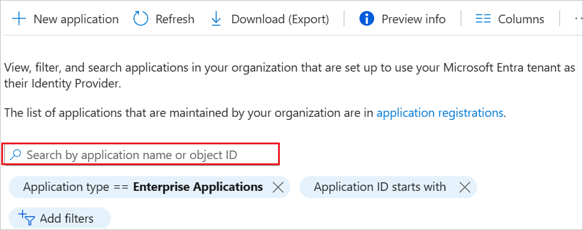

# Configure M-Files for automatic user provisioning with Microsoft Entra ID

This article describes the steps you need to perform in both M-Files and Microsoft Entra ID to configure automatic user provisioning. When configured, Microsoft Entra ID automatically provisions and deprovisions users and groups to [M-Files](https://www.m-files.com/) using the Microsoft Entra provisioning service. For important details on what this service does, how it works, and frequently asked questions, see [Automate user provisioning and deprovisioning to SaaS applications with Microsoft Entra ID](~/identity/app-provisioning/user-provisioning.md). 

## Supported capabilities
> [!div class="checklist"]
> * Create users in M-Files.
> * Remove users in M-Files when they don't require access anymore.
> * Keep user attributes synchronized between Microsoft Entra ID and M-Files.
> * Provision groups and group memberships in M-Files.
> * [Single sign-on](m-files-tutorial.md) to M-Files (recommended).

## Prerequisites

The scenario outlined in this article assumes that you already have the following prerequisites:

* [A Microsoft Entra tenant](~/identity-platform/quickstart-create-new-tenant.md) 
* One of the following roles: [Application Administrator](/entra/identity/role-based-access-control/permissions-reference#application-administrator), [Cloud Application Administrator](/entra/identity/role-based-access-control/permissions-reference#cloud-application-administrator), or [Application Owner](/entra/fundamentals/users-default-permissions#owned-enterprise-applications).
* M-Files Cloud Subscription (Classic Cloud isn't supported).
* A user account in M-Files with the Subscription admin or Access admin access to [M-Files Manage](https://manage.m-files.com/).

## Step 1: Plan your provisioning deployment
1. Learn about [how the provisioning service works](~/identity/app-provisioning/user-provisioning.md).
1. Determine who's in [scope for provisioning](~/identity/app-provisioning/define-conditional-rules-for-provisioning-user-accounts.md).
1. Determine what data to [map between Microsoft Entra ID and M-Files](~/identity/app-provisioning/customize-application-attributes.md).
1. The necessary mappings are predefined but you can map two additional data fields to M-Files.

## Step 2: Configure M-Files to support provisioning with Microsoft Entra ID

Before you set up user provisioning in M-Files, make sure that all vaults in your subscription have user synchronization disabled in M-Files Admin.

If you have previously configured user provisioning in M-Files Manage with your own Entra ID application, you can't change the configuration to use the M-Files application from the  Microsoft Entra application gallery. If you want to use the M-Files application instead, delete the existing configuration from M-Files Manage and disable or delete the related Entra ID application. Then, follow these instructions to create the new configuration.

1. Log in to M-Files Manage at [https://manage.m-files.com](https://manage.m-files.com).
1. In the left-side page navigation, select **Provisioning**.
1. Go to the **Configuration** tab.
1. In **Create configuration for user provisioning**, select **Azure AD gallery app**.
1. Enter the necessary information.
   * In **Configuration name**, enter a unique name for the configuration.
   * Select **Default license type** for the provisioned users. All the provisioned users first get this license. You can change a user group's license type to a higher one after user groups have been provisioned. If there aren't enough available licenses of the default license type in the subscription, all the users don't get the license.
1. Select the copy icon ( ) for each piece of data, that M-Files Manage created, and note down the values.

> [!NOTE]
> The client secret isn't shown anywhere else when you close the dialog.

## Step 3: Add M-Files from the Microsoft Entra application gallery

Add M-Files from the Microsoft Entra application gallery to start managing provisioning to M-Files. If you have previously set up M-Files for SSO you can use the same application. However, we recommend that you create a separate app when testing out the integration initially. Learn more about adding an application from the gallery [here](~/identity/enterprise-apps/add-application-portal.md). 

## Step 4: Define who is in scope for provisioning 

[!INCLUDE [create-assign-users-provisioning.md](~/identity/saas-apps/includes/create-assign-users-provisioning.md)]

## Step 5: Configure automatic user provisioning to M-Files 

This section guides you through the steps to configure the Microsoft Entra provisioning service to create, update, and disable users and/or groups in TestApp based on user and/or group assignments in Microsoft Entra ID.

### To configure automatic user provisioning for M-Files in Microsoft Entra ID:

1. Sign in to the [Microsoft Entra admin center](https://entra.microsoft.com) as at least a [Cloud Application Administrator](~/identity/role-based-access-control/permissions-reference.md#cloud-application-administrator).
1. Browse to **Entra ID** > **Enterprise apps**.

	

1. In the applications list, select **M-Files**.

	

1. Select the **Provisioning** tab.

	

1. Set the **Provisioning Mode** to **Automatic**.

	

1. Under the **Admin Credentials** section, enter your M-Files Tenant URL, Token Endpoint, Client Identifier and Client Secret. Select **Test Connection** to ensure Microsoft Entra ID can connect to M-Files. If the connection fails, make sure that the values you entered are correct and try again.

 	

1. In the **Notification Email** field, enter the email address of a person or group who should receive the provisioning error notifications and select the **Send an email notification when a failure occurs** check box.

	

1. Select **Save**.

1. **Optional**: If you want to synchronize additional user information, you can define two additional fields to be synchronized to M-Files Manage. The information is shown in **Additional information 1** and **Additional information 2** on the **User information** page.
   1. Under the **Mappings** section, select **Synchronize Microsoft Entra users to M-Files**.
   1. In the **Attribute-Mapping** section, select **Add new mapping**.
   1. Use these values:
         * **Mapping type**: **Direct**
         * **Source attribute**: Enter the Entra ID attribute
         * **Target attribute**: Select **urn:ietf:params:scim:schemas:extension:info:2.0:User:info1** or **urn:ietf:params:scim:schemas:extension:info:2.0:User:info2**
         * **Match objects using this attribute**: **No**
         * **Apply this mapping**: **Always**
   1. Select **Ok**.
   1. **Optional**: To synchronize two additional data fields to M-Files Manage, add a second mapping with the other available target attribute.

  > [!NOTE]
  > It isn't recommended to make changes to the default attribute mappings.

1. To configure scoping filters, refer to the following instructions provided in the [Scoping filter  article](../app-provisioning/define-conditional-rules-for-provisioning-user-accounts.md).

1. To enable the Microsoft Entra provisioning service for M-Files, change the **Provisioning Status** to **On** in the **Settings** section.

	

1. Define the users and/or groups that you would like to provision to M-Files by choosing the desired values in **Scope** in the **Settings** section.

	

1. When you're ready to provision, select **Save**.

	

This operation starts the initial synchronization cycle of all users and groups defined in **Scope** in the **Settings** section. The initial cycle takes longer to perform than subsequent cycles, which occur approximately every 40 minutes as long as the Microsoft Entra provisioning service is running. 

## Step 6: Monitor your deployment

[!INCLUDE [monitor-deployment.md](~/identity/saas-apps/includes/monitor-deployment.md)]

## More resources

* [Managing user account provisioning for Enterprise Apps](~/identity/app-provisioning/configure-automatic-user-provisioning-portal.md).
* [What is application access and single sign-on with Microsoft Entra ID?](~/identity/enterprise-apps/what-is-single-sign-on.md).

## Related content

* When the user provisioning is complete, create links between the provisioned user groups and M-Files user groups in M-Files Manage. For instructions, refer to [M-Files Manage - User guide](https://m-files.my.site.com/s/article/mfiles-ka-385842). 
* [Learn how to review logs and get reports on provisioning activity](~/identity/app-provisioning/check-status-user-account-provisioning.md).