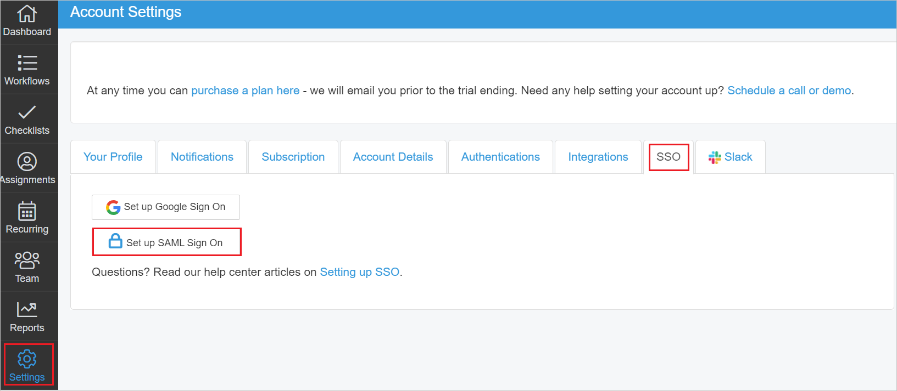
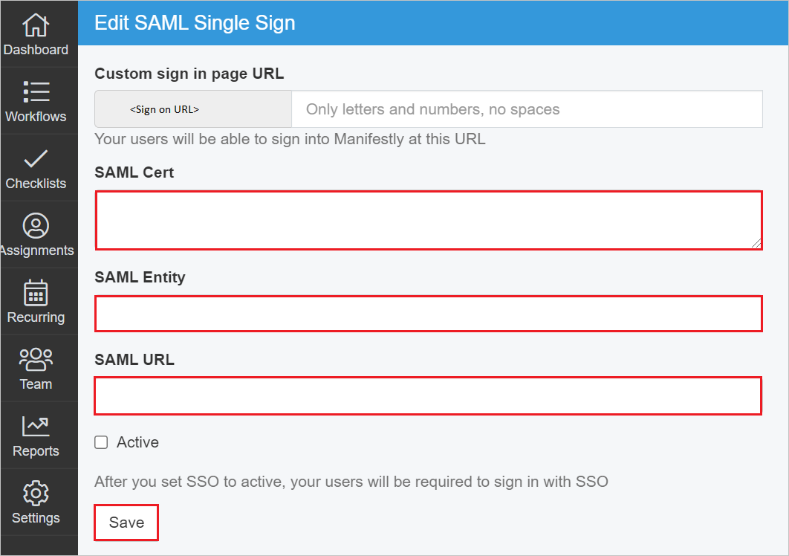
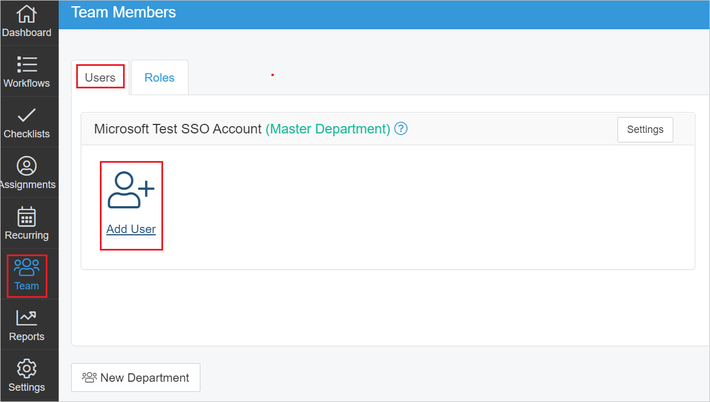
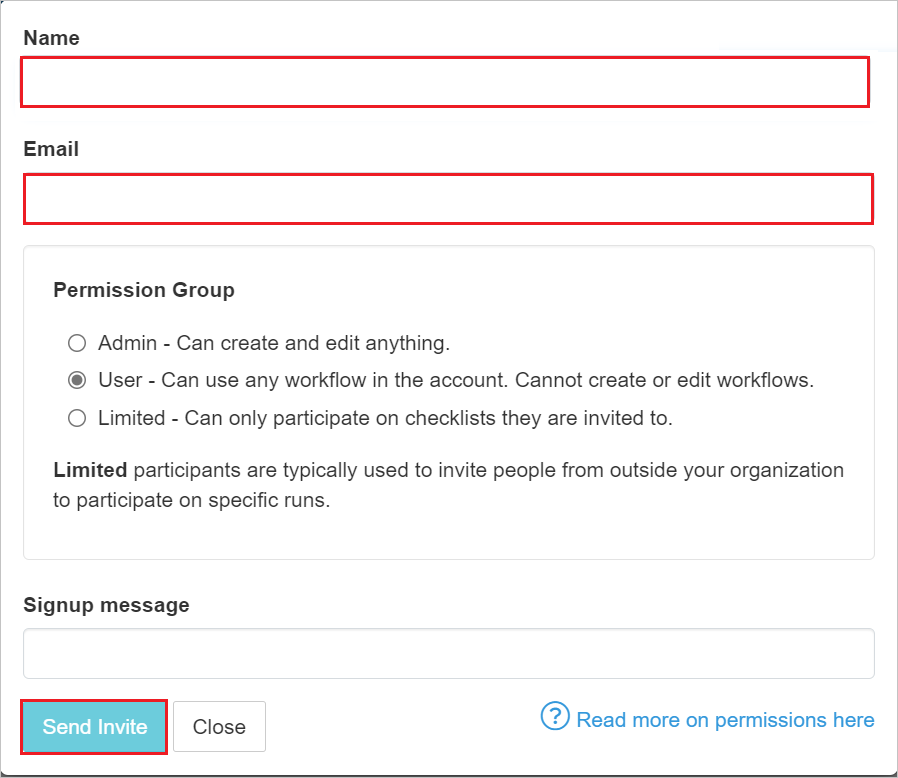

# Configure Manifestly Checklists for Single sign-on with Microsoft Entra ID

In this article,  you learn how to integrate Manifestly Checklists with Microsoft Entra ID. When you integrate Manifestly Checklists with Microsoft Entra ID, you can:

* Control in Microsoft Entra ID who has access to Manifestly Checklists.
* Enable your users to be automatically signed-in to Manifestly Checklists with their Microsoft Entra accounts.
* Manage your accounts in one central location.

## Prerequisites
The scenario outlined in this article assumes that you already have the following prerequisites:

[!INCLUDE [common-prerequisites.md](~/identity/saas-apps/includes/common-prerequisites.md)]
* Manifestly Checklists single sign-on (SSO) enabled subscription.

## Scenario description

In this article,  you configure and test Microsoft Entra SSO in a test environment.

* Manifestly Checklists supports **SP and IDP** initiated SSO.

> [!NOTE]
> Identifier of this application is a fixed string value so only one instance can be configured in one tenant.

## Add Manifestly Checklists from the gallery

To configure the integration of Manifestly Checklists into Microsoft Entra ID, you need to add Manifestly Checklists from the gallery to your list of managed SaaS apps.

1. Sign in to the [Microsoft Entra admin center](https://entra.microsoft.com) as at least a [Cloud Application Administrator](~/identity/role-based-access-control/permissions-reference.md#cloud-application-administrator).
1. Browse to **Entra ID** > **Enterprise apps** > **New application**.
1. In the **Add from the gallery** section, type **Manifestly Checklists** in the search box.
1. Select **Manifestly Checklists** from results panel and then add the app. Wait a few seconds while the app is added to your tenant.

 Alternatively, you can also use the [Enterprise App Configuration Wizard](https://portal.office.com/AdminPortal/home?Q=Docs#/azureadappintegration). In this wizard, you can add an application to your tenant, add users/groups to the app, assign roles, and walk through the SSO configuration as well. [Learn more about Microsoft 365 wizards.](/microsoft-365/admin/misc/azure-ad-setup-guides)

## Configure and test Microsoft Entra SSO for Manifestly Checklists

Configure and test Microsoft Entra SSO with Manifestly Checklists using a test user called **B.Simon**. For SSO to work, you need to establish a link relationship between a Microsoft Entra user and the related user in Manifestly Checklists.

To configure and test Microsoft Entra SSO with Manifestly Checklists, perform the following steps:

1. **[Configure Microsoft Entra SSO](#configure-azure-ad-sso)** - to enable your users to use this feature.
    1. **Create a Microsoft Entra test user** - to test Microsoft Entra single sign-on with B.Simon.
    1. **Assign the Microsoft Entra test user** - to enable B.Simon to use Microsoft Entra single sign-on.
1. **[Configure Manifestly Checklists SSO](#configure-manifestly-checklists-sso)** - to configure the single sign-on settings on application side.
    1. **[Create Manifestly Checklists test user](#create-manifestly-checklists-test-user)** - to have a counterpart of B.Simon in Manifestly Checklists that's linked to the Microsoft Entra representation of user.
1. **[Test SSO](#test-sso)** - to verify whether the configuration works.

## Configure Microsoft Entra SSO

Follow these steps to enable Microsoft Entra SSO.

1. Sign in to the [Microsoft Entra admin center](https://entra.microsoft.com) as at least a [Cloud Application Administrator](~/identity/role-based-access-control/permissions-reference.md#cloud-application-administrator).
1. Browse to **Entra ID** > **Enterprise apps** > **Manifestly Checklists** > **Single sign-on**.
1. On the **Select a single sign-on method** page, select **SAML**.
1. On the **Set up single sign-on with SAML** page, select the pencil icon for **Basic SAML Configuration** to edit the settings.

   

1. On the **Basic SAML Configuration** section, perform the following steps:

    a. In the **Identifier** text box, type the URL:
    `https://app.manifest.ly/users/saml/metadata`

    b. In the **Reply URL** text box, type the URL:
    `https://app.manifest.ly/users/saml/auth`

    c. In the **Sign-on URL** text box, type a URL using one of the following patterns:

    | **Sign-on URL** |
    | -------|
    | `https://app.manifest.ly/users/sign_in` |
    | `https://app.manifest.ly/a/<CustomerName>` |

	> [!NOTE]
	> This value isn't real. Update this value with the actual Sign-on URL. Contact [Manifestly Checklists Client support team](mailto:support@manifest.ly) to get this value. You can also refer to the patterns shown in the **Basic SAML Configuration** section.

1. Manifestly Checklists application expects the SAML assertions in a specific format, which requires you to add custom attribute mappings to your SAML token attributes configuration. The following screenshot shows the list of default attributes.

	

1. In addition to above, Manifestly Checklists application expects few more attributes to be passed back in SAML response which are shown below. These attributes are also pre populated but you can review them as per your requirements.
	
	| Name | Source Attribute |
	| ---------| --------- |
	| email | user.mail |
    | first_name | user.givenname |
    | last_name | user.surname |

1. On the **Set up single sign-on with SAML** page, in the **SAML Signing Certificate** section,  find **Certificate (Base64)** and select **Download** to download the certificate and save it on your computer.

	

1. On the **Set up Manifestly Checklists** section, copy the appropriate URL(s) based on your requirement.

	

[!INCLUDE [create-assign-users-sso.md](~/identity/saas-apps/includes/create-assign-users-sso.md)]

## Configure Manifestly Checklists SSO

1. Log in to your Manifestly Checklists company site as an administrator.

1. Go to **Settings** > **SSO** and select **Set up SAML Sign On** button.

    

1. In the **Edit SAML Single Sign** page, perform the following steps:

    

    1. Open the downloaded **Certificate (Base64)** into Notepad and paste the content into the **SAML Cert** textbox.

    1.  In the **SAML Entity** textbox, paste the **Microsoft Entra Identifier** value which you copied previously.

    1. In the **SAML URL** textbox, paste the **Login URL** value which you copied previously.

    1. Select **Save**.

### Create Manifestly Checklists test user

1. In a different web browser window, sign into your Manifestly Checklists company site as an administrator.

1. Go to **Teams** > **Users** and select **Add User**.

    

1. Enter the **Name** and **Email** in the textbox and select **Send Invite**.

        

## Test SSO 

In this section, you test your Microsoft Entra single sign-on configuration with following options. 

#### SP initiated:

* Select **Test this application**, this option redirects to Manifestly Checklists Sign on URL where you can initiate the login flow.  

* Go to Manifestly Checklists Sign-on URL directly and initiate the login flow from there.

#### IDP initiated:

* Select **Test this application**, and you should be automatically signed in to the Manifestly Checklists for which you set up the SSO. 

You can also use Microsoft My Apps to test the application in any mode. When you select the Manifestly Checklists tile in the My Apps, if configured in SP mode you would be redirected to the application sign on page for initiating the login flow and if configured in IDP mode, you should be automatically signed in to the Manifestly Checklists for which you set up the SSO. For more information, see [Microsoft Entra My Apps](/azure/active-directory/manage-apps/end-user-experiences#azure-ad-my-apps).

## Related content

Once you configure Manifestly Checklists you can enforce session control, which protects exfiltration and infiltration of your organization’s sensitive data in real time. Session control extends from Conditional Access. [Learn how to enforce session control with Microsoft Cloud App Security](/cloud-app-security/proxy-deployment-aad).
