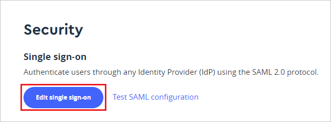
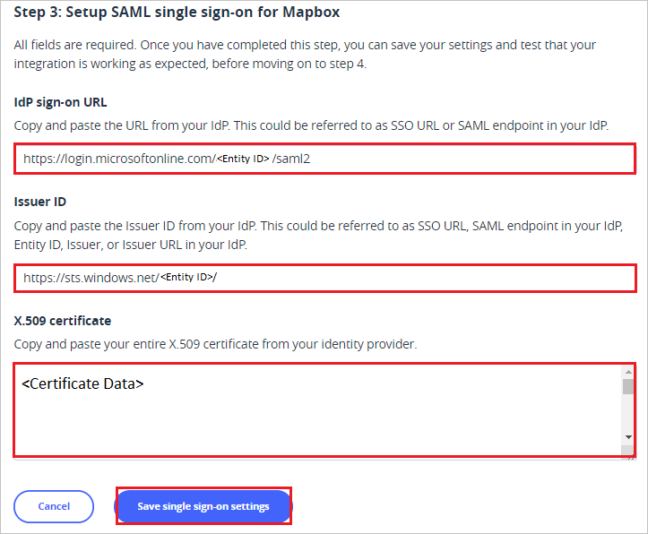

# Microsoft Entra single sign-on (SSO) integration with Mapbox

In this article,  you'll learn how to integrate Mapbox with Microsoft Entra ID. When you integrate Mapbox with Microsoft Entra ID, you can:

* Control in Microsoft Entra ID who has access to Mapbox.
* Enable your users to be automatically signed-in to Mapbox with their Microsoft Entra accounts.
* Manage your accounts in one central location.

## Prerequisites

To get started, you need the following items:

* A Microsoft Entra subscription. If you don't have a subscription, you can get a [free account](https://azure.microsoft.com/free/).
* Mapbox single sign-on (SSO) enabled subscription.

## Scenario description

In this article,  you configure and test Microsoft Entra SSO in a test environment.

* Mapbox supports **IDP** initiated SSO

> [!NOTE]
> Identifier of this application is a fixed string value so only one instance can be configured in one tenant.

## Adding Mapbox from the gallery

To configure the integration of Mapbox into Microsoft Entra ID, you need to add Mapbox from the gallery to your list of managed SaaS apps.

1. Sign in to the [Microsoft Entra admin center](https://entra.microsoft.com) as at least a [Cloud Application Administrator](~/identity/role-based-access-control/permissions-reference.md#cloud-application-administrator).
1. Browse to **Identity** > **Applications** > **Enterprise applications** > **New application**.
1. In the **Add from the gallery** section, type **Mapbox** in the search box.
1. Select **Mapbox** from results panel and then add the app. Wait a few seconds while the app is added to your tenant.

 Alternatively, you can also use the [Enterprise App Configuration Wizard](https://portal.office.com/AdminPortal/home?Q=Docs#/azureadappintegration). In this wizard, you can add an application to your tenant, add users/groups to the app, assign roles, as well as walk through the SSO configuration as well. [Learn more about Microsoft 365 wizards.](/microsoft-365/admin/misc/azure-ad-setup-guides)

## Configure and test Microsoft Entra SSO for Mapbox

Configure and test Microsoft Entra SSO with Mapbox using a test user called **B.Simon**. For SSO to work, you need to establish a link relationship between a Microsoft Entra user and the related user in Mapbox.

To configure and test Microsoft Entra SSO with Mapbox, perform the following steps:

1. **[Configure Microsoft Entra SSO](#configure-azure-ad-sso)** - to enable your users to use this feature.
    1. **[Create a Microsoft Entra test user](#create-an-azure-ad-test-user)** - to test Microsoft Entra single sign-on with B.Simon.
    1. **[Assign the Microsoft Entra test user](#assign-the-azure-ad-test-user)** - to enable B.Simon to use Microsoft Entra single sign-on.
1. **[Configure Mapbox SSO](#configure-mapbox-sso)** - to configure the single sign-on settings on application side.
    1. **[Create Mapbox test user](#create-mapbox-test-user)** - to have a counterpart of B.Simon in Mapbox that is linked to the Microsoft Entra representation of user.
1. **[Test SSO](#test-sso)** - to verify whether the configuration works.

## Configure Microsoft Entra SSO

Follow these steps to enable Microsoft Entra SSO.

1. Sign in to the [Microsoft Entra admin center](https://entra.microsoft.com) as at least a [Cloud Application Administrator](~/identity/role-based-access-control/permissions-reference.md#cloud-application-administrator).
1. Browse to **Identity** > **Applications** > **Enterprise applications** > **Mapbox** > **Single sign-on**.
1. On the **Select a single sign-on method** page, select **SAML**.
1. On the **Set up single sign-on with SAML** page, click the pencil icon for **Basic SAML Configuration** to edit the settings.

   

1. On the **Basic SAML Configuration** section, the application is pre-configured and the necessary URLs are already pre-populated with Azure. The user needs to save the configuration by clicking the **Save** button.

1. Mapbox application expects the SAML assertions in a specific format, which requires you to add custom attribute mappings to your SAML token attributes configuration. The following screenshot shows the list of default attributes.

	

1. In addition to above, Mapbox application expects few more attributes to be passed back in SAML response which are shown below. These attributes are also pre populated but you can review them as per your requirements.

	| Name   |  Source Attribute|
	| -----|--------- |
	| role | user.assignedroles |
	| | |

	> [!NOTE]
	> To understand how to configure roles in Microsoft Entra ID, see [here](~/identity-platform/howto-add-app-roles-in-apps.md#app-roles-ui).

1. On the **Set up single sign-on with SAML** page, in the **SAML Signing Certificate** section,  find **Certificate (Raw)** and select **Download** to download the certificate and save it on your computer.

	

1. On the **Set up Mapbox** section, copy the appropriate URL(s) based on your requirement.

	

### Create a Microsoft Entra test user

In this section, you'll create a test user called B.Simon.

1. Sign in to the [Microsoft Entra admin center](https://entra.microsoft.com) as at least a [User Administrator](~/identity/role-based-access-control/permissions-reference.md#user-administrator).
1. Browse to **Identity** > **Users** > **All users**.
1. Select **New user** > **Create new user**, at the top of the screen.
1. In the **User** properties, follow these steps:
   1. In the **Display name** field, enter `B.Simon`.  
   1. In the **User principal name** field, enter the username@companydomain.extension. For example, `B.Simon@contoso.com`.
   1. Select the **Show password** check box, and then write down the value that's displayed in the **Password** box.
   1. Select **Review + create**.
1. Select **Create**.

### Assign the Microsoft Entra test user

In this section, you'll enable B.Simon to use single sign-on by granting access to Mapbox.

1. Sign in to the [Microsoft Entra admin center](https://entra.microsoft.com) as at least a [Cloud Application Administrator](~/identity/role-based-access-control/permissions-reference.md#cloud-application-administrator).
1. Browse to **Identity** > **Applications** > **Enterprise applications** > **Mapbox**.
1. In the app's overview page, find the **Manage** section and select **Users and groups**.
1. Select **Add user**, then select **Users and groups** in the **Add Assignment** dialog.
1. In the **Users and groups** dialog, select **B.Simon** from the Users list, then click the **Select** button at the bottom of the screen.
1. If you have setup the roles as explained in the above, you can select it from the **Select a role** dropdown.
1. In the **Add Assignment** dialog, click the **Assign** button.

## Configure Mapbox SSO

1. In a different web browser window, sign into Mapbox as an administrator.

1. Click on the **Settings** tab.

	

1. Click on the **Security** tab from the left navigation pane.

	

1. Click **Edit single sign-on**.

	

1. Scroll down to **Step 3: Setup SAML single sign-on for Mapbox** and perform the following steps:

	

	1. In the **Idp Sign-on URL** textbox, paste **Login URL** value, which you copied previously.

	1. In the **Issuer ID** textbox, paste **Microsoft Entra Identifier** value, which you copied previously.

    1. Open the downloaded **Certificate (Raw)** file into Notepad and copy content of certificate file and paste it into the **X.509 certificate** textbox.

	1. Click **Save single sign-on settings**.

### Create Mapbox test user

In this section, you create a user called Britta Simon in Mapbox. Work with [Mapbox support team](mailto:help@mapbox.com) to add the users in the Mapbox platform. Users must be created and activated before you use single sign-on.

## Test SSO 

In this section, you test your Microsoft Entra single sign-on configuration with following options.

* Click on **Test this application**, and you should be automatically signed in to the Mapbox for which you set up the SSO

* You can use Microsoft My Apps. When you click the Mapbox tile in the My Apps, you should be automatically signed in to the Mapbox for which you set up the SSO. For more information about the My Apps, see [Introduction to the My Apps](https://support.microsoft.com/account-billing/sign-in-and-start-apps-from-the-my-apps-portal-2f3b1bae-0e5a-4a86-a33e-876fbd2a4510).

## Related content

Once you configure Mapbox you can enforce session control, which protects exfiltration and infiltration of your organization’s sensitive data in real time. Session control extends from Conditional Access. [Learn how to enforce session control with Microsoft Defender for Cloud Apps](/cloud-app-security/proxy-deployment-any-app).
