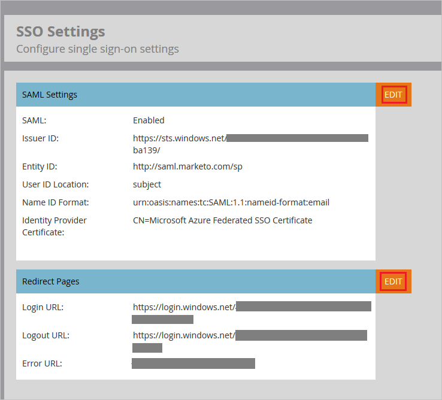
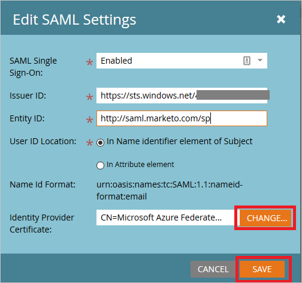
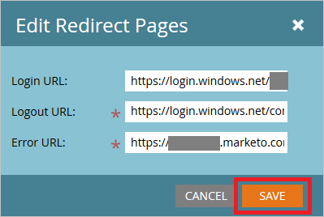
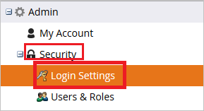
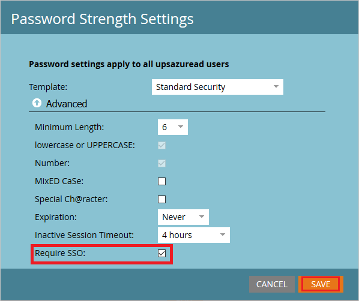
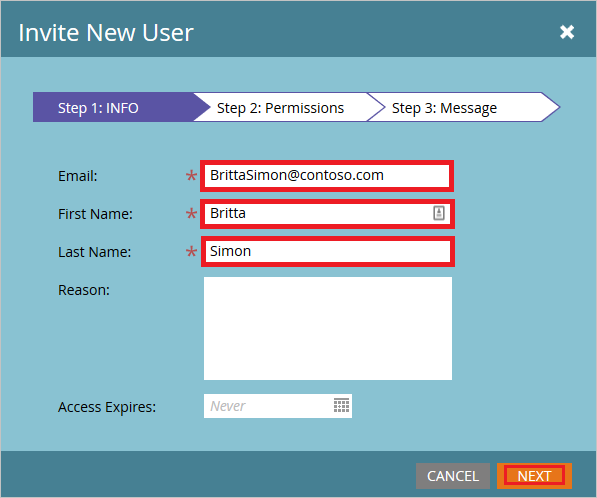
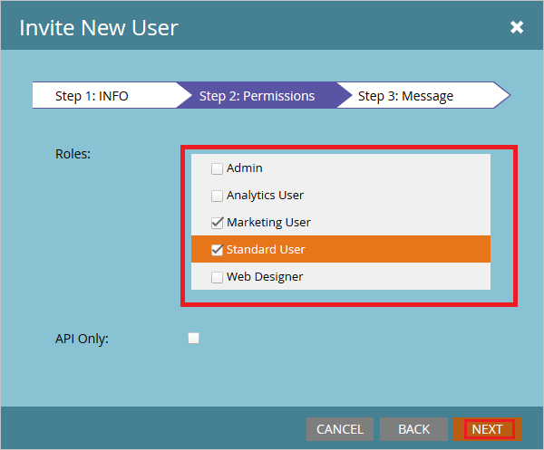
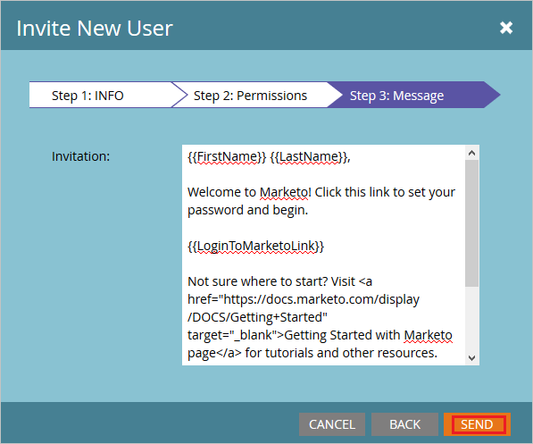

# Configure Marketo for Single sign-on with Microsoft Entra ID

In this article,  you learn how to integrate Marketo with Microsoft Entra ID.
Integrating Marketo with Microsoft Entra ID provides you with the following benefits:

* You can control in Microsoft Entra ID who has access to Marketo.
* You can enable your users to be automatically signed-in to Marketo (Single Sign-On) with their Microsoft Entra accounts.
* You can manage your accounts in one central location.

## Prerequisites
The scenario outlined in this article assumes that you already have the following prerequisites:

[!INCLUDE [common-prerequisites.md](~/identity/saas-apps/includes/common-prerequisites.md)]
* Marketo single sign-on enabled subscription.

## Scenario description

In this article,  you configure and test Microsoft Entra single sign-on in a test environment.

* Marketo supports **IDP** initiated SSO.

> [!NOTE]
> Identifier of this application is a fixed string value so only one instance can be configured in one tenant.

## Add Marketo from the gallery

To configure the integration of Marketo into Microsoft Entra ID, you need to add Marketo from the gallery to your list of managed SaaS apps.

1. Sign in to the [Microsoft Entra admin center](https://entra.microsoft.com) as at least a [Cloud Application Administrator](~/identity/role-based-access-control/permissions-reference.md#cloud-application-administrator).
1. Browse to **Entra ID** > **Enterprise apps** > **New application**.
1. In the **Add from the gallery** section, type **Marketo** in the search box.
1. Select **Marketo** from results panel and then add the app. Wait a few seconds while the app is added to your tenant.

 Alternatively, you can also use the [Enterprise App Configuration Wizard](https://portal.office.com/AdminPortal/home?Q=Docs#/azureadappintegration). In this wizard, you can add an application to your tenant, add users/groups to the app, assign roles, and walk through the SSO configuration as well. [Learn more about Microsoft 365 wizards.](/microsoft-365/admin/misc/azure-ad-setup-guides)

## Configure and test Microsoft Entra SSO for Marketo

In this section, you configure and test Microsoft Entra single sign-on with Marketo based on a test user called **Britta Simon**.
For single sign-on to work, a link relationship between a Microsoft Entra user and the related user in Marketo needs to be established.

To configure and test Microsoft Entra single sign-on with Marketo, perform the following steps:

1. **[Configure Microsoft Entra SSO](#configure-azure-ad-sso)** - to enable your users to use this feature.
    1. **Create a Microsoft Entra test user** - to test Microsoft Entra SSO with Britta Simon.
    1. **Assign the Microsoft Entra test user** - to enable Britta Simon to use Microsoft Entra SSO.
2. **[Configure Marketo SSO](#configure-marketo-sso)** - to configure the SSO settings on application side.
    1. **[Create Marketo test user](#create-marketo-test-user)** - to have a counterpart of Britta Simon in Marketo that's linked to the Microsoft Entra representation of user.
3. **[Test SSO](#test-sso)** - to verify whether the configuration works.

## Configure Microsoft Entra SSO

Follow these steps to enable Microsoft Entra SSO.

1. Sign in to the [Microsoft Entra admin center](https://entra.microsoft.com) as at least a [Cloud Application Administrator](~/identity/role-based-access-control/permissions-reference.md#cloud-application-administrator).
1. Browse to **Entra ID** > **Enterprise apps** > **Marketo** > **Single sign-on**.
1. On the **Select a single sign-on method** page, select **SAML**.
1. On the **Set up single sign-on with SAML** page, select the pencil icon for **Basic SAML Configuration** to edit the settings.

   

1. On the **Basic SAML Configuration** section, perform the following steps:

    a. In the **Identifier** text box, type the URL:
    `https://saml.marketo.com/sp`

    b. In the **Reply URL** text box, type a URL using the following pattern:
    `https://login.marketo.com/saml/assertion/<munchkinid>`

    c. In the **Relay State** text box, type a URL using the following pattern:
    `https://<munchkinid>.marketo.com/`

	> [!NOTE]
	> These values aren't real. Update these values with the actual Reply URL and Relay State. Contact [Marketo Client support team](https://investors.marketo.com/contactus.cfm) to get these values. You can also refer to the patterns shown in the **Basic SAML Configuration** section.

1. Your Marketo application expects the SAML assertions in a specific format, which requires you to add custom attribute mappings to your SAML token attributes configuration. The following screenshot shows an example for this. The default value of **Unique User Identifier** is **user.userprincipalname** but Marketo expects this to be mapped with the user's email address. For that you can use **user.mail** attribute from the list or use the appropriate attribute value based on your organization configuration.

	

1. On the **Set up Single Sign-On with SAML** page, in the **SAML Signing Certificate** section, select **Download** to download the **Certificate (Base64)** from the given options as per your requirement and save it on your computer.

	

1. On the **Set up Marketo** section, copy the appropriate URL(s) as per your requirement.

	

[!INCLUDE [create-assign-users-sso.md](~/identity/saas-apps/includes/create-assign-users-sso.md)]

## Configure Marketo SSO

1. In a different web browser window, sign in to your Marketo company site as an administrator

1. To get Munchkin ID of your application, perform the following actions:
   
    a. Log in to Marketo app using admin credentials.
   
    b. Select the **Admin** button on the top navigation pane.
   
     
   
    c. Navigate to the Integration menu and select the **Munchkin link**.
   
    
   
    d. Copy the Munchkin ID shown on the screen and complete your Reply URL in the Microsoft Entra configuration wizard.
   
     

2. To configure the SSO in the application, follow the below steps:
   
    a. Log in to Marketo app using admin credentials.
   
    b. Select the **Admin** button on the top navigation pane.
   
     
   
    c. Navigate to the Integration menu and select **Single Sign On**.
   
     
   
    d. To enable the SAML Settings, select **Edit** button.
   
     
   
    e. **Enabled** Single Sign-On settings.
   
    f. Paste the **Microsoft Entra Identifier**, in the **Issuer ID** textbox.
   
    g. In the **Entity ID** textbox, enter the URL as `http://saml.marketo.com/sp`.
   
    h. Select the User ID Location as **Name Identifier element**.
   
    
   
    > [!NOTE]
    > If your User Identifier isn't UPN value then change the value in the Attribute tab.
   
    i. Upload the certificate, which you have downloaded from Microsoft Entra configuration wizard. **Save** the settings.
   
    j. Edit the Redirect Pages settings.
   
    k. Paste the **Login URL** in the **Login URL** textbox.
   
    l. Paste the **Logout URL** in the **Logout URL** textbox.
   
    m. In the **Error URL**, copy your **Marketo instance URL** and select **Save** button to save settings.
   
    

3. To enable the SSO for users, complete the following actions:
   
    a. Log in to Marketo app using admin credentials.
   
    b. Select the **Admin** button on the top navigation pane.
   
     
   
    c. Navigate to the **Security** menu and select **Login Settings**.
   
    
   
    d. Check the **Require SSO** option and **Save** the settings.
   
    

### Create Marketo test user

In this section, you create a user called Britta Simon in Marketo. follow these steps to create a user in Marketo platform.

1. Log in to Marketo app using admin credentials.

2. Select the **Admin** button on the top navigation pane.
   
     

3. Navigate to the **Security** menu and select **Users & Roles**.
   
      

4. Select the **Invite New User** link on the Users tab.
   
     

5. In the Invite New User wizard, fill the following information.
   
    a. Enter the user **Email** address in the textbox
   
    
   
    b. Enter the **First Name** in the textbox.
   
    c. Enter the **Last Name**  in the textbox.
   
    d. Select **Next**.

6. In the **Permissions** tab, select the **userRoles** and select **Next**.
   
    
7. Select the **Send** button to send the user invitation
   
    

8. User receives the email notification and has to select the link and change the password to activate the account. 

## Test SSO

In this section, you test your Microsoft Entra single sign-on configuration with following options.

* Select **Test this application**, and you should be automatically signed in to the Marketo for which you set up the SSO

* You can use Microsoft My Apps. When you select the Marketo tile in the My Apps, you should be automatically signed in to the Marketo for which you set up the SSO. For more information about the My Apps, see [Introduction to the My Apps](https://support.microsoft.com/account-billing/sign-in-and-start-apps-from-the-my-apps-portal-2f3b1bae-0e5a-4a86-a33e-876fbd2a4510).

## Related content

Once you configure Marketo you can enforce session control, which protects exfiltration and infiltration of your organization’s sensitive data in real time. Session control extends from Conditional Access. [Learn how to enforce session control with Microsoft Defender for Cloud Apps](/cloud-app-security/proxy-deployment-any-app).
