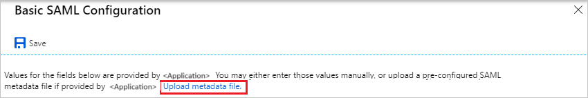
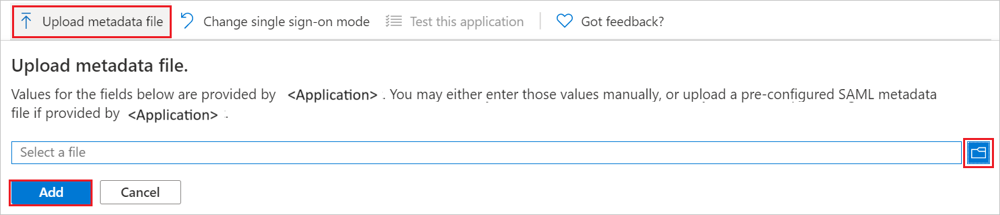

# Configure MindTickle for Single sign-on with Microsoft Entra ID

In this article,  you learn how to integrate MindTickle with Microsoft Entra ID. When you integrate MindTickle with Microsoft Entra ID, you can:

* Control in Microsoft Entra ID who has access to MindTickle.
* Enable your users to be automatically signed-in to MindTickle with their Microsoft Entra accounts.
* Manage your accounts in one central location.

## Prerequisites
The scenario outlined in this article assumes that you already have the following prerequisites:

[!INCLUDE [common-prerequisites.md](~/identity/saas-apps/includes/common-prerequisites.md)]
* MindTickle single sign-on (SSO) enabled subscription.

## Scenario description

In this article,  you configure and test Microsoft Entra single sign-on in a test environment.

* MindTickle supports **SP** initiated SSO.

* MindTickle supports **Just In Time** user provisioning.

* MindTickle supports [Automated user provisioning](mindtickle-provisioning-tutorial.md).

## Add MindTickle from the gallery

To configure the integration of MindTickle into Microsoft Entra ID, you need to add MindTickle from the gallery to your list of managed SaaS apps.

1. Sign in to the [Microsoft Entra admin center](https://entra.microsoft.com) as at least a [Cloud Application Administrator](~/identity/role-based-access-control/permissions-reference.md#cloud-application-administrator).
1. Browse to **Entra ID** > **Enterprise apps** > **New application**.
1. In the **Add from the gallery** section, type **MindTickle** in the search box.
1. Select **MindTickle** from results panel and then add the app. Wait a few seconds while the app is added to your tenant.

 Alternatively, you can also use the [Enterprise App Configuration Wizard](https://portal.office.com/AdminPortal/home?Q=Docs#/azureadappintegration). In this wizard, you can add an application to your tenant, add users/groups to the app, assign roles, and walk through the SSO configuration as well. [Learn more about Microsoft 365 wizards.](/microsoft-365/admin/misc/azure-ad-setup-guides)

## Configure and test Microsoft Entra SSO for MindTickle

Configure and test Microsoft Entra SSO with MindTickle using a test user called **B.Simon**. For SSO to work, you need to establish a link relationship between a Microsoft Entra user and the related user in MindTickle.

To configure and test Microsoft Entra SSO with MindTickle, perform the following steps:

1. **[Configure Microsoft Entra SSO](#configure-azure-ad-sso)** - to enable your users to use this feature.
    1. **Create a Microsoft Entra test user** - to test Microsoft Entra single sign-on with B.Simon.
    1. **Assign the Microsoft Entra test user** - to enable B.Simon to use Microsoft Entra single sign-on.
1. **[Configure MindTickle SSO](#configure-mindtickle-sso)** - to configure the single sign-on settings on application side.
    1. **[Create MindTickle test user](#create-mindtickle-test-user)** - to have a counterpart of B.Simon in MindTickle that's linked to the Microsoft Entra representation of user.
1. **[Test SSO](#test-sso)** - to verify whether the configuration works.

## Configure Microsoft Entra SSO

Follow these steps to enable Microsoft Entra SSO.

1. Sign in to the [Microsoft Entra admin center](https://entra.microsoft.com) as at least a [Cloud Application Administrator](~/identity/role-based-access-control/permissions-reference.md#cloud-application-administrator).
1. Browse to **Entra ID** > **Enterprise apps** > **MindTickle** > **Single sign-on**.
1. On the **Select a single sign-on method** page, select **SAML**.
1. On the **Set up single sign-on with SAML** page, select the pencil icon for **Basic SAML Configuration** to edit the settings.

   

1. On the **Basic SAML Configuration** section, if you have **Service Provider metadata file**, perform the following steps:

	a. Select **Upload metadata file**.

    

	b. Select **folder logo** to select the metadata file and select **Upload**.

	

	c. After the metadata file is successfully uploaded, the **Identifier** value gets auto populated in **Basic SAML Configuration** section.

	In the **Sign-on URL** text box, type a URL using the following pattern:
    `https://<subdomain>.mindtickle.com`

	> [!Note]
	> If the **Identifier** value doesn't get auto populated, then please fill in the value manually according to your requirement. The Sign-on URL value isn't real. Update the value with the actual Sign-on URL. Contact [MindTickle support team](mailto:support@mindtickle.com) to get this value.

1. On the **Set up Single Sign-On with SAML** page, in the **SAML Signing Certificate** section, select **Download** to download the **Federation Metadata XML** from the given options as per your requirement and save it on your computer.

	

6. On the **Set up MindTickle** section, copy the appropriate URL(s) as per your requirement.

	

[!INCLUDE [create-assign-users-sso.md](~/identity/saas-apps/includes/create-assign-users-sso.md)]

## Configure MindTickle SSO

To configure single sign-on on **MindTickle** side, you need to send the downloaded **Federation Metadata XML** and appropriate copied URLs from the application configuration to [MindTickle support team](mailto:support@mindtickle.com). They set this setting to have the SAML SSO connection set properly on both sides.

### Create MindTickle test user

In this section, a user called Britta Simon is created in MindTickle. MindTickle supports **just-in-time user provisioning**, which is enabled by default. There's no action item for you in this section. If a user doesn't already exist in MindTickle, a new one is created after authentication.

MindTickle also supports automatic user provisioning, you can find more details [here](./mindtickle-provisioning-tutorial.md) on how to configure automatic user provisioning.

## Test SSO 

In this section, you test your Microsoft Entra single sign-on configuration with following options. 

* Select **Test this application**, this option redirects to MindTickle Sign-on URL where you can initiate the login flow. 

* Go to MindTickle Sign-on URL directly and initiate the login flow from there.

* You can use Microsoft My Apps. When you select the MindTickle tile in the My Apps, this option redirects to MindTickle Sign-on URL. For more information about the My Apps, see [Introduction to the My Apps](https://support.microsoft.com/account-billing/sign-in-and-start-apps-from-the-my-apps-portal-2f3b1bae-0e5a-4a86-a33e-876fbd2a4510).

## Related content

Once you configure MindTickle you can enforce session control, which protects exfiltration and infiltration of your organization’s sensitive data in real time. Session control extends from Conditional Access. [Learn how to enforce session control with Microsoft Defender for Cloud Apps](/cloud-app-security/proxy-deployment-aad).
