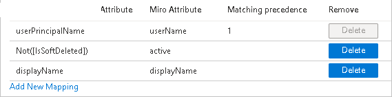
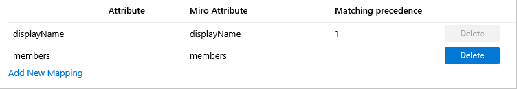

# Configure Miro for automatic user provisioning with Microsoft Entra ID

The objective of this article is to demonstrate the steps to be performed in Miro and Microsoft Entra ID to configure Microsoft Entra ID to automatically provision and de-provision users and/or groups to Miro.

> [!NOTE]
> This article describes a connector built on top of the Microsoft Entra user provisioning service. For important details on what this service does, how it works, and frequently asked questions, see [Automate user provisioning and deprovisioning to SaaS applications with Microsoft Entra ID](~/identity/app-provisioning/user-provisioning.md).
>

## Prerequisites

The scenario outlined in this article assumes that you already have the following prerequisites:

[!INCLUDE [common-prerequisites.md](~/identity/saas-apps/includes/common-prerequisites.md)]
* [A Miro tenant](https://miro.com/pricing/)
* A user account in Miro with Admin permissions.

## Assigning users to Miro

Microsoft Entra ID uses a concept called *assignments* to determine which users should receive access to selected apps. In the context of automatic user provisioning, only the users and/or groups that have been assigned to an application in Microsoft Entra ID are synchronized.

Before configuring and enabling automatic user provisioning, you should decide which users and/or groups in Microsoft Entra ID need access to Miro. Once decided, you can assign these users and/or groups to Miro by following the instructions here:
* [Assign a user or group to an enterprise app](~/identity/enterprise-apps/assign-user-or-group-access-portal.md)

## Important tips for assigning users to Miro

* It's recommended that a single Microsoft Entra user is assigned to Miro to test the automatic user provisioning configuration. Additional users and/or groups may be assigned later.

* When assigning a user to Miro, you must select any valid application-specific role (if available) in the assignment dialog. Users with the **Default Access** role are excluded from provisioning.

## Set up Miro for provisioning

To retrieve the needed **Secret Token** contact [Miro Support Team](mailto:support@miro.com). This value is entered in the Secret Token field in the Provisioning tab of your Miro application.

## Add Miro from the gallery

Before configuring Miro for automatic user provisioning with Microsoft Entra ID, you need to add Miro from the Microsoft Entra application gallery to your list of managed SaaS applications.

**To add Miro from the Microsoft Entra application gallery, perform the following steps:**

1. Sign in to the [Microsoft Entra admin center](https://entra.microsoft.com) as at least a [Cloud Application Administrator](~/identity/role-based-access-control/permissions-reference.md#cloud-application-administrator).
1. Browse to **Entra ID** > **Enterprise apps** > **New application**.
1. In the **Add from the gallery** section, type **Miro** in the search box.
1. Select **Miro** from results panel and then add the app. Wait a few seconds while the app is added to your tenant.

## Configuring automatic user provisioning to Miro 

This section guides you through the steps to configure the Microsoft Entra provisioning service to create, update, and disable users and/or groups in Miro based on user and/or group assignments in Microsoft Entra ID.

> [!TIP]
> You may also choose to enable SAML-based single sign-on for Miro, following the instructions provided in the [Miro Single sign-on  article](./miro-tutorial.md). Single sign-on can be configured independently of automatic user provisioning, though these two features complement each other.

> [!NOTE]
> To learn more about Miro's SCIM endpoint, refer [this](https://help.miro.com/hc/en-us/articles/360036777814).

### To configure automatic user provisioning for Miro in Microsoft Entra ID

1. Sign in to the [Microsoft Entra admin center](https://entra.microsoft.com) as at least a [Cloud Application Administrator](~/identity/role-based-access-control/permissions-reference.md#cloud-application-administrator).
1. Browse to **Entra ID** > **Enterprise apps**

	

1. In the applications list, select **Miro**.

	

1. Select the **Provisioning** tab.

	

1. Set the **Provisioning Mode** to **Automatic**.

	

1. Under the **Admin Credentials** section, input `https://miro.com/api/v1/scim` in **Tenant URL**. Input the **SCIM Authentication Token** value retrieved earlier in **Secret Token**. Select **Test Connection** to ensure Microsoft Entra ID can connect to Miro. If the connection fails, ensure your Miro account has Admin permissions and try again.

	

1. In the **Notification Email** field, enter the email address of a person or group who should receive the provisioning error notifications and check the checkbox - **Send an email notification when a failure occurs**.

	

1. Select **Save**.

1. Under the **Mappings** section, select **Synchronize Microsoft Entra users to Miro**.

1. Review the user attributes that are synchronized from Microsoft Entra ID to Miro in the **Attribute Mapping** section. The attributes selected as **Matching** properties are used to match the user accounts in Miro for update operations. Select the **Save** button to commit any changes.

	

1. Under the **Mappings** section, select **Synchronize Microsoft Entra groups to Miro**.

1. Review the group attributes that are synchronized from Microsoft Entra ID to Miro in the **Attribute Mapping** section. The attributes selected as **Matching** properties are used to match the groups in Miro for update operations. Select the **Save** button to commit any changes. Uncheck **Create** and **Delete** under **Target Object Actions** as Miro SCIM API doesn't support creating and deleting groups.

	

1. To configure scoping filters, refer to the following instructions provided in the [Scoping filter  article](~/identity/app-provisioning/define-conditional-rules-for-provisioning-user-accounts.md).

1. To enable the Microsoft Entra provisioning service for Miro, change the **Provisioning Status** to **On** in the **Settings** section.

	

1. Define the users and/or groups that you would like to provision to Miro by choosing the desired values in **Scope** in the **Settings** section.

	

1. When you're ready to provision, select **Save**.

	

This operation starts the initial synchronization of all users and/or groups defined in **Scope** in the **Settings** section. The initial sync takes longer to perform than subsequent syncs, which occur approximately every 40 minutes as long as the Microsoft Entra provisioning service is running. You can use the **Synchronization Details** section to monitor progress and follow links to provisioning activity report, which describes all actions performed by the Microsoft Entra provisioning service on Miro.

For more information on how to read the Microsoft Entra provisioning logs, see [Reporting on automatic user account provisioning](~/identity/app-provisioning/check-status-user-account-provisioning.md).

## Connector limitations

* Miro's SCIM endpoint doesn't allow **Create** and **Delete** operations on groups. It only supports group **Update** operation.

## Troubleshooting Tips

* If experiencing errors with group creation, then it's required to  disable it by unchecking **Create** and **Delete** under **Target Object Actions** as Miro SCIM API doesn't support creating and deleting groups.

	

## Additional resources

* [Managing user account provisioning for Enterprise Apps](~/identity/app-provisioning/configure-automatic-user-provisioning-portal.md)
* [What is application access and single sign-on with Microsoft Entra ID?](~/identity/enterprise-apps/what-is-single-sign-on.md)

## Related content

* [Learn how to review logs and get reports on provisioning activity](~/identity/app-provisioning/check-status-user-account-provisioning.md)
