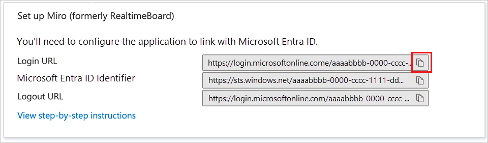

# Configure Miro for Single sign-on with Microsoft Entra ID

In this article,  you learn how to integrate Miro with Microsoft Entra ID. Another version of this article can be found at help.miro.com. When you integrate Miro with Microsoft Entra ID, you can:

* Control in Microsoft Entra ID who has access to Miro.
* Enable your users to be automatically signed-in to Miro with their Microsoft Entra accounts.
* Manage your accounts in one central location.

## Prerequisites
The scenario outlined in this article assumes that you already have the following prerequisites:

[!INCLUDE [common-prerequisites.md](~/identity/saas-apps/includes/common-prerequisites.md)]
* Miro single sign-on (SSO) enabled subscription.

## Scenario description

In this article,  you configure and test Microsoft Entra SSO in a test environment. 
* Miro supports **SP and IDP** initiated SSO and supports **Just In Time** user provisioning.
* Miro supports [**Automated** user provisioning and deprovisioning](miro-provisioning-tutorial.md) (recommended).

## Add Miro from the gallery

To configure the integration of Miro into Microsoft Entra ID, you need to add Miro from the gallery to your list of managed SaaS apps.

1. Sign in to the [Microsoft Entra admin center](https://entra.microsoft.com) as at least a [Cloud Application Administrator](~/identity/role-based-access-control/permissions-reference.md#cloud-application-administrator).
1. Browse to **Entra ID** > **Enterprise apps** > **New application**.
1. In the **Add from the gallery** section, type **Miro** in the search box.
1. Select **Miro** from results panel and then add the app. Wait a few seconds while the app is added to your tenant.

 Alternatively, you can also use the [Enterprise App Configuration Wizard](https://portal.office.com/AdminPortal/home?Q=Docs#/azureadappintegration). In this wizard, you can add an application to your tenant, add users/groups to the app, assign roles, and walk through the SSO configuration as well. [Learn more about Microsoft 365 wizards.](/microsoft-365/admin/misc/azure-ad-setup-guides)

## Configure and test Microsoft Entra SSO for Miro

Configure and test Microsoft Entra SSO with Miro using a test user called **B.Simon**. For SSO to work, you need to establish a link relationship between a Microsoft Entra user and the related user in Miro.

To configure and test Microsoft Entra SSO with Miro, perform the following steps:

1. **[Configure Microsoft Entra SSO](#configure-azure-ad-sso)** - to enable your users to use this feature.
    1. **Create a Microsoft Entra test user** - to test Microsoft Entra single sign-on with B.Simon.
    1. **Assign the Microsoft Entra test user** - to enable B.Simon to use Microsoft Entra single sign-on.
1. **[Configure Miro SSO](#configure-miro-sso)** - to configure the single sign-on settings on application side.
    1. **[Create Miro test user](#create-miro-test-user)** - to have a counterpart of B.Simon in Miro that's linked to the Microsoft Entra representation of user.
1. **[Test SSO](#test-sso)** - to verify whether the configuration works.

## Configure Microsoft Entra SSO

Follow these steps to enable Microsoft Entra SSO.

1. Sign in to the [Microsoft Entra admin center](https://entra.microsoft.com) as at least a [Cloud Application Administrator](~/identity/role-based-access-control/permissions-reference.md#cloud-application-administrator).
1. Browse to **Entra ID** > **Enterprise apps** > **Miro** application integration page, find the **Manage** section and select **Single sign-on**.
1. On the **Select a Single sign-on method** page, select **SAML**.
1. On the **Set up Single Sign-On with SAML** page, select the pencil icon for **Basic SAML Configuration** to edit the settings.

   

1. On the **Basic SAML Configuration** section, perform the following step:

   a. In the **Identifier** text box, type one of the following URL/pattern:

   |**Identifier**|
   |--------------|
   | `https://miro.com/` |
   | `https://<SUBDOMAIN>.miro.com/<ORG_ID>/<SAMLSETTINGS_ID>` |
   | `https://miro.com/<ORG_ID>/<SAMLSETTINGS_ID>` |
   | `https://<SUBDOMAIN>.miro.com/<ORG_ID>` |

   b. In the **Reply URL** text box, type one of the following URL/pattern:

   |**Reply URL**|
   |-------------|
   | `https://miro.com/sso/saml` |
   | `https://<SUBDOMAIN>.miro.com/sso/saml/<ORG_ID>` |
   | `https://miro.com/sso/saml/<ORG_ID>/<SAMLSETTINGS_ID>` |
   | `https://<SUBDOMAIN>.miro.com/sso/saml/<ORG_ID>/<SAMLSETTINGS_ID>` |

5. Perform the following step, if you wish to configure the application in **SP** initiated mode:

   In the **Sign-on URL** text box, type the URL:
   `https://miro.com/sso/login/`

   > [!NOTE]
	> These values aren't real. Update these values with the actual Identifier and Reply URL. Contact [Miro support team](mailto:support@miro.com) to get these values. You can also refer to the patterns shown in the **Basic SAML Configuration** section in the Microsoft Entra admin center.

1. On the **Set up Single Sign-On with SAML** page, in the **SAML Signing Certificate** section, find **Certificate (Base64)** and select **Download** to download the certificate and save it on your computer. You need it to configure SSO on the Miro side.

   

1. On the **Set up Miro** section, copy the Login URL. You need it to configure SSO on the Miro side.

   

[!INCLUDE [create-assign-users-sso.md](~/identity/saas-apps/includes/create-assign-users-sso.md)]

## Configure Miro SSO

To configure single sign-on on Miro side, use the certificate you previously downloaded and the Login URL you previously copied. In the Miro account settings go to the **Security** section and toggle on **Enable SSO/SAML**. 

1. Paste the Login URL in the **SAML Sign-in URL** field.
1. Open the certificate file with a text editor and copy the certificate sequence. Paste the sequence in the **Key x509 Certificate** field.

1. In the **Domains** field type in your domain address, select **Add** and follow the verification procedure. Repeat for your other domain addresses if you have any. The Miro SSO feature is working for the end users which domains are on the list. 

1. Decide if you be using Just in Time provisioning (pulling your users into your subscription during their registration in Miro) and select **Save** to complete the SSO configuration on the Miro side.
 

### Create Miro test user

In this section, a user called B.Simon is created in Miro. Miro supports just-in-time user provisioning, which is enabled by default. There's no action item for you in this section. If a user doesn't already exist in Miro, a new one is created after authentication.

## Test SSO

In this section, you test your Microsoft Entra single sign-on configuration with following options using the test user B.Simon. 

#### SP initiated:

* Go to Miro Sign-on URL directly and initiate the login flow from there.

#### IDP initiated:

* Select **Test this application**, in Azure portal and choose to log in as B.Simon. You should be automatically signed in to the Miro subscription for which you set up the SSO. 

You can also use Microsoft My Apps to test the application in any mode. When you select the Miro tile in the My Apps, if configured in SP mode you would be redirected to the application sign-on page for initiating the login flow and if configured in IDP mode, you should be automatically signed in to the Miro for which you set up the SSO. For more information about the My Apps, see [Introduction to the My Apps](https://support.microsoft.com/account-billing/sign-in-and-start-apps-from-the-my-apps-portal-2f3b1bae-0e5a-4a86-a33e-876fbd2a4510).
