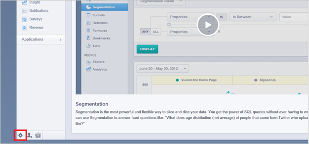
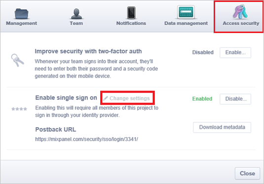
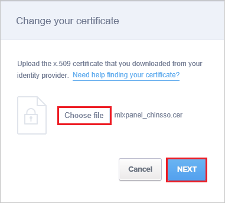
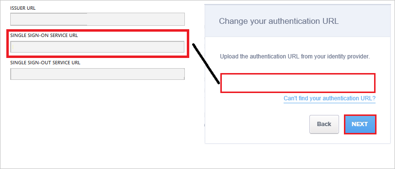
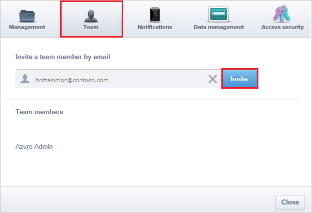

# Configure Mixpanel for Single sign-on with Microsoft Entra ID

In this article,  you learn how to integrate Mixpanel with Microsoft Entra ID. When you integrate Mixpanel with Microsoft Entra ID, you can:

* Control in Microsoft Entra ID who has access to Mixpanel.
* Enable your users to be automatically signed-in to Mixpanel with their Microsoft Entra accounts.
* Manage your accounts in one central location.

## Prerequisites
The scenario outlined in this article assumes that you already have the following prerequisites:

[!INCLUDE [common-prerequisites.md](~/identity/saas-apps/includes/common-prerequisites.md)]
* Mixpanel single sign-on (SSO) enabled subscription.

## Scenario description

In this article,  you configure and test Microsoft Entra single sign-on in a test environment.

* Mixpanel supports **SP** initiated SSO.

* Mixpanel supports [Automated user provisioning](mixpanel-provisioning-tutorial.md).

> [!NOTE]
> Identifier of this application is a fixed string value so only one instance can be configured in one tenant.

## Add Mixpanel from the gallery

To configure the integration of Mixpanel into Microsoft Entra ID, you need to add Mixpanel from the gallery to your list of managed SaaS apps.

1. Sign in to the [Microsoft Entra admin center](https://entra.microsoft.com) as at least a [Cloud Application Administrator](~/identity/role-based-access-control/permissions-reference.md#cloud-application-administrator).
1. Browse to **Entra ID** > **Enterprise apps** > **New application**.
1. In the **Add from the gallery** section, type **Mixpanel** in the search box.
1. Select **Mixpanel** from results panel and then add the app. Wait a few seconds while the app is added to your tenant.

 Alternatively, you can also use the [Enterprise App Configuration Wizard](https://portal.office.com/AdminPortal/home?Q=Docs#/azureadappintegration). In this wizard, you can add an application to your tenant, add users/groups to the app, assign roles, and walk through the SSO configuration as well. [Learn more about Microsoft 365 wizards.](/microsoft-365/admin/misc/azure-ad-setup-guides)

## Configure and test Microsoft Entra SSO for Mixpanel

Configure and test Microsoft Entra SSO with Mixpanel using a test user called **B.Simon**. For SSO to work, you need to establish a link relationship between a Microsoft Entra user and the related user in Mixpanel.

To configure and test Microsoft Entra SSO with Mixpanel, perform the following steps:

1. **[Configure Microsoft Entra SSO](#configure-azure-ad-sso)** - to enable your users to use this feature.
    1. **Create a Microsoft Entra test user** - to test Microsoft Entra single sign-on with B.Simon.
    1. **Assign the Microsoft Entra test user** - to enable B.Simon to use Microsoft Entra single sign-on.
1. **[Configure Mixpanel SSO](#configure-mixpanel-sso)** - to configure the single sign-on settings on application side.
    1. **[Create Mixpanel test user](#create-mixpanel-test-user)** - to have a counterpart of B.Simon in Mixpanel that's linked to the Microsoft Entra representation of user.
1. **[Test SSO](#test-sso)** - to verify whether the configuration works.

## Configure Microsoft Entra SSO

Follow these steps to enable Microsoft Entra SSO.

1. Sign in to the [Microsoft Entra admin center](https://entra.microsoft.com) as at least a [Cloud Application Administrator](~/identity/role-based-access-control/permissions-reference.md#cloud-application-administrator).
1. Browse to **Entra ID** > **Enterprise apps** > **Mixpanel** > **Single sign-on**.
1. On the **Select a single sign-on method** page, select **SAML**.
1. On the **Set up single sign-on with SAML** page, select the pencil icon for **Basic SAML Configuration** to edit the settings.

   

1. On the **Basic SAML Configuration** section, perform the following step:

    In the **Sign-on URL** text box, type the URL: 
    `https://mixpanel.com/login/`

	> [!NOTE]
	> Please register at [https://mixpanel.com/register/](https://mixpanel.com/register/) to set up your login credentials and  contact the [Mixpanel support team](mailto:support@mixpanel.com) to enable SSO settings for your tenant. You can also get your Sign On URL value if necessary from your Mixpanel support team. 

1. On the **Set up Single Sign-On with SAML** page, in the **SAML Signing Certificate** section, select **Download** to download the **Certificate (Base64)** from the given options as per your requirement and save it on your computer.

	

1. On the **Set up Mixpanel** section, copy the appropriate URL(s) as per your requirement.

	

[!INCLUDE [create-assign-users-sso.md](~/identity/saas-apps/includes/create-assign-users-sso.md)]

## Configure Mixpanel SSO

1. In a different browser window, sign-on to your Mixpanel application as an administrator.

2. On bottom of the page, select the little **gear** icon in the left corner. 
   
     

3. Select the **Access security** tab, and then select **Change settings**.
   
     

4. On the **Change your certificate** dialog page, select **Choose file** to upload your downloaded certificate, and then select **NEXT**.
   
     

5.  In the authentication URL textbox on the **Change your authentication  URL** dialog page, paste the value of **Login URL**., and then select **NEXT**.
   
	 

6. Select **Done**.

### Create Mixpanel test user

The objective of this section is to create a user called Britta Simon in Mixpanel. 

1. Sign on to your Mixpanel company site as an administrator.

2. On the bottom of the page, select the little gear button on the left corner to open the **Settings** window.

3. Select the **Team** tab.

4. In the **team member** textbox, type Britta's email address in the Azure.
   
     

5. Select **Invite**. 

> [!Note]
> The user gets an email to set up the profile.

> [!NOTE]
> Mixpanel also supports automatic user provisioning, you can find more details [here](./mixpanel-provisioning-tutorial.md) on how to configure automatic user provisioning.

## Test SSO

In this section, you test your Microsoft Entra single sign-on configuration with following options. 

* Select **Test this application**, this option redirects to Mixpanel Sign-on URL where you can initiate the login flow. 

* Go to Mixpanel Sign-on URL directly and initiate the login flow from there.

* You can use Microsoft My Apps. When you select the Mixpanel tile in the My Apps, this option redirects to Mixpanel Sign-on URL. For more information about the My Apps, see [Introduction to the My Apps](https://support.microsoft.com/account-billing/sign-in-and-start-apps-from-the-my-apps-portal-2f3b1bae-0e5a-4a86-a33e-876fbd2a4510).

## Related content

Once you configure Mixpanel you can enforce session control, which protects exfiltration and infiltration of your organization’s sensitive data in real time. Session control extends from Conditional Access. [Learn how to enforce session control with Microsoft Defender for Cloud Apps](/cloud-app-security/proxy-deployment-aad).
