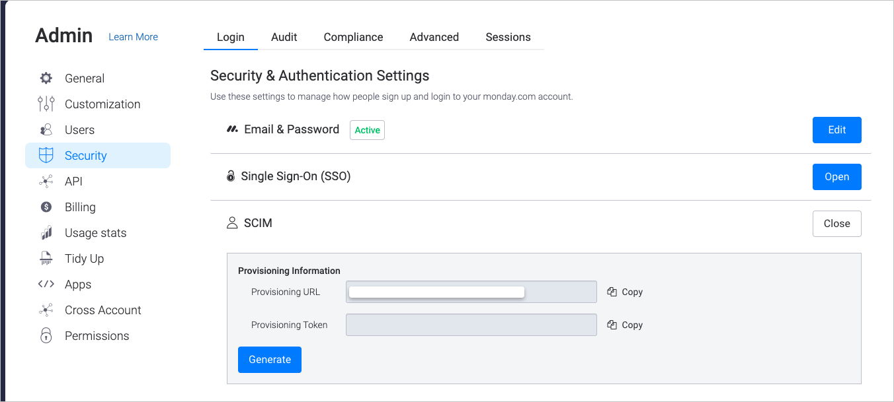

# Configure monday.com for automatic user provisioning with Microsoft Entra ID

This article describes the steps you need to perform in both monday.com and Microsoft Entra ID to configure automatic user provisioning. When configured, Microsoft Entra ID automatically provisions and de-provisions users and groups to [monday.com](https://www.monday.com/) using the Microsoft Entra provisioning service. For important details on what this service does, how it works, and frequently asked questions, see [Automate user provisioning and deprovisioning to SaaS applications with Microsoft Entra ID](~/identity/app-provisioning/user-provisioning.md). 

## Capabilities Supported
> [!div class="checklist"]
> * Create users in monday.com
> * Remove users in monday.com when they don't require access anymore
> * Keep user attributes synchronized between Microsoft Entra ID and monday.com
> * Provision groups and group memberships in monday.com
> * [Single sign-on](mondaycom-tutorial.md) to monday.com (recommended)

## Prerequisites

The scenario outlined in this article assumes that you already have the following prerequisites:

[!INCLUDE [common-prerequisites.md](~/identity/saas-apps/includes/common-prerequisites.md)]
* An **Enterprise**  monday.com account.

## Step 1: Plan your provisioning deployment
1. Learn about [how the provisioning service works](~/identity/app-provisioning/user-provisioning.md).
2. Determine who's in [scope for provisioning](~/identity/app-provisioning/define-conditional-rules-for-provisioning-user-accounts.md).
3. Determine what data to [map between Microsoft Entra ID and monday.com](~/identity/app-provisioning/customize-application-attributes.md). 

## Step 2: Configure monday.com to support provisioning with Microsoft Entra ID
1. Login to [monday.com](https://www.monday.com/). Select your profile picture , on the left navigation pane.
2. Navigate to **Admin > Security** .
3. Select **Open** in the **SCIM** section under the **Login** tab

4. Select **Generate** . These are the **Tenant URL** and **Secret Token** you need for step 5.

>[!NOTE]
>don't share or save this secret token. You can always generate a new token whenever and wherever it's required.

## Step 3: Add monday.com from the Microsoft Entra application gallery

Add monday.com from the Microsoft Entra application gallery to start managing provisioning to monday.com. If you have previously setup monday.com for SSO you can use the same application. However, we recommend that you create a separate app when testing out the integration initially. Learn more about adding an application from the gallery [here](~/identity/enterprise-apps/add-application-portal.md). 

## Step 4: Define who is in scope for provisioning 

[!INCLUDE [create-assign-users-provisioning.md](~/identity/saas-apps/includes/create-assign-users-provisioning.md)]

## Step 5: Configure automatic user provisioning to monday.com 

This section guides you through the steps to configure the Microsoft Entra provisioning service to create, update, and disable users and/or groups in TestApp based on user and/or group assignments in Microsoft Entra ID.

### To configure automatic user provisioning for monday.com in Microsoft Entra ID:

1. Sign in to the [Microsoft Entra admin center](https://entra.microsoft.com) as at least a [Cloud Application Administrator](~/identity/role-based-access-control/permissions-reference.md#cloud-application-administrator).
1. Browse to **Entra ID** > **Enterprise apps**

	

1. In the applications list, select **monday.com**.

	

3. Select the **Provisioning** tab.

	

4. Set the **Provisioning Mode** to **Automatic**.

	

5. Under the **Admin Credentials** section, input your monday.com Tenant URL and Secret Token. Select **Test Connection** to ensure Microsoft Entra ID can connect to monday.com. If the connection fails, ensure your monday.com account has Admin permissions and try again.

 	

6. In the **Notification Email** field, enter the email address of a person or group who should receive the provisioning error notifications and select the **Send an email notification when a failure occurs** check box.

	

7. Select **Save**.

8. Under the **Mappings** section, select **Synchronize Microsoft Entra users to monday.com**.

9. Review the user attributes that are synchronized from Microsoft Entra ID to monday.com in the **Attribute-Mapping** section. The attributes selected as **Matching** properties are used to match the user accounts in monday.com for update operations. If you choose to change the [matching target attribute](~/identity/app-provisioning/customize-application-attributes.md), you need to ensure that the monday.com API supports filtering users based on that attribute. Select the **Save** button to commit any changes.

   |Attribute|Type|Supported for filtering|Required by monday.com|
   |---|---|---|---|
   |userName|String|&check;|&check;
   |userType|String|||
   |displayName|String||&check;
   |title|String|||
   |locale|String|||
   |timezone|String|||
   |roles|String|||

10. Under the **Mappings** section, select **Synchronize Microsoft Entra groups to monday.com**.

11. Review the group attributes that are synchronized from Microsoft Entra ID to monday.com in the **Attribute-Mapping** section. The attributes selected as **Matching** properties are used to match the groups in monday.com for update operations. Select the **Save** button to commit any changes.

      |Attribute|Type|Supported for filtering|Required by monday.com|
      |---|---|---|---|
      |displayName|String|&check;|&check;|
      |members|Reference|||

12. To configure scoping filters, refer to the following instructions provided in the [Scoping filter  article](~/identity/app-provisioning/define-conditional-rules-for-provisioning-user-accounts.md).

13. To enable the Microsoft Entra provisioning service for monday.com, change the **Provisioning Status** to **On** in the **Settings** section.

	

14. Define the users and/or groups that you would like to provision to monday.com by choosing the desired values in **Scope** in the **Settings** section.

	

15. When you're ready to provision, select **Save**.

	

This operation starts the initial synchronization cycle of all users and groups defined in **Scope** in the **Settings** section. The initial cycle takes longer to perform than subsequent cycles, which occur approximately every 40 minutes as long as the Microsoft Entra provisioning service is running. 

## Step 6: Monitor your deployment

[!INCLUDE [monitor-deployment.md](~/identity/saas-apps/includes/monitor-deployment.md)]

## Connector Limitations
* monday.com only supports the userType "admin" , "guest", "member" and "viewer". The userType  "User" isn't supported and is removed in the future.

## Change log
* 1/21/2021 - Added support for core attribute "userType" for users.
* 12/08/2022 - Dropped core user attribute **emails[type eq "work"].value**.Update **userName** , so that it get provisioned **"always"** and not **"only on object creation"**.Removed the mapping for **userType**.Added core user attribute **roles** and it's corresponding mapping.

## Additional resources

* [Managing user account provisioning for Enterprise Apps](~/identity/app-provisioning/configure-automatic-user-provisioning-portal.md)
* [What is application access and single sign-on with Microsoft Entra ID?](~/identity/enterprise-apps/what-is-single-sign-on.md)

## Related content

* [Learn how to review logs and get reports on provisioning activity](~/identity/app-provisioning/check-status-user-account-provisioning.md)
