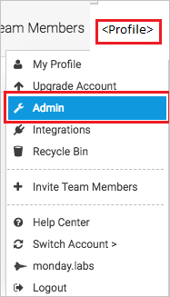
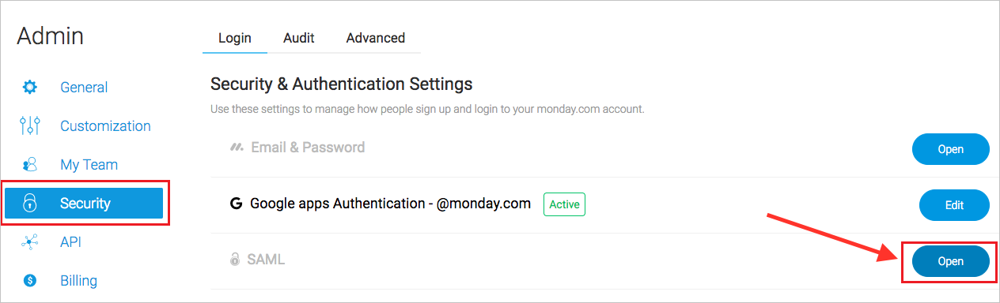
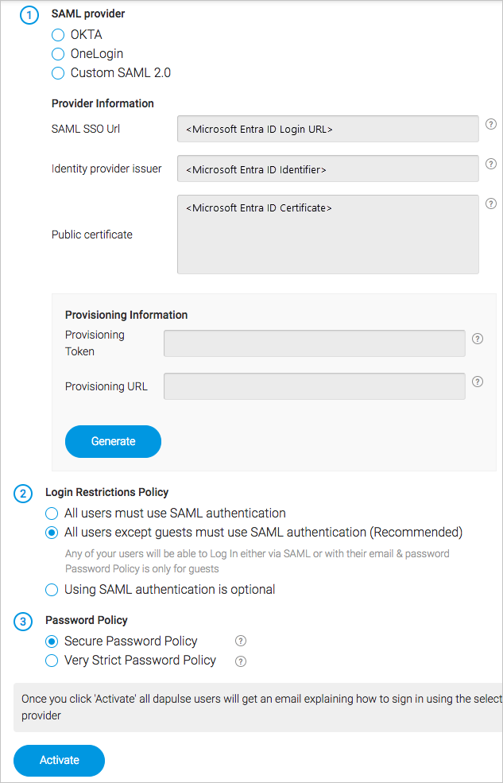

# Configure monday.com for Single sign-on with Microsoft Entra ID

In this article,  you learn how to integrate monday.com with Microsoft Entra ID. When you integrate monday.com with Microsoft Entra ID, you can:

* Control in Microsoft Entra ID who has access to monday.com.
* Enable your users to be automatically signed-in to monday.com with their Microsoft Entra accounts.
* Manage your accounts in one central location.

## Prerequisites
The scenario outlined in this article assumes that you already have the following prerequisites:

[!INCLUDE [common-prerequisites.md](~/identity/saas-apps/includes/common-prerequisites.md)]
* monday.com single sign-on (SSO) enabled subscription.

> [!NOTE]
> This integration is also available to use from Microsoft Entra US Government Cloud environment. You can find this application in the Microsoft Entra US Government Cloud Application Gallery and configure it in the same way as you do from public cloud.

## Scenario description

In this article,  you configure and test Microsoft Entra SSO in a test environment.

* monday.com supports **SP and IDP** initiated SSO.
* monday.com supports [**automated** user provisioning and deprovisioning](mondaycom-provisioning-tutorial.md) (recommended).
* monday.com supports **Just In Time** user provisioning.

## Add monday.com from the gallery

To configure the integration of monday.com into Microsoft Entra ID, you need to add monday.com from the gallery to your list of managed SaaS apps.

1. Sign in to the [Microsoft Entra admin center](https://entra.microsoft.com) as at least a [Cloud Application Administrator](~/identity/role-based-access-control/permissions-reference.md#cloud-application-administrator).
1. Browse to **Entra ID** > **Enterprise apps** > **New application**.
1. In the **Add from the gallery** section, type **monday.com** in the search box.
1. Select **monday.com** from results panel and then add the app. Wait a few seconds while the app is added to your tenant.

 Alternatively, you can also use the [Enterprise App Configuration Wizard](https://portal.office.com/AdminPortal/home?Q=Docs#/azureadappintegration). In this wizard, you can add an application to your tenant, add users/groups to the app, assign roles, and walk through the SSO configuration as well. [Learn more about Microsoft 365 wizards.](/microsoft-365/admin/misc/azure-ad-setup-guides)

## Configure and test Microsoft Entra SSO for monday.com

Configure and test Microsoft Entra SSO with monday.com using a test user called **B.Simon**. For SSO to work, you need to establish a link relationship between a Microsoft Entra user and the related user in monday.com.

To configure and test Microsoft Entra SSO with monday.com, perform the following steps:

1. **[Configure Microsoft Entra SSO](#configure-azure-ad-sso)** - to enable your users to use this feature.
    1. **Create a Microsoft Entra test user** - to test Microsoft Entra single sign-on with B.Simon.
    1. **Assign the Microsoft Entra test user** - to enable B.Simon to use Microsoft Entra single sign-on.
1. **[Configure monday.com SSO](#configure-mondaycom-sso)** - to configure the single sign-on settings on application side.
    1. **[Create monday.com test user](#create-mondaycom-test-user)** - to have a counterpart of B.Simon in monday.com that's linked to the Microsoft Entra representation of user.
1. **[Test SSO](#test-sso)** - to verify whether the configuration works.

## Configure Microsoft Entra SSO

Follow these steps to enable Microsoft Entra SSO.

1. Sign in to the [Microsoft Entra admin center](https://entra.microsoft.com) as at least a [Cloud Application Administrator](~/identity/role-based-access-control/permissions-reference.md#cloud-application-administrator).
1. Browse to **Entra ID** > **Enterprise apps** > **monday.com** > **Single sign-on**.
1. On the **Select a single sign-on method** page, select **SAML**.
1. On the **Set up single sign-on with SAML** page, select the pencil icon for **Basic SAML Configuration** to edit the settings.

   

1. On the **Basic SAML Configuration** section, if you have **Service Provider metadata file** and wish to configure in **IDP** initiated mode, perform the following steps:

    a. Select **Upload metadata file**.

    

    b. Select **folder logo** to select the metadata file and select **Upload**.

    

    c. After the metadata file is successfully uploaded, the **Identifier** and **Reply URL** values get auto populated in Basic SAML Configuration section.

    > [!Note]
    > If the **Identifier** and **Reply URL** values don't get populated automatically, then fill in the values manually. The **Identifier** and the **Reply URL** are the same and value is in the following pattern: `https://<YOUR_DOMAIN>.monday.com/saml/saml_callback`

1. Select **Set additional URLs** and perform the following step if you wish to configure the application in **SP** initiated mode:

    In the **Sign-on URL** text box, type a URL using the following pattern:
    `https://<YOUR_DOMAIN>.monday.com`

    > [!NOTE]
    > These values aren't real. Update these values with the actual Identifier, Reply URL and Sign-On URL. Contact [monday.com Client support team](https://monday.com/contact-us/) to get these values. You can also refer to the patterns shown in the **Basic SAML Configuration** section.

1. monday.com application expects the SAML assertions in a specific format, which requires you to add custom attribute mappings to your SAML token attributes configuration. The following screenshot shows the list of default attributes.

    

1. In addition to above, monday.com application expects few more attributes to be passed back in SAML response which are shown below. These attributes are also pre populated but you can review them as per your requirements.

    | Name | Source Attribute |
    |--|--|
    | Email | user.mail |
    | FirstName | user.givenname |
    | LastName | user.surname |

1. On the **Set up single sign-on with SAML** page, in the **SAML Signing Certificate** section,  find **Certificate (Base64)** and select **Download** to download the certificate and save it on your computer.

    

1. On the **Set up monday.com** section, copy the appropriate URL(s) based on your requirement.

    

[!INCLUDE [create-assign-users-sso.md](~/identity/saas-apps/includes/create-assign-users-sso.md)]

## Configure monday.com SSO

1. In a different web browser window, sign in to your up monday.com company site as an administrator

1. Go to the **Profile** on the top-right corner of page and select **Admin**.

    

1. Select **Security** and make sure to select **Open** next to SAML.

    

1. Fill in the details below from your IDP.

    

    > [!NOTE]
    > For more details refer [this](https://support.monday.com/hc/articles/360000460605-SAML-Single-Sign-on?abcb=34642) article.

### Create monday.com test user

In this section, a user called B.Simon is created in monday.com. monday.com supports just-in-time provisioning, which is enabled by default. There's no action item for you in this section. If a user doesn't already exist in monday.com, a new one is created when you attempt to access monday.com.

## Test SSO

In this section, you test your Microsoft Entra single sign-on configuration with following options. 

#### SP initiated:

* Select **Test this application**, this option redirects to monday.com Sign on URL where you can initiate the login flow.  

* Go to monday.com Sign-on URL directly and initiate the login flow from there.

#### IDP initiated:

* Select **Test this application**, and you should be automatically signed in to the monday.com for which you set up the SSO. 

You can also use Microsoft My Apps to test the application in any mode. When you select the monday.com tile in the My Apps, if configured in SP mode you would be redirected to the application sign on page for initiating the login flow and if configured in IDP mode, you should be automatically signed in to the monday.com for which you set up the SSO. For more information about the My Apps, see [Introduction to the My Apps](https://support.microsoft.com/account-billing/sign-in-and-start-apps-from-the-my-apps-portal-2f3b1bae-0e5a-4a86-a33e-876fbd2a4510).

## Related content

Once you configure monday.com you can enforce session control, which protects exfiltration and infiltration of your organization’s sensitive data in real time. Session control extends from Conditional Access. [Learn how to enforce session control with Microsoft Defender for Cloud Apps](/cloud-app-security/proxy-deployment-any-app).
