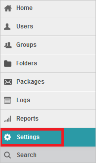
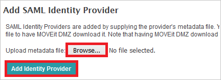

# Configure MOVEit Transfer for Single sign-on with Microsoft Entra ID

In this article,  you learn how to integrate MOVEit Transfer - Microsoft Entra integration with Microsoft Entra ID. When you integrate MOVEit Transfer - Microsoft Entra integration with Microsoft Entra ID, you can:

* Control in Microsoft Entra ID who has access to MOVEit Transfer - Microsoft Entra integration.
* Enable your users to be automatically signed-in to MOVEit Transfer - Microsoft Entra integration with their Microsoft Entra accounts.
* Manage your accounts in one central location.

## Prerequisites
The scenario outlined in this article assumes that you already have the following prerequisites:

[!INCLUDE [common-prerequisites.md](~/identity/saas-apps/includes/common-prerequisites.md)]
* MOVEit Transfer - Microsoft Entra integration single sign-on (SSO) enabled subscription.

## Scenario description

In this article,  you configure and test Microsoft Entra single sign-on in a test environment.

* MOVEit Transfer - Microsoft Entra integration supports **SP** initiated SSO.

## Add MOVEit Transfer - Microsoft Entra integration from the gallery

To configure the integration of MOVEit Transfer - Microsoft Entra integration into Microsoft Entra ID, you need to add MOVEit Transfer - Microsoft Entra integration from the gallery to your list of managed SaaS apps.

1. Sign in to the [Microsoft Entra admin center](https://entra.microsoft.com) as at least a [Cloud Application Administrator](~/identity/role-based-access-control/permissions-reference.md#cloud-application-administrator).
1. Browse to **Entra ID** > **Enterprise apps** > **New application**.
1. In the **Add from the gallery** section, type **MOVEit Transfer - Microsoft Entra integration** in the search box.
1. Select **MOVEit Transfer - Microsoft Entra integration** from results panel and then add the app. Wait a few seconds while the app is added to your tenant.

 Alternatively, you can also use the [Enterprise App Configuration Wizard](https://portal.office.com/AdminPortal/home?Q=Docs#/azureadappintegration). In this wizard, you can add an application to your tenant, add users/groups to the app, assign roles, and walk through the SSO configuration as well. [Learn more about Microsoft 365 wizards.](/microsoft-365/admin/misc/azure-ad-setup-guides)

## Configure and test Microsoft Entra SSO for MOVEit Transfer - Microsoft Entra integration

Configure and test Microsoft Entra SSO with MOVEit Transfer - Microsoft Entra integration using a test user called **B.Simon**. For SSO to work, you need to establish a link relationship between a Microsoft Entra user and the related user in MOVEit Transfer - Microsoft Entra integration.

To configure and test Microsoft Entra SSO with MOVEit Transfer - Microsoft Entra integration, perform the following steps:

1. **[Configure Microsoft Entra SSO](#configure-azure-ad-sso)** - to enable your users to use this feature.
    1. **Create a Microsoft Entra test user** - to test Microsoft Entra single sign-on with B.Simon.
    1. **Assign the Microsoft Entra test user** - to enable B.Simon to use Microsoft Entra single sign-on.
1. **[Configure MOVEit Transfer - Microsoft Entra integration SSO](#configure-moveit-transfer---azure-ad-integration-sso)** - to configure the single sign-on settings on application side.
    1. **[Create MOVEit Transfer - Microsoft Entra integration test user](#create-moveit-transfer---azure-ad-integration-test-user)** - to have a counterpart of B.Simon in MOVEit Transfer - Microsoft Entra integration that's linked to the Microsoft Entra representation of user.
1. **[Test SSO](#test-sso)** - to verify whether the configuration works.

## Configure Microsoft Entra SSO

Follow these steps to enable Microsoft Entra SSO.

1. Sign in to the [Microsoft Entra admin center](https://entra.microsoft.com) as at least a [Cloud Application Administrator](~/identity/role-based-access-control/permissions-reference.md#cloud-application-administrator).
1. Browse to **Entra ID** > **Enterprise apps** > **MOVEit Transfer - Microsoft Entra integration** > **Single sign-on**.
1. On the **Select a single sign-on method** page, select **SAML**.
1. On the **Set up single sign-on with SAML** page, select the pencil icon for **Basic SAML Configuration** to edit the settings.

   

1. On the **Basic SAML Configuration** section, if you have **Service Provider metadata file**, perform the following steps:

	a. Select **Upload metadata file**.

    

	b. Select **folder logo** to select the metadata file and select **Upload**.

	

	c. After the metadata file is successfully uploaded, the **Identifier** and **Reply URL** value gets auto populated in **Basic SAML Configuration** section.

    d. In the **Sign-on URL** text box, type the URL:
    `https://contoso.com`

	> [!NOTE]
	> The **Sign-on URL** value isn't real. Update the value with the actual Sign-On URL. Contact [MOVEit Transfer - Microsoft Entra integration Client support](https://community.ipswitch.com/s/support) team to get the value. You can download the **Service Provider Metadata file** from the **Service Provider Metadata URL** which is explained later in the **Configure MOVEit Transfer - Microsoft Entra integration Single Sign-On** section of the article. You can also refer to the patterns shown in the **Basic SAML Configuration** section.

4. On the **Set up Single Sign-On with SAML** page, in the **SAML Signing Certificate** section, select **Download** to download the **Federation Metadata XML** from the given options as per your requirement and save it on your computer.

	

6. On the **Set up MOVEit Transfer - Microsoft Entra integration** section, copy the appropriate URL(s) as per your requirement.

	

[!INCLUDE [create-assign-users-sso.md](~/identity/saas-apps/includes/create-assign-users-sso.md)]

## Configure MOVEit Transfer - Microsoft Entra integration SSO

1. Sign on to your MOVEit Transfer tenant as an administrator.

2. On the left navigation pane, select **Settings**.

	

3. Select **Single Signon** link, which is under **Security Policies -> User Auth**.

	

4. Select the Metadata URL link to download the metadata document.

	

   a. Verify that the **entityID** value in the **EntityDescriptor** matches **Identifier** in the **Basic SAML Configuration** section.

   b. Verify that the **AssertionConsumerService** **Location** URL matches **REPLY URL**  in the **Basic SAML Configuration** section.

5. Select **Add Identity Provider** button to add a new Federated Identity Provider.

	

6. Select **Browse...** to select the metadata file which you downloaded from Azure portal, then select **Add Identity Provider** to upload the downloaded file.

	

7. Select "**Yes**" as **Enabled** in the **Edit Federated Identity Provider Settings...** page and select **Save**.

	

8. In the **Edit Federated Identity Provider User Settings** page, perform the following actions:
	
	
	
	a. Select **SAML NameID** as **Login name**.
	
	b. Select **Other** as **Full name** and in the **Attribute name** textbox put the value: `http://schemas.microsoft.com/identity/claims/displayname`.
	
	c. Select **Other** as **Email** and in the **Attribute name** textbox put the value: `http://schemas.xmlsoap.org/ws/2005/05/identity/claims/emailaddress`.
	
	d. Select **Yes** as **Auto-create account on signon**.
	
	e. Select **Save** button.

### Create MOVEit Transfer - Microsoft Entra integration test user

The objective of this section is to create a user called Britta Simon in MOVEit Transfer - Microsoft Entra integration. MOVEit Transfer - Microsoft Entra integration supports just-in-time provisioning, which you have enabled. There's no action item for you in this section. A new user is created during an attempt to access MOVEit Transfer - Microsoft Entra integration if it doesn't exist yet.

>[!NOTE]
>If you need to create a user manually, you need to contact the [MOVEit Transfer - Microsoft Entra integration Client support team](https://community.ipswitch.com/s/support).

## Test SSO 

In this section, you test your Microsoft Entra single sign-on configuration with following options. 

* Select **Test this application**, this option redirects to MOVEit Transfer - Microsoft Entra integration Sign-on URL where you can initiate the login flow. 

* Go to MOVEit Transfer - Microsoft Entra integration Sign-on URL directly and initiate the login flow from there.

* You can use Microsoft My Apps. When you select the MOVEit Transfer - Microsoft Entra integration tile in the My Apps, you should be automatically signed in to the MOVEit Transfer - Microsoft Entra integration for which you set up the SSO. For more information about the My Apps, see [Introduction to the My Apps](https://support.microsoft.com/account-billing/sign-in-and-start-apps-from-the-my-apps-portal-2f3b1bae-0e5a-4a86-a33e-876fbd2a4510).

## Related content

Once you configure MOVEit Transfer - Microsoft Entra integration you can enforce session control, which protects exfiltration and infiltration of your organization’s sensitive data in real time. Session control extends from Conditional Access. [Learn how to enforce session control with Microsoft Defender for Cloud Apps](/cloud-app-security/proxy-deployment-any-app).
