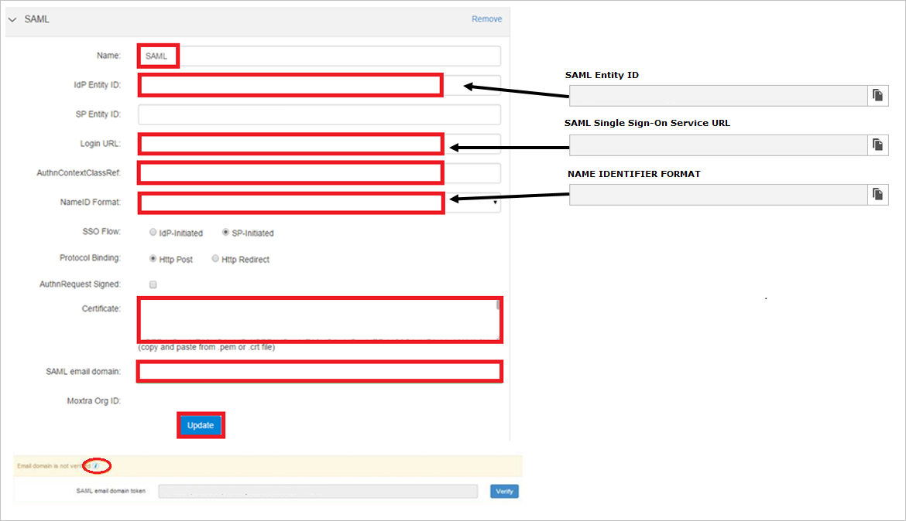
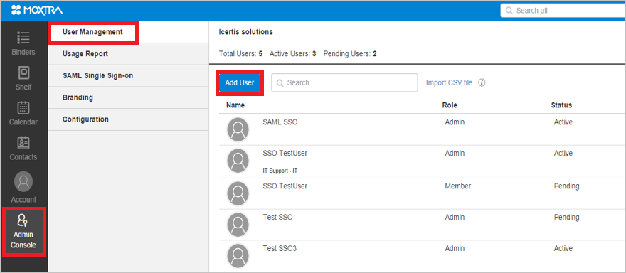

# Configure Moxtra for Single sign-on with Microsoft Entra ID

In this article,  you learn how to integrate Moxtra with Microsoft Entra ID. When you integrate Moxtra with Microsoft Entra ID, you can:

* Control in Microsoft Entra ID who has access to Moxtra.
* Enable your users to be automatically signed-in to Moxtra with their Microsoft Entra accounts.
* Manage your accounts in one central location.

## Prerequisites

To get started, you need the following items:

* A Microsoft Entra subscription. If you don't have a subscription, you can get a [free account](https://azure.microsoft.com/free/).
* Moxtra single sign-on (SSO) enabled subscription.
* Along with Cloud Application Administrator, Application Administrator can also add or manage applications in Microsoft Entra ID.
For more information, see [Azure built-in roles](~/identity/role-based-access-control/permissions-reference.md).

## Scenario description

In this article,  you configure and test Microsoft Entra SSO in a test environment.

* Moxtra supports **SP** initiated SSO.

> [!NOTE]
> Identifier of this application is a fixed string value so only one instance can be configured in one tenant.

## Add Moxtra from the gallery

To configure the integration of Moxtra into Microsoft Entra ID, you need to add Moxtra from the gallery to your list of managed SaaS apps.

1. Sign in to the [Microsoft Entra admin center](https://entra.microsoft.com) as at least a [Cloud Application Administrator](~/identity/role-based-access-control/permissions-reference.md#cloud-application-administrator).
1. Browse to **Entra ID** > **Enterprise apps** > **New application**.
1. In the **Add from the gallery** section, type **Moxtra** in the search box.
1. Select **Moxtra** from results panel and then add the app. Wait a few seconds while the app is added to your tenant.

 Alternatively, you can also use the [Enterprise App Configuration Wizard](https://portal.office.com/AdminPortal/home?Q=Docs#/azureadappintegration). In this wizard, you can add an application to your tenant, add users/groups to the app, assign roles, and walk through the SSO configuration as well. [Learn more about Microsoft 365 wizards.](/microsoft-365/admin/misc/azure-ad-setup-guides)

## Configure and test Microsoft Entra SSO for Moxtra

Configure and test Microsoft Entra SSO with Moxtra using a test user called **B.Simon**. For SSO to work, you need to establish a link relationship between a Microsoft Entra user and the related user in Moxtra.

To configure and test Microsoft Entra SSO with Moxtra, perform the following steps:

1. **[Configure Microsoft Entra SSO](#configure-azure-ad-sso)** - to enable your users to use this feature.
    1. **Create a Microsoft Entra test user** - to test Microsoft Entra single sign-on with B.Simon.
    1. **Assign the Microsoft Entra test user** - to enable B.Simon to use Microsoft Entra single sign-on.
1. **[Configure Moxtra SSO](#configure-moxtra-sso)** - to configure the single sign-on settings on application side.
    1. **[Create Moxtra test user](#create-moxtra-test-user)** - to have a counterpart of B.Simon in Moxtra that's linked to the Microsoft Entra representation of user.
1. **[Test SSO](#test-sso)** - to verify whether the configuration works.

## Configure Microsoft Entra SSO

Follow these steps to enable Microsoft Entra SSO.

1. Sign in to the [Microsoft Entra admin center](https://entra.microsoft.com) as at least a [Cloud Application Administrator](~/identity/role-based-access-control/permissions-reference.md#cloud-application-administrator).
1. Browse to **Entra ID** > **Enterprise apps** > **Moxtra** > **Single sign-on**.
1. On the **Select a single sign-on method** page, select **SAML**.
1. On the **Set up single sign-on with SAML** page, select the pencil icon for **Basic SAML Configuration** to edit the settings.

   

1. On the **Basic SAML Configuration** section, perform the following step:

    In the **Sign-on URL** text box, type the URL:
    `https://www.moxtra.com/service/#login`

1. Moxtra application expects the SAML assertions in a specific format, which requires you to add custom attribute mappings to your SAML token attributes configuration. The following screenshot shows the list of default attributes. Select **Edit** icon to open User Attributes dialog.

	

1. In addition to above, Moxtra application expects few more attributes to be passed back in SAML response. In the User Claims section on the User Attributes dialog, perform the following steps to add SAML token attribute as shown in the below table:

	| Name | Source Attribute|
	| ------------------- | ---------- |    
	| firstname | user.givenname |
	| lastname | user.surname |
	| idpid    | < Microsoft Entra Identifier >

	> [!Note]
	> The value of **idpid** attribute isn't real. You can get the actual value from **Set up Moxtra** section from step#8. 

	1. Select **Add new claim** to open the **Manage user claims** dialog.

	1. In the **Name** textbox, type the attribute name shown for that row.

	1. Leave the **Namespace** blank.

	1. Select Source as **Attribute**.

	1. From the **Source attribute** list, type the attribute value shown for that row.

	1. Select **Ok**

	1. Select **Save**.

1. On the **Set up single sign-on with SAML** page, in the **SAML Signing Certificate** section,  find **Certificate (Base64)** and select **Download** to download the certificate and save it on your computer.

	

1. On the **Set up Moxtra** section, copy the appropriate URL(s) based on your requirement.

	

[!INCLUDE [create-assign-users-sso.md](~/identity/saas-apps/includes/create-assign-users-sso.md)]

## Configure Moxtra SSO

1. In another browser window, sign on to your Moxtra company site as an administrator.

2. In the toolbar on the left, select **Admin Console > SAML Single Sign-on**, and then select **New**.
   
     

3. On the **SAML** page, perform the following steps:
   
       
 
    a. In the **Name** textbox, type a name for your configuration (such as **SAML**). 
  
    b. In the **IdP Entity ID** textbox, paste the value of **Microsoft Entra Identifier**.. 
 
    c. In **Login URL** textbox, paste the value of **Login URL**.. 
 
    d. In the **AuthnContextClassRef** textbox, type **urn:oasis:names:tc:SAML:2.0:ac:classes:Password**. 
 
    e. In the **NameID Format** textbox, type **urn:oasis:names:tc:SAML:1.1:nameid-format:emailAddress**. 
 
    f. Open certificate which you have downloaded from Azure portal in notepad, copy the content, and then paste it into the **Certificate** textbox.    
 
    g. In the SAML email domain textbox, type your SAML email domain.    
  
    >[!NOTE]
    >To see the steps to verify the domain, select the "**i**" below.

    h. Select **Update**.

### Create Moxtra test user

The objective of this section is to create a user called B.simon in Moxtra.

**To create a user called B.simon in Moxtra, perform the following steps:**

1. Sign on to your Moxtra company site as an administrator.

1. In the toolbar on the left, select **Admin Console > User Management**, and then **Add User**.
   
     

1. On the **Add User** dialog, perform the following steps:
  
    a. In the **First Name** textbox, type **B**.
  
    b. In the **Last Name** textbox, type **Simon**.
  
    c. In the **Email** textbox, type B.simon's email address same as on Azure portal.
  
    d. In the **Division** textbox, type **Dev**.
  
    e. In the **Department** textbox, type **IT**.
  
    f. Select **Administrator**.
  
    g. Select **Add**.

## Test SSO 

In this section, you test your Microsoft Entra single sign-on configuration with following options. 

* Select **Test this application**, this option redirects to Moxtra Sign-on URL where you can initiate the login flow. 

* Go to Moxtra Sign-on URL directly and initiate the login flow from there.

* You can use Microsoft My Apps. When you select the Moxtra tile in the My Apps, this option redirects to Moxtra Sign-on URL. For more information, see [Microsoft Entra My Apps](/azure/active-directory/manage-apps/end-user-experiences#azure-ad-my-apps).

## Related content

Once you configure Moxtra you can enforce session control, which protects exfiltration and infiltration of your organization’s sensitive data in real time. Session control extends from Conditional Access. [Learn how to enforce session control with Microsoft Cloud App Security](/cloud-app-security/proxy-deployment-aad).
