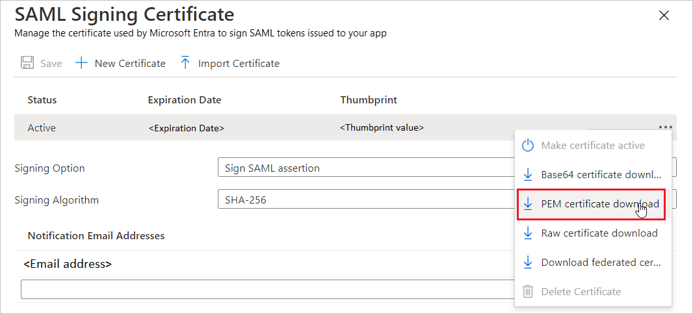

# Configure Mural Identity for Single sign-on with Microsoft Entra ID

In this article,  you learn how to integrate Mural Identity with Microsoft Entra ID. When you integrate Mural Identity with Microsoft Entra ID, you can:

* Control in Microsoft Entra ID who has access to Mural Identity.
* Enable your users to be automatically signed-in to Mural Identity with their Microsoft Entra accounts.
* Manage your accounts in one central location.

## Prerequisites
The scenario outlined in this article assumes that you already have the following prerequisites:

[!INCLUDE [common-prerequisites.md](~/identity/saas-apps/includes/common-prerequisites.md)]
* Mural Identity single sign-on (SSO) enabled subscription.

## Scenario description

In this article,  you configure and test Microsoft Entra SSO in a test environment.

* Mural Identity supports **SP and IDP** initiated SSO.
* Mural Identity supports **Just In Time** user provisioning.
* Mural Identity supports [Automated user provisioning](mural-identity-provisioning-tutorial.md).

> [!NOTE]
> Identifier of this application is a fixed string value so only one instance can be configured in one tenant.

## Add Mural Identity from the gallery

To configure the integration of Mural Identity into Microsoft Entra ID, you need to add Mural Identity from the gallery to your list of managed SaaS apps.

1. Sign in to the [Microsoft Entra admin center](https://entra.microsoft.com) as at least a [Cloud Application Administrator](~/identity/role-based-access-control/permissions-reference.md#cloud-application-administrator).
1. Browse to **Entra ID** > **Enterprise apps** > **New application**.
1. In the **Add from the gallery** section, type **Mural Identity** in the search box.
1. Select **Mural Identity** from results panel and then add the app. Wait a few seconds while the app is added to your tenant.

 Alternatively, you can also use the [Enterprise App Configuration Wizard](https://portal.office.com/AdminPortal/home?Q=Docs#/azureadappintegration). In this wizard, you can add an application to your tenant, add users/groups to the app, assign roles, and walk through the SSO configuration as well. [Learn more about Microsoft 365 wizards.](/microsoft-365/admin/misc/azure-ad-setup-guides)

## Configure and test Microsoft Entra SSO for Mural Identity

Configure and test Microsoft Entra SSO with Mural Identity using a test user called **B.Simon**. For SSO to work, you need to establish a link relationship between a Microsoft Entra user and the related user in Mural Identity.

To configure and test Microsoft Entra SSO with Mural Identity, perform the following steps:

1. **[Configure Microsoft Entra SSO](#configure-azure-ad-sso)** - to enable your users to use this feature.
    1. **Create a Microsoft Entra test user** - to test Microsoft Entra single sign-on with B.Simon.
    1. **Assign the Microsoft Entra test user** - to enable B.Simon to use Microsoft Entra single sign-on.
1. **[Configure Mural Identity SSO](#configure-mural-identity-sso)** - to configure the single sign-on settings on application side.
    1. **[Create Mural Identity test user](#create-mural-identity-test-user)** - to have a counterpart of B.Simon in Mural Identity that's linked to the Microsoft Entra representation of user.
1. **[Test SSO](#test-sso)** - to verify whether the configuration works.

## Configure Microsoft Entra SSO

Follow these steps to enable Microsoft Entra SSO.

1. Sign in to the [Microsoft Entra admin center](https://entra.microsoft.com) as at least a [Cloud Application Administrator](~/identity/role-based-access-control/permissions-reference.md#cloud-application-administrator).
1. Browse to **Entra ID** > **Enterprise apps** > **Mural Identity** > **Single sign-on**.
1. On the **Select a single sign-on method** page, select **SAML**.
1. On the **Set up single sign-on with SAML** page, select the pencil icon for **Basic SAML Configuration** to edit the settings.

   

1. On the **Basic SAML Configuration** section, the user doesn't have to perform any step as the app is already pre-integrated with Azure.

1. Mural Identity application expects the SAML assertions in a specific format, which requires you to add custom attribute mappings to your SAML token attributes configuration. The following screenshot shows the list of default attributes.

	

1. In addition to above, Mural Identity application expects few more attributes to be passed back in SAML response which are shown below. These attributes are also pre populated but you can review them as per your requirements.
	
	| Name | Source Attribute|
	| -------- | --------- |
	| email | user.userprincipalname |
    | FirstName | user.givenname |
    | LastName | user.surname |

1. On the **Set up single sign-on with SAML** page, in the **SAML Signing Certificate** section,  find **Certificate (PEM)** and select **Download** to download the certificate and save it on your computer.

   

1. On the **Set up Mural Identity** section, copy the appropriate URL(s) based on your requirement.

	

[!INCLUDE [create-assign-users-sso.md](~/identity/saas-apps/includes/create-assign-users-sso.md)]

## Configure Mural Identity SSO

1. Log in to the Mural Identity website as an administrator.

1. Select your **name** in the bottom left corner of the dashboard and select **Company dashboard** from the list of options.

1. Select **SSO** in the left sidebar and perform the below steps.

    

a. Download the **MURAL's metadata**.

b. In the **Sign in URL** textbox, paste the **Login URL** value, which you copied previously.

c. In the **Sign in certificate**, upload the **Certificate (PEM)**, which you have downloaded. 

d. Select **HTTP-POST** as the Request binding type and select **SHA256** as the Sign-in algorithm type.

e. In the **Claim mapping** section, fill the following fields. 

* Email address: `http://schemas.xmlsoap.org/ws/2005/05/identity/claims/emailaddress`

* First name: `http://schemas.xmlsoap.org/ws/2005/05/identity/claims/givenname`

* Last name: `http://schemas.xmlsoap.org/ws/2005/05/identity/claims/surname`

f. Select **Test single sign-on** to test the configuration and **Save** it.

> [!NOTE]
> For more information on how to configure the SSO at MURAL, please follow [this](https://support.mural.co/s/article/configure-sso-with-mural-and-azure-ad) support page.

### Create Mural Identity test user

In this section, a user called Britta Simon is created in Mural Identity. Mural Identity supports just-in-time user provisioning, which is enabled by default. There's no action item for you in this section. If a user doesn't already exist in Mural Identity, a new one is created after authentication.

## Test SSO 

In this section, you test your Microsoft Entra single sign-on configuration with following options. 

#### SP initiated:

* Select **Test this application**, this option redirects to Mural Identity Sign on URL where you can initiate the login flow.  

* Go to Mural Identity Sign on URL directly and initiate the login flow from there.

#### IDP initiated:

* Select **Test this application**, and you should be automatically signed in to the Mural Identity for which you set up the SSO. 

You can also use Microsoft My Apps to test the application in any mode. When you select the Mural Identity tile in the My Apps, if configured in SP mode you would be redirected to the application sign-on page for initiating the login flow and if configured in IDP mode, you should be automatically signed in to the Mural Identity for which you set up the SSO. For more information, see [Microsoft Entra My Apps](/azure/active-directory/manage-apps/end-user-experiences#azure-ad-my-apps).

## Change log

* 03/21/2022 - Application Name updated.

## Related content

Once you configure Mural Identity you can enforce session control, which protects exfiltration and infiltration of your organization’s sensitive data in real time. Session control extends from Conditional Access. [Learn how to enforce session control with Microsoft Cloud App Security](/cloud-app-security/proxy-deployment-aad).
