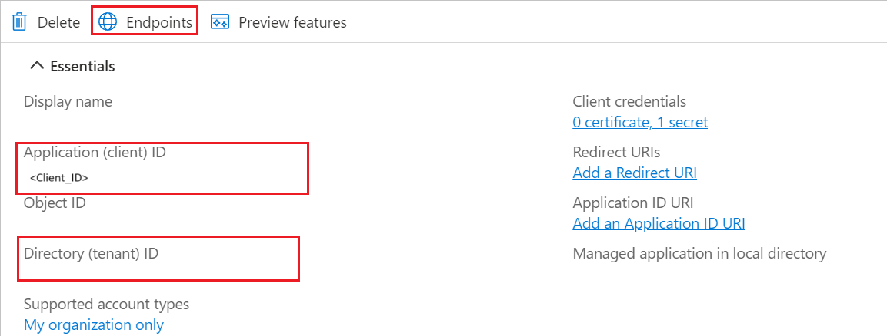
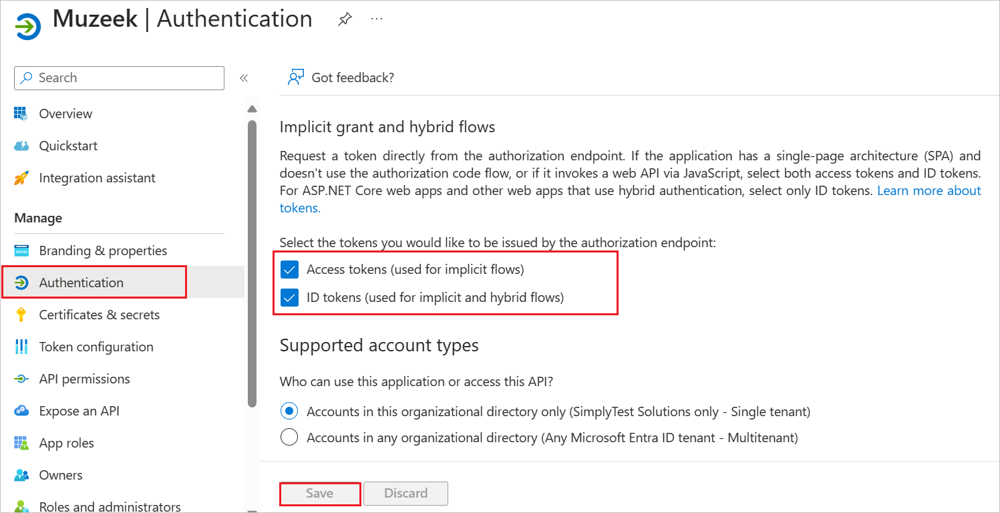

# Configure Muzeek for Single sign-on with Microsoft Entra ID

In this article,  you learn how to integrate Muzeek with Microsoft Entra ID. When you integrate Muzeek with Microsoft Entra ID, you can:

Use Microsoft Entra ID to control who can access Muzeek.
Enable your users to be automatically signed in to Muzeek with their Microsoft Entra accounts.
Manage your accounts in one central location: the Azure portal.

## Prerequisites
The scenario outlined in this article assumes that you already have the following prerequisites:

[!INCLUDE [common-prerequisites.md](~/identity/saas-apps/includes/common-prerequisites.md)]
* Muzeek single sign-on (SSO) enabled subscription.

## Add Muzeek from the gallery

To configure the integration of Muzeek into Microsoft Entra ID, you need to add Muzeek from the gallery to your list of managed SaaS apps.

1. Sign in to the [Microsoft Entra admin center](https://entra.microsoft.com) as at least a [Cloud Application Administrator](~/identity/role-based-access-control/permissions-reference.md#cloud-application-administrator).

1. Browse to **Entra ID** > **Enterprise apps** > **New application**.

1. In the **Add from the gallery** section, enter **Muzeek** in the search box.

1. Select **Muzeek** in the results panel and then add the app. Wait a few seconds while the app is added to your tenant.

## Configure Microsoft Entra SSO

Follow these steps to enable Microsoft Entra SSO in the Microsoft Entra admin center.

1. Sign in to the [Microsoft Entra admin center](https://entra.microsoft.com) as at least a [Cloud Application Administrator](~/identity/role-based-access-control/permissions-reference.md#cloud-application-administrator).

1. Browse to **Entra ID** > **Enterprise apps** > **Muzeek** > **Single sign-on**.

1. Perform the following steps in the below section:

    a. Select **Go to application**.

    

    b. Copy **Application (client) ID** and **Directory (tenant) ID**, use it later in the Muzeek side configuration.

    

1. Navigate to **Authentication** tab on the left menu and perform the following steps:

    a. Enable the **Access tokens** and **ID tokens**

    

    b. select **Save**.

    >[!NOTE]
    > The **Redirect URIs** value is auto populate, you don't need to perform any manual configuration here.

1. Navigate to **Certificates & secrets** on the left menu and perform the following steps:

    1. Go to **Client secrets** tab and select **+New client secret**.
    1. Enter a valid **Description** in the textbox and select **Expires** days from the drop-down as per your requirement and select **Add**.

        

    1. Once you add a client secret, **Value** is generated. Copy the value and use it later in the Muzeek side configuration.

        

[!INCLUDE [create-assign-users-sso.md](~/identity/saas-apps/includes/create-assign-users-sso.md)]

## Configure Muzeek SSO

Below are the configuration steps to complete the OIDC federation setup:

1. Sign into the Muzeek site as an administrator.

1. Select **Settings** icon at the bottom of the page and perform of the below steps.

    

    a. Go to the **Integrations** tab.

    b. In the **ENTRA Domain** field, enter the domain URL value using the following pattern: `https://login.microsoftonline.com/<Tenant_ID>/oauth2/v2.0/authorize`

    > [!NOTE]
    > The domain URL value isn't real, replace the **Tenant_ID** value with actual **Directory (tenant) ID**, which you have copied from Entra side.

    c. In the **ENTRA Client ID** field, paste the **Application ID** value, which you have copied from Entra page. 

    d. In the **ENTRA Client Secret** field, paste the value, which you have copied from **Certificates & secrets** section at Entra side.

    e. Select **Save Changes**.

    f. Once saved, Muzeek populates the **Home Page URL** which can be used later in [Connect SSO via MyApps](#connect-sso-via-myapps) section.
    

## Connect SSO via MyApps

To connect your MyApps account to Muzeek in the Microsoft Entra admin center, please follow the below steps:

1. Navigate to **App Registrations** > **Muzeek **Branding & Properties**.

1. Paste the Home Page URL you copied from Muzeek portal into the **Home Page URL** field in Microsoft Entra admin center.

1. Select **Save** and wait for 10 - 15 minutes for the change to propagate in the system.

Once done, you should now be able to successfully navigate to your Muzeek account while logged into MyApps, and any users you have added to your tenant should be able to do so as well.
