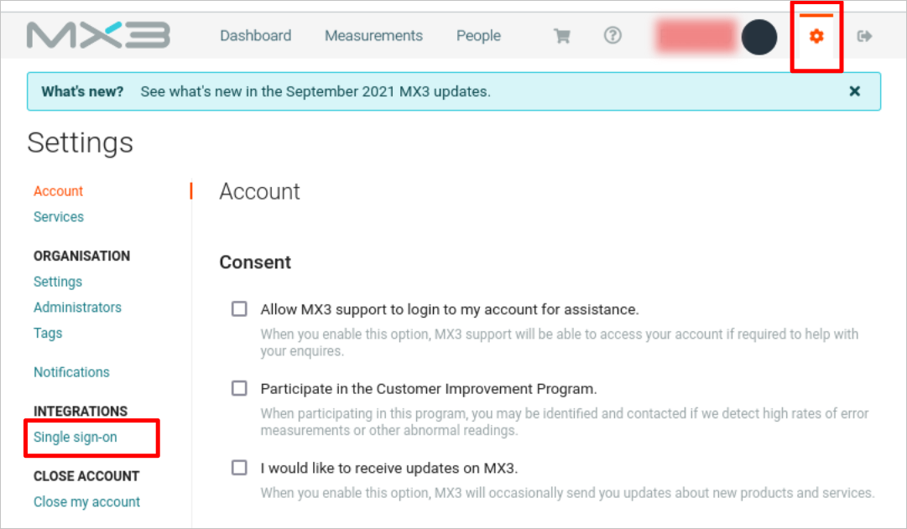
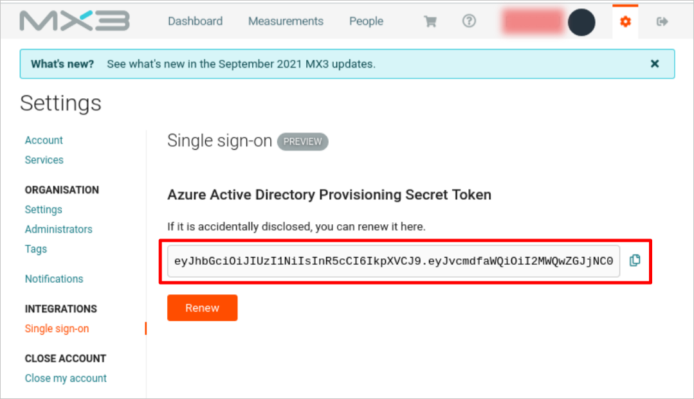

# Configure MX3 Diagnostics Connector for automatic user provisioning with Microsoft Entra ID

This article describes the steps you need to perform in both MX3 Diagnostics Connector and Microsoft Entra ID to configure automatic user provisioning. When configured, Microsoft Entra ID automatically provisions and de-provisions users and groups to [MX3 Diagnostics Connector](https://www.mx3diagnostics.com/) using the Microsoft Entra provisioning service. For important details on what this service does, how it works, and frequently asked questions, see [Automate user provisioning and deprovisioning to SaaS applications with Microsoft Entra ID](~/identity/app-provisioning/user-provisioning.md). 

## Capabilities supported
> [!div class="checklist"]
> * Create users in MX3 Diagnostics Connector.
> * Remove users in MX3 Diagnostics Connector when they don't require access anymore.
> * Keep user attributes synchronized between Microsoft Entra ID and MX3 Diagnostics Connector.
> * Provision groups and group memberships in MX3 Diagnostics Connector.
> * Single sign-on to MX3 Diagnostics Connector.

## Prerequisites

The scenario outlined in this article assumes that you already have the following prerequisites:

* [A Microsoft Entra tenant](~/identity-platform/quickstart-create-new-tenant.md). 
* One of the following roles: [Application Administrator](/entra/identity/role-based-access-control/permissions-reference#application-administrator), [Cloud Application Administrator](/entra/identity/role-based-access-control/permissions-reference#cloud-application-administrator), or [Application Owner](/entra/fundamentals/users-default-permissions#owned-enterprise-applications). 
* An MX3 account with organization feature.
* An account in MX3 Portal with SSO.

## Step 1: Plan your provisioning deployment
1. Learn about [how the provisioning service works](~/identity/app-provisioning/user-provisioning.md).
1. Determine who's in [scope for provisioning](~/identity/app-provisioning/define-conditional-rules-for-provisioning-user-accounts.md).
1. Determine what data to [map between Microsoft Entra ID and MX3 Diagnostics Connector](~/identity/app-provisioning/customize-application-attributes.md). 

## Step 2: Configure MX3 Diagnostics Connector to support provisioning with Microsoft Entra ID

1. If your MX3 account doesn't have organization feature enabled, apply for organization feature as described in documentation at `https://www.mx3diagnostics.com/files/files/MX3_PortalGuide_0321.pdf`.Make sure to sign in to MX3 account to be able to access this documentation.

1. If your MX3 account doesn't have single-sign-on feature enabled, setup Microsoft Entra SSO as described in this documentation.

1. Log in to [MX3 Portal](https://portal.mx3.app). Navigate to the SSO settings page by selecting settings and then select **Single sign-on**.

    

1. Scroll down to view the token. Copy and save the token. You need it in the **Step 5**.

    

## Step 3: Add MX3 Diagnostics Connector from the Microsoft Entra application gallery

Add MX3 Diagnostics Connector from the Microsoft Entra application gallery to start managing provisioning to MX3 Diagnostics Connector. If you have previously setup MX3 Diagnostics Connector for SSO, you can use the same application. However, we recommend that you create a separate app when testing out the integration initially. Learn more about adding an application from the gallery [here](~/identity/enterprise-apps/add-application-portal.md). 

## Step 4: Define who is in scope for provisioning 

[!INCLUDE [create-assign-users-provisioning.md](~/identity/saas-apps/includes/create-assign-users-provisioning.md)]

## Step 5: Configure automatic user provisioning to MX3 Diagnostics Connector 

This section guides you through the steps to configure the Microsoft Entra provisioning service to create, update, and disable users and/or groups in MX3 Diagnostics Connector based on user and/or group assignments in Microsoft Entra ID.

### To configure automatic user provisioning for MX3 Diagnostics Connector in Microsoft Entra ID:

1. Sign in to the [Microsoft Entra admin center](https://entra.microsoft.com) as at least a [Cloud Application Administrator](~/identity/role-based-access-control/permissions-reference.md#cloud-application-administrator).
1. Browse to **Entra ID** > **Enterprise apps**

	

1. In the applications list, select **MX3 Diagnostics Connector**.

	

1. Select the **Provisioning** tab.

	

1. Select **+ New configuration**.

	

1. In the **Tenant URL** field, enter your MX3 Diagnostics Connector Tenant URL and Secret Token. Select **Test Connection** to ensure Microsoft Entra ID can connect to MX3 Diagnostics Connector. If the connection fails, ensure your MX3 Diagnostics Connector account has the required admin permissions and try again.
    > [!NOTE]
    > Enter `https://scim.mx3.app` in the **Tenant URL**.

	

1. Select **Create** to create your configuration.

1. Select **Properties** on the **Overview** page.

1. In the **Notification Email** field, enter the email address of a person who should receive the provisioning error notifications and select the **Send an email notification when a failure occurs** check box.

   

1. Select **Attribute Mapping** in the left panel and select **users**.

1. Review the user attributes that are synchronized from Microsoft Entra ID to MX3 Diagnostics Connector in the **Attribute-Mapping** section. The attributes selected as **Matching** properties are used to match the user accounts in MX3 Diagnostics Connector for update operations. If you choose to change the [matching target attribute](~/identity/app-provisioning/customize-application-attributes.md), you need to ensure that the MX3 Diagnostics Connector API supports filtering users based on that attribute. Select the **Save** button to commit any changes.

    |Attribute|Type|Supported for filtering|
    |---|---|---|
    |userName|String|&check;
    |externalId|String|&check;
    |active|Boolean|
    |name.givenName|String|
    |name.familyName|String|

1. Review the group attributes that are synchronized from Microsoft Entra ID to MX3 Diagnostics Connector in the **Attribute-Mapping** section. The attributes selected as **Matching** properties are used to match the groups in MX3 Diagnostics Connector for update operations. Select the **Save** button to commit any changes.

      |Attribute|Type|Supported for filtering|
      |---|---|---|
      |displayName|String|&check;
      |externalId|String|
      |members|Reference|

1. To configure scoping filters, refer to the instructions provided in the [Scoping filter article](~/identity/app-provisioning/define-conditional-rules-for-provisioning-user-accounts.md).

1. Use [on-demand provisioning](~/identity/app-provisioning/provision-on-demand.md) to validate sync with a small number of users before deploying more broadly in your organization.

1. When you're ready to provision, select **Start Provisioning** from the **Overview** page.

## Step 6: Monitor your deployment

[!INCLUDE [monitor-deployment.md](~/identity/saas-apps/includes/monitor-deployment.md)]

## More resources

* [Managing user account provisioning for Enterprise Apps](~/identity/app-provisioning/configure-automatic-user-provisioning-portal.md)
* [What is application access and single sign-on with Microsoft Entra ID?](~/identity/enterprise-apps/what-is-single-sign-on.md)

## Related content

* [Learn how to review logs and get reports on provisioning activity](~/identity/app-provisioning/check-status-user-account-provisioning.md)
