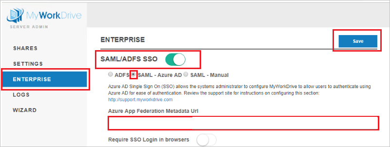

# Configure MyWorkDrive for Single sign-on with Microsoft Entra ID

In this article,  you learn how to integrate MyWorkDrive with Microsoft Entra ID. When you integrate MyWorkDrive with Microsoft Entra ID, you can:

* Control in Microsoft Entra ID who has access to MyWorkDrive.
* Enable your users to be automatically signed-in to MyWorkDrive with their Microsoft Entra accounts.
* Manage your accounts in one central location.

## Prerequisites
The scenario outlined in this article assumes that you already have the following prerequisites:

[!INCLUDE [common-prerequisites.md](~/identity/saas-apps/includes/common-prerequisites.md)]
* MyWorkDrive single sign-on (SSO) enabled subscription.

## Scenario description

In this article,  you configure and test Microsoft Entra SSO in a test environment. 
* MyWorkDrive supports **SP** and **IDP** initiated SSO.

> [!NOTE]
> Identifier of this application is a fixed string value so only one instance can be configured in one tenant.

## Add MyWorkDrive from the gallery

To configure the integration of MyWorkDrive into Microsoft Entra ID, you need to add MyWorkDrive from the gallery to your list of managed SaaS apps.

1. Sign in to the [Microsoft Entra admin center](https://entra.microsoft.com) as at least a [Cloud Application Administrator](~/identity/role-based-access-control/permissions-reference.md#cloud-application-administrator).
1. Browse to **Entra ID** > **Enterprise apps** > **New application**.
1. In the **Add from the gallery** section, type **MyWorkDrive** in the search box.
1. Select **MyWorkDrive** from results panel and then add the app. Wait a few seconds while the app is added to your tenant.

 Alternatively, you can also use the [Enterprise App Configuration Wizard](https://portal.office.com/AdminPortal/home?Q=Docs#/azureadappintegration). In this wizard, you can add an application to your tenant, add users/groups to the app, assign roles, and walk through the SSO configuration as well. [Learn more about Microsoft 365 wizards.](/microsoft-365/admin/misc/azure-ad-setup-guides)

## Configure and test Microsoft Entra SSO for MyWorkDrive

Configure and test Microsoft Entra SSO with MyWorkDrive using a test user called **B.Simon**. For SSO to work, you need to establish a link relationship between a Microsoft Entra user and the related user in MyWorkDrive.

To configure and test Microsoft Entra SSO with MyWorkDrive, perform the following steps:

1. **[Configure Microsoft Entra SSO](#configure-azure-ad-sso)** - to enable your users to use this feature.
    1. **Create a Microsoft Entra test user** - to test Microsoft Entra single sign-on with B.Simon.
    1. **Assign the Microsoft Entra test user** - to enable B.Simon to use Microsoft Entra single sign-on.
1. **[Configure MyWorkDrive SSO](#configure-myworkdrive-sso)** - to configure the single sign-on settings on application side.
    1. **[Create MyWorkDrive test user](#create-myworkdrive-test-user)** - to have a counterpart of B.Simon in MyWorkDrive that's linked to the Microsoft Entra representation of user.
1. **[Test SSO](#test-sso)** - to verify whether the configuration works.

## Configure Microsoft Entra SSO

Follow these steps to enable Microsoft Entra SSO.

1. Sign in to the [Microsoft Entra admin center](https://entra.microsoft.com) as at least a [Cloud Application Administrator](~/identity/role-based-access-control/permissions-reference.md#cloud-application-administrator).
1. Browse to **Entra ID** > **Enterprise apps** > **MyWorkDrive** application integration page, find the **Manage** section and select **Single sign-on**.
1. On the **Select a Single sign-on method** page, select **SAML**.
1. On the **Set up Single Sign-On with SAML** page, select the pencil icon for **Basic SAML Configuration** to edit the settings.

   

1. On the **Basic SAML Configuration** page, If you wish to configure the application in **IDP** initiated mode, perform the following step:

	In the **Reply URL** text box, type a URL using the following pattern:
    `https://<SERVER.DOMAIN.COM>/SAML/AssertionConsumerService.aspx`

1. Select **Set additional URLs** and perform the following step if you wish to configure the application in **SP** initiated mode:

    In the **Sign-on URL** text box, type a URL using the following pattern:
    `https://<SERVER.DOMAIN.COM>/Account/Login-saml`

	> [!NOTE]
    > These values aren't real. Update these values with the actual Reply URL and Sign-On URL. Input your own company's MyWorkDrive Server host name, such as: 
    > 
    > Reply URL: `https://yourserver.yourdomain.com/SAML/AssertionConsumerService.aspx`
    > 
    > Sign-on URL:`https://yourserver.yourdomain.com/Account/Login-saml`
    > 
    > Contact [MyWorkDrive support team](mailto:support@myworkdrive.com) if you're unsure how to setup your own host name and TLS/SSL certificate for these values.

1. On the **Set up Single Sign-On with SAML** page, in the **SAML Signing Certificate** section, select copy button to copy **App Federation Metadata Url** to your clipboard.

	

[!INCLUDE [create-assign-users-sso.md](~/identity/saas-apps/includes/create-assign-users-sso.md)]

## Configure MyWorkDrive SSO

1. In a different web browser window, sign in to your MyWorkDrive company site as an administrator

1. On the MyWorkDrive Server in the admin panel, select **ENTERPRISE** and perform the following steps:

	

	a. Enable **SAML/ADFS SSO**.

	b. Select **SAML - Microsoft Entra ID**.

	c. In the **Azure App Federation Metadata Url** textbox, paste the value of **App Federation Metadata Url** which you copied previously.

	d. Select **Save**.

	> [!NOTE]
	> For additional information review the [MyWorkDrive Microsoft Entra support article](https://www.myworkdrive.com/support/saml-single-sign-on-azure-ad/).

### Create MyWorkDrive test user

In this section, you create a user called Britta Simon in MyWorkDrive. Work with [MyWorkDrive support team](mailto:support@myworkdrive.com) to add the users in the MyWorkDrive platform. Users must be created and activated before you use single sign-on.

## Test SSO

In this section, you test your Microsoft Entra single sign-on configuration with following options. 

#### SP initiated:

* Select **Test this application**, this option redirects to MyWorkDrive Sign on URL where you can initiate the login flow.  

* Go to MyWorkDrive Sign-on URL directly and initiate the login flow from there.

#### IDP initiated:

* Select **Test this application**, and you should be automatically signed in to the MyWorkDrive for which you set up the SSO. 

You can also use Microsoft My Apps to test the application in any mode. When you select the MyWorkDrive tile in the My Apps, if configured in SP mode you would be redirected to the application sign on page for initiating the login flow and if configured in IDP mode, you should be automatically signed in to the MyWorkDrive for which you set up the SSO. For more information about the My Apps, see [Introduction to the My Apps](https://support.microsoft.com/account-billing/sign-in-and-start-apps-from-the-my-apps-portal-2f3b1bae-0e5a-4a86-a33e-876fbd2a4510).

## Related content

Once you configure MyWorkDrive you can enforce session control, which protects exfiltration and infiltration of your organization’s sensitive data in real time. Session control extends from Conditional Access. [Learn how to enforce session control with Microsoft Defender for Cloud Apps](/cloud-app-security/proxy-deployment-aad).
