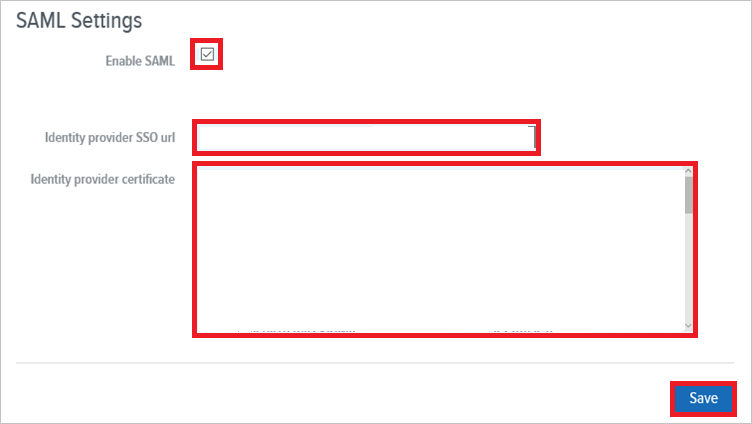
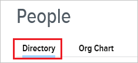
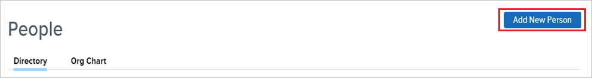

# Configure Namely for Single sign-on with Microsoft Entra ID

In this article,  you learn how to integrate Namely with Microsoft Entra ID. When you integrate Namely with Microsoft Entra ID, you can:

* Control in Microsoft Entra ID who has access to Namely.
* Enable your users to be automatically signed-in to Namely with their Microsoft Entra accounts.
* Manage your accounts in one central location.

## Prerequisites
The scenario outlined in this article assumes that you already have the following prerequisites:

[!INCLUDE [common-prerequisites.md](~/identity/saas-apps/includes/common-prerequisites.md)]
* Namely single sign-on (SSO) enabled subscription.

## Scenario description

In this article,  you configure and test Microsoft Entra single sign-on in a test environment.

* Namely supports **SP** initiated SSO.

## Add Namely from the gallery

To configure the integration of Namely into Microsoft Entra ID, you need to add Namely from the gallery to your list of managed SaaS apps.

1. Sign in to the [Microsoft Entra admin center](https://entra.microsoft.com) as at least a [Cloud Application Administrator](~/identity/role-based-access-control/permissions-reference.md#cloud-application-administrator).
1. Browse to **Entra ID** > **Enterprise apps** > **New application**.
1. In the **Add from the gallery** section, type **Namely** in the search box.
1. Select **Namely** from results panel and then add the app. Wait a few seconds while the app is added to your tenant.

 Alternatively, you can also use the [Enterprise App Configuration Wizard](https://portal.office.com/AdminPortal/home?Q=Docs#/azureadappintegration). In this wizard, you can add an application to your tenant, add users/groups to the app, assign roles, and walk through the SSO configuration as well. [Learn more about Microsoft 365 wizards.](/microsoft-365/admin/misc/azure-ad-setup-guides)

## Configure and test Microsoft Entra SSO for Namely

Configure and test Microsoft Entra SSO with Namely using a test user called **B.Simon**. For SSO to work, you need to establish a link relationship between a Microsoft Entra user and the related user in Namely.

To configure and test Microsoft Entra SSO with Namely, perform the following steps:

1. **[Configure Microsoft Entra SSO](#configure-azure-ad-sso)** - to enable your users to use this feature.
    1. **Create a Microsoft Entra test user** - to test Microsoft Entra single sign-on with B.Simon.
    1. **Assign the Microsoft Entra test user** - to enable B.Simon to use Microsoft Entra single sign-on.
1. **[Configure Namely SSO](#configure-namely-sso)** - to configure the single sign-on settings on application side.
    1. **[Create Namely test user](#create-namely-test-user)** - to have a counterpart of B.Simon in Namely that's linked to the Microsoft Entra representation of user.
1. **[Test SSO](#test-sso)** - to verify whether the configuration works.

## Configure Microsoft Entra SSO

Follow these steps to enable Microsoft Entra SSO.

1. Sign in to the [Microsoft Entra admin center](https://entra.microsoft.com) as at least a [Cloud Application Administrator](~/identity/role-based-access-control/permissions-reference.md#cloud-application-administrator).
1. Browse to **Entra ID** > **Enterprise apps** > **Namely** > **Single sign-on**.
1. On the **Select a single sign-on method** page, select **SAML**.
1. On the **Set up single sign-on with SAML** page, select the pencil icon for **Basic SAML Configuration** to edit the settings.

   

1. On the **Basic SAML Configuration** section, perform the following steps:

	a. In the **Sign on URL** text box, type a URL using the following pattern:
    `https://<subdomain>.namely.com`

    b. In the **Identifier (Entity ID)** text box, type a URL using the following pattern:
    `https://<subdomain>.namely.com/saml/metadata`

	> [!NOTE]
	> These values aren't real. Update these values with the actual Sign on URL and Identifier. Contact [Namely Client support team](https://www.namely.com/contact/) to get these values. You can also refer to the patterns shown in the **Basic SAML Configuration** section.

1. On the **Set up Single Sign-On with SAML** page, in the **SAML Signing Certificate** section, select **Download** to download the **Certificate (Base64)** from the given options as per your requirement and save it on your computer.

	

1. On the **Set up Namely** section, copy the appropriate URL(s) as per your requirement.

	

[!INCLUDE [create-assign-users-sso.md](~/identity/saas-apps/includes/create-assign-users-sso.md)]

## Configure Namely SSO

1. In another browser window, sign on to your Namely company site as an administrator.

2. In the toolbar on the top, select **Company**.
   
     

3. Select the **Settings** tab.
   
     

4. Select **SAML**.
   
     

5. On the **SAML Settings** page, perform the following steps:
   
    
 
    a. Select **Enable SAML**. 

    b. In the **Identity provider SSO url** textbox,  paste the value of **Login URL**.
    
    c. Open your downloaded certificate in Notepad, copy the content, and then paste it into the **Identity provider certificate** textbox.
     
    d. Select **Save**.

### Create Namely test user

The objective of this section is to create a user called Britta Simon in Namely.

**To create a user called Britta Simon in Namely, perform the following steps:**

1. Sign-on to your Namely company site as an administrator.

2. In the toolbar on the top, select **People**.
   
     

3. Select the **Directory** tab.
   
     

4. Select **Add New Person**.

    

5. On the **Add New Person** dialog, perform the following steps:

    a. In the **First name** textbox, type **Britta**.

    b. In the **Last name** textbox, type **Simon**.

    c. In the **Email** textbox, type the **email address** of BrittaSimon.

    d. Select **Save**.

## Test SSO 

In this section, you test your Microsoft Entra single sign-on configuration with following options. 

* Select **Test this application**, this option redirects to Namely Sign-on URL where you can initiate the login flow. 

* Go to Namely Sign-on URL directly and initiate the login flow from there.

* You can use Microsoft My Apps. When you select the Namely tile in the My Apps, this option redirects to Namely Sign-on URL. For more information about the My Apps, see [Introduction to the My Apps](https://support.microsoft.com/account-billing/sign-in-and-start-apps-from-the-my-apps-portal-2f3b1bae-0e5a-4a86-a33e-876fbd2a4510).

## Related content

Once you configure Namely you can enforce session control, which protects exfiltration and infiltration of your organization’s sensitive data in real time. Session control extends from Conditional Access. [Learn how to enforce session control with Microsoft Defender for Cloud Apps](/cloud-app-security/proxy-deployment-any-app).
