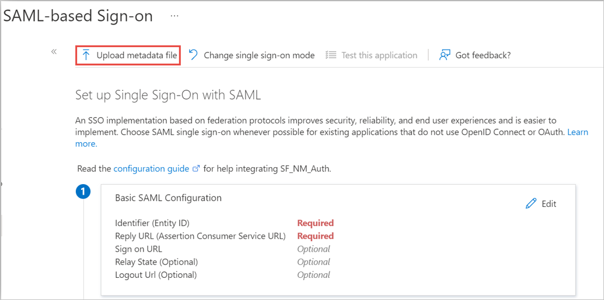

# Configure NetMotion Mobility for Single sign-on with Microsoft Entra ID

In this article,  you learn how to integrate NetMotion Mobility with Microsoft Entra ID. When you integrate NetMotion Mobility with Microsoft Entra ID, you can:

* Control in Microsoft Entra ID who has access to NetMotion Mobility.
* Enable users to be signed-in with a NetMotion Mobility client with their Microsoft Entra accounts.
* Manage your accounts in one central location.

## Prerequisites

To get started, you need the following items:

* A Microsoft Entra subscription. If you don't have a subscription, you can get a [free account](https://azure.microsoft.com/free/).
* NetMotion Mobility 12.50 or later.
* Along with Cloud Application Administrator, Application Administrator can also add or manage applications in Microsoft Entra ID.
For more information, see [Azure built-in roles](~/identity/role-based-access-control/permissions-reference.md).

## Scenario description

In this article,  you configure and test Microsoft Entra SSO in a test environment.

* NetMotion Mobility supports **SP** initiated SSO.
* NetMotion Mobility supports **Just In Time** user provisioning.

## Add NetMotion Mobility from the gallery

To configure the integration of NetMotion Mobility into Microsoft Entra ID, you need to add NetMotion Mobility from the gallery to your list of managed SaaS apps.

1. Sign in to the [Microsoft Entra admin center](https://entra.microsoft.com) as at least a [Cloud Application Administrator](~/identity/role-based-access-control/permissions-reference.md#cloud-application-administrator).
1. Browse to **Entra ID** > **Enterprise apps** > **New application**.
1. In the **Add from the gallery** section, type **NetMotion Mobility** in the search box.
1. Select **NetMotion Mobility** from results panel and then add the app. Wait a few seconds while the app is added to your tenant.

 Alternatively, you can also use the [Enterprise App Configuration Wizard](https://portal.office.com/AdminPortal/home?Q=Docs#/azureadappintegration). In this wizard, you can add an application to your tenant, add users/groups to the app, assign roles, and walk through the SSO configuration as well. [Learn more about Microsoft 365 wizards.](/microsoft-365/admin/misc/azure-ad-setup-guides)

## Configure and test Microsoft Entra SSO for NetMotion Mobility

Configure and test Microsoft Entra SSO with NetMotion Mobility using a test user called **B.Simon**. For SSO to work, you need to establish a link relationship between a Microsoft Entra user and the related user in NetMotion Mobility.

To configure and test Microsoft Entra SSO with NetMotion Mobility, perform the following steps:

1. **[Configure Mobility for SAML-based Authentication](#configure-mobility-for-saml-based-authentication)** - to enable end users to authenticate using their Microsoft Entra credentials. 
2. **[Configure Microsoft Entra SSO](#configure-azure-ad-sso)** - to enable your users to use this feature.
    1. **Create a Microsoft Entra test user** - to test Microsoft Entra single sign-on with B.Simon.
    1. **Assign the Microsoft Entra test user** - to enable B.Simon to use Microsoft Entra single sign-on.
3. **[Configure NetMotion Mobility SSO](#configure-netmotion-mobility-sso)** - to configure the single sign-on settings on application side.
    1. **[Create NetMotion Mobility test user](#create-netmotion-mobility-test-user)** - to have a counterpart of B.Simon in NetMotion Mobility that's linked to the Microsoft Entra representation of user.
4. **[Test SAML-based User Authentication with the Mobility Client](#test-saml-based-user-authentication-with-the-mobility-client)** - to verify whether the configuration works.

## Configure Mobility for SAML-based Authentication

On the Mobility console, follow the procedures in the [Mobility Administrator Guide](https://help.netmotionsoftware.com/support/docs/MobilityXG/1250/help/mobilityhelp.htm#page/Mobility%2520Server%2Fintro.01.01.html%23) to accomplish the following:
1.	Create an [authentication profile](https://help.netmotionsoftware.com/support/docs/MobilityXG/1250/help/mobilityhelp.htm#page/Mobility%2520Server%2Fconfig.05.41.html%23ww2298330) for SAML – to enable a set of Mobility users to use the SAML protocol.
2.	Configure [SAML-based user authentication](https://help.netmotionsoftware.com/support/docs/MobilityXG/1250/help/mobilityhelp.htm#context/nmcfgapp/saml_userconfig), in Mobility – to set an SP URL and generate the mobilitySPmetadata.xml file which you later import into Microsoft Entra ID.

## Configure Microsoft Entra SSO

Follow these steps to enable Microsoft Entra SSO.

1. Sign in to the [Microsoft Entra admin center](https://entra.microsoft.com) as at least a [Cloud Application Administrator](~/identity/role-based-access-control/permissions-reference.md#cloud-application-administrator).
1. Browse to **Entra ID** > **Enterprise apps** > **NetMotion Mobility** > **Single sign-on**.
1. On the **Select a single sign-on method** page, select **SAML**.
1. On the **Set up single sign-on with SAML** page, select **Upload Metadata file** just above the **Basic SAML Configuration** section to import your mobilitySPMetadata.xml file into Microsoft Entra ID.
    
    

1.	After importing the metadata file, on the **Basic SAML Configuration** section, perform the following steps to verify that the XML import has been completed successfully:

    a. In the **Identifier** text box, verify that the URL is using the following pattern, where the variables in the following example URL match those for your Mobility server:
    `https://<YourMobilityServerName>.<CustomerDomain>.<tld>/`

    b. In the **Reply URL** text box, verify that the URL is using the following pattern: 
    `https://<YourMobilityServerName>.<CustomerDomain>.<tld>/saml/login`

1. On the **Set-up single sign-on with SAML** page, in the **SAML Signing Certificate** section,  find **Federation Metadata XML** and select **Download** to download the certificate and save it on your computer.

     

[!INCLUDE [create-assign-users-sso.md](~/identity/saas-apps/includes/create-assign-users-sso.md)]

## Configure NetMotion Mobility SSO

Follow the instructions in the Mobility Administrator Guide for [Configuring IdP Settings in the Mobility Console](https://help.netmotionsoftware.com/support/docs/MobilityXG/1250/help/mobilityhelp.htm#context/nmcfgapp/saml_userconfig), import the Microsoft Entra metadata file back into your Mobility server and complete the steps for IdP configuration.

1. Once the Mobility authentication settings are configured, assign them to devices or device groups. 
1.	Go to **Mobility console** > **Configure** > **Client Settings** and select the device or device group on the left that will use SAML-based authentication.
1.	Select **Authentication - Settings** Profile and choose the settings profile you created from the drop-down list.
1.	When you select **Apply**, the selected device or group is subscribed to the non-default settings.

### Create NetMotion Mobility test user

In this section, a user called B.Simon is created in NetMotion Mobility. NetMotion Mobility supports just-in-time user provisioning, which is enabled by default. There's no action item for you in this section. If a user doesn't already exist in NetMotion Mobility, a new one is created after authentication.

## Test SAML-based User Authentication with the Mobility Client

In this section, you test your Microsoft Entra SAML configuration for client authentication.

1. Follow the guidance in [Configuring Mobility Clients](https://help.netmotionsoftware.com/support/docs/MobilityXG/1250/help/mobilityhelp.htm#page/Mobility%2520Server%2Fusing.06.01.html%23), configure a client device that's assigned a SAML-based authentication profile to access the Mobility server pool you have configured for SAML-based authentication and attempt to connect.
1. If you encounter problems during the test, follow the guidance under [Troubleshooting the Mobility Client](https://help.netmotionsoftware.com/support/docs/MobilityXG/1250/help/mobilityhelp.htm#page/Mobility%2520Server%2Ftrouble.14.02.html).
