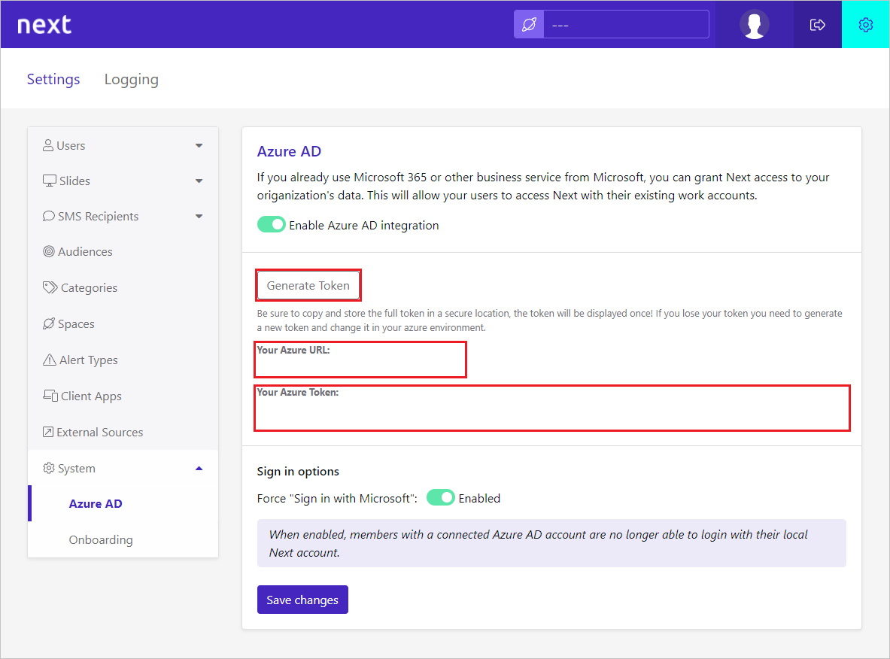

# Configure Netpresenter Next for automatic user provisioning with Microsoft Entra ID

This article describes the steps you need to perform in both Netpresenter Next and Microsoft Entra ID to configure automatic user provisioning. When configured, Microsoft Entra ID automatically provisions and de-provisions users and groups to [Netpresenter Next](https://www.Netpresenter.com/) using the Microsoft Entra provisioning service. For important details on what this service does, how it works, and frequently asked questions, see [Automate user provisioning and deprovisioning to SaaS applications with Microsoft Entra ID](~/identity/app-provisioning/user-provisioning.md).

## Capabilities supported

> [!div class="checklist"]
> * Create users in Netpresenter Next
> * Remove users in Netpresenter Next when they don't require access anymore
> * Keep user attributes synchronized between Microsoft Entra ID and Netpresenter Next.
> * [Single sign-on](~/identity/enterprise-apps/add-application-portal-setup-oidc-sso.md) to Netpresenter Next (recommended).

## Prerequisites

The scenario outlined in this article assumes that you already have the following prerequisites:

* [!INCLUDE [common-prerequisites.md](~/identity/saas-apps/includes/common-prerequisites.md)]
* An administrator account with Netpresenter Next.

## Step 1: Plan your provisioning deployment

1. Learn about [how the provisioning service works](~/identity/app-provisioning/user-provisioning.md).
1. Determine who's in [scope for provisioning](~/identity/app-provisioning/define-conditional-rules-for-provisioning-user-accounts.md).
1. Determine what data to [map between Microsoft Entra ID and Netpresenter Next](~/identity/app-provisioning/customize-application-attributes.md). 

## Step 2: Configure Netpresenter Next to support provisioning with Microsoft Entra ID

1. Sign in to the Netpresenter Next with an administrator account.
1. Select cogwheel icon to go to settings page.
1. In the settings page, select **System** to open the submenu and select **Microsoft Entra ID**.
1. Select the **Generate Token** button.
1. Save the **SCIM Endpoint URL** and **Token** at a secure place, you need it in the **Step 5**.

   

1. **Optional:** Under **Sign in options**, you can enable or disable 'Force sign in with Microsoft'. If enabled, users with a Microsoft Entra account will lose the ability to sign in with their local account.

## Step 3: Add Netpresenter Next from the Microsoft Entra application gallery

Add Netpresenter Next from the Microsoft Entra application gallery to start managing provisioning to Netpresenter Next. If you have previously setup Netpresenter Next for SSO, you can use the same application. However it's recommended that you create a separate app when testing out the integration initially. Learn more about adding an application from the gallery [here](~/identity/enterprise-apps/add-application-portal.md).

## Step 4: Define who is in scope for provisioning

[!INCLUDE [create-assign-users-provisioning.md](~/identity/saas-apps/includes/create-assign-users-provisioning.md)]

## Step 5: Configure automatic user provisioning to Netpresenter Next 

This section guides you through the steps to configure the Microsoft Entra provisioning service to create, update, and disable users and/or groups in TestApp based on user and/or group assignments in Microsoft Entra ID.

### To configure automatic user provisioning for Netpresenter Next in Microsoft Entra ID:

1. Sign in to the [Microsoft Entra admin center](https://entra.microsoft.com) as at least a [Cloud Application Administrator](~/identity/role-based-access-control/permissions-reference.md#cloud-application-administrator).
1. Browse to **Entra ID** > **Enterprise apps**

1. In the applications list, select **Netpresenter Next**.

1. Select the **Provisioning** tab.

1. Select **+ New configuration**.

	

1. In the **Tenant URL** field, enter your Netpresenter Next Tenant URL and Secret Token. Select **Test Connection** to ensure Microsoft Entra ID can connect to Netpresenter Next. If the connection fails, ensure your Netpresenter Next account has the required admin permissions and try again.

	

1. Select **Create** to create your configuration.

1. Select **Properties** on the **Overview** page.

1. In the **Notification Email** field, enter the email address of a person who should receive the provisioning error notifications and select the **Send an email notification when a failure occurs** check box.

   

1. Select **Attribute Mapping** in the left panel and select **users**.

1. Review the user attributes that are synchronized from Microsoft Entra ID to Netpresenter Next in the **Attribute-Mapping** section. The attributes selected as **Matching** properties are used to match the user accounts in Netpresenter Next for update operations. If you choose to change the [matching target attribute](~/identity/app-provisioning/customize-application-attributes.md), you need to ensure that the Netpresenter Next API supports filtering users based on that attribute. Select the **Save** button to commit any changes.

    |Attribute|Type|Supported for filtering|Required by Netpresenter Next
    |---|---|---|---|
    |userName|String|&check;|&check;
    |externalId|String|&check;|&check;
    |emails[type eq "work"].value|String|&check;|&check;
    |active|Boolean||
    |name.givenName|String||
    |name.familyName|String||
    |phoneNumbers[type eq "work"].value|String||
    |phoneNumbers[type eq "mobile"].value|String||

1. To configure scoping filters, refer to the instructions provided in the [Scoping filter article](~/identity/app-provisioning/define-conditional-rules-for-provisioning-user-accounts.md).

1. Use [on-demand provisioning](~/identity/app-provisioning/provision-on-demand.md) to validate sync with a small number of users before deploying more broadly in your organization.

1. When you're ready to provision, select **Start Provisioning** from the **Overview** page.

## Step 6: Monitor your deployment

[!INCLUDE [monitor-deployment.md](~/identity/saas-apps/includes/monitor-deployment.md)]

## Additional resources

* [Managing user account provisioning for Enterprise Apps](~/identity/app-provisioning/configure-automatic-user-provisioning-portal.md)
* [What is application access and single sign-on with Microsoft Entra ID?](~/identity/enterprise-apps/what-is-single-sign-on.md)

## Related content

* [Learn how to review logs and get reports on provisioning activity](~/identity/app-provisioning/check-status-user-account-provisioning.md)
