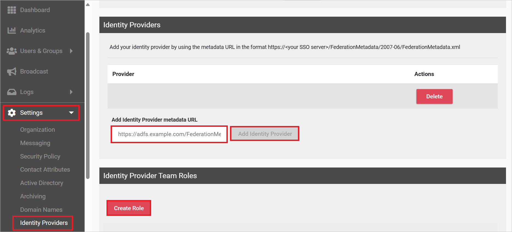
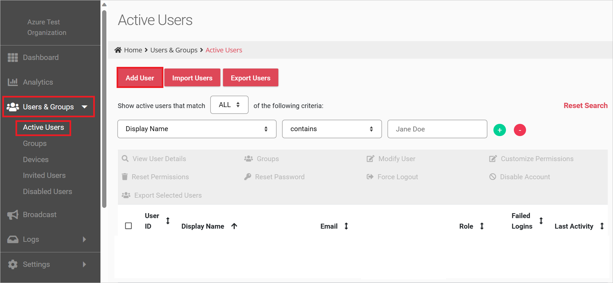
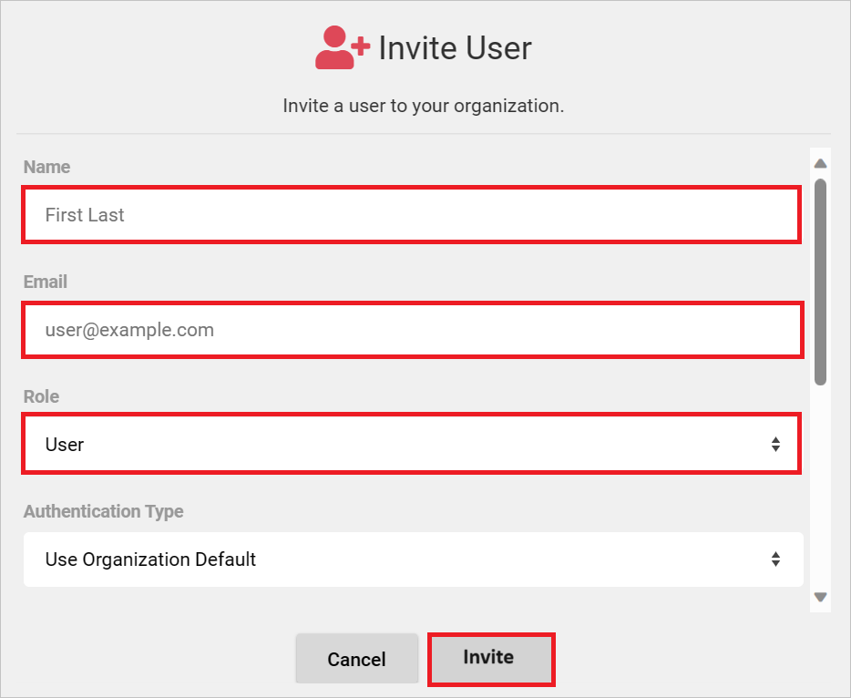

# Configure NetSfere for Single sign-on with Microsoft Entra ID

In this article,  you learn how to integrate NetSfere with Microsoft Entra ID. When you integrate NetSfere with Microsoft Entra ID, you can:

* Control in Microsoft Entra ID who has access to NetSfere.
* Enable your users to be automatically signed-in to NetSfere with their Microsoft Entra accounts.
* Manage your accounts in one central location.

## Prerequisites
The scenario outlined in this article assumes that you already have the following prerequisites:

[!INCLUDE [common-prerequisites.md](~/identity/saas-apps/includes/common-prerequisites.md)]
* NetSfere single sign-on (SSO) enabled subscription.

## Scenario description

In this article,  you configure and test Microsoft Entra SSO in a test environment.

* NetSfere supports **SP and IDP** initiated SSO.

## Add NetSfere from the gallery

To configure the integration of NetSfere into Microsoft Entra ID, you need to add NetSfere from the gallery to your list of managed SaaS apps.

1. Sign in to the [Microsoft Entra admin center](https://entra.microsoft.com) as at least a [Cloud Application Administrator](~/identity/role-based-access-control/permissions-reference.md#cloud-application-administrator).
1. Browse to **Entra ID** > **Enterprise apps** > **New application**.
1. In the **Add from the gallery** section, type **NetSfere** in the search box.
1. Select **NetSfere** from results panel and then add the app. Wait a few seconds while the app is added to your tenant.

Alternatively, you can also use the [Enterprise App Configuration Wizard](https://portal.office.com/AdminPortal/home?Q=Docs#/azureadappintegration). In this wizard, you can add an application to your tenant, add users/groups to the app, assign roles, and walk through the SSO configuration as well. [Learn more about Microsoft 365 wizards.](/microsoft-365/admin/misc/azure-ad-setup-guides)

## Configure and test Microsoft Entra SSO for NetSfere

Configure and test Microsoft Entra SSO with NetSfere using a test user called **B.Simon**. For SSO to work, you need to establish a link relationship between a Microsoft Entra user and the related user in NetSfere.

To configure and test Microsoft Entra SSO with NetSfere, perform the following steps:

1. **[Configure Microsoft Entra SSO](#configure-microsoft-entra-sso)** - to enable your users to use this feature.
    1. **Create a Microsoft Entra test user** - to test Microsoft Entra single sign-on with B.Simon.
    1. **Assign the Microsoft Entra test user** - to enable B.Simon to use Microsoft Entra single sign-on.
1. **[Configure NetSfere SSO](#configure-netsfere-sso)** - to configure the single sign-on settings on application side.
    1. **[Create NetSfere test user](#create-netsfere-test-user)** - to have a counterpart of B.Simon in NetSfere that's linked to the Microsoft Entra representation of user.
1. **[Test SSO](#test-sso)** - to verify whether the configuration works.

## Configure Microsoft Entra SSO

Follow these steps to enable Microsoft Entra SSO in the Microsoft Entra admin center.

1. Sign in to the [Microsoft Entra admin center](https://entra.microsoft.com) as at least a [Cloud Application Administrator](~/identity/role-based-access-control/permissions-reference.md#cloud-application-administrator).
1. Browse to **Entra ID** > **Enterprise apps** > **NetSfere** > **Single sign-on**.
1. On the **Select a single sign-on method** page, select **SAML**.
1. On the **Set up single sign-on with SAML** page, select the pencil icon for **Basic SAML Configuration** to edit the settings.

   

1. On the **Basic SAML Configuration** section, perform the following steps:

    a. In the **Identifier** text box, type a URL using one of the following patterns:

    |**Identifier**|
    |--------------|
    |`spn:<NetSfere_ID>`|
    |`https://<SUBDOMAIN>.netsfere.com/saml/module.php/saml/sp/metadata.php/default-sp`|
    |`https://<SUBDOMAIN>.netsferetest.com/saml/module.php/saml/sp/metadata.php/default-sp`|
    |`https://<SUBDOMAIN>.netsferedev.com/saml/module.php/saml/sp/metadata.php/default-sp`|

    b. In the **Reply URL** text box, type a URL using one of the following patterns:

    |**Reply URL**|
    |--------------|
    |`https://<SUBDOMAIN>.netsfere.com/saml/module.php/saml/sp/saml2-acs.php/default-sp`|
    |`https://<SUBDOMAIN>.netsferetest.com/saml/module.php/saml/sp/saml2-acs.php/default-sp`|
    |`https://<SUBDOMAIN>.netsferedev.com/saml/module.php/saml/sp/saml2-acs.php/default-sp`|

1. Perform the following step, if you wish to configure the application in **SP** initiated mode:

    In the **Sign-on URL** text box, type a URL using one of the following patterns:

    |**Sign on URL**|
    |---------------|
    |`https://<SUBDOMAIN>.netsfere.com`|
    |`https://<SUBDOMAIN>.netsferetest.com`|
    |`https://<SUBDOMAIN>.netsferedev.com`|

	> [!NOTE]
	> These value aren't real. Update these values with the actual Identifier, Reply URL and Sign on URL. Contact [NetSfere support team](mailto:support@netsfere.com) to get these values. You can also refer to the patterns shown in the **Basic SAML Configuration** section in the Microsoft Entra admin center.

1. NetSfere application expects the SAML assertions in a specific format, which requires you to add custom attribute mappings to your SAML token attributes configuration. The following screenshot shows the list of default attributes.

	

1. In addition to above, NetSfere application expects few more attributes to be passed back in SAML response which are shown below. These attributes are also pre populated but you can review them as per your requirements.
	
	| Name |   Source Attribute|
	| ---- | --------- |
	| role | user.assignedroles |

    > [!NOTE]
    > Please select [here](~/identity-platform/howto-add-app-roles-in-apps.md#app-roles-ui) to know how to configure Role in Microsoft Entra ID.

1. On the **Set up single sign-on with SAML** page, in the **SAML Signing Certificate** section, select copy button to copy **App Federation Metadata Url** and save it on your computer.

	

[!INCLUDE [create-assign-users-sso.md](~/identity/saas-apps/includes/create-assign-users-sso.md)]

## Configure NetSfere SSO

1. Log in to NetSfere company site as an administrator.

1. Go to **Settings (gear icon)** > **Identity Providers**.

    

1. In the **Add Identity Provider metadata URL** textbox, paste the **App Federation Metadata Url**, which you have copied from the Microsoft Admin Center.

1. Select **Add Identity Provider**.

### Create NetSfere test user

1. In a different web browser window, sign into NetSfere website as an administrator.

1. Navigate to **Users & Groups** > **Active Users** and select **Add Users**.

    

1. In the **Invite User** section, perform the following steps:

    

    1. In the **Name** textbox, enter a valid name of the user.

    1. In the **Email** textbox, enter a valid email address of the user.

    1. Select the **Role** for the user according to your organization requirement.

    1. Select **Invite**.

## Test SSO 

In this section, you test your Microsoft Entra single sign-on configuration with following options.
 
#### SP initiated:
 
* Select **Test this application** in Microsoft Entra admin center. this option redirects to NetSfere Sign on URL where you can initiate the login flow.  
 
* Go to NetSfere Sign-on URL directly and initiate the login flow from there.
 
#### IDP initiated:
 
* Select **Test this application** in Microsoft Entra admin center and you should be automatically signed in to the NetSfere for which you set up the SSO.
 
You can also use Microsoft My Apps to test the application in any mode. When you select the NetSfere tile in the My Apps, if configured in SP mode you would be redirected to the application sign-on page for initiating the login flow and if configured in IDP mode, you should be automatically signed in to the NetSfere for which you set up the SSO. For more information about the My Apps, see [Introduction to the My Apps](https://support.microsoft.com/account-billing/sign-in-and-start-apps-from-the-my-apps-portal-2f3b1bae-0e5a-4a86-a33e-876fbd2a4510).

## Related content

Once you configure NetSfere you can enforce session control, which protects exfiltration and infiltration of your organization's sensitive data in real time. Session control extends from Conditional Access. [Learn how to enforce session control with Microsoft Defender for Cloud Apps](/cloud-app-security/proxy-deployment-any-app).
