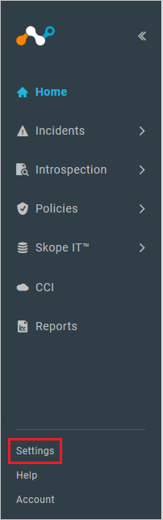
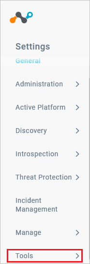
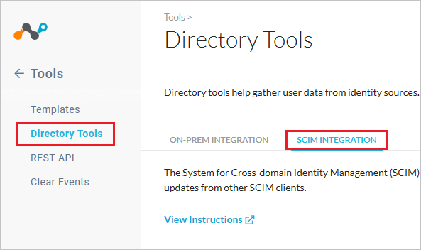
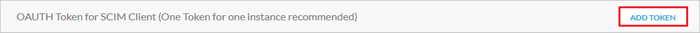
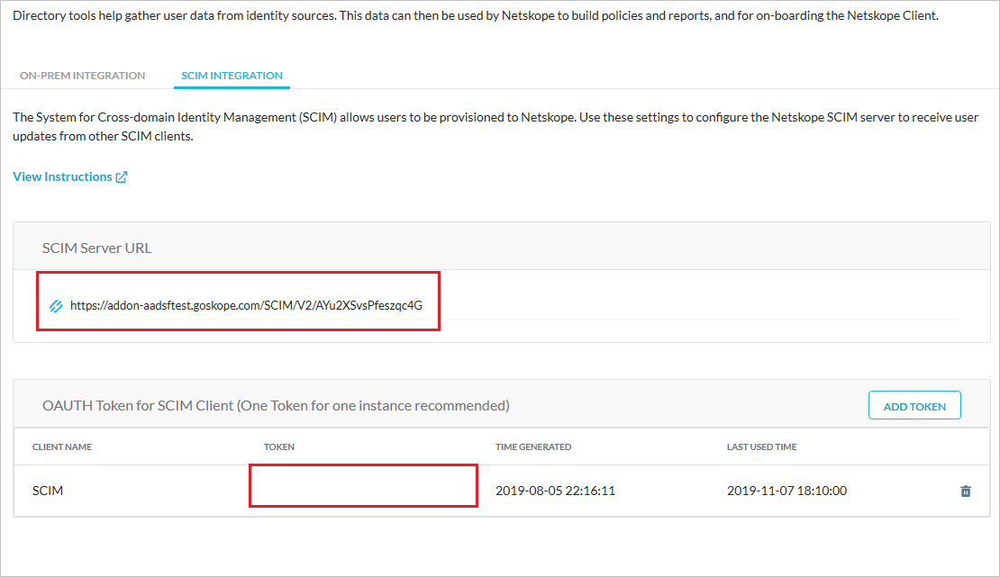
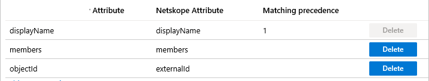

# Configure Netskope User Authentication for automatic user provisioning with Microsoft Entra ID

The objective of this article is to demonstrate the steps to be performed in Netskope User Authentication and Microsoft Entra ID to configure Microsoft Entra ID to automatically provision and de-provision users and/or groups to Netskope User Authentication.

> [!NOTE]
> This article describes a connector built on top of the Microsoft Entra user provisioning service. For important details on what this service does, how it works, and frequently asked questions, see [Automate user provisioning and deprovisioning to SaaS applications with Microsoft Entra ID](~/identity/app-provisioning/user-provisioning.md).
>

## Prerequisites

The scenario outlined in this article assumes that you already have the following prerequisites:

[!INCLUDE [common-prerequisites.md](~/identity/saas-apps/includes/common-prerequisites.md)]
* [A Netskope User Authentication tenant](https://www.netskope.com/)
* A user account in Netskope User Authentication with Admin permissions.

## Assigning users to Netskope User Authentication

Microsoft Entra ID uses a concept called *assignments* to determine which users should receive access to selected apps. In the context of automatic user provisioning, only the users and/or groups that have been assigned to an application in Microsoft Entra ID are synchronized.

Before configuring and enabling automatic user provisioning, you should decide which users and/or groups in Microsoft Entra ID need access to Netskope User Authentication. Once decided, you can assign these users and/or groups to Netskope User Authentication by following the instructions here:
* [Assign a user or group to an enterprise app](~/identity/enterprise-apps/assign-user-or-group-access-portal.md)

## Important tips for assigning users to Netskope User Authentication

* It's recommended that a single Microsoft Entra user is assigned to Netskope User Authentication to test the automatic user provisioning configuration. Additional users and/or groups may be assigned later.

* When assigning a user to Netskope User Authentication, you must select any valid application-specific role (if available) in the assignment dialog. Users with the **Default Access** role are excluded from provisioning.

## Set up Netskope User Authentication for provisioning

1. Sign in to your [Netskope User Authentication Admin Console](https://netskope.goskope.com/). Navigate to **Home > Settings**.

	

2.	Navigate to **Tools**. Under the **Tools** menu navigate to **Directory Tools > SCIM INTEGRATION**.

	

	

3. Scroll down and select **Add Token** button. In the **Add OAuth Client Name** dialog box provide a **CLIENT NAME** and select the **Save** button.

	

	

3.	Copy the **SCIM Server URL** and the **TOKEN**. These values are entered in the Tenant URL and Secret Token fields respectively in the Provisioning tab of your Netskope User Authentication application.

	

## Add Netskope User Authentication from the gallery

Before configuring Netskope User Authentication for automatic user provisioning with Microsoft Entra ID, you need to add Netskope User Authentication from the Microsoft Entra application gallery to your list of managed SaaS applications.

**To add Netskope User Authentication from the Microsoft Entra application gallery, perform the following steps:**

1. Sign in to the [Microsoft Entra admin center](https://entra.microsoft.com) as at least a [Cloud Application Administrator](~/identity/role-based-access-control/permissions-reference.md#cloud-application-administrator).
1. Browse to **Entra ID** > **Enterprise apps** > **New application**.
1. In the **Add from the gallery** section, type **Netskope User Authentication**, select **Netskope User Authentication** in the search box.
1. Select **Netskope User Authentication** from results panel and then add the app. Wait a few seconds while the app is added to your tenant.
	

## Configuring automatic user provisioning to Netskope User Authentication 

This section guides you through the steps to configure the Microsoft Entra provisioning service to create, update, and disable users and/or groups in Netskope User Authentication based on user and/or group assignments in Microsoft Entra ID.

> [!TIP]
> You may also choose to enable SAML-based single sign-on for Netskope User Authentication by following the instructions provided in the [Netskope User Authentication Single sign-on  article](./netskope-cloud-security-tutorial.md). Single sign-on can be configured independently of automatic user provisioning, although these two features complement each other.

> [!NOTE]
> To learn more about Netskope User Authentication's SCIM endpoint, refer [this](https://docs.google.com/document/d/1n9P_TL98_kd1sx5PAvZL2HS6MQAqkQqd-OSkWAAU6ck/edit#heading=h.prxq74iwdpon).

### To configure automatic user provisioning for Netskope User Authentication in Microsoft Entra ID:

1. Sign in to the [Microsoft Entra admin center](https://entra.microsoft.com) as at least a [Cloud Application Administrator](~/identity/role-based-access-control/permissions-reference.md#cloud-application-administrator).
1. Browse to **Entra ID** > **Enterprise apps**

	

1. In the applications list, select **Netskope User Authentication**.

	

3. Select the **Provisioning** tab.

	

4. Set the **Provisioning Mode** to **Automatic**.

	

5. Under the **Admin Credentials** section, input **SCIM Server URL** value retrieved earlier in **Tenant URL**. Input the **TOKEN** value retrieved earlier in **Secret Token**. Select **Test Connection** to ensure Microsoft Entra ID can connect to Netskope User Authentication. If the connection fails, ensure your Netskope User Authentication account has Admin permissions and try again.

	

6. In the **Notification Email** field, enter the email address of a person or group who should receive the provisioning error notifications and check the checkbox - **Send an email notification when a failure occurs**.

	

7. Select **Save**.

8. Under the **Mappings** section, select **Synchronize Microsoft Entra users to Netskope User Authentication**.

9. Review the user attributes that are synchronized from Microsoft Entra ID to Netskope User Authentication in the **Attribute Mapping** section. The attributes selected as **Matching** properties are used to match the user accounts in Netskope User Authentication for update operations. Select the **Save** button to commit any changes.

	

10. Under the **Mappings** section, select **Synchronize Microsoft Entra groups to Netskope User Authentication**.

11. Review the group attributes that are synchronized from Microsoft Entra ID to Netskope User Authentication in the **Attribute Mapping** section. The attributes selected as **Matching** properties are used to match the groups in Netskope User Authentication for update operations. Select the **Save** button to commit any changes.

	

12. To configure scoping filters, refer to the following instructions provided in the [Scoping filter  article](~/identity/app-provisioning/define-conditional-rules-for-provisioning-user-accounts.md).

13. To enable the Microsoft Entra provisioning service for Netskope User Authentication, change the **Provisioning Status** to **On** in the **Settings** section.

	

14. Define the users and/or groups that you would like to provision to Netskope User Authentication by choosing the desired values in **Scope** in the **Settings** section.

	

15. When you're ready to provision, select **Save**.

	

This operation starts the initial synchronization of all users and/or groups defined in **Scope** in the **Settings** section. The initial sync takes longer to perform than subsequent syncs, which occur approximately every 40 minutes as long as the Microsoft Entra provisioning service is running. You can use the **Synchronization Details** section to monitor progress and follow links to provisioning activity report, which describes all actions performed by the Microsoft Entra provisioning service on Netskope User Authentication.

For more information on how to read the Microsoft Entra provisioning logs, see [Reporting on automatic user account provisioning](~/identity/app-provisioning/check-status-user-account-provisioning.md).

## Additional resources

* [Managing user account provisioning for Enterprise Apps](~/identity/app-provisioning/configure-automatic-user-provisioning-portal.md)
* [What is application access and single sign-on with Microsoft Entra ID?](~/identity/enterprise-apps/what-is-single-sign-on.md)

## Related content

* [Learn how to review logs and get reports on provisioning activity](~/identity/app-provisioning/check-status-user-account-provisioning.md)
