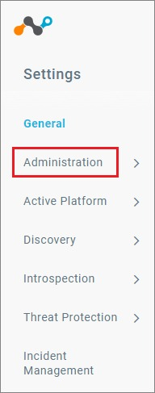
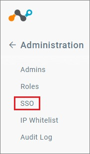
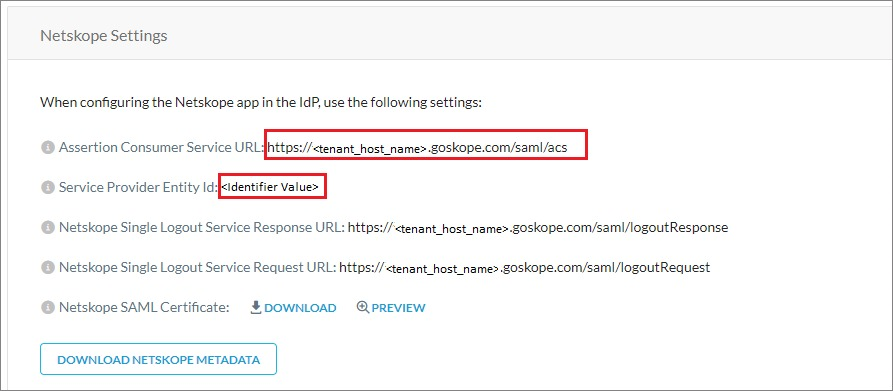
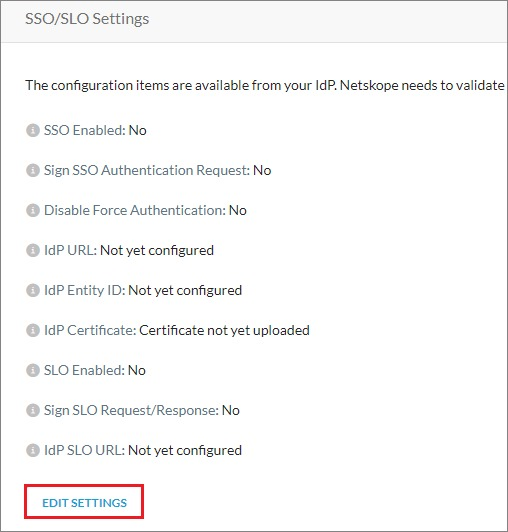
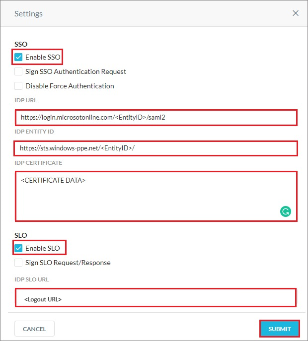

# Configure Netskope Administrator Console for Single sign-on with Microsoft Entra ID

In this article,  you learn how to integrate Netskope Administrator Console with Microsoft Entra ID. When you integrate Netskope Administrator Console with Microsoft Entra ID, you can:

* Control in Microsoft Entra ID who has access to Netskope Administrator Console.
* Enable your users to be automatically signed-in to Netskope Administrator Console with their Microsoft Entra accounts.
* Manage your accounts in one central location.

## Prerequisites
The scenario outlined in this article assumes that you already have the following prerequisites:

[!INCLUDE [common-prerequisites.md](~/identity/saas-apps/includes/common-prerequisites.md)]
* Netskope Administrator Console single sign-on (SSO) enabled subscription.

## Scenario description

In this article,  you configure and test Microsoft Entra SSO in a test environment.

* Netskope Administrator Console supports **SP and IDP** initiated SSO.

* Netskope Administrator Console supports just-in-time user provisioning.

> [!NOTE]
> Identifier of this application is a fixed string value so only one instance can be configured in one tenant.

## Add Netskope Administrator Console from the gallery

To configure the integration of Netskope Administrator Console into Microsoft Entra ID, you need to add Netskope Administrator Console from the gallery to your list of managed SaaS apps.

1. Sign in to the [Microsoft Entra admin center](https://entra.microsoft.com) as at least a [Cloud Application Administrator](~/identity/role-based-access-control/permissions-reference.md#cloud-application-administrator).
1. Browse to **Entra ID** > **Enterprise apps** > **New application**.
1. In the **Add from the gallery** section, type **Netskope Administrator Console** in the search box.
1. Select **Netskope Administrator Console** from results panel and then add the app. Wait a few seconds while the app is added to your tenant.

 Alternatively, you can also use the [Enterprise App Configuration Wizard](https://portal.office.com/AdminPortal/home?Q=Docs#/azureadappintegration). In this wizard, you can add an application to your tenant, add users/groups to the app, assign roles, and walk through the SSO configuration as well. [Learn more about Microsoft 365 wizards.](/microsoft-365/admin/misc/azure-ad-setup-guides)

## Configure and test Microsoft Entra SSO for Netskope Administrator Console

Configure and test Microsoft Entra SSO with Netskope Administrator Console using a test user called **B.Simon**. For SSO to work, you need to establish a link relationship between a Microsoft Entra user and the related user in Netskope Administrator Console.

To configure and test Microsoft Entra SSO with Netskope Administrator Console, perform the following steps:

1. **[Configure Microsoft Entra SSO](#configure-azure-ad-sso)** - to enable your users to use this feature.
   1. **Create a Microsoft Entra test user** - to test Microsoft Entra single sign-on with B.Simon.
   1. **Assign the Microsoft Entra test user** - to enable B.Simon to use Microsoft Entra single sign-on.
1. **[Configure Netskope Administrator Console SSO](#configure-netskope-administrator-console-sso)** - to configure the single sign-on settings on application side.
   1. **[Create Netskope Administrator Console test user](#create-netskope-administrator-console-test-user)** - to have a counterpart of B.Simon in Netskope Administrator Console that's linked to the Microsoft Entra representation of user.
1. **[Test SSO](#test-sso)** - to verify whether the configuration works.

## Configure Microsoft Entra SSO

Follow these steps to enable Microsoft Entra SSO.

1. Sign in to the [Microsoft Entra admin center](https://entra.microsoft.com) as at least a [Cloud Application Administrator](~/identity/role-based-access-control/permissions-reference.md#cloud-application-administrator).
1. Browse to **Entra ID** > **Enterprise apps** > **Netskope Administrator Console** > **Single sign-on**.
1. On the **Select a single sign-on method** page, select **SAML**.
1. On the **Set up single sign-on with SAML** page, select the pencil icon for **Basic SAML Configuration** to edit the settings.

   

1. On the **Basic SAML Configuration** section, if you wish to configure the application in **IDP** initiated mode, perform the following step:

   In the **Reply URL** text box, type a URL using the following pattern:
   `https://<tenant_host_name>/saml/acs`

   > [!NOTE]
   > The value isn't real. Update the value with the actual Reply URL. You get the value explained later in the article.

1. Select **Set additional URLs** and perform the following step if you wish to configure the application in **SP** initiated mode:

   In the **Sign-on URL** text box, type a URL using the following pattern:
   `https://<tenantname>.goskope.com`

   > [!NOTE]
   > The Sign-on URL values isn't real. Update Sign-on URL value with the actual Sign-on URL. Contact [Netskope Administrator Console Client support team](mailto:support@netskope.com) to get Sign-on URL value. You can also refer to the patterns shown in the **Basic SAML Configuration** section.

1. Netskope Administrator Console application expects the SAML assertions in a specific format, which requires you to add custom attribute mappings to your SAML token attributes configuration. The following screenshot shows the list of default attributes.

   

1. In addition to above, Netskope Administrator Console application expects few more attributes to be passed back in SAML response which are shown below. These attributes are also pre populated but you can review them as per your requirements.

   | Name       | Source Attribute   |
   | ---------- | ------------------ |
   | admin-role | user.assignedroles |

   > [!NOTE]
   > Select [here](~/identity-platform/howto-add-app-roles-in-apps.md#app-roles-ui) to know how to create roles in Microsoft Entra ID.

1. On the **Set up single sign-on with SAML** page, in the **SAML Signing Certificate** section, find **Certificate (Base64)** and select **Download** to download the certificate and save it on your computer.

   

1. On the **Set up Netskope Administrator Console** section, copy the appropriate URL(s) based on your requirement.

   

[!INCLUDE [create-assign-users-sso.md](~/identity/saas-apps/includes/create-assign-users-sso.md)]

## Configure Netskope Administrator Console SSO

1. Open a new tab in your browser, and sign in to your Netskope Administrator Console company site as an administrator.

1. Select the **Settings** tab from the left navigation pane.

   

1. Select **Administration** tab.

   

1. Select **SSO** tab.

   

1. On the **Network Settings** section, perform the following steps:

   

   a. Copy **Assertion Consumer Service URL** value and paste it into the **Reply URL** textbox in the **Basic SAML Configuration** section.

   b. Copy **Service Provider Entity ID** value and paste it into the **Identifier** textbox in the **Basic SAML Configuration** section.

1. Select the **EDIT SETTINGS** under the **SSO/SLO Settings** section.

   

1. On the **Settings** pop-up window, perform the following steps;

   

   a. Select **Enable SSO**.

   b. In the **IDP URL** textbox, paste the **Login URL** value, which you copied previously.

   c. In the **IDP ENTITY ID** textbox, paste the **Microsoft Entra Identifier** value, which you copied previously.

   d. Open your downloaded Base64 encoded certificate in notepad, copy the content of it into your clipboard, and then paste it to the **IDP CERTIFICATE** textbox.

   e. Select **Enable SSO**.

   f. In the **IDP SLO URL** textbox, paste the **Logout URL** value, which you copied previously.

   g. Select **SUBMIT**.

### Create Netskope Administrator Console test user

In this section, a user called B.Simon is created in Netskope Administrator Console. Netskope Administrator Console supports just-in-time user provisioning, which is enabled by default. There's no action item for you in this section. If a user doesn't already exist in Netskope Administrator Console, a new one is created after authentication.

## Test SSO

In this section, you test your Microsoft Entra single sign-on configuration with following options. 

#### SP initiated:

* Select **Test this application**, this option redirects to Netskope Administrator Console Sign on URL where you can initiate the login flow.  

* Go to Netskope Administrator Console Sign-on URL directly and initiate the login flow from there.

#### IDP initiated:

* Select **Test this application**, and you should be automatically signed in to the Netskope Administrator Console for which you set up the SSO. 

You can also use Microsoft My Apps to test the application in any mode. When you select the Netskope Administrator Console tile in the My Apps, if configured in SP mode you would be redirected to the application sign on page for initiating the login flow and if configured in IDP mode, you should be automatically signed in to the Netskope Administrator Console for which you set up the SSO. For more information, see [Microsoft Entra My Apps](/azure/active-directory/manage-apps/end-user-experiences#azure-ad-my-apps).

## Related content

Once you configure Netskope Administrator Console you can enforce session control, which protects exfiltration and infiltration of your organization’s sensitive data in real time. Session control extends from Conditional Access. [Learn how to enforce session control with Microsoft Defender for Cloud Apps](/cloud-app-security/proxy-deployment-any-app).
