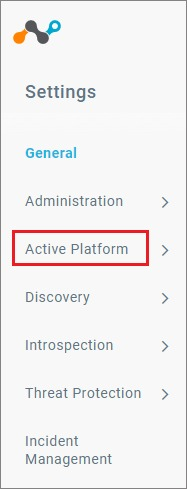
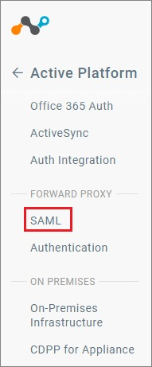
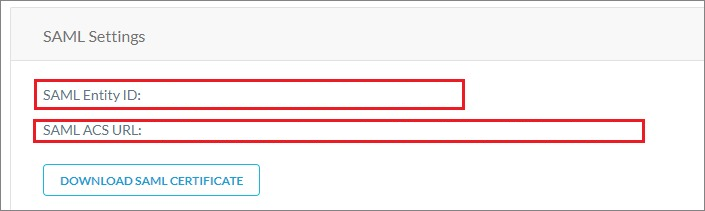
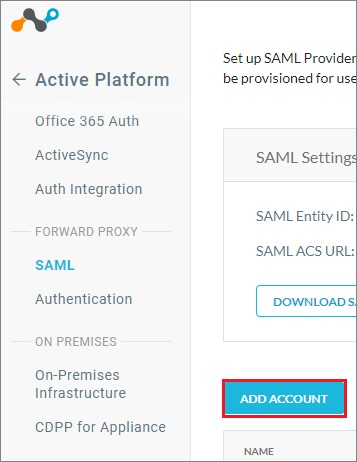
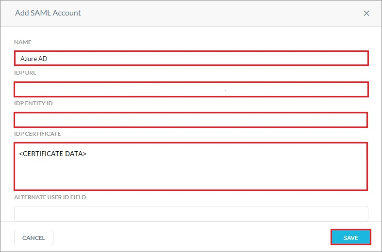
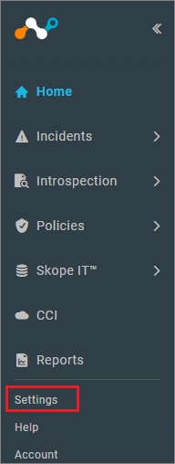
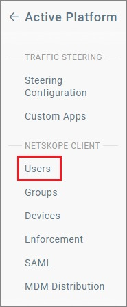
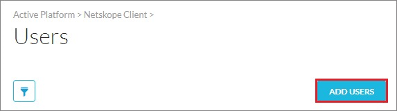
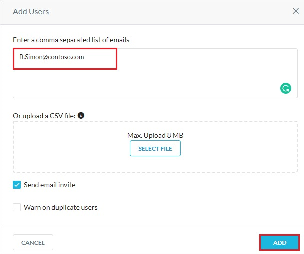

# Configure Netskope User Authentication for Single sign-on with Microsoft Entra ID

In this article,  you learn how to integrate Netskope User Authentication with Microsoft Entra ID. When you integrate Netskope User Authentication with Microsoft Entra ID, you can:

* Control in Microsoft Entra ID who has access to Netskope User Authentication.
* Enable your users to be automatically signed-in to Netskope User Authentication with their Microsoft Entra accounts.
* Manage your accounts in one central location.

## Prerequisites
The scenario outlined in this article assumes that you already have the following prerequisites:

[!INCLUDE [common-prerequisites.md](~/identity/saas-apps/includes/common-prerequisites.md)]
* Netskope User Authentication single sign-on (SSO) enabled subscription.

## Scenario description

In this article,  you configure and test Microsoft Entra SSO in a test environment.

* Netskope User Authentication supports **SP and IDP** initiated SSO.

## Add Netskope User Authentication from the gallery

To configure the integration of Netskope User Authentication into Microsoft Entra ID, you need to add Netskope User Authentication from the gallery to your list of managed SaaS apps.

1. Sign in to the [Microsoft Entra admin center](https://entra.microsoft.com) as at least a [Cloud Application Administrator](~/identity/role-based-access-control/permissions-reference.md#cloud-application-administrator).
1. Browse to **Entra ID** > **Enterprise apps** > **New application**.
1. In the **Add from the gallery** section, type **Netskope User Authentication** in the search box.
1. Select **Netskope User Authentication** from results panel and then add the app. Wait a few seconds while the app is added to your tenant.

 Alternatively, you can also use the [Enterprise App Configuration Wizard](https://portal.office.com/AdminPortal/home?Q=Docs#/azureadappintegration). In this wizard, you can add an application to your tenant, add users/groups to the app, assign roles, and walk through the SSO configuration as well. [Learn more about Microsoft 365 wizards.](/microsoft-365/admin/misc/azure-ad-setup-guides)

## Configure and test Microsoft Entra SSO for Netskope User Authentication

Configure and test Microsoft Entra SSO with Netskope User Authentication using a test user called **B.Simon**. For SSO to work, you need to establish a link relationship between a Microsoft Entra user and the related user in Netskope User Authentication.

To configure and test Microsoft Entra SSO with Netskope User Authentication, complete the following building blocks:

1. **[Configure Microsoft Entra SSO](#configure-azure-ad-sso)** - to enable your users to use this feature.
    1. **Create a Microsoft Entra test user** - to test Microsoft Entra single sign-on with B.Simon.
    1. **Assign the Microsoft Entra test user** - to enable B.Simon to use Microsoft Entra single sign-on.
1. **[Configure Netskope User Authentication SSO](#configure-netskope-user-authentication-sso)** - to configure the single sign-on settings on application side.
    1. **[Create Netskope User Authentication test user](#create-netskope-user-authentication-test-user)** - to have a counterpart of B.Simon in Netskope User Authentication that's linked to the Microsoft Entra representation of user.
1. **[Test SSO](#test-sso)** - to verify whether the configuration works.

## Configure Microsoft Entra SSO

Follow these steps to enable Microsoft Entra SSO.

1. Sign in to the [Microsoft Entra admin center](https://entra.microsoft.com) as at least a [Cloud Application Administrator](~/identity/role-based-access-control/permissions-reference.md#cloud-application-administrator).
1. Browse to **Entra ID** > **Enterprise apps** > **Netskope User Authentication** > **Single sign-on**.
1. On the **Select a single sign-on method** page, select **SAML**.
1. On the **Set up single sign-on with SAML** page, select the pencil icon for **Basic SAML Configuration** to edit the settings.

   

1. On the **Basic SAML Configuration** section, if you wish to configure the application in **IDP** initiated mode, enter the values for the following fields:

    a. In the **Identifier** text box, type a URL using the following pattern:
    `https://<tenantname>.goskope.com/<customer entered string>`

    b. In the **Reply URL** text box, type a URL using the following pattern:
    `https://<tenantname>.goskope.com/nsauth/saml2/http-post/<customer entered string>`

    > [!NOTE]
	> These values aren't real. Update these values with the actual Identifier and Reply URL. You get these values explained later in the article.

1. Select **Set additional URLs** and perform the following step if you wish to configure the application in **SP** initiated mode:

    In the **Sign-on URL** text box, type a URL using the following pattern:
    `https://<tenantname>.goskope.com`

	> [!NOTE]
	> The Sign-on URL values isn't real. Update Sign-on URL value with the actual Sign-on URL. Contact [Netskope User Authentication Client support team](mailto:support@netskope.com) to get Sign-on URL value. You can also refer to the patterns shown in the **Basic SAML Configuration** section.

1. On the **Set up Single Sign-On with SAML** page, in the **SAML Signing Certificate** section, select **Download** to download the **Federation Metadata XML** from the given options as per your requirement and save it on your computer.

	

1. On the **Set up Netskope User Authentication** section, copy the appropriate URL(s) based on your requirement.

	

[!INCLUDE [create-assign-users-sso.md](~/identity/saas-apps/includes/create-assign-users-sso.md)]

## Configure Netskope User Authentication SSO

1. Open a new tab in your browser, and sign in to your Netskope User Authentication company site as an administrator.

1. Select **Active Platform** tab.

    

1. Scroll down to **FORWARD PROXY** and select **SAML**.

    

1. On the **SAML Settings** page, perform the following steps:

    

    a. Copy **SAML Entity ID** value and paste it into the **Identifier** textbox in the **Basic SAML Configuration** section.

    b. Copy **SAML ACS URL** value and paste it into the **Reply URL** textbox in the **Basic SAML Configuration** section.

1. Select **ADD ACCOUNT**.

    

1. On the **Add SAML Account** page, perform the following steps:

    

    a. In the **NAME** textbox, provide the name like Microsoft Entra ID.

    b. In the **IDP URL** textbox, paste the **Login URL** value, which you copied previously.

    c. In the **IDP ENTITY ID** textbox, paste the **Microsoft Entra Identifier** value, which you copied previously.

    d. Open your downloaded metadata file in notepad, copy the content of it into your clipboard, and then paste it to the **IDP CERTIFICATE** textbox.

    e. Select **SAVE**.

### Create Netskope User Authentication test user

1. Open a new tab in your browser, and sign in to your Netskope User Authentication company site as an administrator.

1. Select the **Settings** tab from the left navigation pane.

    

1. Select **Active Platform** tab.

    

1. Select **Users** tab.

    

1. Select **ADD USERS**.

    

1. Enter the email address of the user you want to add and select **ADD**.

    

## Test SSO

In this section, you test your Microsoft Entra single sign-on configuration with following options. 

#### SP initiated:

* Select **Test this application**, this option redirects to Netskope User Authentication Sign on URL where you can initiate the login flow.  

* Go to Netskope User Authentication Sign-on URL directly and initiate the login flow from there.

#### IDP initiated:

* Select **Test this application**, and you should be automatically signed in to the Netskope User Authentication for which you set up the SSO. 

You can also use Microsoft My Apps to test the application in any mode. When you select the Netskope User Authentication tile in the My Apps, if configured in SP mode you would be redirected to the application sign on page for initiating the login flow and if configured in IDP mode, you should be automatically signed in to the Netskope User Authentication for which you set up the SSO. For more information about the My Apps, see [Introduction to the My Apps](https://support.microsoft.com/account-billing/sign-in-and-start-apps-from-the-my-apps-portal-2f3b1bae-0e5a-4a86-a33e-876fbd2a4510).

## Related content

Once you configure Netskope User Authentication you can enforce session control, which protects exfiltration and infiltration of your organization’s sensitive data in real time. Session control extends from Conditional Access. [Learn how to enforce session control with Microsoft Defender for Cloud Apps](/cloud-app-security/proxy-deployment-any-app).
