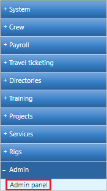
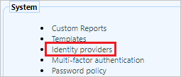
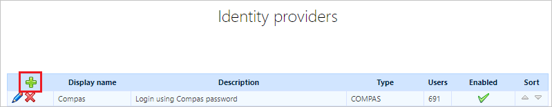
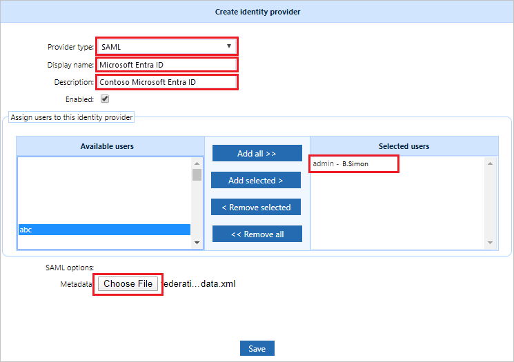
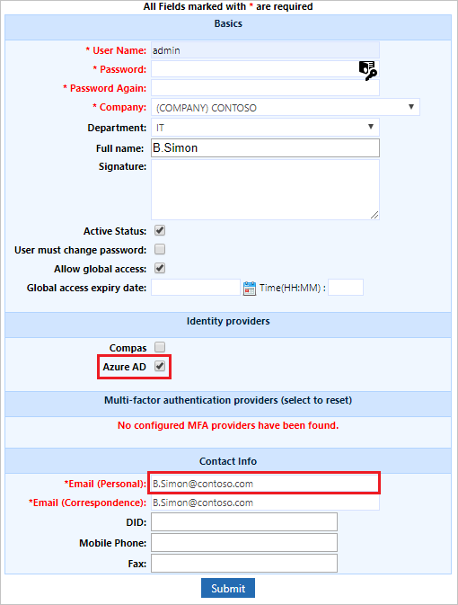
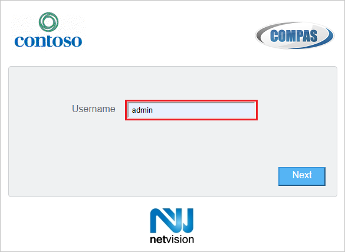

# Configure Netvision Compas for Single sign-on with Microsoft Entra ID

In this article,  you learn how to integrate Netvision Compas with Microsoft Entra ID. When you integrate Netvision Compas with Microsoft Entra ID, you can:

* Control in Microsoft Entra ID who has access to Netvision Compas.
* Enable your users to be automatically signed-in to Netvision Compas with their Microsoft Entra accounts.
* Manage your accounts in one central location.

To learn more about SaaS app integration with Microsoft Entra ID, see [What is application access and single sign-on with Microsoft Entra ID](~/identity/enterprise-apps/what-is-single-sign-on.md).

## Prerequisites
The scenario outlined in this article assumes that you already have the following prerequisites:

[!INCLUDE [common-prerequisites.md](~/identity/saas-apps/includes/common-prerequisites.md)]
* Netvision Compas single sign-on (SSO) enabled subscription.

## Scenario description

In this article,  you configure and test Microsoft Entra SSO in a test environment.

* Netvision Compas supports **SP and IDP** initiated SSO
* Once you configure Netvision Compas you can enforce Session Control, which protects exfiltration and infiltration of your organization's sensitive data in real time. Session Control extends from Conditional Access. [Learn how to enforce session control with Microsoft Defender for Cloud Apps](/cloud-app-security/proxy-deployment-aad).

## Adding Netvision Compas from the gallery

To configure the integration of Netvision Compas into Microsoft Entra ID, you need to add Netvision Compas from the gallery to your list of managed SaaS apps.

1. Sign in to the [Microsoft Entra admin center](https://entra.microsoft.com) as at least a [Cloud Application Administrator](~/identity/role-based-access-control/permissions-reference.md#cloud-application-administrator).
1. Browse to **Entra ID** > **Enterprise apps** > **New application**.
1. In the **Add from the gallery** section, type **Netvision Compas** in the search box.
1. Select **Netvision Compas** from results panel and then add the app. Wait a few seconds while the app is added to your tenant.

 Alternatively, you can also use the [Enterprise App Configuration Wizard](https://portal.office.com/AdminPortal/home?Q=Docs#/azureadappintegration). In this wizard, you can add an application to your tenant, add users/groups to the app, assign roles, and walk through the SSO configuration as well. [Learn more about Microsoft 365 wizards.](/microsoft-365/admin/misc/azure-ad-setup-guides)

## Configure and test Microsoft Entra single sign-on for Netvision Compas

Configure and test Microsoft Entra SSO with Netvision Compas using a test user called **B.Simon**. For SSO to work, you need to establish a link relationship between a Microsoft Entra user and the related user in Netvision Compas.

To configure and test Microsoft Entra SSO with Netvision Compas, complete the following building blocks:

1. **[Configure Microsoft Entra SSO](#configure-azure-ad-sso)** - to enable your users to use this feature.
    1. **Create a Microsoft Entra test user** - to test Microsoft Entra single sign-on with B.Simon.
    1. **Assign the Microsoft Entra test user** - to enable B.Simon to use Microsoft Entra single sign-on.
1. **[Configure Netvision Compas SSO](#configure-netvision-compas-sso)** - to configure the single sign-on settings on application side.
    1. **[Configure Netvision Compas test user](#configure-netvision-compas-test-user)** - to have a counterpart of B.Simon in Netvision Compas that's linked to the Microsoft Entra representation of user.
1. **[Test SSO](#test-sso)** - to verify whether the configuration works.

## Configure Microsoft Entra SSO

Follow these steps to enable Microsoft Entra SSO.

1. Sign in to the [Microsoft Entra admin center](https://entra.microsoft.com) as at least a [Cloud Application Administrator](~/identity/role-based-access-control/permissions-reference.md#cloud-application-administrator).
1. Browse to **Entra ID** > **Enterprise apps** > **Netvision Compas** > **Single sign-on**.
1. On the **Select a single sign-on method** page, select **SAML**.
1. On the **Set up single sign-on with SAML** page, select the edit/pen icon for **Basic SAML Configuration** to edit the settings.

   

1. On the **Basic SAML Configuration** section, if you wish to configure the application in **IDP** initiated mode, enter the values for the following fields:

    a. In the **Identifier** text box, type a URL using the following pattern:
    `https://<TENANT>.compas.cloud/Identity/Saml20`

    b. In the **Reply URL** text box, type a URL using the following pattern:
    `https://<TENANT>.compas.cloud/Identity/Auth/AssertionConsumerService`

1. Select **Set additional URLs** and perform the following step if you wish to configure the application in **SP** initiated mode:

    In the **Sign-on URL** text box, type a URL using the following pattern:
    `https://<TENANT>.compas.cloud/Identity/Auth/AssertionConsumerService`

    > [!NOTE]
    > These values aren't real. Update these values with the actual Identifier, Reply URL and Sign-on URL. Contact [Netvision Compas Client support team](mailto:contact@net.vision) to get these values. You can also refer to the patterns shown in the **Basic SAML Configuration** section.

1. On the **Set up single sign-on with SAML** page, in the **SAML Signing Certificate** section,  find **Federation Metadata XML** and select **Download** to download the metadata file and save it on your computer.

    

[!INCLUDE [create-assign-users-sso.md](~/identity/saas-apps/includes/create-assign-users-sso.md)]

## Configure Netvision Compas SSO

In this section you enable SAML SSO in **Netvision Compas**.
1. Log into **Netvision Compas** using an administrative account and access the administration area.

    

1. Locate the **System** area and select **Identity Providers**.

    

1. Select the **Add** action to register Microsoft Entra ID as a new IDP.

    

1. Select **SAML** for the **Provider type**.
1. Enter meaningful values for the **Display name** and **Description** fields.
1. Assign **Netvision Compas** users to the IDP by selecting from the **Available users** list and then selecting the **Add selected** button. Users can also be assigned to the IDP while following the provisioning procedure.
1. For the **Metadata** SAML option select the **Choose File** button and select the metadata file previously saved on your computer.
1. Select **Save**.

    

### Configure Netvision Compas test user

In this section, you configure an existing user in **Netvision Compas** to use Microsoft Entra ID for SSO.
1. Follow the **Netvision Compas** user provisioning procedure, as defined by your company or edit an existing user account.
1. While defining the user's profile, make sure that the user's **Email (Personal)** address matches the Microsoft Entra username: username@companydomain.extension. For example, `B.Simon@contoso.com`.

    

Users must be created and activated before you use single sign-on.

## Test SSO 

In this section, you test your Microsoft Entra single sign-on configuration.

### Using the Access Panel (IDP initiated).

When you select the Netvision Compas tile in the Access Panel, you should be automatically signed in to the Netvision Compas for which you set up SSO. For more information about the Access Panel, see [Introduction to the Access Panel](https://support.microsoft.com/account-billing/sign-in-and-start-apps-from-the-my-apps-portal-2f3b1bae-0e5a-4a86-a33e-876fbd2a4510).

### Directly accessing Netvision Compas (SP initiated).

1. Access the **Netvision Compas** URL. For example, `https://tenant.compas.cloud`.
1. Enter the **Netvision Compas** username and select **Next**.

    

1. **(optional)** If the user is assigned multiple IDPs within **Netvision Compas**, a list of available IDPs is presented. Select the Microsoft Entra IDP configured previously in **Netvision Compas**.

1. You're redirected to Microsoft Entra ID to perform the authentication. Once you're successfully authenticated, you should be automatically signed in to **Netvision Compas** for which you set up SSO.

## Additional resources

- [List of articles on How to Integrate SaaS Apps with Microsoft Entra ID](./tutorial-list.md)

- [What is application access and single sign-on with Microsoft Entra ID?](~/identity/enterprise-apps/what-is-single-sign-on.md)

- [What is Conditional Access in Microsoft Entra ID?](~/identity/conditional-access/overview.md)

- [What is session control in Microsoft Defender for Cloud Apps?](/cloud-app-security/proxy-intro-aad)
