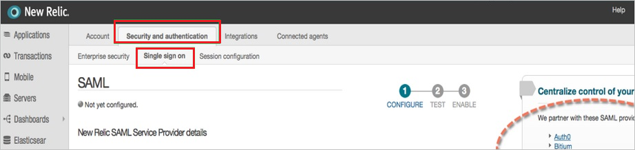

# Configure New Relic by Account for Single sign-on with Microsoft Entra ID

In this article,  you learn how to integrate New Relic by Account with Microsoft Entra ID. When you integrate New Relic by Account with Microsoft Entra ID, you can:

* Control in Microsoft Entra ID who has access to New Relic by Account.
* Enable your users to be automatically signed-in to New Relic by Account with their Microsoft Entra accounts.
* Manage your accounts in one central location.

> [!NOTE]
> This document is only relevant if you're using the [Original User Model](https://docs.newrelic.com/docs/accounts/original-accounts-billing/original-users-roles/overview-user-models/) in New Relic. Please refer to [New Relic (By Organization)](new-relic-limited-release-tutorial.md) if you're using New Relic's newer user model.

## Prerequisites

The scenario outlined in this article assumes that you already have the following prerequisites:

[!INCLUDE [common-prerequisites.md](~/identity/saas-apps/includes/common-prerequisites.md)]
* New Relic by Account single sign-on (SSO) enabled subscription.

## Scenario description

In this article,  you configure and test Microsoft Entra SSO in a test environment.

* New Relic by Account supports **SP** initiated SSO
* New Relic supports [**automated user provisioning and deprovisioning**](new-relic-by-organization-provisioning-tutorial.md) (recommended).

## Add New Relic by Account from the gallery

To configure the integration of New Relic by Account into Microsoft Entra ID, you need to add New Relic by Account from the gallery to your list of managed SaaS apps.

1. Sign in to the [Microsoft Entra admin center](https://entra.microsoft.com) as at least a [Cloud Application Administrator](~/identity/role-based-access-control/permissions-reference.md#cloud-application-administrator).
1. Browse to **Entra ID** > **Enterprise apps** > **New application**.
1. In the **Add from the gallery** section, type **New Relic by Account** in the search box.
1. Select **New Relic by Account** from results panel and then add the app. Wait a few seconds while the app is added to your tenant.

 [!INCLUDE [sso-wizard.md](~/identity/saas-apps/includes/sso-wizard.md)]

## Configure and test Microsoft Entra SSO for New Relic by Account

Configure and test Microsoft Entra SSO with New Relic by Account using a test user called **B.Simon**. For SSO to work, you need to establish a link relationship between a Microsoft Entra user and the related user in New Relic by Account.

To configure and test Microsoft Entra SSO with New Relic by Account, perform the following steps:

1. **[Configure Microsoft Entra SSO](#configure-azure-ad-sso)** - to enable your users to use this feature.
    * **Create a Microsoft Entra test user** - to test Microsoft Entra single sign-on with B.Simon.
    * **Assign the Microsoft Entra test user** - to enable B.Simon to use Microsoft Entra single sign-on.
1. **[Configure New Relic by Account SSO](#configure-new-relic-by-account-sso)** - to configure the single sign-on settings on application side.
    * **[Create New Relic by Account test user](#create-new-relic-by-account-test-user)** - to have a counterpart of B.Simon in New Relic by Account that's linked to the Microsoft Entra representation of user.
1. **[Test SSO](#test-sso)** - to verify whether the configuration works.

## Configure Microsoft Entra SSO

Follow these steps to enable Microsoft Entra SSO.

1. Sign in to the [Microsoft Entra admin center](https://entra.microsoft.com) as at least a [Cloud Application Administrator](~/identity/role-based-access-control/permissions-reference.md#cloud-application-administrator).
1. Browse to **Entra ID** > **Enterprise apps** > **New Relic by Account** > **Single sign-on**.
1. On the **Select a single sign-on method** page, select **SAML**.
1. On the **Set up single sign-on with SAML** page, select the pencil icon for **Basic SAML Configuration** to edit the settings.

   
   
1. On the **Basic SAML Configuration** section, perform the following steps:

	a. In the **Sign on URL** text box, type the URL using the following pattern:

    `https://rpm.newrelic.com:443/accounts/{acc_id}/sso/saml/finalize` - Be sure to substitute `acc_id` with your own Account ID of New Relic by Account.

    b. In the **Identifier (Entity ID)** text box, type the URL:
    `rpm.newrelic.com`

1. On the **Set up Single Sign-On with SAML** page, in the **SAML Signing Certificate** section, select **Download** to download the **Certificate (Base64)** from the given options as per your requirement and save it on your computer.

	

1. On the **Set up New Relic by Account** section, copy the appropriate URL(s) as per your requirement.

	

[!INCLUDE [create-assign-users-sso.md](~/identity/saas-apps/includes/create-assign-users-sso.md)]

## Configure New Relic by Account SSO

1. In a different web browser window, sign on to your **New Relic by Account** company site as administrator.

2. In the menu on the top, select **Account Settings**.
   
    

3. Select the **Security and authentication** tab, and then select the **Single sign on** tab.
   
    

4. On the SAML dialog page, perform the following steps:
   
    
   
    a. Select **Choose File** to upload your downloaded Microsoft Entra certificate.

    b. In the **Remote login URL** textbox,  paste the value of **Login URL**.
   
    c. In the **Logout landing URL** textbox, paste the value of **Logout URL**.

    d. Select **Save my changes**.

### Create New Relic by Account test user

1. Sign into your **New Relic by Account** company site as administrator.

2. In the menu on the top, select **Account Settings**.
   
    

3. In the **Account** pane on the left side, select **Summary**, and then select **Add user**.
   
    

4. On the **Active users** dialog, perform the following steps:
   
    
   
    a. In the **Email** textbox, type the email address of a valid Microsoft Entra user you want to provision.

    b. As **Role** select **User**.

    c. Select **Add this user**.

> [!NOTE]
> You can use any other New Relic by Account user account creation tools or APIs provided by New Relic by Account to provision Microsoft Entra user accounts.

## Test SSO 

In this section, you test your Microsoft Entra single sign-on configuration with following options. 

* Select **Test this application**, this option redirects to New Relic by Account Sign-on URL where you can initiate the login flow. 

* Go to New Relic by Account Sign-on URL directly and initiate the login flow from there.

* You can use Microsoft My Apps. When you select the New Relic by Account tile in the My Apps, this option redirects to New Relic by Account Sign-on URL. For more information about the My Apps, see [Introduction to the My Apps](https://support.microsoft.com/account-billing/sign-in-and-start-apps-from-the-my-apps-portal-2f3b1bae-0e5a-4a86-a33e-876fbd2a4510).

## Related content

Once you configure New Relic by Account you can enforce session control, which protects exfiltration and infiltration of your organization’s sensitive data in real time. Session control extends from Conditional Access. [Learn how to enforce session control with Microsoft Defender for Cloud Apps](/cloud-app-security/proxy-deployment-any-app).
