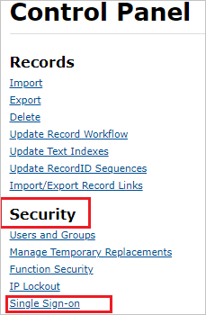
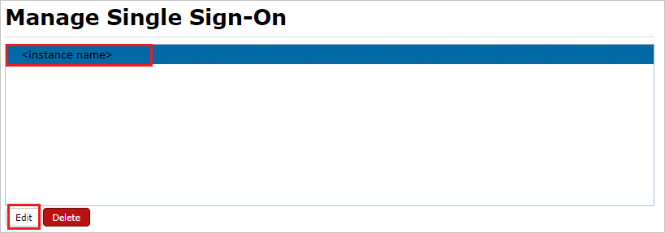
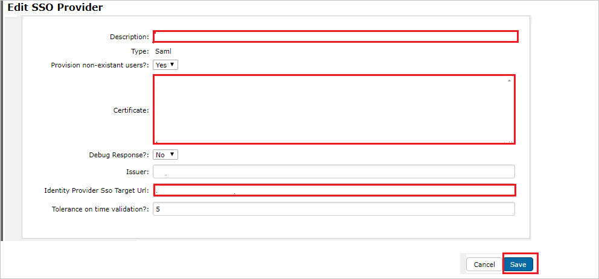

# Configure Nimblex for Single sign-on with Microsoft Entra ID

In this article,  you learn how to integrate Nimblex with Microsoft Entra ID. When you integrate Nimblex with Microsoft Entra ID, you can:

* Control in Microsoft Entra ID who has access to Nimblex.
* Enable your users to be automatically signed-in to Nimblex with their Microsoft Entra accounts.
* Manage your accounts in one central location.

## Prerequisites

The scenario outlined in this article assumes that you already have the following prerequisites:

[!INCLUDE [common-prerequisites.md](~/identity/saas-apps/includes/common-prerequisites.md)]
* Nimblex single sign-on (SSO) enabled subscription.

## Scenario description

In this article,  you configure and test Microsoft Entra single sign-on in a test environment.

* Nimblex supports **SP** initiated SSO.

* Nimblex supports **Just In Time** user provisioning.

## Add Nimblex from the gallery

To configure the integration of Nimblex into Microsoft Entra ID, you need to add Nimblex from the gallery to your list of managed SaaS apps.

1. Sign in to the [Microsoft Entra admin center](https://entra.microsoft.com) as at least a [Cloud Application Administrator](~/identity/role-based-access-control/permissions-reference.md#cloud-application-administrator).
1. Browse to **Entra ID** > **Enterprise apps** > **New application**.
1. In the **Add from the gallery** section, type **Nimblex** in the search box.
1. Select **Nimblex** from results panel and then add the app. Wait a few seconds while the app is added to your tenant.

 [!INCLUDE [sso-wizard.md](~/identity/saas-apps/includes/sso-wizard.md)]

## Configure and test Microsoft Entra SSO for Nimblex

Configure and test Microsoft Entra SSO with Nimblex using a test user called **B.Simon**. For SSO to work, you need to establish a link relationship between a Microsoft Entra user and the related user in Nimblex.

To configure and test Microsoft Entra SSO with Nimblex, perform the following steps:

1. **[Configure Microsoft Entra SSO](#configure-azure-ad-sso)** - to enable your users to use this feature.
    1. **Create a Microsoft Entra test user** - to test Microsoft Entra single sign-on with B.Simon.
    1. **Assign the Microsoft Entra test user** - to enable B.Simon to use Microsoft Entra single sign-on.
1. **[Configure Nimblex SSO](#configure-nimblex-sso)** - to configure the single sign-on settings on application side.
    1. **[Create Nimblex test user](#create-nimblex-test-user)** - to have a counterpart of B.Simon in Nimblex that's linked to the Microsoft Entra representation of user.
1. **[Test SSO](#test-sso)** - to verify whether the configuration works.

## Configure Microsoft Entra SSO

Follow these steps to enable Microsoft Entra SSO.

1. Sign in to the [Microsoft Entra admin center](https://entra.microsoft.com) as at least a [Cloud Application Administrator](~/identity/role-based-access-control/permissions-reference.md#cloud-application-administrator).
1. Browse to **Entra ID** > **Enterprise apps** > **Nimblex** > **Single sign-on**.
1. On the **Select a single sign-on method** page, select **SAML**.
1. On the **Set up single sign-on with SAML** page, select the pencil icon for **Basic SAML Configuration** to edit the settings.

   

1. On the **Basic SAML Configuration** section, perform the following steps:

    a. In the **Sign-on URL** text box, type a URL using the following pattern:
    `https://<YOUR_APPLICATION_PATH>/Login.aspx`

    b. In the **Identifier** box, type a URL using the following pattern:
    `https://<YOUR_APPLICATION_PATH>/`

    c. In the **Reply URL** text box, type a URL using the following pattern:
    `https://<path-to-application>/SamlReply.aspx`

	> [!NOTE]
	> These values aren't real. Update these values with the actual Sign-On URL, Identifier and Reply URL. Contact [Nimblex Client support team](mailto:support@ebms.com.au) to get these values. You can also refer to the patterns shown in the **Basic SAML Configuration** section.

1. On the **Set-up Single Sign-On with SAML** page, in the **SAML Signing Certificate** section, select **Download** to download the **Certificate (Base64)** from the given options as per your requirement and save it on your computer.

	

1. On the **Set up Nimblex** section, copy the appropriate URL(s) as per your requirement.

	

[!INCLUDE [create-assign-users-sso.md](~/identity/saas-apps/includes/create-assign-users-sso.md)]

## Configure Nimblex SSO

1. In a different web browser window, sign in to Nimblex as a Security Administrator.

2. On the top right-side of the page, select **Settings** logo.

	

3. On the **Control Panel** page, under **Security** section select **Single Sign-on**.

	

4. On the **Manage Single Sign-On** page, select your instance name and select **Edit**.

	

5. On the **Edit SSO Provider** page, perform the following steps:

	

	a. In the **Description** textbox, type your instance name.

	b. In Notepad, open the base-64 encoded certificate that you downloaded, copy its content, and then paste it into the **Certificate** box.

	c. In the **Identity Provider Sso Target Url** textbox, paste the value of **Login URL**, which you copied previously.

	d. Select **Save**.

### Create Nimblex test user

In this section, a user called Britta Simon is created in Nimblex. Nimblex supports just-in-time user provisioning, which is enabled by default. There's no action item for you in this section. If a user doesn't already exist in Nimblex, a new one is created after authentication.

>[!Note]
>If you need to create a user manually, contact [Nimblex Client support team](mailto:support@ebms.com.au).

## Test SSO 

In this section, you test your Microsoft Entra single sign-on configuration with following options. 

* Select **Test this application**, this option redirects to Nimblex Sign-on URL where you can initiate the login flow. 

* Go to Nimblex Sign-on URL directly and initiate the login flow from there.

* You can use Microsoft My Apps. When you select the Nimblex tile in the My Apps, this option redirects to Nimblex Sign-on URL. For more information about the My Apps, see [Introduction to the My Apps](https://support.microsoft.com/account-billing/sign-in-and-start-apps-from-the-my-apps-portal-2f3b1bae-0e5a-4a86-a33e-876fbd2a4510).

## Related content

Once you configure Nimblex you can enforce session control, which protects exfiltration and infiltration of your organization’s sensitive data in real time. Session control extends from Conditional Access. [Learn how to enforce session control with Microsoft Defender for Cloud Apps](/cloud-app-security/proxy-deployment-aad).
