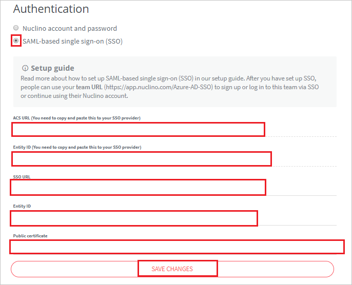

# Configure Nuclino for Single sign-on with Microsoft Entra ID

In this article,  you learn how to integrate Nuclino with Microsoft Entra ID. When you integrate Nuclino with Microsoft Entra ID, you can:

* Control in Microsoft Entra ID who has access to Nuclino.
* Enable your users to be automatically signed-in to Nuclino with their Microsoft Entra accounts.
* Manage your accounts in one central location.

## Prerequisites

The scenario outlined in this article assumes that you already have the following prerequisites:

[!INCLUDE [common-prerequisites.md](~/identity/saas-apps/includes/common-prerequisites.md)]
* Nuclino single sign-on (SSO) enabled subscription.

## Scenario description

In this article,  you configure and test Microsoft Entra SSO in a test environment.

* Nuclino supports **SP and IDP** initiated SSO.
* Nuclino supports **Just In Time** user provisioning.

## Add Nuclino from the gallery

To configure the integration of Nuclino into Microsoft Entra ID, you need to add Nuclino from the gallery to your list of managed SaaS apps.

1. Sign in to the [Microsoft Entra admin center](https://entra.microsoft.com) as at least a [Cloud Application Administrator](~/identity/role-based-access-control/permissions-reference.md#cloud-application-administrator).
1. Browse to **Entra ID** > **Enterprise apps** > **New application**.
1. In the **Add from the gallery** section, type **Nuclino** in the search box.
1. Select **Nuclino** from results panel and then add the app. Wait a few seconds while the app is added to your tenant.

 [!INCLUDE [sso-wizard.md](~/identity/saas-apps/includes/sso-wizard.md)]

## Configure and test Microsoft Entra SSO for Nuclino

Configure and test Microsoft Entra SSO with Nuclino using a test user called **B.Simon**. For SSO to work, you need to establish a link relationship between a Microsoft Entra user and the related user in Nuclino.

To configure and test Microsoft Entra SSO with Nuclino, perform the following steps:

1. **[Configure Microsoft Entra SSO](#configure-azure-ad-sso)** - to enable your users to use this feature.
    1. **Create a Microsoft Entra test user** - to test Microsoft Entra single sign-on with B.Simon.
    1. **Assign the Microsoft Entra test user** - to enable B.Simon to use Microsoft Entra single sign-on.
1. **[Configure Nuclino SSO](#configure-nuclino-sso)** - to configure the single sign-on settings on application side.
    1. **[Create Nuclino test user](#create-nuclino-test-user)** - to have a counterpart of B.Simon in Nuclino that's linked to the Microsoft Entra representation of user.
1. **[Test SSO](#test-sso)** - to verify whether the configuration works.

## Configure Microsoft Entra SSO

Follow these steps to enable Microsoft Entra SSO.

1. Sign in to the [Microsoft Entra admin center](https://entra.microsoft.com) as at least a [Cloud Application Administrator](~/identity/role-based-access-control/permissions-reference.md#cloud-application-administrator).
1. Browse to **Entra ID** > **Enterprise apps** > **Nuclino** > **Single sign-on**.
1. On the **Select a single sign-on method** page, select **SAML**.
1. On the **Set up single sign-on with SAML** page, select the pencil icon for **Basic SAML Configuration** to edit the settings.

   

1. On the **Basic SAML Configuration** section, if you wish to configure the application in **IDP** initiated mode, perform the following steps:

    a. In the **Identifier** text box, type a URL using the following pattern:
    `https://api.nuclino.com/api/sso/<UNIQUE-ID>/metadata`

    b. In the **Reply URL** text box, type a URL using the following pattern:
    `https://api.nuclino.com/api/sso/<UNIQUE-ID>/acs`

	> [!NOTE]
	> These values aren't real. Update these values with the actual Identifier and Reply URL from the **Authentication** section, which is explained later in this article.

1. Select **Set additional URLs** and perform the following step if you wish to configure the application in **SP** initiated mode:

    In the **Sign-on URL** text box, type a URL using the following pattern:
    `https://app.nuclino.com/<UNIQUE-ID>/login`

	> [!NOTE]
	> These values aren't real. Update these values with the actual Identifier, Reply URL and Sign-on URL. Contact [Nuclino Client support team](mailto:contact@nuclino.com) to get these values. You can also refer to the patterns shown in the **Basic SAML Configuration** section.

6. Nuclino application expects the SAML assertions in a specific format, which requires you to add custom attribute mappings to your SAML token attributes configuration. The following screenshot shows the list of default attributes.

	

7. In addition to above, Nuclino application expects few more attributes to be passed back in SAML response which are shown below. These attributes are also pre populated but you can review them as per your requirements.

	| Name |  Source Attribute|
	| ---------------| --------- |
	| first_name | user.givenname |
	| last_name | user.surname |

1. On the **Set up single sign-on with SAML** page, in the **SAML Signing Certificate** section,  find **Certificate (Base64)** and select **Download** to download the certificate and save it on your computer.

	

1. On the **Set up Nuclino** section, copy the appropriate URL(s) based on your requirement.

	

[!INCLUDE [create-assign-users-sso.md](~/identity/saas-apps/includes/create-assign-users-sso.md)]

## Configure Nuclino SSO

1. In a different web browser window, sign in to your Nuclino company site as an administrator

4. Select the **ICON**.

	

5. Select the **Microsoft Entra SSO** and select **Team settings** from the dropdown.

6. Select **Authentication** from left navigation pane.

7. In the **Authentication** section, perform the following steps:

	

	a. Select **SAML-based single sign-on (SSO)**.

	b. Copy **ACS URL (You need to copy and paste this to your SSO provider)** value and paste it into the **Reply URL** textbox of the **Basic SAML Configuration** section.

	c. Copy **Entity ID (You need to copy and paste this to your SSO provider)** value and paste it into the **Identifier** textbox of the **Basic SAML Configuration** section.

	d. In the **SSO URL** textbox, paste the **Login URL** value which you copied previously.

	e. In the **Entity ID** textbox, paste the **Microsoft Entra Identifier** value which you copied previously.

	f. Open your downloaded **Certificate(Base64)** file in Notepad. Copy the content of it into your clipboard, and then paste it to the **Public certificate** text box.

	g. Select **SAVE CHANGES**.

### Create Nuclino test user

In this section, a user called B.Simon is created in Nuclino. Nuclino supports just-in-time user provisioning, which is enabled by default. There's no action item for you in this section. If a user doesn't already exist in Nuclino, a new one is created after authentication.

> [!Note]
> If you need to create a user manually, contact [Nuclino support team](mailto:contact@nuclino.com).

## Test SSO 

In this section, you test your Microsoft Entra single sign-on configuration with following options. 

#### SP initiated:

* Select **Test this application**, this option redirects to Nuclino Sign on URL where you can initiate the login flow.  

* Go to Nuclino Sign-on URL directly and initiate the login flow from there.

#### IDP initiated:

* Select **Test this application**, and you should be automatically signed in to the Nuclino for which you set up the SSO. 

You can also use Microsoft My Apps to test the application in any mode. When you select the Nuclino tile in the My Apps, if configured in SP mode you would be redirected to the application sign on page for initiating the login flow and if configured in IDP mode, you should be automatically signed in to the Nuclino for which you set up the SSO. For more information about the My Apps, see [Introduction to the My Apps](https://support.microsoft.com/account-billing/sign-in-and-start-apps-from-the-my-apps-portal-2f3b1bae-0e5a-4a86-a33e-876fbd2a4510).

## Related content

Once you configure Nuclino you can enforce session control, which protects exfiltration and infiltration of your organization’s sensitive data in real time. Session control extends from Conditional Access. [Learn how to enforce session control with Microsoft Defender for Cloud Apps](/cloud-app-security/proxy-deployment-aad).
