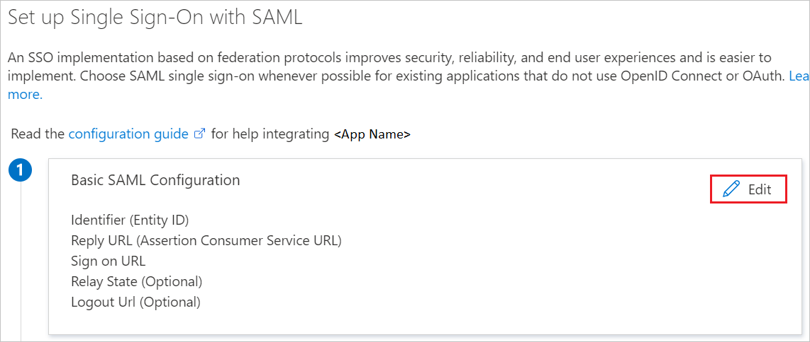
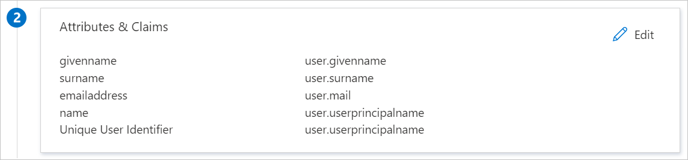
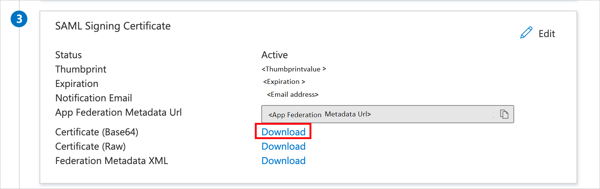
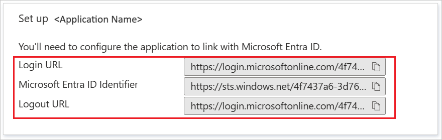

# Configure Nulab Pass (Backlog and Cacoo) for Single sign-on with Microsoft Entra ID

In this article,  you learn how to integrate Nulab Pass (Backlog and Cacoo) with Microsoft Entra ID. By integrating, you can:

* Control in Microsoft Entra ID who has access to Nulab Pass in Microsoft Entra ID.
* Enable users to be automatically signed in to Nulab Pass with their Microsoft Entra accounts.
* Manage your accounts in one central location.

## Prerequisites

The scenario outlined in this article assumes that you already have the following prerequisites:

[!INCLUDE [common-prerequisites.md](~/identity/saas-apps/includes/common-prerequisites.md)]
* Nulab Pass SSO-enabled subscription.

## Scenario description

In this article,  you’ll configure and test Microsoft Entra SSO in a test environment. Nulab Pass supports both **SP and IDP**-initiated SSO.

## Add Nulab Pass from the gallery

To configure the integration of Nulab Pass into Microsoft Entra ID, add Nulab Pass from the gallery to your list of managed SaaS apps.

1. Go to **Entra ID** > **Enterprise apps** > **New application**.
1. In the **Add from the gallery** section, type **Nulab Pass** in the search box.
1. Select **Nulab Pass** from results panel and add the app.
1. Wait a few seconds while the app is added to your tenant.

 [!INCLUDE [sso-wizard.md](~/identity/saas-apps/includes/sso-wizard.md)]

## Configure and test Microsoft Entra SSO for Nulab Pass

Configure and test Microsoft Entra SSO with Nulab Pass using a test user called B.Simon. For SSO to work, you need to establish a link relationship between a Microsoft Entra user and the related user in Nulab Pass.

To configure and test Microsoft Entra SSO with Nulab Pass:

1. **[Configure Microsoft Entra SSO](#configure-azure-ad-sso)** to enable your users to use this feature.
    1. **Create a Microsoft Entra test user** to test Microsoft Entra SSO with B.Simon.
    1. **Assign the Microsoft Entra test user** to enable B.Simon to use Microsoft Entra SSO.
1. **[Configure Nulab Pass SSO](#configure-nulab-pass-sso)** to configure the SSO settings on the application side.
    1. **[Create Nulab Pass test user](#create-nulab-pass-test-user)** to have a counterpart of B.Simon in Nulab Pass that’s linked to the Microsoft Entra representation of user.
1. **[Test SSO](#test-sso)** to verify whether the configuration works.

## Configure Microsoft Entra SSO

To enable Microsoft Entra SSO:

1. Sign in to the [Microsoft Entra admin center](https://entra.microsoft.com) as at least a [Cloud Application Administrator](~/identity/role-based-access-control/permissions-reference.md#cloud-application-administrator).
1. Go to **Entra ID** > **Enterprise apps** > **Nulab Pass (Backlog and Cacoo)** > **Single sign-on**.
1. On the **Select a single sign-on method** page, select **SAML**.
1. On the **Set up single sign-on with SAML** page, select the pencil icon for **Basic SAML Configuration** to edit the settings.

   

1. In the **Basic SAML Configuration** section, perform the following steps:

    a. In the **Identifier** text box, type a URL using the following pattern:
   `https://apps.nulab.com/signin/spaces/<Space_Key>/saml`

    b. In the **Reply URL** text box, type a URL using the following pattern:
    `https://apps.nulab.com/signin/spaces/<Space_Key>/saml/callback`

1. Perform the following step to configure the application in **SP** initiated mode:

    In the **Sign on URL** text box, type the URL:
   `https://apps.nulab.com/signin`

	> [!NOTE]
	> These values aren't real and should be updated with the actual Identifier, Reply URL, and Sign on URL found in your Nulab Pass organization settings. In your organization settings:
	>  1. Select **Single Sign-On** from the menu on the left.
 	>  2. Press the **Manage** button to display the **Manage SAML authentication** dialog.
	>  3. Copy **SP Entity ID** and **SP Endpoint URL (ACS)** values and paste in the Entra side configuration.
 	>  4. For more information, please refer [how to set up SAML authentication](https://support.nulab.com/hc/en-us/articles/6478805477401) documentation.	

1. Your Nulab Pass application expects the SAML assertions in a specific format, which requires you to add custom attribute mappings to your SAML token attributes configuration. The following screenshot shows an example for this. The default value of **Unique User Identifier** is **user.userprincipalname**, but Nulab Pass expects this to be mapped with the user's email. Use the **user.mail** attribute from the list or the appropriate attribute value based on your organization configuration.

	

1. On the **Set up single sign-on with SAML** page in the **SAML Signing Certificate** section, you find the **Certificate (Base64)**. Select **Download** to download the certificate and save it on your computer.

	

1. In the **Set up Nulab Pass** section, copy the appropriate URL(s) based on your requirement.

	

[!INCLUDE [create-assign-users-sso.md](~/identity/saas-apps/includes/create-assign-users-sso.md)]

## Configure Nulab Pass SSO

You must configure **[Domain authentication](https://support.nulab.com/hc/en-us/articles/6558108028825)** before configure SSO.

To configure SSO in **Nulab Pass**, set the **Certificate (Base64)** and URLs from the application configuration to ensure that the SSO connection is set on both sides. To do this:

1. Go to your Nulab Pass organization settings.
2. Select **Single Sign-On** from the menu on the left.
3. Press the **Manage** button to display the **Manage SAML authentication** dialog.
4. Enter the following:
   * IdP Entity ID
   * IdP Endpoint URL
   * X.509 Certificate (Base64)

Please refer [how to set up SAML authentication](https://support.nulab.com/hc/en-us/articles/6478805477401) documentation for more details.

### Create Nulab Pass test user

Next, you’ll create a user called `Britta Simon` in Nulab Pass by [adding a Managed Account](https://support.nulab.com/hc/en-us/articles/6480291067801). Users must be created and activated before you use SSO.

## Test SSO 

Now, you’ll test your Microsoft Entra SSO configuration using one of the following options: 

#### SP initiated:

* Select **Test this application** to be redirected to Nulab Pass to sign in.  

* Or, go to the Nulab Pass sign in page directly and initiate the flow from there.

#### IDP initiated:

* Select **Test this application** to be automatically signed in to SSO-enabled Nulab Pass. 

You can also use Microsoft My Apps to test the application in any mode. When you select the Nulab Pass tile in My Apps, you’ll be redirected to the application sign on page for initiating the login flow if it was configured in SP mode. If configured in IDP mode, you’ll be automatically signed in to SSO-enabled Nulab Pass. [Learn more about My Apps](https://support.microsoft.com/account-billing/sign-in-and-start-apps-from-the-my-apps-portal-2f3b1bae-0e5a-4a86-a33e-876fbd2a4510).

## Related content

With Nulab Pass configured, you can enforce session control, which protects exfiltration and infiltration of your organization’s sensitive data in real time. Session control extends from Conditional Access. [Learn how to enforce session control with Microsoft Defender for Cloud Apps](/cloud-app-security/proxy-deployment-aad).
