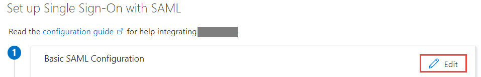
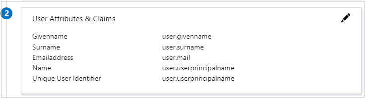
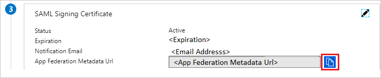

# Configure NumlyEngage™ for Single sign-on with Microsoft Entra ID

In this article,  you learn how to integrate NumlyEngage™ with Microsoft Entra ID. When you integrate NumlyEngage™ with Microsoft Entra ID, you can:

* Control in Microsoft Entra ID who has access to NumlyEngage™.
* Enable your users to be automatically signed-in to NumlyEngage™ with their Microsoft Entra accounts.
* Manage your accounts in one central location.

To learn more about SaaS app integration with Microsoft Entra ID, see [What is application access and single sign-on with Microsoft Entra ID](~/identity/enterprise-apps/what-is-single-sign-on.md).

## Prerequisites

The scenario outlined in this article assumes that you already have the following prerequisites:

[!INCLUDE [common-prerequisites.md](~/identity/saas-apps/includes/common-prerequisites.md)]
* NumlyEngage™ single sign-on (SSO) enabled subscription.

## Scenario description

In this article,  you configure and test Microsoft Entra SSO in a test environment.

* NumlyEngage™ supports **SP** initiated SSO
* Once you configure NumlyEngage™ you can enforce session control, which protects exfiltration and infiltration of your organization’s sensitive data in real time. Session control extends from Conditional Access. [Learn how to enforce session control with Microsoft Defender for Cloud Apps](/cloud-app-security/proxy-deployment-any-app).

## Adding NumlyEngage™ from the gallery

To configure the integration of NumlyEngage™ into Microsoft Entra ID, you need to add NumlyEngage™ from the gallery to your list of managed SaaS apps.

1. Sign in to the [Microsoft Entra admin center](https://entra.microsoft.com) as at least a [Cloud Application Administrator](~/identity/role-based-access-control/permissions-reference.md#cloud-application-administrator).
1. Browse to **Entra ID** > **Enterprise apps** > **New application**.
1. In the **Add from the gallery** section, type **NumlyEngage™** in the search box.
1. Select **NumlyEngage™** from results panel and then add the app. Wait a few seconds while the app is added to your tenant.

 [!INCLUDE [sso-wizard.md](~/identity/saas-apps/includes/sso-wizard.md)]

## Configure and test Microsoft Entra SSO for NumlyEngage™

Configure and test Microsoft Entra SSO with NumlyEngage™ using a test user called **B.Simon**. For SSO to work, you need to establish a link relationship between a Microsoft Entra user and the related user in NumlyEngage™.

To configure and test Microsoft Entra SSO with NumlyEngage™, complete the following building blocks:

1. **[Configure Microsoft Entra SSO](#configure-azure-ad-sso)** - to enable your users to use this feature.
    1. **Create a Microsoft Entra test user** - to test Microsoft Entra single sign-on with B.Simon.
    1. **Assign the Microsoft Entra test user** - to enable B.Simon to use Microsoft Entra single sign-on.
1. **[Configure NumlyEngage™ SSO](#configure-numlyengage-sso)** - to configure the single sign-on settings on application side.
    1. **[Create NumlyEngage™ test user](#create-numlyengage-test-user)** - to have a counterpart of B.Simon in NumlyEngage™ that's linked to the Microsoft Entra representation of user.
1. **[Test SSO](#test-sso)** - to verify whether the configuration works.

## Configure Microsoft Entra SSO

Follow these steps to enable Microsoft Entra SSO.

1. Sign in to the [Microsoft Entra admin center](https://entra.microsoft.com) as at least a [Cloud Application Administrator](~/identity/role-based-access-control/permissions-reference.md#cloud-application-administrator).
1. Browse to **Entra ID** > **Enterprise apps** > **NumlyEngage™** > **Single sign-on**.
1. On the **Select a single sign-on method** page, select **SAML**.
1. On the **Set up single sign-on with SAML** page, select the edit/pen icon for **Basic SAML Configuration** to edit the settings.

   

1. On the **Basic SAML Configuration** section, enter the values for the following fields:

	a. In the **Sign on URL** text box, type a URL using the following pattern:
    `https://<SUBDOMAIN>.numly.io/registration?mail=<CUSTOM_IDENTIFIER>`

    b. In the **Identifier (Entity ID)** text box, type a URL using the following pattern:
    `urn:amazon:cognito:sp:<NUMLY_ENGAGE_SPECIFIC_IDENTIFIER>`

    c. In the **Reply URL** text box, type a URL using the following pattern:
    `https://<SUBDOMAIN>.NUMLYENGAGE_SPECIFIC_amazoncognito.com/saml2/idpresponse`

	> [!NOTE]
	> These values aren't real. Update these values with the actual Sign on URL, Reply URL and Identifier. Contact [NumlyEngage™ Client support team](mailto:numlyengage-support@numly.io) to get these values. You can also refer to the patterns shown in the **Basic SAML Configuration** section.

1. NumlyEngage™ application expects the SAML assertions in a specific format, which requires you to add custom attribute mappings to your SAML token attributes configuration. The following screenshot shows the list of default attributes.

	

1. In addition to above, NumlyEngage™ application expects few more attributes to be passed back in SAML response which are shown below. These attributes are also pre populated but you can review them as per your requirements.
	
	| Name |  Source Attribute |
	| ------------------ | --------- |
	| Email | user.mail |
	| Phone number | user.telephonenumber |

1. On the **Set up single sign-on with SAML** page, In the **SAML Signing Certificate** section, select copy button to copy **App Federation Metadata Url** and save it on your computer.

	

[!INCLUDE [create-assign-users-sso.md](~/identity/saas-apps/includes/create-assign-users-sso.md)]

## Configure NumlyEngage SSO

To configure single sign-on on **NumlyEngage™** side, you need to send the **App Federation Metadata Url** to [NumlyEngage™ support team](mailto:numlyengage-support@numly.io). They set this setting to have the SAML SSO connection set properly on both sides.

### Create NumlyEngage test user

In this section, you create a user called B.Simon in NumlyEngage™. Work with [NumlyEngage™ support team](mailto:numlyengage-support@numly.io) to add the users in the NumlyEngage™ platform. Users must be created and activated before you use single sign-on.

## Test SSO 

In this section, you test your Microsoft Entra single sign-on configuration using the Access Panel.

When you select the NumlyEngage™ tile in the Access Panel, you should be automatically signed in to the NumlyEngage™ for which you set up SSO. For more information about the Access Panel, see [Introduction to the Access Panel](https://support.microsoft.com/account-billing/sign-in-and-start-apps-from-the-my-apps-portal-2f3b1bae-0e5a-4a86-a33e-876fbd2a4510).

## Additional resources

- [List of articles on How to Integrate SaaS Apps with Microsoft Entra ID](./tutorial-list.md)

- [What is application access and single sign-on with Microsoft Entra ID?](~/identity/enterprise-apps/what-is-single-sign-on.md)

- [What is Conditional Access in Microsoft Entra ID?](~/identity/conditional-access/overview.md)

- [What is session control in Microsoft Defender for Cloud Apps?](/cloud-app-security/proxy-intro-aad)

- [How to protect NumlyEngage™ with advanced visibility and controls](/cloud-app-security/proxy-intro-aad)
