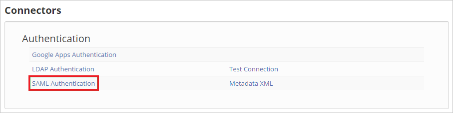

# Configure OfficeSpace Software for Single sign-on with Microsoft Entra ID

## Prerequisites

The scenario outlined in this article assumes that you already have the following prerequisites:

[!INCLUDE [common-prerequisites.md](~/identity/saas-apps/includes/common-prerequisites.md)]
* OfficeSpace Software single sign-on (SSO) enabled subscription.

## Configure and test Microsoft Entra SSO for OfficeSpace Software

Configure and test Microsoft Entra SSO with OfficeSpace Software using a test user called **B.Simon**. For SSO to work, you need to establish a link relationship between a Microsoft Entra user and the related user in OfficeSpace Software.

To configure and test Microsoft Entra SSO with OfficeSpace Software, perform the following steps:

1. **[Configure Microsoft Entra SSO](#configure-azure-ad-sso)** - to enable your users to use this feature.
    1. **Create a Microsoft Entra test user** - to test Microsoft Entra single sign-on with B.Simon.
    1. **Assign the Microsoft Entra test user** - to enable B.Simon to use Microsoft Entra single sign-on.
1. **[Configure OfficeSpace Software SSO](#configure-officespace-software-sso)** - to configure the single sign-on settings on application side.

## Configure Microsoft Entra SSO

Follow these steps to enable Microsoft Entra SSO.

1. Sign in to the [Microsoft Entra admin center](https://entra.microsoft.com) as at least a [Cloud Application Administrator](~/identity/role-based-access-control/permissions-reference.md#cloud-application-administrator).
1. Browse to **Entra ID** > **Enterprise apps** > **OfficeSpace Software** > **Single sign-on**.
1. On the **Select a single sign-on method** page, select **SAML**.
1. On the **Set up single sign-on with SAML** page, select the pencil icon for **Basic SAML Configuration** to edit the settings.

   

1. On the **Basic SAML Configuration** section, perform the following steps:

	a. In the **Sign on URL** text box, type a URL using the following pattern:
    `https://<company name>.officespacesoftware.com/users/sign_in/saml`

    b. In the **Identifier (Entity ID)** text box, type a URL using the following pattern:
    `<company name>.officespacesoftware.com`

	> [!NOTE]
	> These values aren't real. Update these values with the actual Sign-on URL and Identifier. Contact the [OfficeSpace Software Client support team](mailto:support@officespacesoftware.com) to get these values. You can also refer to the patterns shown in the **Basic SAML Configuration** section.

1. OfficeSpace Software application expects the SAML assertions in a specific format, which requires you to add custom attribute mappings to your SAML token attributes configuration. The following screenshot shows the list of default attributes, whereas **nameidentifier** is mapped with **user.userprincipalname**. OfficeSpace Software application expects **nameidentifier** to be mapped with **user.mail**, so you need to edit the attribute mapping by selecting **Edit** icon and change the attribute mapping.

	

1. In addition to above, OfficeSpace Software application expects few more attributes to be passed back in SAML response which are shown below. These attributes are also prepopulated but you can review them as per your requirement.

	| Name | Source Attribute|
	| ---------------| --------------- |
	| email | user.mail |
	| name | user.displayname |
	| first_name | user.givenname |
	| last_name | user.surname |

1. In the **SAML Signing Certificate** section, select **Edit** button to open **SAML Signing Certificate** dialog.

	

1. In the **SAML Signing Certificate Section**, download the PEM certificate.

    

1. In the **Set up OfficeSpace Software** section, copy one or more appropriate URLs based on your requirement.

	

[!INCLUDE [create-assign-users-sso.md](~/identity/saas-apps/includes/create-assign-users-sso.md)]

## Configure OfficeSpace Software SSO

1. In a different web browser window, sign in to your OfficeSpace Software tenant as an administrator.

2. Go to **Settings** and select **Connectors**.

	

3. Select **SAML Authentication**.

	

4. In the **SAML Authentication** section, perform the following steps:

	

	a. In the **Logout provider url** textbox, paste the value of **Logout URL**..

	b. In the **Client idp target url** textbox, paste the value of **Login URL**..

	c. Paste the **Thumbprint** value., into the **Client IDP certificate fingerprint** textbox. 

	d. Select **Save Settings**.

### Create OfficeSpace Software test user

In this section, a user called B.Simon is created in OfficeSpace Software. OfficeSpace Software supports just-in-time user provisioning, which is enabled by default. There's no action item for you in this section. If a user doesn't already exist in OfficeSpace Software, a new one is created after authentication.

> [!NOTE]
> If you need to create a user manually, you need to Contact [OfficeSpace Software support team](mailto:support@officespacesoftware.com).

## Test SSO 

In this section, you test your Microsoft Entra single sign-on configuration with following options. 

* Select **Test this application**, this option redirects to OfficeSpace Software Sign-on URL where you can initiate the sign-in flow. 

* Go to OfficeSpace Software Sign-on URL directly and initiate the sign-in flow from there.

* You can use Microsoft My Apps. When you select the OfficeSpace Software tile in the My Apps, this option redirects to OfficeSpace Software Sign-on URL. For more information about the My Apps, see [Introduction to the My Apps](https://support.microsoft.com/account-billing/sign-in-and-start-apps-from-the-my-apps-portal-2f3b1bae-0e5a-4a86-a33e-876fbd2a4510).

## Related content

Once you configure OfficeSpace Software you can enforce session control, which protects exfiltration and infiltration of your organization’s sensitive data in real time. Session control extends from Conditional Access. [Learn how to enforce session control with Microsoft Defender for Cloud Apps](/cloud-app-security/proxy-deployment-aad).
