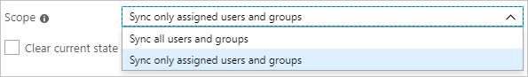

# Configure Olfeo SAAS for automatic user provisioning with Microsoft Entra ID

This article describes the steps you need to do in both Olfeo SAAS and Microsoft Entra ID to configure automatic user provisioning. When configured, Microsoft Entra ID automatically provisions and de-provisions users and groups to [Olfeo SAAS](https://www.olfeo.com) using the Microsoft Entra provisioning service. For important details on what this service does, how it works, and frequently asked questions, see [Automate user provisioning and deprovisioning to SaaS applications with Microsoft Entra ID](~/identity/app-provisioning/user-provisioning.md). 

## Capabilities Supported
> [!div class="checklist"]
> * Create users in Olfeo SAAS
> * Remove users in Olfeo SAAS when they don't require access anymore
> * Keep user attributes synchronized between Microsoft Entra ID and Olfeo SAAS
> * Provision groups and group memberships in Olfeo SAAS
> * [Single sign-on](olfeo-saas-tutorial.md) to Olfeo SAAS (recommended)

## Prerequisites

The scenario outlined in this article assumes that you already have the following prerequisites:

[!INCLUDE [common-prerequisites.md](~/identity/saas-apps/includes/common-prerequisites.md)]
* A [Olfeo SAAS tenant](https://www.olfeo.com/).
* A user account in Olfeo SAAS with Admin permissions.

## Step 1: Plan your provisioning deployment

1. Learn about [how the provisioning service works](~/identity/app-provisioning/user-provisioning.md).
1. Determine who's in [scope for provisioning](~/identity/app-provisioning/define-conditional-rules-for-provisioning-user-accounts.md).
1. Determine what data to [map between Microsoft Entra ID and Olfeo SAAS](~/identity/app-provisioning/customize-application-attributes.md).

## Step 2: Configure Olfeo SAAS to support provisioning with Microsoft Entra ID

1. Login to Olfeo SAAS admin console. 
1. Navigate to **Configuration > Annuaires**.
1. Create a new directory and then name it.
1. Select **Azure** provider and then select **Créer** to save the new directory. 
1. Navigate to the **Synchronisation** tab to see the **Tenant URL** and the **Jeton secret**. These values are copied and pasted in the **Tenant URL** and **Secret Token** fields in the Provisioning tab of your Olfeo SAAS application.

## Step 3: Add Olfeo SAAS from the Microsoft Entra application gallery

Add Olfeo SAAS from the Microsoft Entra application gallery to start managing provisioning to Olfeo SAAS. If you have previously setup Olfeo SAAS for SSO, you can use the same application. However it's recommended that you create a separate app when testing out the integration initially. Learn more about adding an application from the gallery [here](~/identity/enterprise-apps/add-application-portal.md). 

## Step 4: Define who is in scope for provisioning 

[!INCLUDE [create-assign-users-provisioning.md](~/identity/saas-apps/includes/create-assign-users-provisioning.md)]

## Step 5: Configure automatic user provisioning to Olfeo SAAS 

This section guides you through the steps to configure the Microsoft Entra provisioning service to create, update, and disable users and groups in Olfeo SAAS app based on user and group assignments in Microsoft Entra ID.

### To configure automatic user provisioning for Olfeo SAAS in Microsoft Entra ID:

1. Sign in to the [Microsoft Entra admin center](https://entra.microsoft.com) as at least a [Cloud Application Administrator](~/identity/role-based-access-control/permissions-reference.md#cloud-application-administrator).
1. Browse to **Entra ID** > **Enterprise apps**

	

1. In the applications list, select **Olfeo SAAS**.

	

1. Select the **Provisioning** tab.

	

1.  Set the **Provisioning Mode** to **Automatic**.

	

1. In the **Admin Credentials** section, enter your Olfeo SAAS **Tenant URL** and **Secret token** information. Select **Test Connection** to ensure that Microsoft Entra ID can connect to Olfeo SAAS. If the connection fails, ensure that your Olfeo SAAS account has admin permissions and try again.

 	

1. In the **Notification Email** field, enter the email address of a person or group who should receive the provisioning error notifications. Select the **Send an email notification when a failure occurs** check box.

	

1. Select **Save**.

1. In the **Mappings** section, select **Synchronize Microsoft Entra users to Olfeo SAAS**.

1. Review the user attributes that are synchronized from Microsoft Entra ID to Olfeo SAAS in the **Attribute Mapping** section. The attributes selected as **Matching** properties are used to match the user accounts in Olfeo SAAS for update operations. If you change the [matching target attribute](~/identity/app-provisioning/customize-application-attributes.md), you need to ensure that the Olfeo SAAS API supports filtering users based on that attribute. Select **Save** to commit any changes.

   |Attribute|Type|Supported for filtering|
   |---|---|---|
   |userName|String|&check;|
   |displayName|String|
   |active|Boolean|
   |emails[type eq "work"].value|String|
   |preferredLanguage|String|
   |name.givenName|String|
   |name.familyName|String|
   |name.formatted|String|
   |externalId|String|  

1. Under the **Mappings** section, select **Synchronize Microsoft Entra groups to Olfeo SAAS**.

1. Review the group attributes that are synchronized from Microsoft Entra ID to Olfeo SAAS in the **Attribute-Mapping** section. The attributes selected as **Matching** properties are used to match the groups in Olfeo SAAS for update operations. Select the **Save** button to commit any changes.

      |Attribute|Type|Supported for filtering|
      |---|---|---|
      |displayName|String|&check;|
      |externalId|String|
      |members|Reference|

1. To configure scoping filters, see the instructions provided in the [Scoping filter  article](~/identity/app-provisioning/define-conditional-rules-for-provisioning-user-accounts.md).

1. To enable the Microsoft Entra provisioning service for Olfeo SAAS, change **Provisioning Status** to **On** in the **Settings** section.

	

1. Define the users or groups that you want to provision to Olfeo SAAS by selecting the desired values in **Scope** in the **Settings** section.

	

1. When you're ready to provision, select **Save**.

	

This operation starts the initial synchronization cycle of all users and groups defined in **Scope** in the **Settings** section. The initial cycle takes longer to do than next cycles, which occur about every 40 minutes as long as the Microsoft Entra provisioning service is running.

## Step 6: Monitor your deployment

[!INCLUDE [monitor-deployment.md](~/identity/saas-apps/includes/monitor-deployment.md)]

## More resources

* [Managing user account provisioning for enterprise apps](~/identity/app-provisioning/configure-automatic-user-provisioning-portal.md)
* [What is application access and single sign-on with Microsoft Entra ID?](~/identity/enterprise-apps/what-is-single-sign-on.md)

## Related content

* [Learn how to review logs and get reports on provisioning activity](~/identity/app-provisioning/check-status-user-account-provisioning.md)
