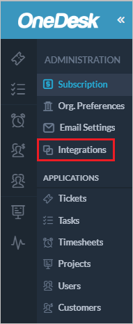
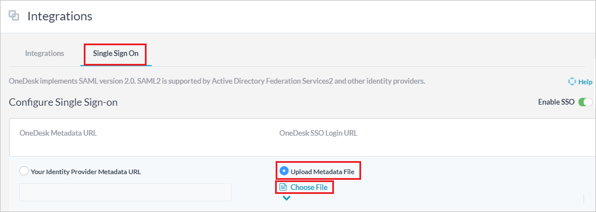

# Configure OneDesk for Single sign-on with Microsoft Entra ID

In this article,  you learn how to integrate OneDesk with Microsoft Entra ID. When you integrate OneDesk with Microsoft Entra ID, you can:

* Control in Microsoft Entra ID who has access to OneDesk.
* Enable your users to be automatically signed-in to OneDesk with their Microsoft Entra accounts.
* Manage your accounts in one central location.

## Prerequisites

The scenario outlined in this article assumes that you already have the following prerequisites:

[!INCLUDE [common-prerequisites.md](~/identity/saas-apps/includes/common-prerequisites.md)]
* OneDesk single sign-on (SSO) enabled subscription.

## Scenario description

In this article,  you configure and test Microsoft Entra SSO in a test environment.

* OneDesk supports **SP and IDP** initiated SSO.
* OneDesk supports **Just In Time** user provisioning.

## Add OneDesk from the gallery

To configure the integration of OneDesk into Microsoft Entra ID, you need to add OneDesk from the gallery to your list of managed SaaS apps.

1. Sign in to the [Microsoft Entra admin center](https://entra.microsoft.com) as at least a [Cloud Application Administrator](~/identity/role-based-access-control/permissions-reference.md#cloud-application-administrator).
1. Browse to **Entra ID** > **Enterprise apps** > **New application**.
1. In the **Add from the gallery** section, type **OneDesk** in the search box.
1. Select **OneDesk** from results panel and then add the app. Wait a few seconds while the app is added to your tenant.

 [!INCLUDE [sso-wizard.md](~/identity/saas-apps/includes/sso-wizard.md)]

## Configure and test Microsoft Entra SSO for OneDesk

Configure and test Microsoft Entra SSO with OneDesk using a test user called **B.Simon**. For SSO to work, you need to establish a link relationship between a Microsoft Entra user and the related user in OneDesk.

To configure and test Microsoft Entra SSO with OneDesk, perform the following steps:

1. **[Configure Microsoft Entra SSO](#configure-azure-ad-sso)** - to enable your users to use this feature.
    1. **Create a Microsoft Entra test user** - to test Microsoft Entra single sign-on with B.Simon.
    1. **Assign the Microsoft Entra test user** - to enable B.Simon to use Microsoft Entra single sign-on.
1. **[Configure OneDesk SSO](#configure-onedesk-sso)** - to configure the single sign-on settings on application side.
    1. **[Create OneDesk test user](#create-onedesk-test-user)** - to have a counterpart of B.Simon in OneDesk that's linked to the Microsoft Entra representation of user.
1. **[Test SSO](#test-sso)** - to verify whether the configuration works.

## Configure Microsoft Entra SSO

Follow these steps to enable Microsoft Entra SSO.

1. Sign in to the [Microsoft Entra admin center](https://entra.microsoft.com) as at least a [Cloud Application Administrator](~/identity/role-based-access-control/permissions-reference.md#cloud-application-administrator).
1. Browse to **Entra ID** > **Enterprise apps** > **OneDesk** > **Single sign-on**.
1. On the **Select a single sign-on method** page, select **SAML**.
1. On the **Set up single sign-on with SAML** page, select the pencil icon for **Basic SAML Configuration** to edit the settings.

   

1. On the **Basic SAML Configuration** section, if you wish to configure the application in **IDP** initiated mode, perform the following steps:

    a. In the **Identifier** text box, type a value using the following pattern:
    `onedesk.com_<specific_tenant_string>`

    b. In the **Reply URL** text box, type a URL using the following pattern:
    `https://app.onedesk.com/sso/saml/SSO/alias/onedesk.com_<specific_tenant_string>`

1. Select **Set additional URLs** and perform the following step if you wish to configure the application in **SP** initiated mode:

    In the **Sign-on URL** text box, type a URL using the following pattern:
    `https://app.onedesk.com/sso/saml/login/alias/onedesk.com_<specific_tenant_string>`

	> [!NOTE]
	> These values aren't real. Update these values with the actual Identifier, Reply URL and Sign-on URL. Contact [OneDesk Client support team](mailto:hello@onedesk.com) to get these values. You can also refer to the patterns shown in the **Basic SAML Configuration** section.

1. On the **Set up single sign-on with SAML** page, in the **SAML Signing Certificate** section, find **Federation Metadata XML** and select **Download** to download the certificate and save it on your computer.

	

1. On the **Set up OneDesk** section, copy the appropriate URL(s) based on your requirement.

	

[!INCLUDE [create-assign-users-sso.md](~/identity/saas-apps/includes/create-assign-users-sso.md)]

## Configure OneDesk SSO

1. In a different web browser window, sign in to your OneDesk company site as an administrator

1. Select the **Integrations** tab.

    

1. Select the **Single Sign On**, select **Upload Metadata File** and select the **Choose File** to upload the metadata file, which you have downloaded.

    

### Create OneDesk test user

In this section, a user called B.Simon is created in OneDesk. OneDesk supports just-in-time user provisioning, which is enabled by default. There's no action item for you in this section. If a user doesn't already exist in OneDesk, a new one is created after authentication.

## Test SSO

In this section, you test your Microsoft Entra single sign-on configuration with following options. 

#### SP initiated:

* Select **Test this application**, this option redirects to OneDesk Sign on URL where you can initiate the login flow.  

* Go to OneDesk Sign-on URL directly and initiate the login flow from there.

#### IDP initiated:

* Select **Test this application**, and you should be automatically signed in to the OneDesk for which you set up the SSO. 

You can also use Microsoft My Apps to test the application in any mode. When you select the OneDesk tile in the My Apps, if configured in SP mode you would be redirected to the application sign on page for initiating the login flow and if configured in IDP mode, you should be automatically signed in to the OneDesk for which you set up the SSO. For more information, see [Microsoft Entra My Apps](/azure/active-directory/manage-apps/end-user-experiences#azure-ad-my-apps).

## Related content

Once you configure OneDesk you can enforce session control, which protects exfiltration and infiltration of your organization’s sensitive data in real time. Session control extends from Conditional Access. [Learn how to enforce session control with Microsoft Defender for Cloud Apps](/cloud-app-security/proxy-deployment-aad).
