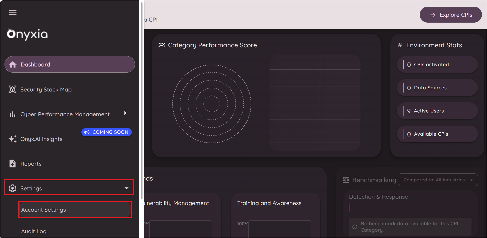
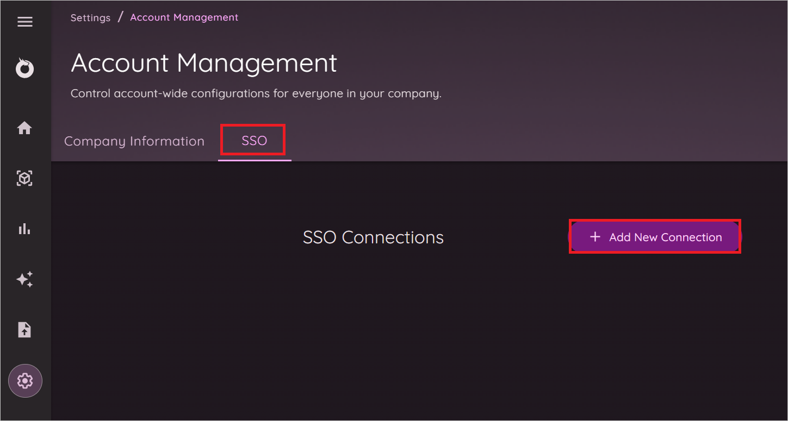
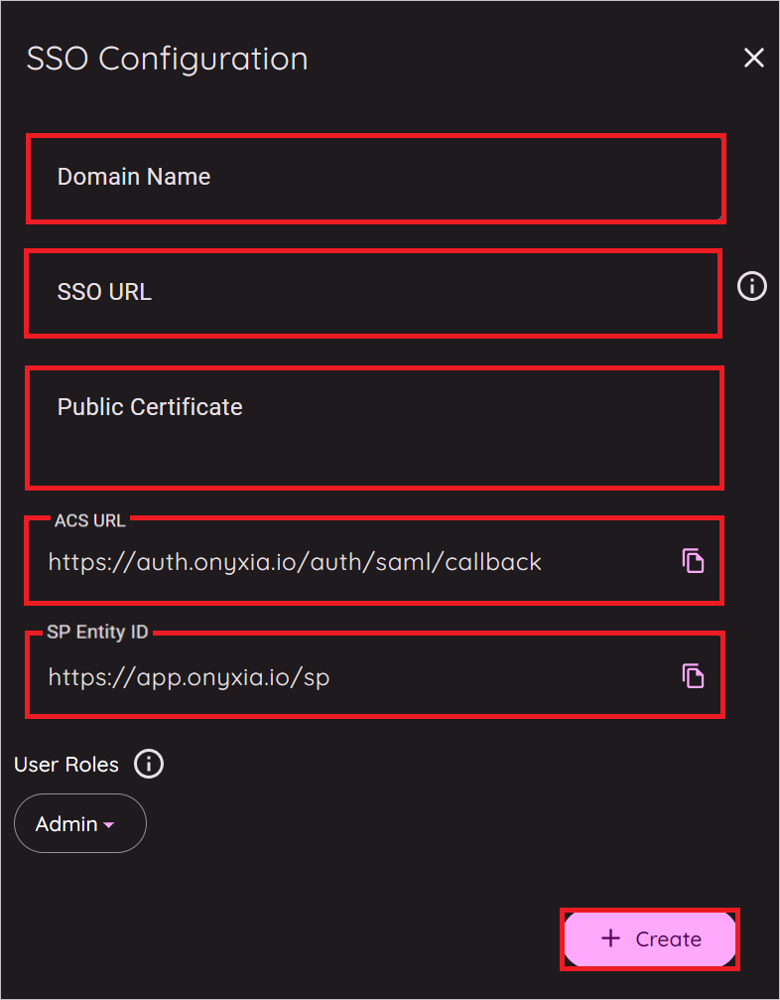

# Configure Onyxia for Single sign-on with Microsoft Entra ID

In this article,  you learn how to integrate Onyxia with Microsoft Entra ID. When you integrate Onyxia with Microsoft Entra ID, you can:

* Control in Microsoft Entra ID who has access to Onyxia.
* Enable your users to be automatically signed-in to Onyxia with their Microsoft Entra accounts.
* Manage your accounts in one central location.

## Prerequisites

The scenario outlined in this article assumes that you already have the following prerequisites:

[!INCLUDE [common-prerequisites.md](~/identity/saas-apps/includes/common-prerequisites.md)]
* Onyxia single sign-on (SSO) enabled subscription.

## Scenario description

In this article,  you configure and test Microsoft Entra SSO in a test environment.

* Onyxia supports both **SP and IDP** initiated SSO.
* Onyxia supports **Just In Time** user provisioning.

> [!NOTE]
> Identifier of this application is a fixed string value so only one instance can be configured in one tenant.

## Add Onyxia from the gallery

To configure the integration of Onyxia into Microsoft Entra ID, you need to add Onyxia from the gallery to your list of managed SaaS apps.

1. Sign in to the [Microsoft Entra admin center](https://entra.microsoft.com) as at least a [Cloud Application Administrator](~/identity/role-based-access-control/permissions-reference.md#cloud-application-administrator).
1. Browse to **Entra ID** > **Enterprise apps** > **New application**.
1. In the **Add from the gallery** section, type **Onyxia** in the search box.
1. Select **Onyxia** from results panel and then add the app. Wait a few seconds while the app is added to your tenant.

[!INCLUDE [sso-wizard.md](~/identity/saas-apps/includes/sso-wizard.md)]

## Configure and test Microsoft Entra SSO for Onyxia

Configure and test Microsoft Entra SSO with Onyxia using a test user called **B.Simon**. For SSO to work, you need to establish a link relationship between a Microsoft Entra user and the related user in Onyxia.

To configure and test Microsoft Entra SSO with Onyxia, perform the following steps:

1. **[Configure Microsoft Entra SSO](#configure-microsoft-entra-sso)** - to enable your users to use this feature.
    1. **Create a Microsoft Entra test user** - to test Microsoft Entra single sign-on with B.Simon.
    1. **Assign the Microsoft Entra test user** - to enable B.Simon to use Microsoft Entra single sign-on.
1. **[Configure Onyxia SSO](#configure-onyxia-sso)** - to configure the single sign-on settings on application side.
    1. **[Create Onyxia test user](#create-onyxia-test-user)** - to have a counterpart of B.Simon in Onyxia that's linked to the Microsoft Entra representation of user.
1. **[Test SSO](#test-sso)** - to verify whether the configuration works.

## Configure Microsoft Entra SSO

Follow these steps to enable Microsoft Entra SSO in the Microsoft Entra admin center.

1. Sign in to the [Microsoft Entra admin center](https://entra.microsoft.com) as at least a [Cloud Application Administrator](~/identity/role-based-access-control/permissions-reference.md#cloud-application-administrator).
1. Browse to **Entra ID** > **Enterprise apps** > **Onyxia** > **Single sign-on**.
1. On the **Select a single sign-on method** page, select **SAML**.
1. On the **Set up single sign-on with SAML** page, select the pencil icon for **Basic SAML Configuration** to edit the settings.

   

1. On the **Basic SAML Configuration** section, the application is pre-configured and the necessary URLs are already pre-populated with Microsoft Entra. The user needs to save the configuration by selecting the **Save** button.

1. Perform the following step, if you wish to configure the application in **SP** initiated mode:

    In the **Sign-on URL** text box, type the URL:
    `https://auth.onyxia.io/auth/saml/callback`

1. On the **Set up single sign-on with SAML** page, in the **SAML Signing Certificate** section, find **Certificate (Base64)** and select **Download** to download the certificate and save it on your computer.

	

1. On the **Set up Onyxia** section, copy the appropriate URLs based on your requirement.

	

[!INCLUDE [create-assign-users-sso.md](~/identity/saas-apps/includes/create-assign-users-sso.md)]

## Configure Onyxia SSO

1. Log in to Onyxia company site as an administrator.

1. Go to **Settings** and select **Account Settings**.

    

1. Navigate to **SSO** section and select **+ Add New Connection**.

    

1. In the **SSO Configuration** section, perform the following steps:

    

    1. In the **Domain Name** text box, enter a valid Domain name.

    1. In the **SSO URL** textbox, paste the **Login URL** which you have copied from the Microsoft Entra admin center.

    1. Open the downloaded **Certificate (Base64)** into Notepad and paste the content into the **Public Certificate** textbox.

    1. Copy the **ACS URL** and paste it in the **Reply URL** textbox in the **Basic SAML Configuration** section in the Microsoft Entra admin center.

    1. Copy the **SP Entity ID** and paste it in the **Identifier (Entity ID)** textbox in the **Basic SAML Configuration** section in the Microsoft Entra admin center.

    1. Select **+ Create**.

### Create Onyxia test user

In this section, a user called Britta Simon is created in Onyxia. Onyxia supports just-in-time user provisioning, which is enabled by default. There's no action item for you in this section. If a user doesn't already exist in Onyxia, a new one is created after authentication.

## Test SSO 

In this section, you test your Microsoft Entra single sign-on configuration with following options.
 
#### SP initiated:
 
* Select **Test this application** in Microsoft Entra admin center. this option redirects to Onyxia Sign-on URL where you can initiate the login flow.  
 
* Go to Onyxia Sign-on URL directly and initiate the login flow from there.
 
#### IDP initiated:
 
* Select **Test this application** in Microsoft Entra admin center and you should be automatically signed in to the Onyxia for which you set up the SSO.
 
You can also use Microsoft My Apps to test the application in any mode. When you select the Onyxia tile in the My Apps, if configured in SP mode you would be redirected to the application sign-on page for initiating the login flow and if configured in IDP mode, you should be automatically signed in to the Onyxia for which you set up the SSO. For more information about the My Apps, see [Introduction to the My Apps](https://support.microsoft.com/account-billing/sign-in-and-start-apps-from-the-my-apps-portal-2f3b1bae-0e5a-4a86-a33e-876fbd2a4510).

## Related content

Once you configure Onyxia you can enforce session control, which protects exfiltration and infiltration of your organization's sensitive data in real time. Session control extends from Conditional Access. [Learn how to enforce session control with Microsoft Defender for Cloud Apps](/cloud-app-security/proxy-deployment-any-app).
