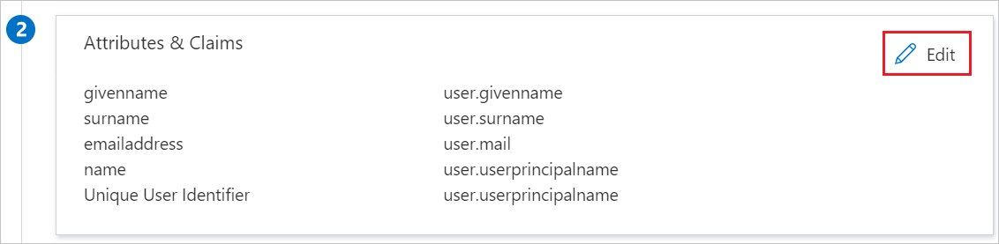

# Configure Opal for Single sign-on with Microsoft Entra ID

In this article,  you learn how to integrate Opal with Microsoft Entra ID. When you integrate Opal with Microsoft Entra ID, you can:

* Control in Microsoft Entra ID who has access to Opal.
* Enable your users to be automatically signed-in to Opal with their Microsoft Entra accounts.
* Manage your accounts in one central location.

## Prerequisites

To get started, you need the following items:

* A Microsoft Entra subscription. If you don't have a subscription, you can get a [free account](https://azure.microsoft.com/free/).
* Opal single sign-on (SSO) enabled subscription.
* Along with Cloud Application Administrator, Application Administrator can also add or manage applications in Microsoft Entra ID.
For more information, see [Azure built-in roles](~/identity/role-based-access-control/permissions-reference.md).

## Scenario description

In this article,  you configure and test Microsoft Entra SSO in a test environment.

* Opal supports **IDP** initiated SSO.

> [!NOTE]
> Identifier of this application is a fixed string value so only one instance can be configured in one tenant.

## Add Opal from the gallery

To configure the integration of Opal into Microsoft Entra ID, you need to add Opal from the gallery to your list of managed SaaS apps.

1. Sign in to the [Microsoft Entra admin center](https://entra.microsoft.com) as at least a [Cloud Application Administrator](~/identity/role-based-access-control/permissions-reference.md#cloud-application-administrator).
1. Browse to **Entra ID** > **Enterprise apps** > **New application**.
1. In the **Add from the gallery** section, type **Opal** in the search box.
1. Select **Opal** from results panel and then add the app. Wait a few seconds while the app is added to your tenant.

 [!INCLUDE [sso-wizard.md](~/identity/saas-apps/includes/sso-wizard.md)]

## Configure and test Microsoft Entra SSO for Opal

Configure and test Microsoft Entra SSO with Opal using a test user called **B.Simon**. For SSO to work, you need to establish a link relationship between a Microsoft Entra user and the related user in Opal.

To configure and test Microsoft Entra SSO with Opal, perform the following steps:

1. **[Configure Microsoft Entra SSO](#configure-azure-ad-sso)** - to enable your users to use this feature.
    1. **Create a Microsoft Entra test user** - to test Microsoft Entra single sign-on with B.Simon.
    1. **Assign the Microsoft Entra test user** - to enable B.Simon to use Microsoft Entra single sign-on.
1. **[Configure Opal SSO](#configure-opal-sso)** - to configure the single sign-on settings on application side.
    1. **[Create Opal test user](#create-opal-test-user)** - to have a counterpart of B.Simon in Opal that's linked to the Microsoft Entra representation of user.
1. **[Test SSO](#test-sso)** - to verify whether the configuration works.

## Configure Microsoft Entra SSO

Follow these steps to enable Microsoft Entra SSO.

1. Sign in to the [Microsoft Entra admin center](https://entra.microsoft.com) as at least a [Cloud Application Administrator](~/identity/role-based-access-control/permissions-reference.md#cloud-application-administrator).
1. Browse to **Entra ID** > **Enterprise apps** > **Opal** > **Single sign-on**.
1. On the **Select a single sign-on method** page, select **SAML**.
1. On the **Set up single sign-on with SAML** page, select the pencil icon for **Basic SAML Configuration** to edit the settings.

   

1. On the **Basic SAML Configuration** section, perform the following steps:

    a. In the **Identifier** text box, type the value:
    `Opal`

    b. In the **Reply URL** text box, type a URL using the following pattern:
    `https://<subdomain>.ouropal.com/auth/saml/callback`

    > [!NOTE]
    > The Reply URL value isn't real. Update the value with the actual Reply URL. Contact [Opal Client support team](mailto:support@workwithopal.com) to get the value. You can also refer to the patterns shown in the **Basic SAML Configuration** section.

1. Opal application expects the SAML assertions in a specific format, which requires you to add custom attribute mappings to your SAML token attributes configuration. The following screenshot shows the list of default attributes.

    

1. In addition to above, Opal application expects few more attributes to be passed back in SAML response which are shown below. These attributes are also pre populated but you can review them as per your requirement.

    | Name | Source Attribute|
    | ---------------| --------------- |
    | firstname | user.givenname |
    | lastname | user.surname |

1. On the **Set up single sign-on with SAML** page, in the **SAML Signing Certificate** section,  find **Federation Metadata XML** and select **Download** to download the certificate and save it on your computer.

    

1. On the **Set up Opal** section, copy the appropriate URL(s) based on your requirement.

    

[!INCLUDE [create-assign-users-sso.md](~/identity/saas-apps/includes/create-assign-users-sso.md)]

## Configure Opal SSO

To configure single sign-on on **Opal** side, you need to send the downloaded **Federation Metadata XML** and appropriate copied URLs from the application configuration to [Opal support team](mailto:support@workwithopal.com). They set this setting to have the SAML SSO connection set properly on both sides.

### Create Opal test user

In this section, you create a user called Britta Simon in Opal. Work with [Opal support team](mailto:support@workwithopal.com) to add the users in the Opal platform. Users must be created and activated before you use single sign-on.

## Test SSO 

In this section, you test your Microsoft Entra single sign-on configuration with following options.

* Select **Test this application**, and you should be automatically signed in to the Opal for which you set up the SSO.

* You can use Microsoft My Apps. When you select the Opal tile in the My Apps, you should be automatically signed in to the Opal for which you set up the SSO. For more information, see [Microsoft Entra My Apps](/azure/active-directory/manage-apps/end-user-experiences#azure-ad-my-apps).

## Related content

Once you configure Opal you can enforce session control, which protects exfiltration and infiltration of your organization’s sensitive data in real time. Session control extends from Conditional Access. [Learn how to enforce session control with Microsoft Cloud App Security](/cloud-app-security/proxy-deployment-aad).
