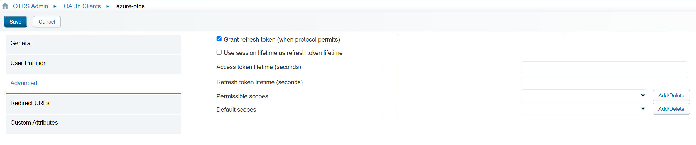

# Configure OpenText Directory Services for automatic user provisioning with Microsoft Entra ID

This article describes the steps you need to perform in both OpenText Directory Services and Microsoft Entra ID to configure automatic user provisioning. When configured, Microsoft Entra ID automatically provisions and de-provisions users and groups to OpenText Directory Services using the Microsoft Entra provisioning service. For important details on what this service does, how it works, and frequently asked questions, see [Automate user provisioning and deprovisioning to SaaS applications with Microsoft Entra ID](~/identity/app-provisioning/user-provisioning.md). 

## Capabilities supported
> [!div class="checklist"]
> * Create users in OpenText Directory Services
> * Remove users in OpenText Directory Services when they don't require access anymore
> * Keep user attributes synchronized between Microsoft Entra ID and OpenText Directory Services
> * Provision groups and group memberships in OpenText Directory Services
> * [Single sign-on](./directory-services-tutorial.md) to OpenText Directory Services (recommended)

## Prerequisites

The scenario outlined in this article assumes that you already have the following prerequisites:

[!INCLUDE [common-prerequisites.md](~/identity/saas-apps/includes/common-prerequisites.md)]
* An OTDS installation accessible by Microsoft Entra ID.

## Step 1: Plan your provisioning deployment
1. Learn about [how the provisioning service works](~/identity/app-provisioning/user-provisioning.md).
2. Determine who's in [scope for provisioning](~/identity/app-provisioning/define-conditional-rules-for-provisioning-user-accounts.md).
3. Determine what data to [map between Microsoft Entra ID and OpenText Directory Services](~/identity/app-provisioning/customize-application-attributes.md). 

## Step 2: Configure OpenText Directory Services to support provisioning with Microsoft Entra ID

> [!NOTE]
> The below steps  apply to an OpenText Directory Services installation. They don't apply for OpenText CoreShare or OpenText OT2 tenants.

1. Create a dedicated confidential **OAuth client**.
2. Set a long **Access token lifetime**.

      

3. don't specify any redirect URLs. They aren't required. 
4. OTDS will generate and display the **client secret**. Save the **client id** and **client secret** in a secure location.

      

5. Create a partition for the users and groups to be synchronized from Microsoft Entra ID.

      

6. Grant administrative rights to the OAuth client you created on the partition you use for the Microsoft Entra users and groups being synchronized.    
      * Partition -> Actions -> Edit Administrators

      

5. A secret token must be retrieved and configured in Microsoft Entra ID. Any HTTP client application can be used for this. Below are steps to retrieve using the Swagger API application included in OTDS.
      * In a web browser, go to {OTDS URL}/otdsws/oauth2
      * Go to /token and select the lock icon at the top right. Enter the OAuth client ID and secret retrieved earlier as the username and password respectively. Select Authorize.

      

6. Select **client_credentials** for the grant_type and select **Execute**.

      

7. The access token in the response should be used in the **Secret Token** field in Microsoft Entra ID.

      

## Step 3: Add OpenText Directory Services from the Microsoft Entra application gallery

Add OpenText Directory Services from the Microsoft Entra application gallery to start managing provisioning to OpenText Directory Services. If you have previously setup OpenText Directory Services for SSO, you can use the same application. However, we recommend that you create a separate app when testing out the integration initially. Learn more about adding an application from the gallery [here](~/identity/enterprise-apps/add-application-portal.md). 

## Step 4: Define who is in scope for provisioning 

[!INCLUDE [create-assign-users-provisioning.md](~/identity/saas-apps/includes/create-assign-users-provisioning.md)]

## Step 5: Configure automatic user provisioning to OpenText Directory Services 

This section guides you through the steps to configure the Microsoft Entra provisioning service to create, update, and disable users and/or groups in TestApp based on user and/or group assignments in Microsoft Entra ID.

### To configure automatic user provisioning for OpenText Directory Services in Microsoft Entra ID:

1. Sign in to the [Microsoft Entra admin center](https://entra.microsoft.com) as at least a [Cloud Application Administrator](~/identity/role-based-access-control/permissions-reference.md#cloud-application-administrator).
1. Browse to **Entra ID** > **Enterprise apps**

	

1. In the applications list, select **OpenText Directory Services**.

	

3. Select the **Provisioning** tab.

	

4. Set the **Provisioning Mode** to **Automatic**.

	

5. Under the **Admin Credentials** section, input your OpenText Directory Services Tenant URL
   * Non-specific tenant URL : {OTDS URL}/scim/{partitionName}
   * Specific tenant URL :  {OTDS URL}/otdstenant/{tenantID}/scim/{partitionName}

6. Enter the Secret Token retrieved from Step 2. Select **Test Connection** to ensure Microsoft Entra ID can connect to OpenText Directory Services. If the connection fails, ensure your OpenText Directory Services account has Admin permissions and try again.

      

6. In the **Notification Email** field, enter the email address of a person or group who should receive the provisioning error notifications and select the **Send an email notification when a failure occurs** check box.

	

7. Select **Save**.

8. Under the **Mappings** section, select **Synchronize Microsoft Entra users to OpenText Directory Services**.

9. Review the user attributes that are synchronized from Microsoft Entra ID to OpenText Directory Services in the **Attribute-Mapping** section. The attributes selected as **Matching** properties are used to match the user accounts in OpenText Directory Services for update operations. If you choose to change the [matching target attribute](~/identity/app-provisioning/customize-application-attributes.md), you need to ensure that the OpenText Directory Services API supports filtering users based on that attribute. Select the **Save** button to commit any changes.

   |Attribute|Type|
   |---|---|
   |userName|String|
   |active|Boolean|
   |displayName|String|
   |title|String|
   |emails[type eq "work"].value|String|
   |preferredLanguage|String|
   |name.givenName|String|
   |name.familyName|String|
   |name.formatted|String|
   |addresses[type eq "work"].formatted|String|
   |addresses[type eq "work"].streetAddress|String|
   |addresses[type eq "work"].locality|String|
   |addresses[type eq "work"].region|String|
   |addresses[type eq "work"].postalCode|String|
   |addresses[type eq "work"].country|String|
   |phoneNumbers[type eq "work"].value|String|
   |phoneNumbers[type eq "mobile"].value|String|
   |phoneNumbers[type eq "fax"].value|String|
   |externalId|String|
   |urn:ietf:params:scim:schemas:extension:enterprise:2.0:User:employeeNumber|String|
   |urn:ietf:params:scim:schemas:extension:enterprise:2.0:User:department|String|
   |urn:ietf:params:scim:schemas:extension:enterprise:2.0:User:manager|Reference| 

10. Under the **Mappings** section, select **Synchronize Microsoft Entra groups to OpenText Directory Services**.

11. Review the group attributes that are synchronized from Microsoft Entra ID to OpenText Directory Services in the **Attribute-Mapping** section. The attributes selected as **Matching** properties are used to match the groups in OpenText Directory Services for update operations. Select the **Save** button to commit any changes.

      |Attribute|Type|
      |---|---|
      |displayName|String|
      |externalId|String|
      |members|Reference|

12. To configure scoping filters, refer to the following instructions provided in the [Scoping filter  article](~/identity/app-provisioning/define-conditional-rules-for-provisioning-user-accounts.md).

13. To enable the Microsoft Entra provisioning service for OpenText Directory Services, change the **Provisioning Status** to **On** in the **Settings** section.

	

14. Define the users and/or groups that you would like to provision to OpenText Directory Services by choosing the desired values in **Scope** in the **Settings** section.

	

15. When you're ready to provision, select **Save**.

	

This operation starts the initial synchronization cycle of all users and groups defined in **Scope** in the **Settings** section. The initial cycle takes longer to perform than subsequent cycles, which occur approximately every 40 minutes as long as the Microsoft Entra provisioning service is running. 

## Step 6: Monitor your deployment

[!INCLUDE [monitor-deployment.md](~/identity/saas-apps/includes/monitor-deployment.md)]

## Additional resources

* [Managing user account provisioning for Enterprise Apps](~/identity/app-provisioning/configure-automatic-user-provisioning-portal.md)
* [What is application access and single sign-on with Microsoft Entra ID?](~/identity/enterprise-apps/what-is-single-sign-on.md)

## Related content

* [Learn how to review logs and get reports on provisioning activity](~/identity/app-provisioning/check-status-user-account-provisioning.md)
