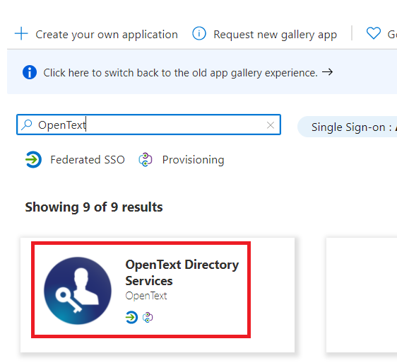
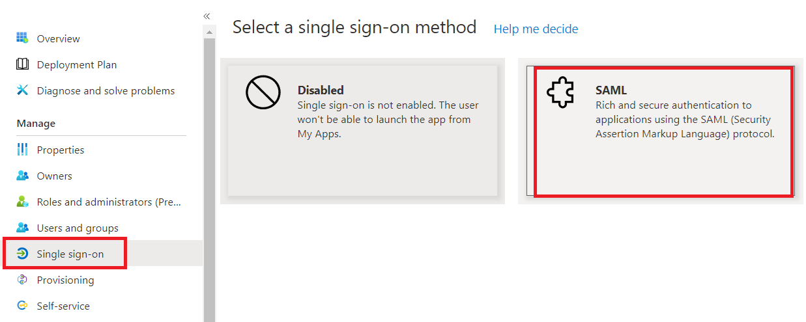
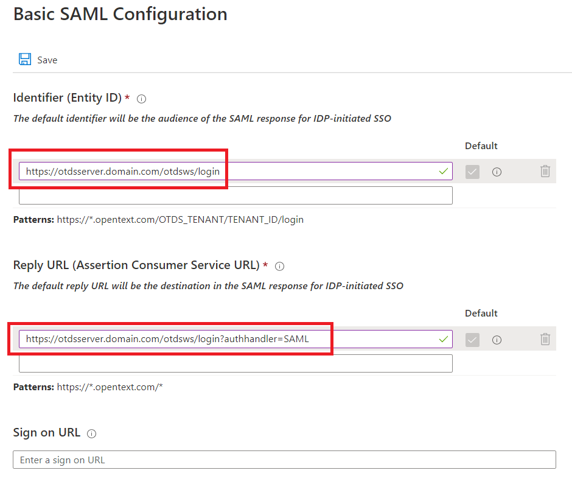
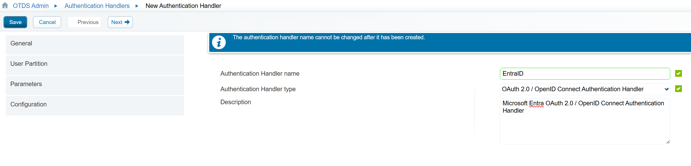
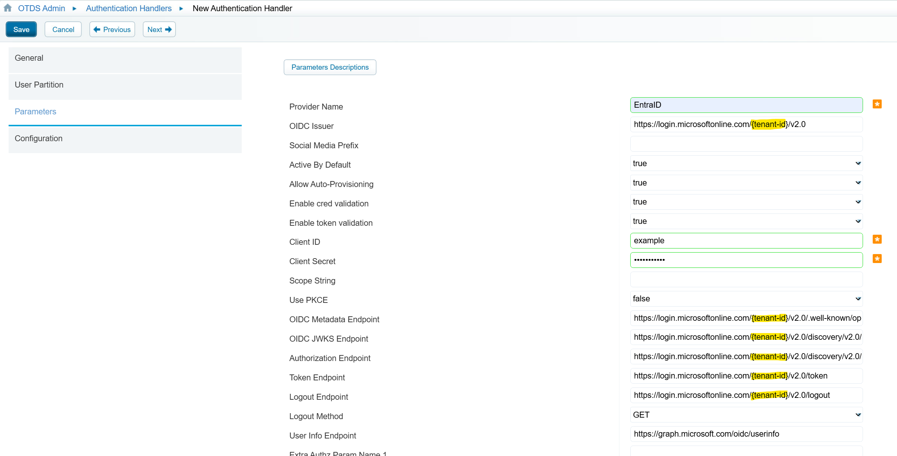
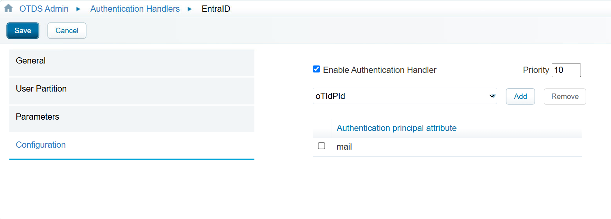
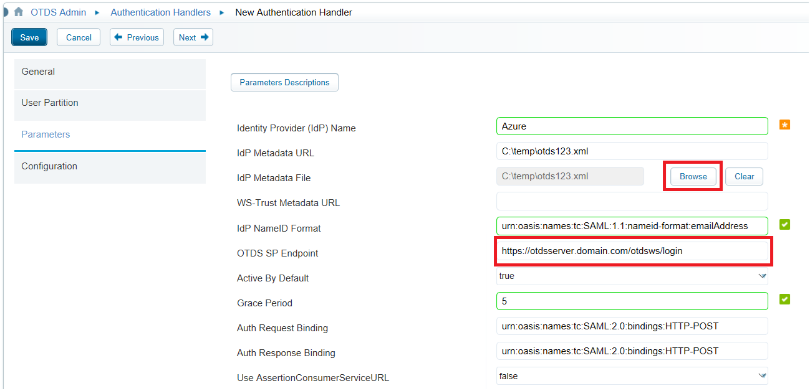
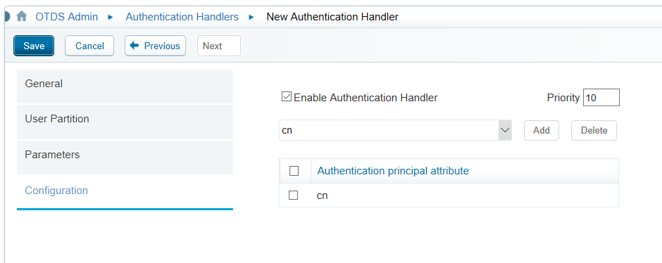

# Microsoft Entra SSO integration with OpenText Directory Services (OTDS)

In this article, you will learn how to integrate OpenText Directory Services (OTDS) with Microsoft Entra ID. When you integrate OTDS with Microsoft Entra ID, you can:

* Control in Microsoft Entra ID who has access to OTDS.
* Enable your users to be automatically signed-in to OTDS with their Microsoft Entra accounts.
* Manage your accounts in one central location.

## Prerequisites

The scenario outlined in this article assumes that you already have the following prerequisites:

[!INCLUDE [common-prerequisites.md](~/identity/saas-apps/includes/common-prerequisites.md)]
* OpenText Directory Services (OTDS).

## Scenario description

In this article,  you configure and test Microsoft Entra SSO in a test environment.

* OTDS supports both **SAML** and **OIDC** authentication
* OTDS supports **SP and IDP** initiated SSO.
* OTDS supports **Just In Time** user provisioning.
* OTDS supports [Automated user provisioning](open-text-directory-services-provisioning-tutorial.md).

## Add Directory Services from the gallery

To configure the integration of Directory Services into Microsoft Entra ID, you need to add Directory Services from the gallery to your list of managed SaaS apps.

1. Sign in to the [Microsoft Entra admin center](https://entra.microsoft.com) as at least a [Cloud Application Administrator](~/identity/role-based-access-control/permissions-reference.md#cloud-application-administrator).
1. Browse to **Entra ID** > **Enterprise apps** > **New application**.
1. In the **Add from the gallery** section, type **OpenText** in the search box.

1. Select **OpenText Directory Services** from results panel and then add the app. Wait a few seconds while the app is added to your tenant.

 [!INCLUDE [sso-wizard.md](~/identity/saas-apps/includes/sso-wizard.md)]

## Configure and test Microsoft Entra SSO for OpenText Directory Services

Configure and test Microsoft Entra SSO with OTDS using a test user, for example **B.Simon**. For SSO to work, you need to establish a link relationship between a Microsoft Entra user and the related user in Directory Services.

To configure and test Microsoft Entra SSO with Directory Services, perform the following steps:

1. **[Configure Microsoft Entra SSO](#configure-azure-ad-sso)** - to enable your users to use this feature.
    1. **Create a Microsoft Entra test user** - to test Microsoft Entra single sign-on with B.Simon.
    1. **Assign the Microsoft Entra test user** - to enable B.Simon to use Microsoft Entra single sign-on.
1. **[Configure OTDS SSO](#configure-directory-services-sso)** - to configure the single sign-on settings on application side.
    1. **[Create OTDS test user](#create-directory-services-test-user)** - to have a counterpart of B.Simon in Directory Services that's linked to the Microsoft Entra representation of user.
1. **[Test SSO](#test-sso)** - to verify whether the configuration works.

## Configure Microsoft Entra SSO

### OIDC Authentication
Follow these steps to enable Microsoft Entra SSO using OIDC Authentication. See [OpenID Connect on the Microsoft identity platform](~/identity-platform/v2-protocols-oidc) for background information.

The *ID token* introduced by OpenID Connect is issued by the authorization server, the Microsoft identity platform, when the client application requests one during user authentication. The ID token enables a client application to verify the identity of the user and to get other information (claims) about them.

ID tokens aren't issued by default for an application registered with the Microsoft identity platform. ID tokens for an application are enabled by using one of the following methods:

1. Sign in to the [Microsoft Entra admin center](https://entra.microsoft.com).
1. Browse to **Entra ID** > **App registrations** > **OpenText Directory Services** > **Authentication**.
1. Under **Platform configurations**, select **Add a platform**. 
1. In the pane that opens, select the appropriate platform for your application. For example, select **Web** for a web application.
1. Under Redirect URIs, add the redirect URI of your application. For example, `https://localhost:8080/`.
1. Under **Implicit grant and hybrid flows**, select the **ID tokens (used for implicit and hybrid flows)** checkbox.

Or:

1. Select **Entra ID** > **App registrations** > **OpenText Directory Services** > **Manifest**.
1. Set `oauth2AllowIdTokenImplicitFlow` to `true` in the app registration's [application manifest](reference-app-manifest.md).

If ID tokens aren't enabled for your app and one is requested, the Microsoft identity platform returns an `unsupported_response` error similar to:

> *The provided value for the input parameter 'response_type' isn't allowed for this client. Expected value is 'code'*.

### SAML Authentication
Follow these steps to enable Microsoft Entra SSO using SAML Authentication.

1. Sign in to the [Microsoft Entra admin center](https://entra.microsoft.com) as at least a [Cloud Application Administrator](~/identity/role-based-access-control/permissions-reference.md#cloud-application-administrator).
1. Browse to **Entra ID** > **Enterprise apps** > **OpenText Directory Services** > **Single sign-on**.
1. On the **Select a single sign-on method** page, select **SAML**.

   

1. On the **Set up single sign-on with SAML** page, select the pencil icon for **Basic SAML Configuration** to edit the settings.

   

1. On the **Basic SAML Configuration** section, perform the following steps:

   

    a. In the **Identifier** text box, type a URL using one of the following patterns:

    | Identifier |
    |------------|
    | `https://<HOSTNAME.DOMAIN.com>/otdsws/login` |
    | `https://<HOSTNAME.DOMAIN.com>/<OTDS_TENANT>/<TENANTID>/otdsws/login` |
    | `https://<HOSTNAME.DOMAIN.com>/otdsws/<OTDS_TENANT>/<TENANTID>/login` |
    | `https://<HOSTNAME.DOMAIN.com>/<OTDS_TENANT>/<TENANTID>/login` |

    b. In the **Reply URL** text box, type a URL using one of the following patterns:

    | Reply URL |
    |------------|
    | `https://<HOSTNAME.DOMAIN.com>/otdsws/login?authhandler=<AUTH-HANDLER-NAME>` |
    | `https://<HOSTNAME.DOMAIN.com>/<OTDS_TENANT>/<TENANTID>/otdsws/login?authhandler=<AUTH-HANDLER-NAME>` |
    | `https://<HOSTNAME.DOMAIN.com>/otdsws/<OTDS_TENANT>/<TENANTID>/login?authhandler=<AUTH-HANDLER-NAME>` |
    | `https://<HOSTNAME.DOMAIN.com>/<OTDS_TENANT>/<TENANTID>/login?authhandler=<AUTH-HANDLER-NAME>` |

1. Perform the following step, if you wish to configure the application in **SP** initiated mode:

    In the **Sign-on URL** text box, type a URL using one of the following patterns:
    
    | Sign-on URL |
    |------------|
    | `https://<HOSTNAME.DOMAIN.com>/otdsws/login` |
    | `https://<HOSTNAME.DOMAIN.com>/<OTDS_TENANT>/<TENANTID>/otdsws/login` |
    | `https://<HOSTNAME.DOMAIN.com>/otdsws/<OTDS_TENANT>/<TENANTID>/login` |
    | `https://<HOSTNAME.DOMAIN.com>/<OTDS_TENANT>/<TENANTID>/login` |

1. On the **Set up single sign-on with SAML** page, In the **SAML Signing Certificate** section, select copy button to copy **App Federation Metadata Url** and save it on your computer.

	

> [!NOTE]
> These values are examples. Update these values with the actual Identifier, Reply URL and Sign-on URL. Contact [Directory Services support team](mailto:support@opentext.com) to get these values. You can also refer to the patterns shown above in the **Basic SAML Configuration** section. Alternatively, if you have already setup the Authentication Handler in OTDS, you can get the configuration xml from `https://<HOSTNAME.DOMAIN.com>/otdsws/login?SAMLMetadata=<AUTH-HANDLER-NAME>`.

[!INCLUDE [create-assign-users-sso.md](~/identity/saas-apps/includes/create-assign-users-sso.md)]

## Configure OpenText Directory Services (OTDS) Authentication Handlers

OTDS can be configured to use OIDC or SAML as required for Single Sign-On.

### OIDC Authentication
To configure single sign-on on **OTDS** side, you need the **OpenID Configuration URL**: `https://login.microsoftonline.com/{tenant-id}/v2.0/.well-known/openid-configuration`

In OTDS, create a OAuth 2.0 / OpenID Connect Authentication Handler

* In the **Parameters** tab, update the following:

| Parameter | Value |
| --- | --- |
| Provider Name | EntraID *(for example)* |
| OIDC Issuer | **issuer** value from openid-configuration URL, for example: `https://login.microsoftonline.com/{tenant-id}/v2.0` |
| Client ID | <client_id> value form Entra configuration |
| Client Secret | <client_secret> value form Entra configuration |
| Scope String | **openid profile email User.Read** |
| OIDC Metadata Endpoint | openid-configuration URL, for example: `https://login.microsoftonline.com/{tenant-id}/v2.0/.well-known/openid-configuration` |
| OIDC JWKS Endpoint | **jwks_uri** value from openid-configuration URL, for example: `https://login.microsoftonline.com/{tenant-id}/v2.0/discovery/v2.0/keys` |
| Authorization Endpoint | **authorization_endpoint** value from openid-configuration URL, for example: `https://login.microsoftonline.com/{tenant-id}/v2.0/discovery/v2.0/authorize` |
| Token Endpoint | **token_endpoint** value from openid-configuration URL, for example: `https://login.microsoftonline.com/{tenant-id}/v2.0/token` |
| Logout Endpoint | **end_session_endpoint** value from openid-configuration URL, for example: `https://login.microsoftonline.com/{tenant-id}/v2.0/logout` |
| Logout Method | GET |
| User Info Endpoint | **userinfo_endpoint** value from openid-configuration URL, for example: `https://graph.microsoft.com/oidc/userinfo` |
| User Identifier Field | **userPrincipalName** | 

> [!NOTE]
> If you set the OIDC Metadata Endpoint, there is no need to configure the other URL's as they will be automatically populated.
> Set the **Enable cred validation** and **Enable token validation** as required.

* In the **Configuration** tab, update the Authentication principall attribute to **mail**

* Save the authentication handler and attempt to access the application. You should now be automatically redirected to Entra and be able to sign in.

### SAML Authentication
To configure single sign-on on **OTDS** side, you need to send the **App Federation Metadata Url** or **App Federation Metadata XML** to [Directory Services support team](mailto:support@opentext.com). They set this setting to have the SAML SSO connection set properly on both sides.

If you have access to your own OTDS installation, you can perform the following steps

In OTDS, create a SAML 2.0 Authentication Handler.
* In the **Parameters** tab:
    * Select Browse to select the metadata file downloaded above
    * Configure the OTDS SP Endpoint to be the exact same URL entered into Azure AD above

   

* In the **Configuration** tab:
    * If you used the default settings in the attribute mappings on Azure AD, set the authentication principal attribute to cn.

   

* Save the authentication handler and attempt to access the application. You should now be automatically redirected to Entra and be able to sign in.

> [!NOTE]
> There is no need to configure certificates on the OTDS side since Azure AD does not expect or require applications to sign their SAML authentication requests. However, should you require Single Logout (SLO) out to be initiated from OTDS, you must configure signing on the authentication handler. See the latest OpenText Directory Services Installation and Administration Guide for details.
> Enabling Single Logout (SLO) out may in turn require that the **XML Signature Algorithm** is changed from `http://www.w3.org/2000/09/xmldsig#rsa-sha1` to `http://www.w3.org/2001/04/xmldsig-more#rsa-sha256`

> [!NOTE]
> Once the Authentication handler has been created, the configuration is available for download via the following URL: `https://<HOSTNAME.DOMAIN.com>/otdsws/login?SAMLMetadata=<AUTH-HANDLER-NAME>`. You can download this XML for comparison / import in Entra if required.

> [!NOTE]
> OTDS also supports automatic user provisioning, you can find more details [here](./open-text-directory-services-provisioning-tutorial.md) on how to configure automatic user provisioning.

## Test SSO 

In this section, you test your Microsoft Entra single sign-on configuration with following options. 

* Select **Test this application**, this option redirects to Directory Services Sign-on URL where you can initiate the login flow.  

* Go to Directory Services Sign-on URL directly and initiate the login flow from there.