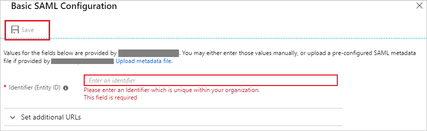
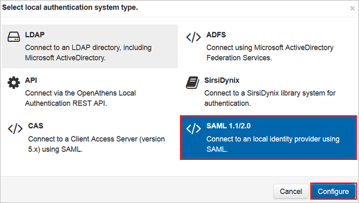
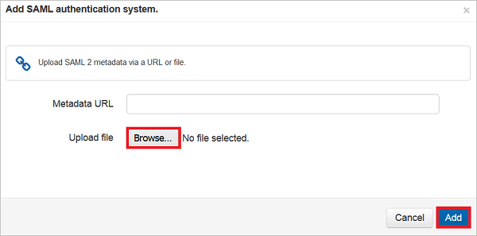
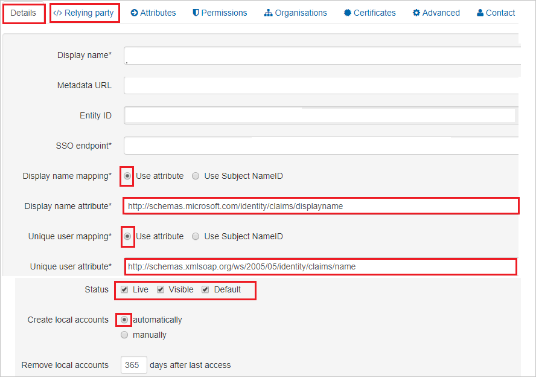
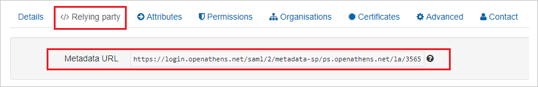

# Configure OpenAthens for Single sign-on with Microsoft Entra ID

In this article,  you learn how to integrate OpenAthens with Microsoft Entra ID. When you integrate OpenAthens with Microsoft Entra ID, you can:

* Control in Microsoft Entra ID who has access to OpenAthens.
* Enable your users to be automatically signed-in to OpenAthens with their Microsoft Entra accounts.
* Manage your accounts in one central location.

## Prerequisites

The scenario outlined in this article assumes that you already have the following prerequisites:

[!INCLUDE [common-prerequisites.md](~/identity/saas-apps/includes/common-prerequisites.md)]
* OpenAthens single sign-on (SSO) enabled subscription.

## Scenario description

In this article,  you configure and test Microsoft Entra SSO in a test environment.

* OpenAthens supports **IDP** initiated SSO
* OpenAthens supports **Just In Time** user provisioning

## Add OpenAthens from the gallery

To configure the integration of OpenAthens into Microsoft Entra ID, you need to add OpenAthens from the gallery to your list of managed SaaS apps.

1. Sign in to the [Microsoft Entra admin center](https://entra.microsoft.com) as at least a [Cloud Application Administrator](~/identity/role-based-access-control/permissions-reference.md#cloud-application-administrator).
1. Browse to **Entra ID** > **Enterprise apps** > **New application**.
1. In the **Add from the gallery** section, type **OpenAthens** in the search box.
1. Select **OpenAthens** from results panel and then add the app. Wait a few seconds while the app is added to your tenant.

 [!INCLUDE [sso-wizard.md](~/identity/saas-apps/includes/sso-wizard.md)]

## Configure and test Microsoft Entra SSO for OpenAthens

Configure and test Microsoft Entra SSO with OpenAthens using a test user called **B.Simon**. For SSO to work, you need to establish a link relationship between a Microsoft Entra user and the related user in OpenAthens.

To configure and test Microsoft Entra SSO with OpenAthens, perform the following steps:

1. **[Configure Microsoft Entra SSO](#configure-azure-ad-sso)** - to enable your users to use this feature.
    * **Create a Microsoft Entra test user** - to test Microsoft Entra single sign-on with B.Simon.
    * **Assign the Microsoft Entra test user** - to enable B.Simon to use Microsoft Entra single sign-on.
1. **[Configure OpenAthens SSO](#configure-openathens-sso)** - to configure the single sign-on settings on application side.
    * **[Create OpenAthens test user](#create-openathens-test-user)** - to have a counterpart of B.Simon in OpenAthens that's linked to the Microsoft Entra representation of user.
1. **[Test SSO](#test-sso)** - to verify whether the configuration works.

## Configure Microsoft Entra SSO

Follow these steps to enable Microsoft Entra SSO.

1. Sign in to the [Microsoft Entra admin center](https://entra.microsoft.com) as at least a [Cloud Application Administrator](~/identity/role-based-access-control/permissions-reference.md#cloud-application-administrator).
1. Browse to **Entra ID** > **Enterprise apps** > **OpenAthens** > **Single sign-on**.
1. On the **Select a single sign-on method** page, select **SAML**.
1. On the **Set up single sign-on with SAML** page, select the pencil icon for **Basic SAML Configuration** to edit the settings.

   

1. On the **Basic SAML Configuration** section, upload the **Service Provider metadata file**, the steps for which are mentioned later in this article.

	a. Select **Upload metadata file**.

    

	b. Select **folder logo** to select the metadata file and select **Upload**.

	

	c. Once the metadata file is successfully uploaded, the **Identifier** value get auto populated in **Basic SAML Configuration** section textbox:

    

1. On the **Set up single sign-on with SAML** page, in the **SAML Signing Certificate** section,  find **Federation Metadata XML** and select **Download** to download the certificate and save it on your computer.

	

1. On the **Set up OpenAthens** section, copy the appropriate URL(s) based on your requirement.

	

[!INCLUDE [create-assign-users-sso.md](~/identity/saas-apps/includes/create-assign-users-sso.md)]

## Configure OpenAthens SSO

1. In a different web browser window, sign in to your OpenAthens company site as an administrator.

1. Select **Connections** from the list under the **Management** tab.

1. Select **SAML 1.1/2.0**, and then select the **Configure** button.

	

1. To add the configuration, select the **Browse** button to upload the metadata .xml file that you downloaded, and then select **Add**.

	

1. Perform the following steps under the **Details** tab.

	

	a. In **Display name mapping**, select **Use attribute**.

	b. In the **Display name attribute** text box, enter the value `http://schemas.microsoft.com/identity/claims/displayname`.

	c. In **Unique user mapping**, select **Use attribute**.

	d. In the **Unique user attribute** text box, enter the value `http://schemas.xmlsoap.org/ws/2005/05/identity/claims/name`.

	e. In **Status**, select all the three check boxes.

	f. In **Create local accounts**, select **automatically**.

	g. Select **Save changes**.

    h. From the **</> Relying Party** tab, copy the **Metadata URL** and open this in the browser to download the **SP metadata XML** file. Upload this SP metadata file on the **Basic SAML Configuration** section in Microsoft Entra ID.

    

### Create OpenAthens test user

In this section, a user called Britta Simon is created in OpenAthens. OpenAthens supports **just-in-time user provisioning**, which is enabled by default. There's no action item for you in this section. If a user doesn't already exist in OpenAthens, a new one is created after authentication.

## Test SSO

In this section, you test your Microsoft Entra single sign-on configuration with following options.

* Select **Test this application**, and you should be automatically signed in to the OpenAthens for which you set up the SSO.

* You can use Microsoft My Apps. When you select the OpenAthens tile in the My Apps, you should be automatically signed in to the OpenAthens for which you set up the SSO. For more information about the My Apps, see [Introduction to the My Apps](https://support.microsoft.com/account-billing/sign-in-and-start-apps-from-the-my-apps-portal-2f3b1bae-0e5a-4a86-a33e-876fbd2a4510).

## Related content

Once you configure OpenAthens you can enforce session control, which protects exfiltration and infiltration of your organization’s sensitive data in real time. Session control extends from Conditional Access. [Learn how to enforce session control with Microsoft Defender for Cloud Apps](/cloud-app-security/proxy-deployment-any-app).
