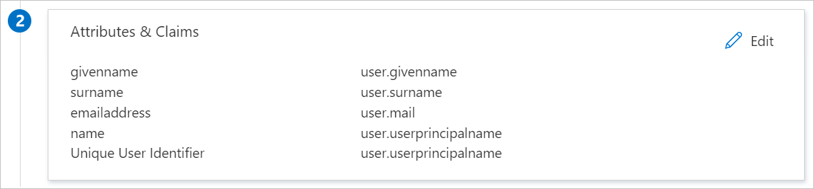

# Configure OpenLearning for Single sign-on with Microsoft Entra ID

In this article,  you learn how to integrate OpenLearning with Microsoft Entra ID. When you integrate OpenLearning with Microsoft Entra ID, you can:

* Control in Microsoft Entra ID who has access to OpenLearning.
* Enable your users to be automatically signed-in to OpenLearning with their Microsoft Entra accounts.
* Manage your accounts in one central location.

## Prerequisites

The scenario outlined in this article assumes that you already have the following prerequisites:

[!INCLUDE [common-prerequisites.md](~/identity/saas-apps/includes/common-prerequisites.md)]
* OpenLearning single sign-on (SSO) enabled subscription.

> [!NOTE]
> This integration is also available to use from Microsoft Entra US Government Cloud environment. You can find this application in the Microsoft Entra US Government Cloud Application Gallery and configure it in the same way as you do from public cloud.

## Scenario description

In this article,  you configure and test Microsoft Entra SSO in a test environment.

* OpenLearning supports **SP** initiated SSO.

## Add OpenLearning from the gallery

To configure the integration of OpenLearning into Microsoft Entra ID, you need to add OpenLearning from the gallery to your list of managed SaaS apps.

1. Sign in to the [Microsoft Entra admin center](https://entra.microsoft.com) as at least a [Cloud Application Administrator](~/identity/role-based-access-control/permissions-reference.md#cloud-application-administrator).
1. Browse to **Entra ID** > **Enterprise apps** > **New application**.
1. In the **Add from the gallery** section, type **OpenLearning** in the search box.
1. Select **OpenLearning** from results panel and then add the app. Wait a few seconds while the app is added to your tenant.

 [!INCLUDE [sso-wizard.md](~/identity/saas-apps/includes/sso-wizard.md)]

## Configure and test Microsoft Entra SSO for OpenLearning

Configure and test Microsoft Entra SSO with OpenLearning using a test user called **B.Simon**. For SSO to work, you need to establish a link relationship between a Microsoft Entra user and the related user in OpenLearning.

To configure and test Microsoft Entra SSO with OpenLearning, perform the following steps:

1. **[Configure Microsoft Entra SSO](#configure-azure-ad-sso)** - to enable your users to use this feature.
    1. **Create a Microsoft Entra test user** - to test Microsoft Entra single sign-on with B.Simon.
    1. **Assign the Microsoft Entra test user** - to enable B.Simon to use Microsoft Entra single sign-on.
1. **[Configure OpenLearning SSO](#configure-openlearning-sso)** - to configure the single sign-on settings on application side.
    1. **[Create OpenLearning test user](#create-openlearning-test-user)** - to have a counterpart of B.Simon in OpenLearning that's linked to the Microsoft Entra representation of user.
1. **[Test SSO](#test-sso)** - to verify whether the configuration works.

## Configure Microsoft Entra SSO

Follow these steps to enable Microsoft Entra SSO.

1. Sign in to the [Microsoft Entra admin center](https://entra.microsoft.com) as at least a [Cloud Application Administrator](~/identity/role-based-access-control/permissions-reference.md#cloud-application-administrator).
1. Browse to **Entra ID** > **Enterprise apps** > **OpenLearning** > **Single sign-on**.
1. On the **Select a single sign-on method** page, select **SAML**.
1. On the **Set up single sign-on with SAML** page, select the pencil icon for **Basic SAML Configuration** to edit the settings.

   

1. On the **Basic SAML Configuration** section, if you have **Service Provider metadata file**, perform the following steps:

	a. Select **Upload metadata file**.

    

	b. Select **folder logo** to select the metadata file and select **Upload**.

	

	c. After the metadata file is successfully uploaded, the **Identifier** value gets auto populated in Basic SAML Configuration section.

	d. In the **Sign-on URL** text box, type a URL using the following pattern:
    `https://www.openlearning.com/saml-redirect/<institution_id>/<idp_name>/`

	> [!Note]
	> If the **Identifier** value doesn't get auto populated, then please fill in the value manually according to your requirement. The Sign-on URL value isn't real. Update this value with the actual Sign-on URL. Contact [OpenLearning Client support team](mailto:dev@openlearning.com) to get this value. You can also refer to the patterns shown in the **Basic SAML Configuration** section.

1. OpenLearning Identity Authentication application expects the SAML assertions in a specific format, which requires you to add custom attribute mappings to your SAML token attributes configuration. The following screenshot shows the list of default attributes.

	

1. In addition to above, OpenLearning Identity Authentication application expects few more attributes to be passed back in SAML response which are shown below. These attributes are also pre populated but you can review them as per your requirements.

    | Name | Source Attribute|
	| ---------------| --------------- |
    | urn:oid:0.9.2342.19200300.100.1.3 | user.mail |
    | urn:oid:2.16.840.1.113730.3.1.241 | user.displayname |
    | urn:oid:1.3.6.1.4.1.5923.1.1.1.9 | user.extensionattribute1 |
    | urn:oid:1.3.6.1.4.1.5923.1.1.1.6 | user.objectid |
    | urn:oid:2.5.4.10 | user.companyname |

1. On the **Set up single sign-on with SAML** page, in the **SAML Signing Certificate** section,  find **Certificate (Base64)** and select **Download** to download the certificate and save it on your computer.

	

1. On the **Set up OpenLearning** section, copy the appropriate URL(s) based on your requirement.

	
	
1. OpenLearning application expects to enable token encryption in order to make SSO work. To activate token encryption, Browse to **Entra ID** > **Enterprise apps** > select your application > **Token encryption**. For more information see the article [Configure Microsoft Entra SAML token encryption](~/identity/enterprise-apps/howto-saml-token-encryption.md).

[!INCLUDE [create-assign-users-sso.md](~/identity/saas-apps/includes/create-assign-users-sso.md)]

## Configure OpenLearning SSO

1. Log in to your OpenLearning company site as an administrator.

1. Go to **SETTINGS** > **Integrations** and select **ADD** under SAML Identity Provider(IDP) Configuration.

1. In the **SAML Identity Provider** page, perform the following steps:

    

    1. In the **Name (required)** textbox, type a short configuration name.

    1. Copy **Reply(ACS) Url** value, paste this value into the **Reply URL** text box in the **Basic SAML Configuration** section.

    1. In the **Entity ID/Issuer URL (required)** textbox, paste the **Microsoft Entra Identifier** value which you copied previously.

    1. In the **Sign-In URL (required)** textbox, paste the **Login URL** value which you copied previously.

    1. Open the downloaded **Certificate (Base64)** into Notepad and paste the content into the **Certificate (required)** textbox.

    1. Download the **Metadata XML** into Notepad and upload the file into **Basic SAML Configuration** section.

    1. Select **Save**.

### Create OpenLearning test user

In this section, a user called Britta Simon is created in OpenLearning. OpenLearning supports just-in-time user provisioning, which is enabled by default. There's no action item for you in this section. If a user doesn't already exist in OpenLearning, a new one is created after authentication.

## Test SSO 

In this section, you test your Microsoft Entra single sign-on configuration with following options. 

* Select **Test this application**, this option redirects to OpenLearning Sign-on URL where you can initiate the login flow. 

* Go to OpenLearning Sign-on URL directly and initiate the login flow from there.

* You can use Microsoft My Apps. When you select the OpenLearning tile in the My Apps, this option redirects to OpenLearning Sign-on URL. For more information, see [Microsoft Entra My Apps](/azure/active-directory/manage-apps/end-user-experiences#azure-ad-my-apps).

## Related content

Once you configure OpenLearning you can enforce session control, which protects exfiltration and infiltration of your organization’s sensitive data in real time. Session control extends from Conditional Access. [Learn how to enforce session control with Microsoft Cloud App Security](/cloud-app-security/proxy-deployment-aad).
