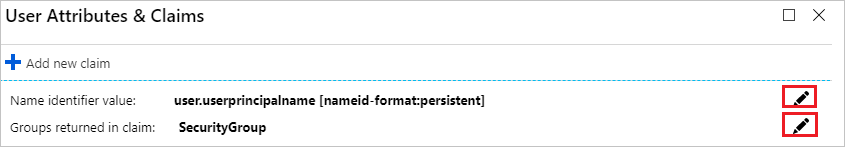
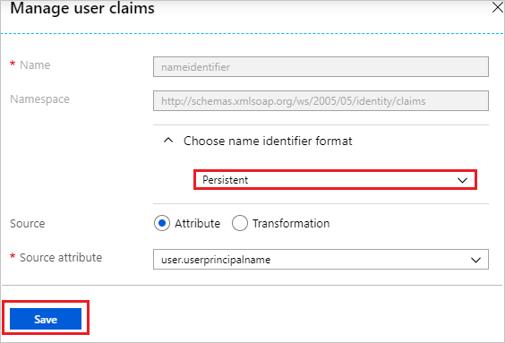
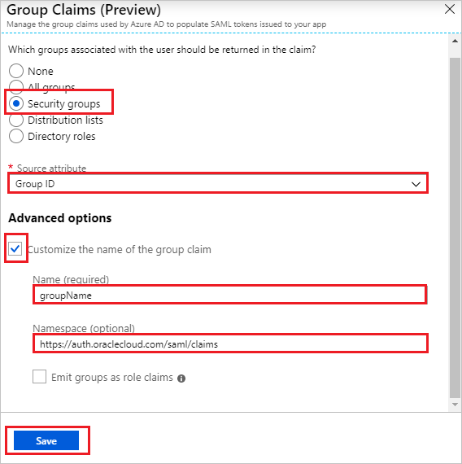
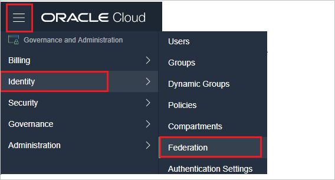
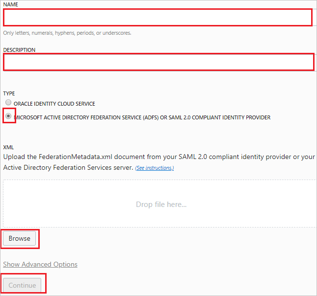
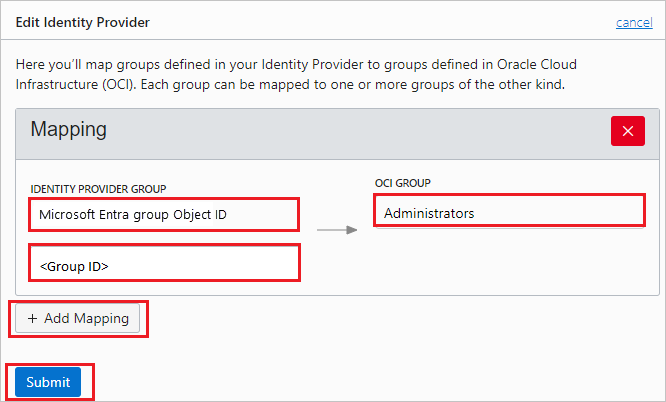
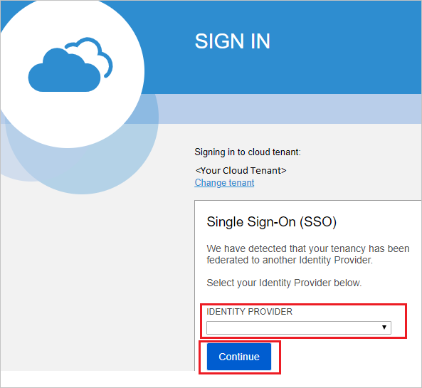

# Configure Oracle Cloud Infrastructure Console for Single sign-on with Microsoft Entra ID

In this article,  you learn how to integrate Oracle Cloud Infrastructure Console with Microsoft Entra ID. When you integrate Oracle Cloud Infrastructure Console with Microsoft Entra ID, you can:

* Control in Microsoft Entra ID who has access to Oracle Cloud Infrastructure Console.
* Enable your users to be automatically signed-in to Oracle Cloud Infrastructure Console with their Microsoft Entra accounts.
* Manage your accounts in one central location.

## Prerequisites

The scenario outlined in this article assumes that you already have the following prerequisites:

[!INCLUDE [common-prerequisites.md](~/identity/saas-apps/includes/common-prerequisites.md)]
* Oracle Cloud Infrastructure Console single sign-on (SSO) enabled subscription.

> [!NOTE]
> This integration is also available to use from Microsoft Entra US Government Cloud environment. You can find this application in the Microsoft Entra US Government Cloud Application Gallery and configure it in the same way as you do from public cloud.

## Scenario description

In this article,  you configure and test Microsoft Entra SSO in a test environment.

* Oracle Cloud Infrastructure Console supports **SP** initiated SSO.
* Oracle Cloud Infrastructure Console supports [**Automated** user provisioning and deprovisioning](oracle-cloud-infrastructure-console-provisioning-tutorial.md) (recommended).

## Add Oracle Cloud Infrastructure Console from the gallery

To configure the integration of Oracle Cloud Infrastructure Console into Microsoft Entra ID, you need to add Oracle Cloud Infrastructure Console from the gallery to your list of managed SaaS apps.

1. Sign in to the [Microsoft Entra admin center](https://entra.microsoft.com) as at least a [Cloud Application Administrator](~/identity/role-based-access-control/permissions-reference.md#cloud-application-administrator).
1. Browse to **Entra ID** > **Enterprise apps** > **New application**.
1. In the **Add from the gallery** section, type **Oracle Cloud Infrastructure Console** in the search box.
1. Select **Oracle Cloud Infrastructure Console** from results panel and then add the app. Wait a few seconds while the app is added to your tenant.

 [!INCLUDE [sso-wizard.md](~/identity/saas-apps/includes/sso-wizard.md)]

## Configure and test Microsoft Entra SSO

Configure and test Microsoft Entra SSO with Oracle Cloud Infrastructure Console using a test user called **B. Simon**. For SSO to work, you need to establish a link relationship between a Microsoft Entra user and the related user in Oracle Cloud Infrastructure Console.

To configure and test Microsoft Entra SSO with Oracle Cloud Infrastructure Console, perform the following steps:

1. **[Configure Microsoft Entra SSO](#configure-azure-ad-sso)** to enable your users to use this feature.
   1. **Create a Microsoft Entra test user** to test Microsoft Entra single sign-on with B. Simon.
   1. **Assign the Microsoft Entra test user** to enable B. Simon to use Microsoft Entra single sign-on.
1. **[Configure Oracle Cloud Infrastructure Console SSO](#configure-oracle-cloud-infrastructure-console-sso)** to configure the SSO settings on application side.
   1. **[Create Oracle Cloud Infrastructure Console test user](#create-oracle-cloud-infrastructure-console-test-user)** to have a counterpart of B. Simon in Oracle Cloud Infrastructure Console that's linked to the Microsoft Entra representation of user.
1. **[Test SSO](#test-sso)** to verify whether the configuration works.

## Configure Microsoft Entra SSO

Follow these steps to enable Microsoft Entra SSO.

1. Sign in to the [Microsoft Entra admin center](https://entra.microsoft.com) as at least a [Cloud Application Administrator](~/identity/role-based-access-control/permissions-reference.md#cloud-application-administrator).
1. Browse to **Entra ID** > **Enterprise apps** > **Oracle Cloud Infrastructure Console** application integration page, find the **Manage** section and select **Single sign-on**.
1. On the **Select a Single sign-on method** page, select **SAML**.
1. On the **Set up Single Sign-On with SAML** page, select the pencil icon for **Basic SAML Configuration** to edit the settings.

   

1. On the **Basic SAML Configuration** section, perform the following steps:

   > [!NOTE]
   > You get the Service Provider metadata file from the **Configure Oracle Cloud Infrastructure Console Single Sign-On** section of the article.
	
   1. Select **Upload metadata file**.

   1. Select **folder logo** to select the metadata file and select **Upload**.

   1. Once the metadata file is successfully uploaded, the **Identifier** and **Reply URL** values get auto populated in **Basic SAML Configuration** section textbox.
	
      > [!NOTE]
      > If the **Identifier** and **Reply URL** values don't get auto populated, then fill in the values manually according to your requirement.

      In the **Sign-on URL** text box, type a URL using the following pattern:
      `https://cloud.oracle.com/?region=<REGIONNAME>`

      > [!NOTE]
      > The value isn't real. Update the value with the actual Sign-On URL. Contact [Oracle Cloud Infrastructure Console Client support team](https://www.oracle.com/support/advanced-customer-services/cloud/) to get the value. You can also refer to the patterns shown in the **Basic SAML Configuration** section.

1. On the **Set up Single Sign-On with SAML** page, in the **SAML Signing Certificate** section, find **Federation Metadata XML** and select **Download** to download the certificate and save it on your computer.

   

1. Oracle Cloud Infrastructure Console application expects the SAML assertions in a specific format, which requires you to add custom attribute mappings to your SAML token attributes configuration. The following screenshot shows the list of default attributes. Select **Edit** icon to open User Attributes dialog.

   

1. In addition to above, Oracle Cloud Infrastructure Console application expects few more attributes to be passed back in SAML response. In the **User Attributes & Claims** section on the **Group Claims (Preview)** dialog, perform the following steps:

   1. Select the **pen** next to **Name identifier value**.

   1. Select **Persistent** as **Choose name identifier format**.
 
   1. Select **Save**.

      
	
      

   1. Select the **pen** next to **Groups returned in claim**.

   1. Select **Security groups** from the radio list.

   1. Select **Source Attribute** of **Group ID**.

   1. Check **Customize the name of the group claim**.

   1. In the **Name** text box, type **groupName**.

   1. In the **Namespace (optional)** text box, type `https://auth.oraclecloud.com/saml/claims`.

   1. Select **Save**.

      

1. On the **Set up Oracle Cloud Infrastructure Console** section, copy the appropriate URL(s) based on your requirement.

   

[!INCLUDE [create-assign-users-sso.md](~/identity/saas-apps/includes/create-assign-users-sso.md)]

## Configure Oracle Cloud Infrastructure Console SSO

1. In a different web browser window, sign in to Oracle Cloud Infrastructure Console as an Administrator.

1. Select the left side of the menu and select **Identity** then navigate to **Federation**.

   

1. Save the **Service Provider metadata file** by selecting the **Download this document** link and upload it into the **Basic SAML Configuration** section of Azure portal and then select **Add Identity Provider**.

   

1. On the **Add Identity Provider** pop-up, perform the following steps:

   

   1. In the **NAME** text box, enter your name.

   1. In the **DESCRIPTION** text box, enter your description.

   1. Select **MICROSOFT ACTIVE DIRECTORY FEDERATION SERVICE (ADFS) OR SAML 2.0 COMPLIANT IDENTITY PROVIDER** as **TYPE**.

   1. Select **Browse** to upload the Federation Metadata XML, which you have downloaded previously.

   1. Select **Continue** and on the **Edit Identity Provider** section perform the following steps:

      

   1. The **IDENTITY PROVIDER GROUP** should be selected as Microsoft Entra group Object ID. The GROUP ID should be the GUID of the group from Microsoft Entra ID. The group needs to be mapped with corresponding group in **OCI GROUP** field.

   1. You can map multiple groups as per your setup in Azure portal and your organization need. Select **+ Add mapping** to add as many groups as you need.

   1. Select **Submit**.
   
### Create Oracle Cloud Infrastructure Console test user

 Oracle Cloud Infrastructure Console supports just-in-time provisioning, which is by default. There's no action item for you in this section. A new user doesn't get created during an attempt to access and also no need to create the user.

## Test SSO

When you select the Oracle Cloud Infrastructure Console tile in the My Apps, you be redirected to the Oracle Cloud Infrastructure Console sign-in page. Select the **IDENTITY PROVIDER** from the drop-down menu and select **Continue** as shown below to sign in. For more information about the My Apps, see [Introduction to the My Apps](https://support.microsoft.com/account-billing/sign-in-and-start-apps-from-the-my-apps-portal-2f3b1bae-0e5a-4a86-a33e-876fbd2a4510).

## Related content

Once you configure the Oracle Cloud Infrastructure Console you can enforce session controls, which protect exfiltration and infiltration of your organization’s sensitive data in real time. Session controls extend from Conditional Access. [Learn how to enforce session control with Microsoft Defender for Cloud Apps](/cloud-app-security/proxy-deployment-aad).
