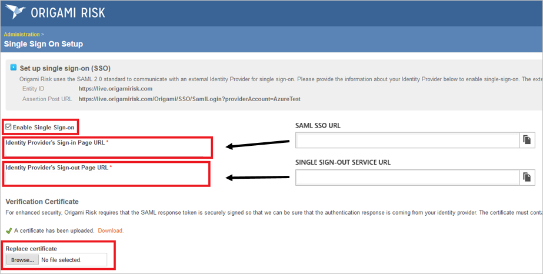
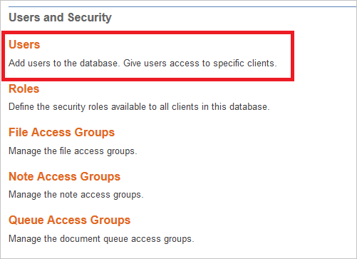
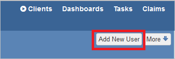
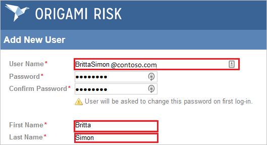
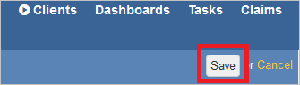
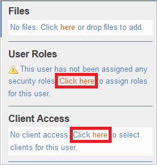

# Configure Origami for Single sign-on with Microsoft Entra ID

In this article,  you learn how to integrate Origami with Microsoft Entra ID. When you integrate Origami with Microsoft Entra ID, you can:

* Control in Microsoft Entra ID who has access to Origami.
* Enable your users to be automatically signed-in to Origami with their Microsoft Entra accounts.
* Manage your accounts in one central location.

## Prerequisites

The scenario outlined in this article assumes that you already have the following prerequisites:

[!INCLUDE [common-prerequisites.md](~/identity/saas-apps/includes/common-prerequisites.md)]
* Origami single sign-on (SSO) enabled subscription.

## Scenario description

In this article,  you configure and test Microsoft Entra single sign-on in a test environment.

* Origami supports **SP** initiated SSO.

> [!NOTE]
> Identifier of this application is a fixed string value so only one instance can be configured in one tenant.

## Add Origami from the gallery

To configure the integration of Origami into Microsoft Entra ID, you need to add Origami from the gallery to your list of managed SaaS apps.

1. Sign in to the [Microsoft Entra admin center](https://entra.microsoft.com) as at least a [Cloud Application Administrator](~/identity/role-based-access-control/permissions-reference.md#cloud-application-administrator).
1. Browse to **Entra ID** > **Enterprise apps** > **New application**.
1. In the **Add from the gallery** section, type **Origami** in the search box.
1. Select **Origami** from results panel and then add the app. Wait a few seconds while the app is added to your tenant.

 [!INCLUDE [sso-wizard.md](~/identity/saas-apps/includes/sso-wizard.md)]

## Configure and test Microsoft Entra SSO for Origami

Configure and test Microsoft Entra SSO with Origami using a test user called **B.Simon**. For SSO to work, you need to establish a link relationship between a Microsoft Entra user and the related user in Origami.

To configure and test Microsoft Entra SSO with Origami, perform the following steps:

1. **[Configure Microsoft Entra SSO](#configure-azure-ad-sso)** - to enable your users to use this feature.
    1. **Create a Microsoft Entra test user** - to test Microsoft Entra single sign-on with B.Simon.
    1. **Assign the Microsoft Entra test user** - to enable B.Simon to use Microsoft Entra single sign-on.
1. **[Configure Origami SSO](#configure-origami-sso)** - to configure the single sign-on settings on application side.
    1. **[Create Origami test user](#create-origami-test-user)** - to have a counterpart of B.Simon in Origami that's linked to the Microsoft Entra representation of user.
1. **[Test SSO](#test-sso)** - to verify whether the configuration works.

## Configure Microsoft Entra SSO

Follow these steps to enable Microsoft Entra SSO.

1. Sign in to the [Microsoft Entra admin center](https://entra.microsoft.com) as at least a [Cloud Application Administrator](~/identity/role-based-access-control/permissions-reference.md#cloud-application-administrator).
1. Browse to **Entra ID** > **Enterprise apps** > **Origami** > **Single sign-on**.
1. On the **Select a single sign-on method** page, select **SAML**.
1. On the **Set up single sign-on with SAML** page, select the pencil icon for **Basic SAML Configuration** to edit the settings.

   

1. On the **Basic SAML Configuration** section, perform the following steps:

    In the **Sign-on URL** text box, type a URL using the following pattern:
    `https://live.origamirisk.com/origami/account/login?account=<COMPANY_NAME>`

	> [!NOTE]
	> The value isn't real. Update the value with the actual Sign-On URL. Contact [Origami Client support team](https://wordpress.org/support/theme/origami) to get the value. You can also refer to the patterns shown in the **Basic SAML Configuration** section.

1. On the **Set up Single Sign-On with SAML** page, in the **SAML Signing Certificate** section, select **Download** to download the **Certificate (Base64)** from the given options as per your requirement and save it on your computer.

	

1. On the **Set up Origami** section, copy the appropriate URL(s) as per your requirement.

	

[!INCLUDE [create-assign-users-sso.md](~/identity/saas-apps/includes/create-assign-users-sso.md)]

## Configure Origami SSO

1. Log in to the Origami account with Admin rights.

2. In the menu on the top, select **Admin**.
   
    

3. On the Single Sign On Setup dialog page, perform the following steps:
   
    

    a. Select **Enable Single Sign On**.

    b. In the **Identity Provider's Sign-in Page URL** textbox, paste the value of **Login URL**.

    c. In the **Identity Provider's Sign-out Page URL** textbox, paste the value of **Logout URL**.

    d. Select **Browse** to upload the certificate you have downloaded.

    e. Select **Save Changes**.

### Create Origami test user

In this section, you create a user called Britta Simon in Origami. 

1. Log in to the Origami account with Admin rights.

2. In the menu on the top, select **Admin**.
   
    

3. On the **Users and Security** dialog, select **Users**.
   
    

4. Select **Add New User**.
   
    

5. On the Add New User dialog, perform the following steps:
   
    

    a. In the **User Name** textbox, enter the email of user like **brittasimon\@contoso.com**.

    b. In the **Password** textbox, type a password.

    c. In the **Confirm Password** textbox, type the password again.

    d. In the **First Name** textbox, enter the first name of user like **Britta**.

    e. In the **Last Name** textbox, enter the last name of user like **Simon**.

    f. Select **Save**.
   
    

6. Assign **User Roles** and **Client Access** to the user. 
   
    

## Test SSO

In this section, you test your Microsoft Entra single sign-on configuration with following options. 

* Select **Test this application**, this option redirects to Origami Sign-on URL where you can initiate the login flow. 

* Go to Origami Sign-on URL directly and initiate the login flow from there.

* You can use Microsoft My Apps. When you select the Origami tile in the My Apps, this option redirects to Origami Sign-on URL. For more information about the My Apps, see [Introduction to the My Apps](https://support.microsoft.com/account-billing/sign-in-and-start-apps-from-the-my-apps-portal-2f3b1bae-0e5a-4a86-a33e-876fbd2a4510).

## Related content

Once you configure Origami you can enforce session control, which protects exfiltration and infiltration of your organization’s sensitive data in real time. Session control extends from Conditional Access. [Learn how to enforce session control with Microsoft Defender for Cloud Apps](/cloud-app-security/proxy-deployment-aad).
