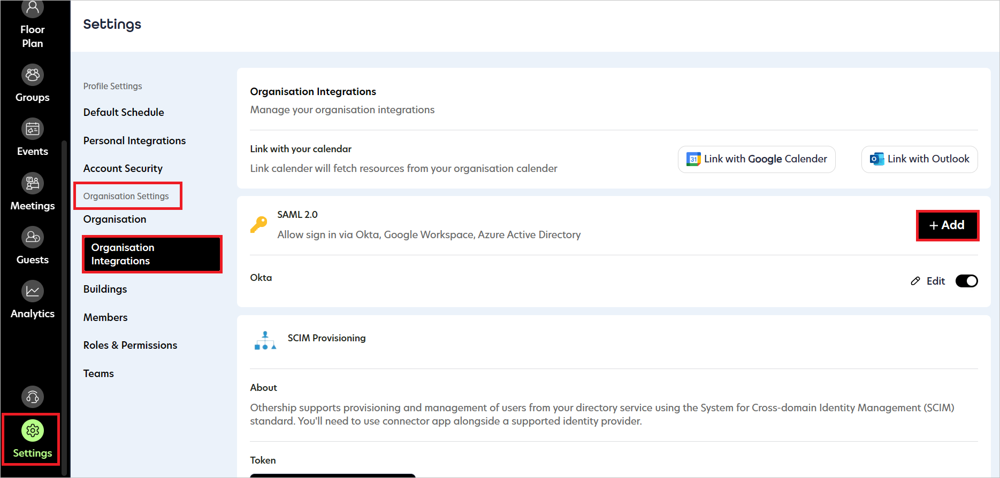
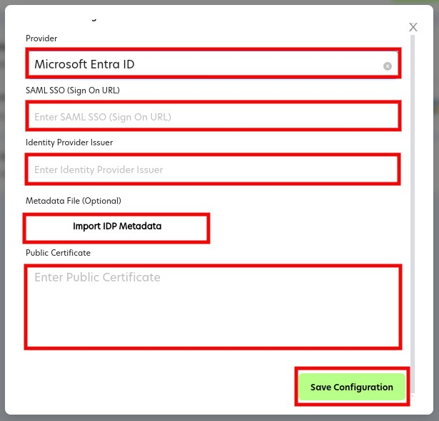

# Configure Othership Workplace Scheduler for Single sign-on with Microsoft Entra ID

In this article,  you learn how to integrate Othership Workplace Scheduler with Microsoft Entra ID. When you integrate Othership Workplace Scheduler with Microsoft Entra ID, you can:

* Control in Microsoft Entra ID who has access to Othership Workplace Scheduler.
* Enable your users to be automatically signed-in to Othership Workplace Scheduler with their Microsoft Entra accounts.
* Manage your accounts in one central location.

## Prerequisites

The scenario outlined in this article assumes that you already have the following prerequisites:

[!INCLUDE [common-prerequisites.md](~/identity/saas-apps/includes/common-prerequisites.md)]
* Othership Workplace Scheduler single sign-on (SSO) enabled subscription.

## Scenario description

In this article,  you configure and test Microsoft Entra SSO in a test environment.

* Othership Workplace Scheduler supports only **IDP** initiated SSO.
* Othership Workplace Scheduler supports **Just In Time** user provisioning.

> [!NOTE]
> Identifier of this application is a fixed string value so only one instance can be configured in one tenant.

## Add Othership Workplace Scheduler from the gallery

To configure the integration of Othership Workplace Scheduler into Microsoft Entra ID, you need to add Othership Workplace Scheduler from the gallery to your list of managed SaaS apps.

1. Sign in to the [Microsoft Entra admin center](https://entra.microsoft.com) as at least a [Cloud Application Administrator](~/identity/role-based-access-control/permissions-reference.md#cloud-application-administrator).
1. Browse to **Entra ID** > **Enterprise apps** > **New application**.
1. In the **Add from the gallery** section, type **Othership Workplace Scheduler** in the search box.
1. Select **Othership Workplace Scheduler** from results panel and then add the app. Wait a few seconds while the app is added to your tenant.

[!INCLUDE [sso-wizard.md](~/identity/saas-apps/includes/sso-wizard.md)]

## Configure and test Microsoft Entra SSO for Othership Workplace Scheduler

Configure and test Microsoft Entra SSO with Othership Workplace Scheduler using a test user called **B.Simon**. For SSO to work, you need to establish a link relationship between a Microsoft Entra user and the related user in Othership Workplace Scheduler.

To configure and test Microsoft Entra SSO with Othership Workplace Scheduler, perform the following steps:

1. **[Configure Microsoft Entra SSO](#configure-microsoft-entra-sso)** - to enable your users to use this feature.
   1. **Create a Microsoft Entra test user** - to test Microsoft Entra single sign-on with B.Simon.
   1. **Assign the Microsoft Entra test user** - to enable B.Simon to use Microsoft Entra single sign-on.
1. **[Configure Othership Workplace Scheduler SSO](#configure-othership-workplace-scheduler-sso)** - to configure the single sign-on settings on application side.
   1. **[Create Othership Workplace Scheduler test user](#create-othership-workplace-scheduler-test-user)** - to have a counterpart of B.Simon in Othership Workplace Scheduler that's linked to the Microsoft Entra representation of user.
1. **[Test SSO](#test-sso)** - to verify whether the configuration works.

## Configure Microsoft Entra SSO

Follow these steps to enable Microsoft Entra SSO in the Microsoft Entra admin center.

1. Sign in to the [Microsoft Entra admin center](https://entra.microsoft.com) as at least a [Cloud Application Administrator](~/identity/role-based-access-control/permissions-reference.md#cloud-application-administrator).
1. Browse to **Entra ID** > **Enterprise apps** > **Othership Workplace Scheduler** > **Single sign-on**.
1. On the **Select a single sign-on method** page, select **SAML**.
1. On the **Set up single sign-on with SAML** page, select the pencil icon for **Basic SAML Configuration** to edit the settings.

   

1. On the **Basic SAML Configuration** section, the application is preconfigured and the necessary URLs are already prepopulated with Microsoft Entra. The user needs to save the configuration by selecting the **Save** button.

1. Othership Workplace Scheduler application expects the SAML assertions in a specific format, which requires you to add custom attribute mappings to your SAML token attributes configuration. The following screenshot shows the list of default attributes.

	

1. In addition to above, Othership Workplace Scheduler application expects few more attributes to be passed back in SAML response, which are shown below. These attributes are also pre populated but you can review them as per your requirements.
	
	| Name | Source Attribute |
	| ---- | ---------------- |
	| first_name | user.givenname |
	| last_name | user.surname |
	| email | user.mail |

1. On the **Set up single sign-on with SAML** page, in the **SAML Signing Certificate** section, find **Federation Metadata XML** and select **Download** to download the certificate and save it on your computer.

	

1. On the **Set up Othership Workplace Scheduler** section, copy the appropriate URL(s) based on your requirement.

	

[!INCLUDE [create-assign-users-sso.md](~/identity/saas-apps/includes/create-assign-users-sso.md)]

## Configure Othership Workplace Scheduler SSO

1. Log in to Othership Workplace Scheduler company site as an administrator.

1. Go to **Settings** > **Organisation Settings** > **Organisation Integrations** and select **+ Add** SAML 2.0.

   

1. In the **Add SAML Configuration** page, perform the following steps:

   

   1. Select **Microsoft Entra ID** as a **Provider** from the drop-down.

   1. In the **SAML SSO (Sign On URL)** text box, paste the **Login URL** value, which you have copied from the Microsoft Entra admin center.

   1. In the **Identity Provider Issuer** textbox, paste the **Microsoft Entra Identifier** value, which you have copied from the Microsoft Entra admin center.

   1. Select Import IDP Metadata to import the **Federation Metadata XML** file you previously downloaded, after which the Certificate appears in the **Public Certificate** textbox.

   1. Select **Save Configuration**.

### Create Othership Workplace Scheduler test user

In this section, a user called Britta Simon is created in Othership Workplace Scheduler. Othership Workplace Scheduler supports just-in-time user provisioning, which is enabled by default. There's no action item for you in this section. If a user doesn't already exist in Othership Workplace Scheduler, a new one is created after authentication.

## Test SSO

In this section, you test your Microsoft Entra single sign-on configuration with following options.
 
* Select Test this application in Microsoft Entra admin center and you should be automatically signed in to the Othership Workplace Scheduler for which you set up the SSO.
 
* You can use Microsoft My Apps. When you select the Othership Workplace Scheduler tile in the My Apps, you should be automatically signed in to the Othership Workplace Scheduler for which you set up the SSO. For more information about the My Apps, see [Introduction to the My Apps](https://support.microsoft.com/account-billing/sign-in-and-start-apps-from-the-my-apps-portal-2f3b1bae-0e5a-4a86-a33e-876fbd2a4510).

## Related content

Once you configure Othership Workplace Scheduler you can enforce session control, which protects exfiltration and infiltration of your organization's sensitive data in real time. Session control extends from Conditional Access. [Learn how to enforce session control with Microsoft Defender for Cloud Apps](/cloud-app-security/proxy-deployment-any-app).
