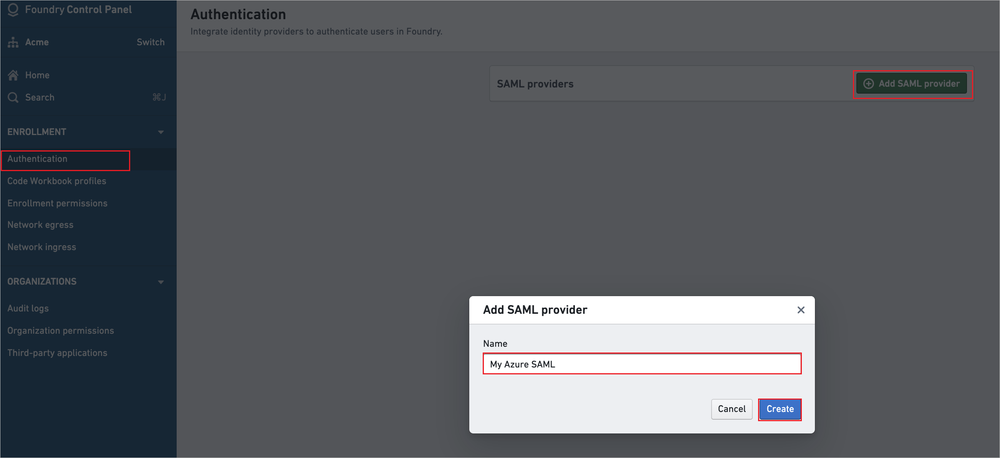
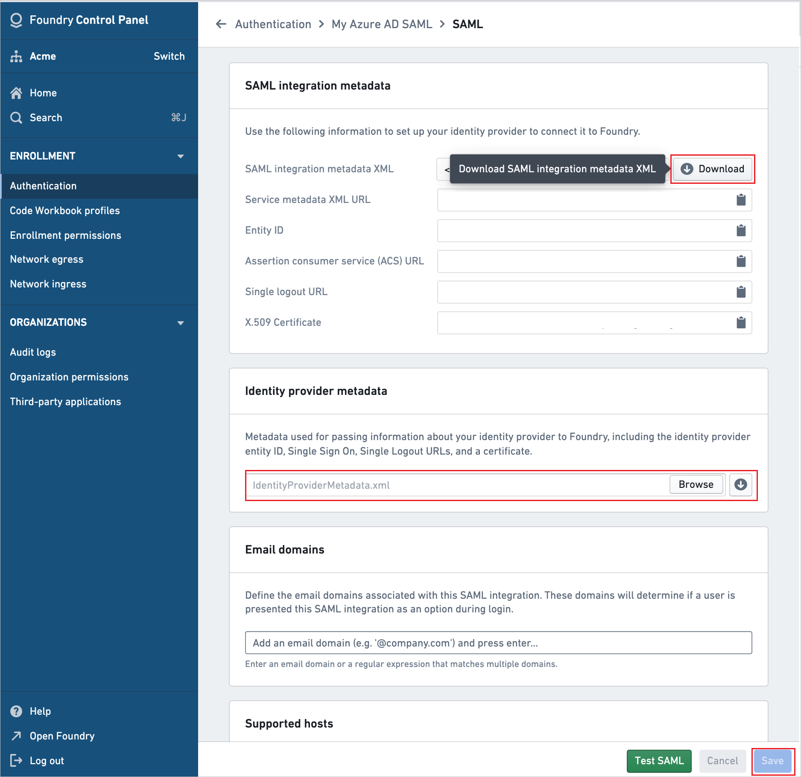

# Configure Palantir Foundry for Single sign-on with Microsoft Entra ID

In this article,  you learn how to integrate Palantir Foundry with Microsoft Entra ID. When you integrate Palantir Foundry with Microsoft Entra ID, you can:

* Control in Microsoft Entra ID who has access to Palantir Foundry.
* Enable your users to be automatically signed-in to Palantir Foundry with their Microsoft Entra accounts.
* Manage your accounts in one central location.

## Prerequisites

To get started, you need the following items:

* A Microsoft Entra subscription. If you don't have a subscription, you can get a [free account](https://azure.microsoft.com/free/).
* Palantir Foundry single sign-on (SSO) enabled subscription.
* Along with Cloud Application Administrator, Application Administrator can also add or manage applications in Microsoft Entra ID.
For more information, see [Azure built-in roles](~/identity/role-based-access-control/permissions-reference.md).

> [!NOTE]
> This integration is also available to use from Microsoft Entra US Government Cloud environment. You can find this application in the Microsoft Entra US Government Cloud Application Gallery and configure it in the same way as you do from public cloud.

## Scenario description

In this article,  you configure and test Microsoft Entra SSO in a test environment.

* Palantir Foundry supports **SP and IDP** initiated SSO.
* Palantir Foundry supports **Just In Time** user provisioning.

## Add Palantir Foundry from the gallery

To configure the integration of Palantir Foundry into Microsoft Entra ID, you need to add Palantir Foundry from the gallery to your list of managed SaaS apps.

1. Sign in to the [Microsoft Entra admin center](https://entra.microsoft.com) as at least a [Cloud Application Administrator](~/identity/role-based-access-control/permissions-reference.md#cloud-application-administrator).
1. Browse to **Entra ID** > **Enterprise apps** > **New application**.
1. In the **Add from the gallery** section, type **Palantir Foundry** in the search box.
1. Select **Palantir Foundry** from results panel and then add the app. Wait a few seconds while the app is added to your tenant.

 [!INCLUDE [sso-wizard.md](~/identity/saas-apps/includes/sso-wizard.md)]

## Configure and test Microsoft Entra SSO for Palantir Foundry

Configure and test Microsoft Entra SSO with Palantir Foundry using a test user called **B.Simon**. For SSO to work, you need to establish a link relationship between a Microsoft Entra user and the related user in Palantir Foundry.

To configure and test Microsoft Entra SSO with Palantir Foundry, perform the following steps:

1. **[Configure Microsoft Entra SSO](#configure-azure-ad-sso)** - to enable your users to use this feature.
    1. **Create a Microsoft Entra test user** - to test Microsoft Entra single sign-on with B.Simon.
    1. **Assign the Microsoft Entra test user** - to enable B.Simon to use Microsoft Entra single sign-on.
1. **[Configure Palantir Foundry SSO](#configure-palantir-foundry-sso)** - to configure the single sign-on settings on application side.
    1. **[Create Palantir Foundry test user](#create-palantir-foundry-test-user)** - to have a counterpart of B.Simon in Palantir Foundry that's linked to the Microsoft Entra representation of user.
1. **[Test SSO](#test-sso)** - to verify whether the configuration works.

## Configure Microsoft Entra SSO

Follow these steps to enable Microsoft Entra SSO.

1. Sign in to the [Microsoft Entra admin center](https://entra.microsoft.com) as at least a [Cloud Application Administrator](~/identity/role-based-access-control/permissions-reference.md#cloud-application-administrator).
1. Browse to **Entra ID** > **Enterprise apps** > **Palantir Foundry** > **Single sign-on**.
1. On the **Select a single sign-on method** page, select **SAML**.
1. On the **Set up single sign-on with SAML** page, select the pencil icon for **Basic SAML Configuration** to edit the settings.

   

1. Choose **Upload metadata file**, select the metadata file which you have downloaded in the **[Configure Palantir Foundry SSO](#configure-palantir-foundry-sso)** section, and then select **Add**.

   

1. When the metadata file is successfully uploaded, the values for **Identifier**, **Reply URL** and **Logout URL** appear automatically in the Palantir Foundry section text box.

    > [!Note]
    > If the **Identifier**, **Reply URL** and **Logout URL** values don't appear automatically, fill in the values manually which can be found in Foundry Control Panel.

1. On the **Set up single sign-on with SAML** page, in the **SAML Signing Certificate** section,  find **Federation Metadata XML** and select **Download** to download the certificate and save it on your computer.

	

[!INCLUDE [create-assign-users-sso.md](~/identity/saas-apps/includes/create-assign-users-sso.md)]

## Configure Palantir Foundry SSO

1. In Foundry Control Panel, go to the **Authentication** tab and select **Add SAML provider**. 

    

1. Give a valid SAML provider name and select **Create**.

1. Select **Manage** in the **SAML** section.

1. Perform the following steps in the **SAML** section:

    

    a. In the SAML integration metadata section, download the **SAML integration metadata XML**, and save it as file in your computer.

    b. In the Identity provider metadata section, select **Browse** to upload the **Federation Metadata XML** file which you have downloaded.

    c. Select **Save**.

### Create Palantir Foundry test user

In this section, a user called Britta Simon is created in Palantir Foundry. Palantir Foundry supports just-in-time user provisioning, which is enabled by default. There's no action item for you in this section. If a user doesn't already exist in Palantir Foundry, a new one is created after authentication.

## Test SSO 

In this section, you test your Microsoft Entra single sign-on configuration with following options. 

#### SP initiated:

* Select **Test this application**, this option redirects to Palantir Foundry Sign-on URL where you can initiate the login flow.  

* Go to Palantir Foundry Sign-on URL directly and initiate the login flow from there.

#### IDP initiated:

* Select **Test this application**, and you should be automatically signed in to the Palantir Foundry for which you set up the SSO. 

You can also use Microsoft My Apps to test the application in any mode. When you select the Palantir Foundry tile in the My Apps, if configured in SP mode you would be redirected to the application sign-on page for initiating the login flow and if configured in IDP mode, you should be automatically signed in to the Palantir Foundry for which you set up the SSO. For more information, see [Microsoft Entra My Apps](/azure/active-directory/manage-apps/end-user-experiences#azure-ad-my-apps).

## Related content

Once you configure Palantir Foundry you can enforce session control, which protects exfiltration and infiltration of your organization’s sensitive data in real time. Session control extends from Conditional Access. [Learn how to enforce session control with Microsoft Cloud App Security](/cloud-app-security/proxy-deployment-aad).
